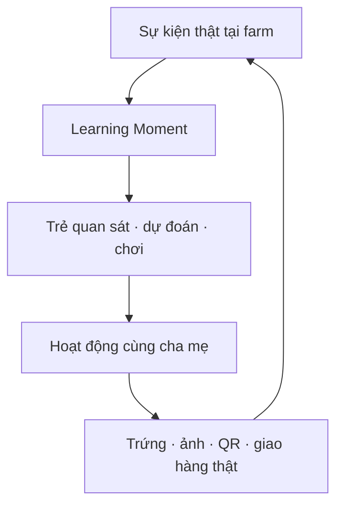
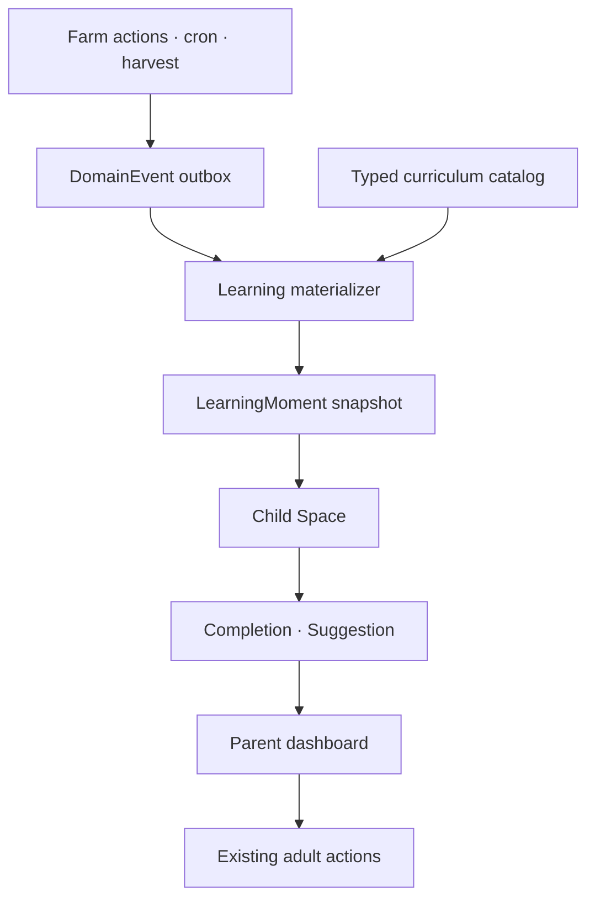

# ChicChic Next Plan — Family Learning

## Đặc tả business + product + kỹ thuật để phát triển trụ cột giáo dục–giải trí trẻ em

> Phiên bản: `1.0`  
> Ngày chốt: `2026-08-12`  
> Trạng thái: `Approved direction — ready for technical discovery and staged implementation`  
> Đối tượng đọc: Product Owner, Business Analyst, Tech Lead, AI coding agent, QA, vận hành nông trại, chuyên gia giáo dục và cố vấn pháp lý  
> Tài liệu nguồn: `ChicChic-Playbook-PoC-MVP.md`, `Research Report.md`, `CODEMAP.md`, `HUONG-DAN-SETUP-DEPLOY.md`

---

## 0. Cách sử dụng tài liệu này

Đây là tài liệu đầu vào chính cho agent phát triển phần **Family Learning** của ChicChic. Tài liệu vừa mô tả mô hình kinh doanh, trải nghiệm người dùng, các ràng buộc đạo đức–pháp lý, vừa chỉ rõ kiến trúc, dữ liệu, route, action, migration, kiểm thử và lộ trình rollout.

Agent triển khai phải làm theo thứ tự sau:

1. Đọc toàn bộ tài liệu này.
2. Đọc toàn bộ `CODEMAP.md`, đặc biệt §1, §2, §3, §7, §8, §9, §10, §11 và §13.
3. Đọc `HUONG-DAN-SETUP-DEPLOY.md` để hiểu các bước nghiệm thu thủ công và những biên giới không được test tự động.
4. Đối chiếu source code thật. Tài liệu mô tả code hiện tại dựa trên `CODEMAP`; source code và schema thật mới là bằng chứng cuối cùng về implementation.
5. Chạy baseline trước khi sửa: `npm test`, `npx tsc --noEmit`, `npm run lint`, `npm run build`.
6. Không triển khai toàn bộ trong một commit. Làm lần lượt theo các Epic ở §20.
7. Mỗi Epic phải cập nhật đồng thời code, test, `CODEMAP.md` và hướng dẫn deploy/nghiệm thu.
8. Nếu source code khác tài liệu, dừng để ghi rõ divergence; không tự “đoán cho khớp”.

### 0.1 Thứ tự ưu tiên khi tài liệu xung đột

1. Bất biến bảo mật, tiền và bằng chứng trong `CODEMAP.md`.
2. Các quyết định khóa trong §3 của tài liệu này.
3. Source code và Prisma schema hiện tại.
4. Backlog/roadmap và ví dụ minh họa.
5. Các đoạn cũ trong hướng dẫn deploy.

### 0.2 Ý nghĩa nhãn quyết định

| Nhãn | Ý nghĩa |
|---|---|
| `LOCKED` | Đã chốt; agent không được tự đổi |
| `MVP` | Phải có trong bản pilot có code |
| `P1` | Làm sau MVP khi đã có tín hiệu sử dụng |
| `P2` | Hướng mở rộng, chưa được làm sớm |
| `NO-GO` | Điều kiện chưa đạt thì không được mở cho trẻ thật |
| `OUT` | Ngoài phạm vi hiện tại |

---

## 1. Executive summary

ChicChic đang xây mô hình kết hợp bốn thành phần:

1. Nhận nuôi/chăm một chuồng gà thật qua ứng dụng.
2. Trang trại và nông dân vận hành ngoài đời thật.
3. Thu hoạch, truy xuất và giao nông sản thật.
4. Trải nghiệm giáo dục–giải trí cho trẻ, do cha mẹ đăng ký và kiểm soát.

Ba trụ đầu đã có hệ thống nghiệp vụ đáng kể: ba vai người dùng, nhận chuồng, nông dân làm việc kèm ảnh, sổ thu hoạch, chợ, giỏ hàng, thanh toán, giao hàng, QR truy xuất, cron vòng đời và bộ test bất biến.

Trụ thứ tư chưa có implementation. Đây không được là một tab “Bài học” hoặc một nhóm mini-game tách rời. Family Learning phải biến **sự kiện có thật tại nông trại** thành **khoảnh khắc học ngắn**, rồi dẫn trẻ và cha mẹ trở lại hoạt động ngoài đời.

North Star của sản phẩm không phải thời gian trẻ nhìn màn hình. North Star là:

> Số khoảnh khắc học gắn với một sự kiện thật mà mỗi gia đình hoàn thành trong một tháng.

Vòng giá trị cốt lõi:



### 1.1 Định vị sản phẩm

> ChicChic Family Learning là một chương trình đồng hành cùng chuồng gà đẻ thật: trẻ khám phá khoa học, toán, dinh dưỡng, trách nhiệm và nguồn gốc thực phẩm qua các sự kiện thật từ nông trại; cha mẹ là chủ tài khoản, người mua và người kiểm soát mọi quyết định.

### 1.2 Điều ChicChic không phải

- Không phải game nuôi thú thuần số.
- Không phải nền tảng đầu tư/góp vốn/sinh lời.
- Không phải mạng xã hội trẻ em.
- Không phải công cụ giữ trẻ bằng màn hình.
- Không phải chatbot AI nói chuyện tự do với trẻ.
- Không phải marketplace cho trẻ mua decor, thức ăn hoặc nông sản.

---

## 2. Hiện trạng hệ thống

### 2.1 Những năng lực đã có thể tái sử dụng

| Năng lực hiện tại | Giá trị cho Family Learning |
|---|---|
| `Flock.stage` + cron | Tạo chương học theo giai đoạn thật của đàn |
| `BarnTask` + `proofMediaId` | Biến việc thật đã hoàn thành thành nội dung quan sát |
| `BarnMedia` + `FarmUpdate` | Ảnh, video và lời kể thật từ nông dân |
| `HarvestLot` | Dữ liệu đếm trứng, cân nặng, ngày thu hoạch và bằng chứng |
| `WeighIn` | Dữ liệu toán/biểu đồ cho gà thịt trong tương lai |
| `Bird.name`, `Barn.label` | Gắn bó cảm xúc và kể chuyện có kiểm soát |
| `Delivery`/`HANDOVER` | Học chuỗi thực phẩm từ farm tới gia đình |
| `/tx/[code]` | Nhiệm vụ quét QR và truy xuất nguồn gốc |
| `FarmWorker` profile | Tôn trọng và hiểu công việc nông dân |
| `Notification`/`Nudge` | Báo cho cha mẹ, không báo trực tiếp cho trẻ |
| `Event` analytics | Đo hành vi nội bộ ở mức tối thiểu, không dùng làm business event bus |

### 2.2 Khoảng trống hiện tại

- Chưa có hồ sơ trẻ em.
- Chưa có consent/assent và audit log cho dữ liệu trẻ.
- Chưa có Family Learning enrollment hoặc child–barn link.
- Chưa có child mode và parental gate.
- Chưa có curriculum/content engine.
- Chưa có learning moment, progress, achievement hoặc family mission.
- Chưa có business event/outbox đáng tin cậy.
- Chưa có dashboard/báo cáo học tập cho cha mẹ.
- Chưa có công cụ vận hành nội dung cho admin.
- Chưa có policy riêng cho vòng đời đàn gắn với trẻ.

### 2.3 Các khoảng trống hiện tại ảnh hưởng trực tiếp tới rollout

Trước khi mở pilot thật, phải xác minh hoặc xử lý:

- Checklist nghiệm thu trình duyệt R, S, T, U trong hướng dẫn deploy.
- QR truy xuất phải được quét bằng điện thoại thật.
- Luồng upload ảnh/video phải chạy ổn định ngoài nông trại.
- Tài liệu deploy có đoạn cũ không còn đúng với `CODEMAP` mới: giữ chỗ 24 giờ/3 giờ, điều kiện người mua phải có chuồng, phí giao và giỏ hàng. Phải dọn tài liệu để chỉ còn một hành vi hiện hành.
- `HealthEvent`/`HealthPackage` chưa có action runtime thật; MVP không được khẳng định tình trạng sức khỏe của một con vật thật dựa trên dữ liệu seed.
- Chưa có test nối DB/network. Mọi migration và concurrency quan trọng phải có script nghiệm thu riêng.

---

## 3. Decision log — các quyết định đã khóa

| ID | Trạng thái | Quyết định |
|---|---|---|
| FL-D01 | `LOCKED` | Phụ huynh là chủ `User`; trẻ không có tài khoản đăng nhập độc lập trong MVP |
| FL-D02 | `LOCKED` | MVP phục vụ trẻ 5–8 tuổi, chia nội dung `5–6` và `7–8` |
| FL-D03 | `LOCKED` | MVP chỉ áp dụng cho gà đẻ (`LAYER`) |
| FL-D04 | `LOCKED` | Family Learning là một SKU/enrollment riêng, không tự bật cho mọi chuồng |
| FL-D05 | `LOCKED` | Child Space không hiện tiền, chợ, hóa đơn, ngân hàng, hoàn tiền, payout hoặc ROI |
| FL-D06 | `LOCKED` | Trẻ không gọi trực tiếp bất kỳ action nào làm thay đổi tiền hoặc trạng thái farm |
| FL-D07 | `LOCKED` | Mọi mong muốn có tác động thật chỉ tạo `ChildSuggestion`; cha mẹ phải vào Adult Space để quyết định và thực hiện |
| FL-D08 | `LOCKED` | Không chat trực tiếp giữa trẻ và nông dân; câu hỏi phải qua danh sách kiểm duyệt, cha mẹ duyệt và được gom theo cohort |
| FL-D09 | `LOCKED` | Không quảng cáo, gacha, loot box, paid random reward, streak, leaderboard, infinite scroll hoặc dark pattern |
| FL-D10 | `LOCKED` | Không upload ảnh, video, khuôn mặt, giọng nói hoặc bài viết tự do của trẻ trong MVP |
| FL-D11 | `LOCKED` | Chỉ thu nickname do cha mẹ nhập, nhóm tuổi và avatar từ danh sách đóng; không thu ngày sinh chính xác, trường/lớp hoặc vị trí trẻ |
| FL-D12 | `LOCKED` | Child-linked flock không có lựa chọn `MEAT` |
| FL-D13 | `LOCKED` | MVP Family Learning kết thúc bằng `RETIRE`; nhánh `RENEW` bị hoãn vì implementation hiện tại reset cùng một flock và không lưu được số phận đàn cũ |
| FL-D14 | `LOCKED` | `Event` analytics hiện tại không được dùng làm business event bus; thêm transactional `DomainEvent`/outbox riêng |
| FL-D15 | `LOCKED` | Curriculum MVP khai báo bằng TypeScript typed catalog và snapshot vào `LearningMoment`; chưa làm CMS |
| FL-D16 | `LOCKED` | Hoạt động không chấm điểm cạnh tranh; hoàn thành là khám phá, không phải “đúng mới được thưởng” |
| FL-D17 | `LOCKED` | Notification chỉ gửi cho tài khoản cha mẹ; Child Space không có push trực tiếp |
| FL-D18 | `LOCKED` | Pilot bao gồm Family Learning trong gói thử; chưa tích hợp nguồn thu/mã thanh toán mới |
| FL-D19 | `LOCKED` | Không dùng generative AI tương tác trực tiếp với trẻ trong MVP |
| FL-D20 | `LOCKED` | Không ghi DB trong Server Component render; materialization phải qua job hoặc action/endpoint có cổng |

### 3.1 Quyết định vòng đời có ảnh hưởng business lớn

Một Family Learning flock đã tạo gắn bó cá nhân với trẻ không được bất ngờ chuyển sang nhận thịt.

MVP phải snapshot policy lên **flock**, không chỉ lên child profile hoặc enrollment. Nếu cha mẹ rút consent/xóa hồ sơ trẻ, cam kết vòng đời đối với đàn thật vẫn tồn tại. Dữ liệu operational này không phải dữ liệu trẻ và không được cascade-delete.

Policy MVP:

```text
STANDARD flock
  → MEAT | RETIRE | RENEW theo luật hiện tại

FAMILY_RETIRE_ONLY flock
  → RETIRE
  → không render MEAT/RENEW
  → server action cũng từ chối MEAT/RENEW kể cả gọi trực tiếp
```

`NO-GO`: Trước khi mời gia đình thật, Product Owner phải chốt chi phí và năng lực nuôi dưỡng sau nghỉ hưu. Pilot nhỏ có thể dùng quỹ vận hành thủ công, nhưng không được hứa quy mô lớn nếu chưa có retirement reserve, phí chăm hợp lý hoặc đối tác tiếp nhận đàn.

---

## 4. Mục tiêu, giả thuyết và chỉ số

### 4.1 Mục tiêu MVP

Trong 6–8 tuần, chứng minh rằng:

1. Trẻ thực sự quan tâm tới các sự kiện của chuồng thật.
2. Cha mẹ đánh giá đây là screen time có ý nghĩa.
3. Nội dung tạo hành động ngoài màn hình, không chỉ tăng thời lượng app.
4. Nông dân không bị tăng tải vận hành quá mức.
5. Phụ huynh sẵn sàng tiếp tục hoặc trả thêm cho chương trình.

### 4.2 Giả thuyết cần kiểm chứng

| ID | Giả thuyết | Dấu hiệu xác nhận |
|---|---|---|
| H1 | Sự kiện thật hấp dẫn hơn bài học chung | Learning Moment có ảnh/dữ liệu thật đạt completion cao hơn nội dung evergreen |
| H2 | Trẻ muốn quay lại vì chờ sự kiện farm, không vì streak | Retention không cần daily reward |
| H3 | QR + nông sản làm tăng nhận thức nguồn gốc | Gia đình hoàn thành mission “từ farm tới bữa ăn” |
| H4 | Cha mẹ nhìn thấy giá trị giáo dục | Report được mở, khảo sát có thay đổi hành vi/hiểu biết |
| H5 | Mô hình có thể scale vận hành | Nông dân tăng không quá khoảng 30 phút/farm/tuần |
| H6 | Family Learning tăng retention của gói layer | Cohort Family tốt hơn cohort layer tiêu chuẩn có kiểm soát |

### 4.3 North Star và metric tree

**North Star:** `Real-world Learning Moments Completed per Active Family per Month`.

Supporting metrics:

- Activation: `% enrollment có ít nhất một child profile và hoàn thành onboarding moment`.
- Weekly learning activation: `% gia đình hoàn thành ≥1 moment/tuần`.
- Week-6 retention.
- Offline mission completion rate.
- Parent report open rate.
- QR mission completion rate.
- Child suggestion → parent reviewed rate.
- Median farmer operational minutes/farm/week.
- Content incident rate.
- Consent withdrawal/delete completion SLA.
- Direct child-initiated financial action count: phải luôn bằng `0`.

### 4.4 Ngưỡng pilot đề xuất

Đây là ngưỡng quyết định nội bộ, không phải benchmark thị trường:

- ≥60% gia đình được mời kích hoạt Family Learning.
- ≥50% hoàn thành onboarding moment.
- ≥40% còn hoàn thành ≥1 moment/tuần ở tuần 6.
- ≥30% hoàn thành ít nhất một family mission ngoài đời/tháng.
- ≥50% cha mẹ mở ít nhất một báo cáo tuần.
- Median tăng tải nông dân ≤30 phút/farm/tuần.
- `0` sự kiện trẻ tự mua, tự gửi tin hoặc tự quyết vòng đời.
- `0` dữ liệu ảnh/giọng nói/vị trí của trẻ được thu ngoài thiết kế.

### 4.5 Kill/pivot criteria

- Retention tuần 6 <25% dù nội dung đã được quan sát và cải tiến hai vòng.
- Phần lớn completion chỉ đến từ video xem thụ động, offline mission gần bằng 0.
- Nông dân tăng tải >60 phút/farm/tuần.
- Phụ huynh không hiểu khác biệt giữa Family Learning và game nuôi gà.
- Bất kỳ incident nghiêm trọng nào về dữ liệu trẻ, giao dịch từ child mode hoặc nội dung vòng đời gây hiểu lầm.

---

## 5. Đối tượng sử dụng và jobs-to-be-done

### 5.1 Phụ huynh

**JTBD:** “Khi con muốn chơi điện thoại và tò mò về động vật, tôi muốn một trải nghiệm ngắn, an toàn, có ích và nối được với đời thật để hai bố mẹ con cùng làm.”

Nhu cầu:

- Biết con đang học gì.
- Không phải giám sát từng cú chạm.
- Không bị thúc mua hàng qua cảm xúc của con.
- Kiểm soát nội dung nhạy cảm.
- Xóa dữ liệu con dễ dàng.
- Nhìn thấy farm/người/nông sản thật.

### 5.2 Trẻ 5–6 tuổi

Nhu cầu:

- Ít chữ, có đọc thoại, hình thật rõ.
- Chạm, kéo, chọn và kể lại.
- Hoạt động 3–5 phút.
- Phản hồi tích cực, không phạt vì sai.
- Chơi cùng cha mẹ.

### 5.3 Trẻ 7–8 tuổi

Nhu cầu:

- Dự đoán, so sánh và đọc số đơn giản.
- Có nhật ký hành trình.
- Có quyền chọn trong phạm vi an toàn.
- Hoạt động 5–8 phút.
- Thấy dự đoán được kiểm chứng bằng dữ liệu thật sau đó.

### 5.4 Nông dân

**JTBD:** “Tôi muốn gửi đúng một cập nhật đơn giản từ công việc thật và hệ thống tự biến nó thành nội dung cho nhiều gia đình, không phải trả lời từng trẻ.”

### 5.5 Admin/content operator

Nhu cầu:

- Mời đúng layer barn vào pilot.
- Biết gia đình nào đã consent.
- Biết event nào chưa materialize.
- Xem nội dung trước khi phát hành.
- Tạm dừng một unit hoặc cả feature ngay khi có incident.

---

## 6. Phạm vi MVP và ngoài phạm vi

### 6.1 MVP bắt buộc

- Family Learning invitation/enrollment cho `LAYER` barn.
- Parent verification + consent + child assent 7–8 tuổi theo chuẩn nội bộ.
- Child profile tối thiểu.
- Child Space riêng.
- Sáu chương curriculum.
- Domain event/outbox.
- Idempotent learning materialization.
- Learning Moment và completion.
- Family mission offline.
- Child suggestion không có side effect.
- Parent dashboard + weekly summary.
- Feature flag và kill switch.
- Privacy delete/export tối thiểu.
- Test pure logic + source wiring + integration script + manual browser checklist.

### 6.2 P1 sau khi pilot có tín hiệu

- Nội dung 9–12 tuổi.
- Generic observation log cho layer trước khi đẻ.
- Health learning sau khi `HealthEvent` runtime thật đã hoàn chỉnh.
- Content admin/CMS có versioning và approval workflow.
- Email digest cho cha mẹ.
- Cohort A/B có kiểm soát.
- Bộ worksheet in được.
- B2B lớp học dùng chung một chuồng.
- Multi-language.

### 6.3 OUT/P2

- Child account/password riêng.
- Social feed, friend, follower, like, comment.
- Livestream camera 24/7 cho trẻ.
- AI chatbot với trẻ.
- Nhận diện khuôn mặt/giọng nói.
- Child-generated image/audio upload.
- Game economy, coin, NFT, token hoặc quyền mua bán vật nuôi.
- Marketplace trường học.
- AR/VR.
- CMS phức tạp trước khi nội dung được chứng minh.
- Gà thịt cho trẻ nhỏ.

---

## 7. Trụ cột curriculum

### 7.1 Khoa học sự sống

- Gà cần thức ăn, nước, nơi ở và sự chăm sóc.
- Giai đoạn từ úm đến lớn và đẻ trứng.
- Hành vi cơ bản của gà.
- Sự khác nhau giữa quan sát thật và dự đoán.
- Không khẳng định sức khỏe nếu không có dữ liệu runtime được xác minh.

### 7.2 Toán và tư duy dữ liệu

- Đếm trứng.
- Gom nhóm 5/10.
- So sánh nhiều–ít, trước–sau.
- Chia đều đơn giản cho nhóm 7–8 tuổi.
- Đọc timeline và biểu đồ ở giai đoạn sau.
- Dự đoán rồi đối chiếu kết quả thật.

### 7.3 Dinh dưỡng và chuỗi thực phẩm

- Trứng đến từ đâu.
- Thu hoạch, bảo quản, đóng gói và giao.
- Vệ sinh tay và sử dụng thực phẩm an toàn.
- QR truy xuất là gì.
- Tôn trọng sự khác nhau giữa “thực phẩm sạch” như marketing và dữ liệu truy xuất thật.

### 7.4 Cảm xúc và trách nhiệm

- Kiên nhẫn chờ một sinh vật lớn lên.
- Quan tâm không đồng nghĩa sở hữu tuyệt đối.
- Tôn trọng nông dân và công sức lao động.
- Tin xấu được nói trung thực, theo ngôn ngữ phù hợp tuổi.
- Không dùng cảm xúc tội lỗi để kéo trẻ quay lại.

### 7.5 Ngôn ngữ và sáng tạo

- Nghe và kể lại điều quan sát được.
- Chọn câu mô tả ảnh.
- Sắp xếp câu chuyện theo trình tự.
- Vẽ/làm thủ công ngoài app; MVP chỉ đánh dấu hoàn thành, không upload sản phẩm của trẻ.

---

## 8. Game mechanics được phép và bị cấm

### 8.1 Bốn mechanic cốt lõi

| Mechanic | Ví dụ 5–6 | Ví dụ 7–8 |
|---|---|---|
| Quan sát | Tìm máng nước trong ảnh | Chọn ba dấu hiệu cho thấy chuồng đã được chuẩn bị |
| Dự đoán | Ngày mai có trứng không? | Tuần sau nhiều hơn, ít hơn hay bằng tuần này? |
| Sắp xếp | Thức ăn → gà ăn → lớn | Nhặt trứng → kiểm tra → đóng hộp → giao → quét QR |
| Phân loại | Gà ăn được/không ăn được | Nhu cầu của gà vs đồ trang trí |

### 8.2 Phản hồi

- Không dùng “Sai rồi” theo giọng phạt.
- Giải thích ngắn: “Mình thử nhìn lại tấm ảnh nhé”.
- Không giới hạn lượt thử.
- Không lưu điểm thấp.
- Achievement ghi nhận hành vi khám phá, không so sánh trẻ.

### 8.3 Cơ chế bị cấm

- Daily streak hoặc mất thưởng nếu nghỉ.
- “Gà buồn/đói vì con chưa vào app”.
- Countdown tạo sợ bỏ lỡ cho trẻ.
- Hộp quà ngẫu nhiên trả phí.
- Quảng cáo hoặc nội dung tài trợ ẩn.
- Leaderboard.
- Push trực tiếp tới trẻ.
- Infinite scroll/autoplay liên tục.
- Thưởng vì tiêu tiền.
- Khuyến khích trẻ gây áp lực mua hàng lên cha mẹ.

---

## 9. Sáu chương nội dung MVP

### Chương 1 — Gặp người chăm và chuồng của mình

**Trigger:** Family Enrollment được kích hoạt và có ảnh `CHECK` đầu tiên.

**Mục tiêu:** Trẻ hiểu con vật thật được một người thật chăm sóc tại một nơi thật.

**Hoạt động:**

- Nhìn ảnh cô/chú nông dân và chọn công việc đang làm.
- Tìm ba chi tiết trong ảnh chuồng.
- Chọn avatar/nickname của trẻ.
- Family mission: cha mẹ cùng con kể lại “ai đang chăm chuồng”.

**Không làm:** Không hiển thị tuổi/địa chỉ riêng tư sâu của nông dân trong Child Space.

### Chương 2 — Gà cần gì mỗi ngày?

**Trigger:** việc `FEED` hoặc `CHECK` hoàn thành kèm ảnh.

**Mục tiêu:** Nhu cầu cơ bản của sinh vật sống.

**Hoạt động:**

- Phân loại thức ăn, nước, nơi trú và đồ không phải nhu cầu.
- Quan sát ảnh thật để tìm máng ăn/máng nước.
- Dự đoán: điều gì xảy ra nếu trời nóng/mưa, không đưa ra lời khuyên thú y.

### Chương 3 — Đàn đang lớn

**Trigger:** `FLOCK_STAGE_CHANGED` từ `BROODING` sang `GROWING`, hoặc cập nhật ảnh mốc son.

**Mục tiêu:** Hiểu thay đổi theo thời gian.

**Hoạt động:**

- So ảnh trước/sau nếu có hai media hợp lệ.
- Xếp timeline.
- Đếm số ngày/tuần ở mức phù hợp tuổi.
- Dự đoán điều sẽ thay đổi tiếp theo.

**Lưu ý:** Không dùng `WeighIn` cho layer khi chưa có dữ liệu. Không nội suy số cân.

### Chương 4 — Quả trứng đầu tiên

**Trigger:** `HARVEST_LOGGED` đầu tiên của loại `EGG` và flock chuyển `LAYING` bằng bằng chứng thật.

**Mục tiêu:** Hiểu mối liên hệ giữa chăm sóc, thời gian và sản phẩm.

**Hoạt động:**

- Đếm trứng trong ảnh/dựa trên số thật.
- 5–6: ghép số lượng đơn giản.
- 7–8: gom nhóm 5/10, cộng/trừ hoặc chia đều với số phù hợp.
- Không hứa mỗi ngày sẽ có số trứng giống nhau.

### Chương 5 — Một mẻ trứng đi đâu?

**Trigger:** `LOT_CLAIMED` hoặc `HANDOVER_COMPLETED`.

**Mục tiêu:** Hiểu chuỗi cung ứng đơn giản.

**Hoạt động:**

- Sắp xếp thu hoạch → bảo quản → đóng hộp → giao.
- Chọn cách bảo quản đúng theo dữ liệu sản phẩm đã được duyệt.
- Family mission: cùng cha mẹ nhận hộp, rửa tay, đếm lại.

### Chương 6 — Từ QR tới bữa ăn

**Trigger:** lô `DELIVERED` về chính chủ. Việc quét QR được xác nhận trong Child Space bằng nút mission; không ghi DB trong public `/tx` render.

**Mục tiêu:** Truy xuất nguồn gốc và lòng biết ơn đối với thực phẩm.

**Hoạt động:**

- Cha mẹ mở QR; trẻ tìm tên người chăm, ngày thu và giống.
- Sắp xếp lại hành trình.
- Chọn món gia đình muốn cùng chuẩn bị.
- Family mission: cùng cha mẹ nấu/chuẩn bị món, chỉ đánh dấu hoàn thành.

---

## 10. User journeys

### 10.1 Admin mời một gia đình vào pilot

1. Admin vào `/admin` → “Family Learning Pilot”.
2. Chọn một barn.
3. Server kiểm:
   - Barn có chủ.
   - `productLine === LAYER`.
   - Flock chưa ở closed stage.
   - Chưa có enrollment active/invited.
4. Admin tạo invitation với `cohortKey`, `programVersion`, `lifecyclePolicy=FAMILY_RETIRE_ONLY`.
5. Chủ barn nhận Notification dẫn tới `/gia-dinh`.
6. Chưa đổi policy của flock ở bước invite; chỉ khóa khi cha mẹ chấp nhận rõ ràng.

### 10.2 Cha mẹ tạo hồ sơ trẻ và chấp nhận

1. Cha mẹ đăng nhập tài khoản hiện tại.
2. Vào `/gia-dinh` và xem invitation.
3. Xác minh lại bằng password hoặc OTP/recent-auth.
4. Đọc tóm tắt dữ liệu thu thập, vòng đời và giá pilot.
5. Xác nhận là cha/mẹ/người giám hộ và đủ tuổi sử dụng tài khoản.
6. Tạo child profile: nickname, age band, avatar key.
7. Với nhóm 7–8, app mở màn assent ngôn ngữ đơn giản cho trẻ.
8. Một transaction:
   - ghi consent event;
   - active child profile;
   - accept enrollment;
   - link child ↔ enrollment;
   - snapshot `Flock.lifecyclePolicy=FAMILY_RETIRE_ONLY`;
   - tạo `DomainEvent.FAMILY_ENROLLED`.
9. Chuyển tới onboarding Child Space.

### 10.3 Trẻ dùng Child Space

1. Cha mẹ chọn “Vào khu khám phá của bé”.
2. Chọn child profile nếu có nhiều trẻ.
3. `/be/[childId]` kiểm quyền, consent và enrollment.
4. Hiện tối đa 1 learning moment nổi bật và 2 moment gần đây; không infinite scroll.
5. Trẻ hoàn thành hoạt động.
6. Nếu hoạt động dẫn tới mong muốn tác động thật, chỉ tạo suggestion.
7. Thoát Child Space → parental gate → Adult Space.

### 10.4 Trẻ đề xuất decor

1. Trẻ chọn một mẫu decor từ danh sách đóng.
2. App hiện rõ “Gửi mong muốn cho bố/mẹ”, không hiện giá.
3. `createChildSuggestion` ghi `PENDING`; không gọi decor/payment action.
4. Cha mẹ thấy suggestion ở `/gia-dinh/de-xuat`.
5. Cha mẹ chọn:
   - Bỏ qua/decline.
   - Xem món tại Adult Space.
6. Nếu muốn mua, cha mẹ đi qua luồng decor hiện tại với giá, kho và thanh toán đầy đủ.

### 10.5 Cha mẹ rút consent/xóa dữ liệu

1. Cha mẹ vào `/gia-dinh/quyen-rieng-tu`.
2. Recent-auth bắt buộc.
3. App nói rõ:
   - dữ liệu child-specific nào sẽ mất;
   - dữ liệu operational của barn/farm vẫn còn;
   - cam kết `FAMILY_RETIRE_ONLY` của flock không bị đảo ngược.
4. Một transaction rút consent và khóa Child Space ngay.
5. Xóa/anonymize dữ liệu child-specific theo §17.
6. Ghi consent audit event không chứa nội dung học chi tiết.

---

## 11. Kiến trúc tổng thể



### 11.1 Giữ nguyên luật tầng hiện tại

- `app/*/page.tsx`: đọc dữ liệu và kiểm quyền, không ghi.
- `components/*`: UI client, không đụng Prisma/auth/db.
- `app/*-actions.ts`: cổng server, kiểm quyền trước khi ghi.
- `lib/*.ts`: logic thuần hoặc logic DB nội bộ không callable từ client.
- `lib/db.ts`: cửa duy nhất tới Prisma.
- Mọi action mới là public endpoint về mặt kỹ thuật; phải có cổng ở đầu hàm.

### 11.2 Module mới đề xuất

| File/module | Trách nhiệm |
|---|---|
| `src/lib/family-gates.ts` | Pure decision functions cho parent/child/enrollment/consent |
| `src/lib/family.ts` | DB helpers nội bộ, không export thành server action |
| `src/lib/child-consent.ts` | State transition, policy version, delete scope |
| `src/lib/domain-events.ts` | Dedupe key, create event trong transaction |
| `src/lib/learning.ts` | Type và helper client-safe |
| `src/lib/learning-materializer.ts` | Event + child + curriculum → LearningMoment idempotent |
| `src/data/learning-curriculum.ts` | Typed content catalog MVP |
| `src/app/family-actions.ts` | Parent profile, consent, enrollment, privacy actions |
| `src/app/learning-actions.ts` | Sync, complete moment, family mission, suggestion |
| `src/app/family-admin-actions.ts` | Admin invite, pause/kill program |
| `src/components/family/*` | Parent dashboard UI |
| `src/components/learning/*` | Child UI, không import adult actions |

---

## 12. Data model đề xuất

Đây là logical schema. Agent phải đối chiếu tên enum/model hiện tại trước khi viết migration.

### 12.1 Enums

```prisma
enum ChildAgeBand {
  AGE_5_6
  AGE_7_8
}

enum ChildProfileStatus {
  DRAFT
  ACTIVE
  CONSENT_WITHDRAWN
  DELETION_PENDING
  DELETED
}

enum ConsentAction {
  GRANTED
  ASSENTED
  WITHDRAWN
  DELETE_REQUESTED
  DELETED
}

enum FamilyEnrollmentStatus {
  INVITED
  ACTIVE
  PAUSED
  WITHDRAWN
  COMPLETED
}

enum FlockLifecyclePolicy {
  STANDARD
  FAMILY_RETIRE_ONLY
}

enum DomainEventType {
  FAMILY_ENROLLED
  CARE_TASK_COMPLETED
  FLOCK_STAGE_CHANGED
  FIRST_EGG_RECORDED
  HARVEST_LOGGED
  LOT_CLAIMED
  HANDOVER_COMPLETED
}

enum LearningMomentStatus {
  AVAILABLE
  STARTED
  COMPLETED
  ARCHIVED
}

enum LearningReceiptStatus {
  CREATED
  SKIPPED
  FAILED
}

enum ChildSuggestionKind {
  DECOR_WISH
  CURATED_FARM_QUESTION
  FAMILY_ACTIVITY_WISH
}

enum ChildSuggestionStatus {
  PENDING
  REVIEWED
  DECLINED
  EXPIRED
}
```

### 12.2 ChildProfile

```prisma
model ChildProfile {
  id            String             @id @default(cuid())
  parentId      String
  nickname      String
  ageBand       ChildAgeBand
  avatarKey     String
  status        ChildProfileStatus @default(DRAFT)
  consentVersion String?
  consentedAt   DateTime?
  withdrawnAt   DateTime?
  deletedAt     DateTime?
  createdAt     DateTime           @default(now())
  updatedAt     DateTime           @updatedAt

  parent        User               @relation(fields: [parentId], references: [id], onDelete: Cascade)
  links         ChildBarnLink[]
  consentEvents ChildConsentEvent[]
  moments       LearningMoment[]
  suggestions   ChildSuggestion[]

  @@index([parentId, status])
}
```

Luật:

- `nickname` do cha mẹ nhập, tối đa khoảng 20 Unicode code points sau `cleanLine`.
- UI cảnh báo không nhập họ tên đầy đủ.
- `avatarKey` phải thuộc allowlist trong code.
- Không có birth date, school, class, phone, email hoặc location.
- Một parent có thể có nhiều child profile.

### 12.3 ChildConsentEvent

```prisma
model ChildConsentEvent {
  id            String        @id @default(cuid())
  childId       String
  parentId      String
  action        ConsentAction
  policyVersion String
  purposes      Json
  childAssent   Boolean?
  evidence      Json?
  createdAt     DateTime      @default(now())

  child         ChildProfile  @relation(fields: [childId], references: [id], onDelete: Cascade)
  parent        User          @relation(fields: [parentId], references: [id], onDelete: Restrict)

  @@index([childId, createdAt])
}
```

Luật:

- Append-only.
- `evidence` không lưu giấy tờ tùy thân; chỉ lưu method như `password_reauth`/`email_otp`, session/re-auth timestamp và policy checksum nếu có.
- State nhanh nằm trên `ChildProfile`; event là audit trail. Cả hai đổi cùng transaction.

### 12.4 FamilyEnrollment và ChildBarnLink

```prisma
model FamilyEnrollment {
  id              String                 @id @default(cuid())
  barnId          String
  parentId        String
  status          FamilyEnrollmentStatus @default(INVITED)
  cohortKey       String
  programVersion  String
  lifecyclePolicy FlockLifecyclePolicy
  invitedAt       DateTime               @default(now())
  acceptedAt      DateTime?
  pausedAt        DateTime?
  endedAt         DateTime?
  createdAt       DateTime               @default(now())
  updatedAt       DateTime               @updatedAt

  barn            Barn                   @relation(fields: [barnId], references: [id], onDelete: Restrict)
  parent          User                   @relation(fields: [parentId], references: [id], onDelete: Restrict)
  children        ChildBarnLink[]

  @@index([parentId, status])
  @@index([barnId, status])
}

model ChildBarnLink {
  id           String           @id @default(cuid())
  childId      String
  enrollmentId String
  linkedAt     DateTime         @default(now())
  unlinkedAt   DateTime?

  child        ChildProfile     @relation(fields: [childId], references: [id], onDelete: Cascade)
  enrollment   FamilyEnrollment @relation(fields: [enrollmentId], references: [id], onDelete: Restrict)

  @@unique([childId, enrollmentId])
  @@index([enrollmentId, unlinkedAt])
}
```

Database không hỗ trợ partial unique dễ dàng qua Prisma schema cho “một active enrollment/barn”. Action admin phải dùng transaction + so-sánh-rồi-đặt; nếu cần chốt cứng, thêm migration SQL/index phù hợp sau khi kiểm dữ liệu.

### 12.5 Flock lifecycle policy

Thêm vào `Flock`:

```prisma
lifecyclePolicy FlockLifecyclePolicy @default(STANDARD)
```

Không cascade hoặc reset field này khi child data bị xóa. Nhánh `RENEW` hiện tại phải được review kỹ; với `FAMILY_RETIRE_ONLY`, action chỉ nhận `RETIRE`.

### 12.6 DomainEvent outbox

```prisma
model DomainEvent {
  id            String          @id @default(cuid())
  type          DomainEventType
  aggregateType String
  aggregateId   String
  barnId        String?
  flockId       String?
  dedupeKey     String          @unique
  schemaVersion Int             @default(1)
  payload       Json
  happenedAt    DateTime
  createdAt     DateTime        @default(now())

  receipts      LearningEventReceipt[]

  @@index([barnId, happenedAt])
  @@index([type, happenedAt])
}
```

Payload không chứa child data, địa chỉ, số điện thoại, ngân hàng, tin nhắn hoặc free text không cần thiết.

Dedupe key mẫu:

- `family-enrolled:<enrollmentId>`
- `task-done:<taskId>`
- `flock-stage:<flockId>:<stage>`
- `first-egg:<flockId>`
- `harvest:<lotId>`
- `lot-claimed:<lotId>`
- `handover:<lotId>`

### 12.7 LearningMoment và receipt

```prisma
model LearningMoment {
  id              String               @id @default(cuid())
  childId         String
  enrollmentId    String
  domainEventId   String
  unitKey         String
  contentVersion  Int
  status          LearningMomentStatus @default(AVAILABLE)
  contentSnapshot Json
  factSnapshot    Json
  availableAt     DateTime             @default(now())
  startedAt       DateTime?
  completedAt     DateTime?
  completion      Json?
  createdAt       DateTime             @default(now())
  updatedAt       DateTime             @updatedAt

  child           ChildProfile         @relation(fields: [childId], references: [id], onDelete: Cascade)
  domainEvent     DomainEvent           @relation(fields: [domainEventId], references: [id], onDelete: Restrict)

  @@unique([childId, domainEventId])
  @@index([childId, status, availableAt])
}

model LearningEventReceipt {
  id            String                @id @default(cuid())
  childId       String
  domainEventId String
  status        LearningReceiptStatus
  reason        String?
  momentId      String?
  createdAt     DateTime              @default(now())

  domainEvent   DomainEvent           @relation(fields: [domainEventId], references: [id], onDelete: Cascade)

  @@unique([childId, domainEventId])
}
```

Luật:

- `contentSnapshot` giúp moment cũ không đổi khi catalog đổi.
- `factSnapshot` chỉ chứa dữ kiện cần cho bài học: quantity, collectedAt, stage, approved media reference; không chứa PII giao hàng.
- `completion` chỉ lưu lựa chọn khóa đóng, không free text.
- Một event tạo tối đa một moment/child trong MVP.
- Receipt ghi cả `SKIPPED` để materializer không thử lại mãi.

### 12.8 ChildSuggestion

```prisma
model ChildSuggestion {
  id          String                @id @default(cuid())
  childId     String
  parentId    String
  enrollmentId String
  kind        ChildSuggestionKind
  optionKey   String
  status      ChildSuggestionStatus @default(PENDING)
  createdAt   DateTime              @default(now())
  reviewedAt  DateTime?
  expiresAt   DateTime?

  child       ChildProfile          @relation(fields: [childId], references: [id], onDelete: Cascade)

  @@index([parentId, status, createdAt])
}
```

- `optionKey` phải thuộc catalog đóng.
- Không lưu lời nhắn tự do của trẻ.
- Review không tự gọi action người lớn.

---

## 13. Curriculum catalog và render contract

### 13.1 Không làm CMS trong MVP

Tạo typed catalog tương tự các catalog hiện tại:

```ts
type LearningUnit = {
  key: string;
  version: number;
  ageBand: "AGE_5_6" | "AGE_7_8";
  eventType: DomainEventType;
  objectives: LearningObjective[];
  sensitivity: "NORMAL" | "CAREGIVER_CONTEXT";
  durationMinutes: number;
  cards: LearningCard[];
  familyMission?: FamilyMissionSpec;
};
```

`LearningCard` là discriminated union, ví dụ:

```ts
type LearningCard =
  | { kind: "story"; title: string; body: string; media: "EVENT_PROOF" | "FARMER_AVATAR" }
  | { kind: "observe"; prompt: string; options: ClosedOption[]; explain: Record<string, string> }
  | { kind: "predict"; prompt: string; options: ClosedOption[] }
  | { kind: "sequence"; prompt: string; items: ClosedOption[] }
  | { kind: "count"; source: "HARVEST_QTY"; variant: "COUNT" | "GROUP_5" | "GROUP_10" | "SHARE" }
  | { kind: "finish"; message: string; achievementKey?: string };
```

### 13.2 Content validation

- Catalog phải validate ở test/build.
- Mọi `eventType × ageBand` được dùng phải có unit hoặc explicit `SKIP`.
- Không render arbitrary HTML.
- Không nhận URL bên ngoài trong content.
- Text phải có giới hạn độ dài.
- Media chỉ resolve từ reference đã được server cho phép.
- Nội dung không nói “gà của con” theo nghĩa sở hữu tuyệt đối; ưu tiên “đàn con đang đồng hành”.
- Nội dung về bệnh/chết/vòng đời phải có review chuyên gia và cờ `CAREGIVER_CONTEXT`.

### 13.3 Versioning

- Sửa nội dung có ý nghĩa → tăng `version`.
- Moment đã tạo giữ snapshot/version cũ.
- Unit bị incident có thể bị disable bằng server-side feature config/kill list.
- Không sửa dữ liệu lịch sử để làm số liệu đẹp hơn.

---

## 14. Domain event và materialization flow

### 14.1 Vì sao không dùng `Event` hiện tại

`lib/track.track` là best-effort, nuốt lỗi và dùng cho analytics. Learning Moment là trải nghiệm người dùng có nghĩa vụ phải xuất hiện đúng một lần. Vì vậy cần outbox được ghi cùng transaction với nghiệp vụ thật.

### 14.2 Điểm phát event

| Event | Nơi phát dự kiến | Điều kiện |
|---|---|---|
| `FAMILY_ENROLLED` | `family-actions.acceptEnrollment` | Consent + policy lock thành công |
| `CARE_TASK_COMPLETED` | `worker-actions.completeTask` | Task DONE thật + proof media |
| `FLOCK_STAGE_CHANGED` | `jobs.advanceFlocks` | Chỉ flock đọc lại xác nhận đã đổi |
| `FIRST_EGG_RECORDED` | `worker-actions.logHarvest` | Lô EGG đầu tiên, cùng chỗ đặt `LAYING` |
| `HARVEST_LOGGED` | `worker-actions.logHarvest` | HarvestLot tạo thành công |
| `LOT_CLAIMED` | `harvest-actions.claimLot` | AT_FARM → CLAIMED thành công |
| `HANDOVER_COMPLETED` | `worker-actions.completeTask(HANDOVER)` | Lô chính chủ → DELIVERED thật |

### 14.3 Transaction rule

Domain event phải được tạo trong cùng Prisma transaction với thay đổi nguồn khi có thể. Nếu nghiệp vụ rollback thì event không tồn tại. Nếu dedupe conflict, logic phải xác định đó là retry hợp lệ, không nhân đôi event.

### 14.4 Materializer

`materializeLearningMoments({ parentId? })`:

1. Lấy active child + active enrollment + active consent.
2. Lấy DomainEvent phù hợp với barn/enrollment, sau `acceptedAt`.
3. Loại event đã có receipt cho child.
4. Chọn unit theo event type, age band, program version.
5. Kiểm sensitivity và source fact.
6. Snapshot content/fact.
7. Tạo `LearningMoment` hoặc receipt `SKIPPED` trong transaction.
8. Unique constraint là chốt idempotency.

### 14.5 Hai đường gọi materializer

1. `runDailyJobs()` gọi global materializer với batch có trần.
2. `/be/[childId]` render xong, một `LearningSyncGate` gọi server action idempotent cho parent hiện tại; render không ghi DB.

Không dùng `Promise.all` bên trong interactive transaction để giả tốc độ. Giảm số câu lệnh và dùng `createMany`/`skipDuplicates` khi đúng.

### 14.6 Failure behavior

- Content mapping lỗi không được làm rollback việc nông dân.
- DomainEvent nằm lại để retry.
- Receipt `FAILED` có reason code, không chứa stack/PII.
- Admin có bảng event/materialization failure.
- Feature flag có thể tắt materializer mà không ảnh hưởng farm core.

---

## 15. Route và cổng quyền

### 15.1 Routes mới

| Route | Vai | Nội dung |
|---|---|---|
| `/gia-dinh` | Parent | Hồ sơ trẻ, invitations, enrollment, báo cáo tuần, suggestions |
| `/gia-dinh/tre-moi` | Parent + recent-auth | Tạo child profile + consent |
| `/gia-dinh/quyen-rieng-tu` | Parent + recent-auth | Consent, export, withdraw, delete |
| `/gia-dinh/de-xuat` | Parent | Child suggestions chờ xem |
| `/be/[childId]` | Parent session + owns child + consent + enrollment | Child home |
| `/be/[childId]/khoanh-khac/[momentId]` | Như trên + owns moment | Hoạt động học |
| `/be/[childId]/nhat-ky` | Như trên | Timeline đã hoàn thành |
| `/admin` block | Admin | Invitation, enrollment, kill switch, failures |

Mọi route nặng phải có `loading.tsx` đúng hình, không async/DB/chữ giả, theo bất biến hiện tại.

### 15.2 Pure gates

Tách decision logic để test bảng đầy đủ:

```ts
canParentManageChild({ sessionUserId, parentId, childStatus, consentActive })
canEnterChildSpace({ ownsChild, childStatus, consentActive, enrollmentActive, featureEnabled })
canViewMoment({ canEnterChildSpace, momentChildId, childId, momentStatus })
allowedLifecycleChoices({ productLine, lifecyclePolicy, stage })
```

### 15.3 Adult/child surface separation

Child components không được import:

- `decor-actions`
- `market-actions`
- `billing-actions`
- `care-actions`
- `refund-actions`
- `harvest-actions`
- `actions.decideEndOfLay`
- Bank/payment components

Test đọc source phải quét điều này, tương tự `cong-quyen.test.ts`.

### 15.4 Parental gate

- Parent → Child Space: một cú bấm.
- Child Space → Adult Space: PIN/re-auth gate.
- PIN không phải security boundary duy nhất; server vẫn dựa vào session + ownership + action auth.
- Không dùng PIN để xác nhận thanh toán hoặc vòng đời; các luồng đó vẫn dùng Adult Space hiện tại.
- PIN hash phải lưu an toàn; không plaintext.

---

## 16. Server actions đề xuất

### 16.1 `family-actions.ts`

| Action | Cổng | Ghi |
|---|---|---|
| `createChildProfile` | parent + recent-auth + invitation/eligibility | ChildProfile DRAFT/ACTIVE + consent event |
| `grantChildConsent` | parent + recent-auth + owns child | Consent state + event |
| `recordChildAssent` | parent session + owns child + age 7–8 | Assent event; closed response |
| `acceptFamilyEnrollment` | parent + owns barn + active consent | Enrollment ACTIVE + link + flock policy + DomainEvent |
| `withdrawChildConsent` | parent + recent-auth | Lock child space immediately + audit |
| `requestChildDataDeletion` | parent + recent-auth | Deletion transaction/job |
| `setParentGatePin` | parent + recent-auth | FamilySettings hash |

### 16.2 `learning-actions.ts`

| Action | Cổng | Ghi |
|---|---|---|
| `syncLearningMoments` | parent + owns active child | Idempotent materialization cho scope parent |
| `startLearningMoment` | Child Space gate + owns moment | AVAILABLE → STARTED |
| `completeLearningMoment` | Child Space gate + owns moment | STARTED/AVAILABLE → COMPLETED, closed completion payload |
| `completeFamilyMission` | Child Space gate + unit permits | Mark mission done, no upload |
| `createChildSuggestion` | Child Space gate + option allowlist | PENDING suggestion only |
| `reviewChildSuggestion` | parent + owns child | REVIEWED/DECLINED, no adult side effect |

Mọi transition dùng so-sánh-rồi-đặt trong `WHERE`, chống double click/concurrent tabs.

### 16.3 `family-admin-actions.ts`

| Action | Cổng | Ghi |
|---|---|---|
| `inviteFamilyEnrollment` | `isAdmin()` | Invitation, chỉ LAYER eligible barn |
| `pauseFamilyEnrollment` | `isAdmin()` | Pause digital experience, không đổi farm lifecycle |
| `resumeFamilyEnrollment` | `isAdmin()` | Resume nếu consent còn active |
| `disableLearningUnit` | `isAdmin()` | Kill-list server-side |
| `retryLearningEvent` | `isAdmin()` | Bỏ/đổi FAILED receipt có kiểm soát |

---

## 17. Privacy, consent và data lifecycle

### 17.1 Chuẩn nội bộ

MVP áp dụng chuẩn thiết kế thận trọng:

- Parent account là người tạo và quản lý child profile.
- Recent-auth trước consent, withdrawal và deletion.
- Child 7–8 có assent bằng ngôn ngữ đơn giản như một chuẩn sản phẩm nội bộ.
- High privacy by default.
- Không third-party advertising/tracking.
- Không geolocation.
- Không share child data với nông dân hoặc người dùng khác.
- Không dùng child data để training model.
- Không conditioning participation vào việc cung cấp thêm dữ liệu.

Đây không thay thế legal review. Luồng và văn bản consent phải được luật sư Việt Nam duyệt trước production.

### 17.2 Data inventory

| Dữ liệu | Thu? | Mục đích | Retention đề xuất |
|---|---|---|---|
| Nickname | Có | Hiển thị Child Space | Tới khi xóa profile |
| Age band | Có | Chọn nội dung | Tới khi xóa profile |
| Avatar key | Có | Cá nhân hóa an toàn | Tới khi xóa profile |
| Progress/completion | Có | Báo cáo học | Active + tối đa 90 ngày sau rút consent nếu legal cho phép; ưu tiên xóa sớm |
| Consent audit | Có | Chứng minh tuân thủ | Theo thời hạn pháp lý được cố vấn chốt |
| Ảnh/giọng nói/vị trí trẻ | Không | Không cần cho MVP | Không thu |
| Farm event | Có, không phải child data tự thân | Tạo learning moment | Theo retention nghiệp vụ farm |

### 17.3 Withdrawal

Withdrawal phải:

1. Khóa Child Space ngay.
2. Dừng materialization mới.
3. Không gửi thêm digest/notification Family Learning.
4. Không đổi `Flock.lifecyclePolicy`.
5. Cho cha mẹ chọn xóa ngay hoặc export trước.

### 17.4 Delete scope

**Xóa/cascade:**

- ChildBarnLink.
- LearningMoment.
- LearningEventReceipt của child.
- ChildSuggestion.
- Child achievement/progress nếu thêm.
- Nickname/avatar/age band.

**Không xóa:**

- Barn, Flock, Bird.
- BarnMedia/FarmUpdate.
- HarvestLot/Delivery/Payment.
- DomainEvent farm.
- `Flock.lifecyclePolicy`.
- Consent proof tối thiểu nếu pháp luật yêu cầu giữ; phần này cần legal retention policy.

### 17.5 Analytics privacy

Chỉ dùng first-party `Event` nội bộ, với parent user context hiện có và props tối thiểu:

- `family_profile_created`: ageBand, programVersion.
- `family_enrolled`: cohortKey.
- `child_space_opened`: ageBand.
- `learning_moment_started/completed`: unitKey, contentVersion, eventType.
- `family_mission_completed`: missionKey.
- `parent_report_viewed`.
- `child_suggestion_created/reviewed`: kind, không option text.
- `consent_withdrawn`, `child_data_deleted`.

Không gửi nickname, childId, barn label, free text, địa chỉ hoặc media URL vào analytics props.

---

## 18. UX/UI contract

### 18.1 Child Space

- Một màn hình tập trung, tối đa ba card.
- Tap target lớn, contrast rõ.
- Có đọc thoại nếu dùng audio asset do ChicChic kiểm duyệt; không thu voice.
- Mỗi moment 3–8 phút.
- Có nút dừng/thoát rõ ràng.
- Không nav sang Adult Space nếu chưa qua parent gate.
- Không hiển thị external link.
- Không autoplay moment tiếp theo.
- Motion tuân theo `prefers-reduced-motion`.
- Mọi ảnh thật có alt text phù hợp.

### 18.2 Parent dashboard

- Enrollment status và lifecycle commitment.
- Child profiles.
- “Tuần này con đã khám phá”: moment, objective, offline mission.
- Suggestion đang chờ.
- Privacy/consent controls dễ tìm.
- Không biến báo cáo thành điểm số/xếp hạng trẻ.

### 18.3 Farmer UI

MVP gần như không thay đổi farmer workflow. Chỉ cân nhắc thêm tag đóng vào cập nhật:

- `CHO_AN`
- `UONG_NUOC`
- `RA_VUON`
- `KIEM_TRA_CHUONG`
- `NHAT_TRUNG`

Tag phải là optional hoặc chọn một chạm. Không thêm form bài học cho nông dân.

### 18.4 Sensitive event

Nếu một con vật ốm/chết:

- MVP không tự sinh child moment từ health/death event.
- Chỉ parent surface nhận thông tin theo luồng farm hiện có.
- Một content playbook riêng phải được chuyên gia giáo dục, thú y và pháp lý duyệt trước khi mở cho trẻ.

---

## 19. Non-functional requirements

### 19.1 Security

- Mọi action có auth gate ở đầu.
- Ownership filter kèm `parentId`/`childId`; không tra child theo id trần.
- ID sai và không thuộc quyền không được xác nhận resource có tồn tại.
- Rate limit các cửa tạo profile, consent, sync và suggestion theo `me.id`.
- Không nhận arbitrary JSON completion; validate union + allowlist ở server.
- CSP cho toàn app là P1 nhưng Child Space không được đưa thêm third-party script.

### 19.2 Reliability

- Outbox event cùng transaction.
- Materializer idempotent.
- Completion so-sánh-rồi-đặt.
- Retry không tạo moment/suggestion trùng.
- Learning failure không chặn core farm.
- Kill switch server-side.

### 19.3 Performance

- Mỗi list có `take` và pagination/cursor nếu cần.
- Query độc lập dùng `Promise.all` ngoài transaction.
- Không nested include sâu trên trang Child Space.
- Curriculum catalog code-defined và cacheable.
- Media dùng existing optimized path; không tải cả video trong grid.
- Đo median/best-of-3 production trước/sau, giữ Vercel và Supabase cùng region.

### 19.4 Accessibility

- Keyboard navigation cho parent surface.
- Screen reader label.
- Reduced motion.
- Không dựa duy nhất vào màu.
- Caption/text alternative cho audio/video.

### 19.5 Observability

Admin cần thấy:

- Active/invited/paused enrollment.
- Domain event chưa có receipt quá SLA.
- Failed receipt theo reason code.
- Moment available/completed theo cohort, chỉ aggregate.
- Consent withdrawal/delete job failure.
- Không hiện nickname trẻ trong bảng aggregate nếu không cần xử lý support cụ thể.

---

## 20. Implementation roadmap theo Epic

### Epic 0 — Baseline, documentation cleanup và feature flag

**Mục tiêu:** Tạo điểm xuất phát đáng tin cậy.

**Công việc:**

1. Checkout commit mới nhất, xác nhận khớp `CODEMAP` header.
2. Chạy bốn lệnh baseline và lưu kết quả trong PR description.
3. Rà `HUONG-DAN-SETUP-DEPLOY` để xóa/cập nhật hành vi cũ.
4. Hoàn tất hoặc ghi rõ trạng thái checklist R–U, QR và upload.
5. Thêm server feature flag `FAMILY_LEARNING_ENABLED`; không dùng `NEXT_PUBLIC_*`.
6. Chưa thêm route public-visible khi flag tắt.

**Acceptance criteria:**

- Bốn lệnh baseline xanh.
- Tài liệu không còn mâu thuẫn 24h/3h, buyer gate cũ/mới hoặc phí giao cũ/mới.
- Production flag tắt trả UI không lộ feature pilot.

### Epic 1 — Family domain và lifecycle policy

**Dependency:** Epic 0.

**Công việc:**

1. Thêm enums/models: FamilyEnrollment, FlockLifecyclePolicy.
2. Migration trên DB test riêng hoặc dataset tạm có backup.
3. Thêm admin invitation block.
4. Thêm pure `allowedLifecycleChoices`.
5. Sửa UI và server action end-of-cycle:
   - STANDARD giữ hành vi hiện tại.
   - FAMILY_RETIRE_ONLY chỉ RETIRE.
6. Không sửa nhánh STANDARD ngoài mức cần thiết.

**Acceptance criteria:**

- Không invite được BROILER.
- Không invite barn không chủ/closed flock.
- Hai admin gọi song song không tạo hai invitation active.
- Curl/direct action `MEAT`/`RENEW` trên family flock bị server từ chối.
- Xóa child data sau này không reset lifecycle policy.

### Epic 2 — Child profile, consent và privacy controls

**Dependency:** Epic 1.

**Công việc:**

1. ChildProfile + ChildConsentEvent + ChildBarnLink.
2. Recent-auth mechanism dùng hạ tầng auth hiện có.
3. Parent routes `/gia-dinh`, `/tre-moi`, `/quyen-rieng-tu`.
4. Closed avatar catalog.
5. Consent/assent screens.
6. Withdrawal và delete path.
7. Rate limit.

**Acceptance criteria:**

- Parent A không đọc/ghi child của Parent B.
- Không tạo profile nếu thiếu recent-auth.
- 7–8 cần assent theo policy sản phẩm.
- Withdrawal khóa Child Space ngay.
- Delete xóa child data nhưng giữ farm data/lifecycle policy.
- Không có trường ngày sinh, trường học, vị trí, ảnh hoặc voice của trẻ trong schema/form.

### Epic 3 — DomainEvent outbox

**Dependency:** Epic 1; có thể song song phần cuối Epic 2 sau khi schema strategy ổn định.

**Công việc:**

1. DomainEvent model + helper.
2. Instrument bảy source events.
3. Dedupe tests.
4. Không thay `track()`; hai hệ thống có mục đích khác nhau.
5. Admin diagnostics tối thiểu.

**Acceptance criteria:**

- Business transaction rollback → không có DomainEvent.
- Retry action → một event.
- Payload không chứa PII cấm.
- Event failure không bị nuốt lặng nếu nó nằm trong transaction; lỗi phải rollback nguồn hoặc được thiết kế rõ theo từng source.

### Epic 4 — Typed curriculum và materializer

**Dependency:** Epic 2 + 3.

**Công việc:**

1. Typed catalog sáu chương × hai age bands.
2. Test completeness và content guardrails.
3. LearningMoment + Receipt.
4. Materializer idempotent.
5. Cron batch + lazy sync gate.
6. Admin failure view.

**Acceptance criteria:**

- Một event/child tạo tối đa một moment.
- Hai sync song song không trùng.
- Unit thiếu tạo SKIPPED receipt có reason.
- Content sửa version mới không đổi snapshot cũ.
- Event trước `acceptedAt` không tự biến thành lịch sử giả, trừ onboarding được tạo có chủ ý.

### Epic 5 — Child Space

**Dependency:** Epic 4.

**Công việc:**

1. `/be/[childId]`, moment page, journal.
2. Four mechanics components.
3. Completion transition.
4. Family mission.
5. Parent exit gate.
6. Responsive + accessibility + reduced motion.

**Acceptance criteria:**

- Child Space không chứa tiền/market/payment/adult action imports.
- Mỗi moment hoạt động trên mobile 360px và tablet.
- Không autoplay/infinite scroll.
- Reload sau completion không nhân bản hoặc mất trạng thái.
- Tab khác hoàn thành trước → tab hiện tại nhận phản hồi idempotent tử tế.

### Epic 6 — Suggestion và parent dashboard/report

**Dependency:** Epic 5.

**Công việc:**

1. ChildSuggestion.
2. Decor wish + curated question + family activity wish.
3. Parent review.
4. Weekly summary derived từ completed moments.
5. Một Notification gộp cho parent, không notification cho child.

**Acceptance criteria:**

- Suggestion không tạo order/task/payment.
- Parent review không tự mua.
- OptionKey ngoài allowlist bị server từ chối.
- Weekly report không có điểm số/xếp hạng.
- Nhiều moment được gộp một notification, không dội chuông.

### Epic 7 — Pilot operations và analytics

**Dependency:** Epic 6.

**Công việc:**

1. Admin cohort view.
2. First-party metrics.
3. Farmer tag optional.
4. Incident/kill switch playbook.
5. Data export/delete SLA dashboard.
6. Pilot onboarding script cho 10–15 gia đình.

**Acceptance criteria:**

- Có thể pause content/unit/enrollment mà không ảnh hưởng core farm.
- Farmer workflow chỉ tăng tối đa một trường chọn nhanh.
- Metrics không chứa nickname/childId/free text.
- Có checklist support cho consent, sensitive event và bug child/adult boundary.

### Epic 8 — Pilot và decision review

**Dependency:** Epic 7 + NO-GO checklist.

**Công việc:**

1. Chạy 6–8 tuần.
2. Quan sát trực tiếp ít nhất năm gia đình ở tuần đầu.
3. Phỏng vấn tuần 2, 4, 6.
4. Đo effort nông dân.
5. Review content incidents.
6. Go/pivot/stop theo §4.

---

## 21. Test strategy

### 21.1 Pure unit tests

Thêm các bộ:

- `family-gates.test.ts`: bảng quyền parent/child/enrollment/consent/flag.
- `family-lifecycle.test.ts`: STANDARD vs FAMILY_RETIRE_ONLY.
- `child-consent.test.ts`: transition và delete scope.
- `learning-curriculum.test.ts`: catalog completeness, age band, text length, no URL/HTML/disallowed mechanic.
- `learning-materializer.test.ts`: mapping event → unit, fact snapshot, skip reasons.
- `child-suggestion.test.ts`: allowlist/status transition/no side effect surface.

### 21.2 Source wiring tests

Quét source để bắt:

- Mọi `/be/**/page.tsx` gọi child gate.
- Mọi action mới gọi parent/child/admin gate.
- Child components không import adult actions.
- Server Component không gọi create/update/materializer trực tiếp.
- Domain event được phát ở đúng source action/job.
- `allowedLifecycleChoices` được dùng cả UI và server action.
- Learning notification chỉ target parent.

### 21.3 DB integration scripts

Dùng DB test riêng nếu có. Nếu buộc dùng DB thật, tạo dữ liệu prefix riêng, snapshot và dọn con trước–cha sau, cuối script count lại bằng 0.

Các ca bắt buộc:

1. Hai admin invite cùng barn song song.
2. Hai lần accept enrollment song song.
3. Hai sync materializer song song.
4. Hai tab complete cùng moment.
5. Parent A đoán đúng child/moment ID của B.
6. Withdraw consent trong lúc child tab đang mở.
7. Delete child data và kiểm farm objects còn nguyên.
8. Direct call `MEAT`/`RENEW` lên family flock.
9. DomainEvent rollback cùng source transaction.
10. Retry worker action không nhân event/moment.

### 21.4 Browser/manual QA

- Mobile thật, mạng 3G/4G.
- Tablet.
- Reduced motion.
- Parent ↔ Child exit gate.
- Nhiều child profile.
- Consent withdrawal giữa phiên.
- Screenshot/HTML grep: không có giá, account number, child data ngoài scope.
- Back button không mở cached child screen sau logout/withdraw.
- Child suggestion không làm kho/order thay đổi.
- QR mission bằng điện thoại thật.
- Screen reader cơ bản.

### 21.5 Negative content tests

Catalog build phải đỏ nếu có:

- “mua ngay”, “nhờ bố mẹ mua”, “sắp hết hạn” trong child content.
- “gà buồn vì con”.
- “đầu tư”, “lợi nhuận”, “kiếm tiền”.
- URL bên ngoài.
- Paid/random reward.
- MEAT/giết mổ trong AGE_5_6/AGE_7_8 MVP.
- Health claim khi unit chưa được phép.

---

## 22. Migration và rollout

### 22.1 Migration principles

- Mọi cột mới có default an toàn hoặc nullable khi backfill.
- `Flock.lifecyclePolicy` backfill `STANDARD` cho toàn bộ dữ liệu hiện tại.
- Không tự chuyển barn hiện tại sang Family.
- Dùng `prisma migrate diff --script` trước enum/index thay đổi.
- Nếu `db push` đòi data loss, kiểm đúng target; không chấp nhận mù.
- Schema deploy và code deploy phải có thứ tự tương thích hai chiều.

### 22.2 Feature rollout

1. Deploy schema + code với flag off.
2. Chạy baseline regression toàn app.
3. Bật flag cho admin only.
4. Tạo một enrollment test trên barn demo layer.
5. Chạy trọn parent/child/farmer/admin flow.
6. Pilot nội bộ 2–3 gia đình.
7. Review 7 ngày.
8. Mở cohort 10–15 gia đình.

### 22.3 Kill switch

Phải tắt được độc lập:

- Toàn Family Learning.
- Một enrollment.
- Một unit key/version.
- Materializer.
- Notification/digest.

Tắt digital experience không được:

- Dừng chăm gà.
- Xóa farm event.
- Mở lại MEAT cho family flock.
- Làm mất harvest/delivery/payment.

---

## 23. NO-GO checklist trước pilot thật

- [ ] Product Owner ký quyết định `FAMILY_RETIRE_ONLY` và trách nhiệm tài chính sau nghỉ hưu.
- [ ] Luật sư duyệt consent, privacy notice, withdrawal, deletion và terms Family Learning.
- [ ] Chuyên gia giáo dục duyệt 12 unit variant (6 chương × 2 age bands).
- [ ] Chuyên gia nông nghiệp/thú y duyệt factual content.
- [ ] `npm test`, `tsc`, `lint`, `build` xanh.
- [ ] DB concurrency/integration scripts xanh và dọn sạch.
- [ ] Parent A không truy cập child B.
- [ ] Child Space không gọi adult actions.
- [ ] Direct server call không thể chọn MEAT/RENEW cho family flock.
- [ ] Consent withdrawal khóa Child Space ngay.
- [ ] Delete child data không xóa farm records/lifecycle commitment.
- [ ] QR quét bằng điện thoại thật.
- [ ] Upload ảnh/video nông dân chạy trên điện thoại thật.
- [ ] R–U trong hướng dẫn deploy được nghiệm thu hoặc có waiver rõ.
- [ ] Feature kill switch đã thử.
- [ ] Incident owner và support contact được chỉ định.

---

## 24. Vận hành nội dung và nông trại

### 24.1 Nhịp nội dung

- Tối đa hai moment/tuần/child trong pilot.
- Event đến dồn dập thì xếp hàng, không bắn hết.
- Một moment nổi bật tại một thời điểm.
- Evergreen content chỉ dùng để lấp khoảng trống có chủ ý, phải phân biệt với event thật.

### 24.2 Farmer workload

- Không chụp riêng cho từng child.
- Một ảnh/update phục vụ mọi family enrollment hợp lệ gắn với barn.
- Câu hỏi trẻ được gom theo farm/cohort.
- Tối đa một video trả lời chung/tuần hoặc hai tuần.
- Nông dân có quyền từ chối xuất hiện theo consent profile hiện tại.

### 24.3 Content approval

MVP content trong code vẫn phải có review metadata:

```ts
review: {
  education: "name/date";
  agriculture: "name/date";
  legal?: "name/date";
}
```

Không dùng tên giả khi đưa production. PR phải nêu ai duyệt hoặc giữ unit disabled.

### 24.4 Incident classes

| Mức | Ví dụ | Hành động |
|---|---|---|
| SEV-1 | Child tự kích hoạt thanh toán; lộ dữ liệu trẻ khác | Tắt toàn feature, khóa route/action, điều tra và thông báo theo policy |
| SEV-2 | Nội dung MEAT xuất hiện; consent withdrawal không khóa ngay | Tắt unit/enrollment, sửa trong ngày |
| SEV-3 | Moment trùng, ảnh sai, text age-inappropriate | Pause unit, sửa và rematerialize có kiểm soát |
| SEV-4 | Lỗi layout/audio | Backlog theo SLA thường |

---

## 25. Business model rollout

### 25.1 Pilot

- Family Learning được bao gồm trong cohort thử.
- Không thêm pay code/payment kind.
- Ghi `priceVnd=0` hoặc không lưu giá nếu chưa cần; không hiển thị “miễn phí vĩnh viễn”.
- Đo willingness-to-pay bằng phỏng vấn và hành vi continuation.

### 25.2 Sau pilot

Chỉ test một trong ba packaging tại một thời điểm:

1. `Family Layer` bundle: giá nuôi + giáo dục + retirement reserve.
2. Add-on 59–99k/tháng như giả thuyết giá, phải validate.
3. Seasonal program 6–8 tuần.

Không tích hợp billing trước khi có quyết định packaging. Thêm nguồn thu mới vào hệ thống hiện tại kéo theo pay code, webhook, polling, admin reconciliation và payment invariant; không được làm như một field giá đơn giản.

### 25.3 B2B school — P2

Sau B2C proof:

- Teacher là account owner.
- Một classroom profile, không tạo profile từng trẻ nếu không cần.
- Cả lớp theo dõi một shared barn.
- Worksheet và teacher guide.
- Không thu danh sách học sinh trong MVP trường học.
- School authorization không được dùng child data cho commercial advertising.

---

## 26. Technical debt và prerequisite backlog liên quan

Không nhất thiết chặn toàn bộ MVP, nhưng phải được đánh giá:

1. `HealthEvent` runtime chưa hoàn chỉnh: defer health lessons.
2. Storage orphan files: child feature không upload child media nên không làm nặng thêm; vẫn cần cleanup P1.
3. External media URL allowlist còn lỏng: Child Space chỉ dùng approved farm media; cân nhắc host allowlist.
4. CSP chưa có: không thêm third-party scripts cho Child Space.
5. Notification polling: chấp nhận vì parent notification không realtime-critical.
6. Cron Hobby một lần/ngày: lazy sync gate bù learning latency; không đổi cron schedule chỉ vì child feature.
7. Multi-flock history: blocker cho `RENEW` có phẩm giá; thiết kế riêng P1/P2.
8. Existing `RENEW` reset same flock: cần audit về lịch sử Bird và outcome đàn cũ, ngay cả ngoài Family Learning.
9. Documentation drift: Epic 0 bắt buộc.
10. Tests không nối network/DB: giữ manual/integration scripts và không đọc “all tests passed” thành production-ready.

---

## 27. Những điều agent tuyệt đối không được tự quyết

- Không đổi Family lifecycle policy sang cho phép MEAT.
- Không thêm RENEW cho Family trước multi-flock design.
- Không thêm payment/subscription source.
- Không thêm AI/chat/social.
- Không thu thêm dữ liệu trẻ vì “sau này có thể cần”.
- Không cho nông dân xem child profile/nickname.
- Không tự gửi thông báo cho trẻ.
- Không dùng notification guilt/fear.
- Không tạo activity từ health/death event chưa duyệt.
- Không viết DB trong page render.
- Không reuse `Event` analytics làm outbox.
- Không bỏ proof-media invariant để tạo content nhanh hơn.
- Không mở child route chỉ vì biết `childId`; luôn kiểm parent ownership + consent + enrollment.
- Không cascade child deletion vào farm objects.

---

## 28. Definition of Done cho toàn chương trình MVP

MVP chỉ được coi là hoàn thành khi:

1. Một admin mời được một layer barn hợp lệ.
2. Cha mẹ recent-auth, tạo child profile, consent/assent và accept.
3. Flock được khóa `FAMILY_RETIRE_ONLY` trong cùng transaction.
4. Nông dân hoàn thành việc/ghi lô như flow hiện tại, không cần tạo bài học tay.
5. DomainEvent sinh đúng một lần.
6. Materializer tạo đúng LearningMoment theo age band.
7. Trẻ hoàn thành moment và mission trên điện thoại.
8. Trẻ tạo suggestion nhưng không có side effect.
9. Cha mẹ review và nếu muốn thì tự đi qua Adult Space.
10. Weekly report tổng hợp đúng, không chấm điểm/xếp hạng.
11. Withdraw/delete hoạt động đúng scope.
12. Family flock không thể chọn MEAT/RENEW ở cả UI lẫn server.
13. Kill switch hoạt động mà core farm vẫn chạy.
14. Test tự động, DB scripts và browser checklist đều có bằng chứng.
15. `CODEMAP` và hướng dẫn deploy được cập nhật cùng implementation.

---

## 29. Prompt handoff ngắn cho coding agent

Có thể dùng đoạn sau khi bắt đầu một Epic:

> Đọc toàn bộ `CHICCHIC-NEXT-PLAN-FAMILY-LEARNING.md`, sau đó đọc `CODEMAP.md` và phần liên quan trong `HUONG-DAN-SETUP-DEPLOY.md`. Chỉ triển khai Epic được giao, không triển khai trước Epic sau. Trước khi sửa, đối chiếu Prisma schema/source thật và báo divergence. Giữ nguyên mọi bất biến quyền, tiền, proof media, so-sánh-rồi-đặt và luật tầng. Mọi route/action/model mới phải cập nhật CODEMAP và test. Chạy `npm test`, `npx tsc --noEmit`, `npm run lint`, `npm run build`; với thay đổi DB/concurrency, thêm script kiểm riêng và dọn sạch dữ liệu tạm. Không được mở MEAT/RENEW cho Family, không cho child surface gọi adult action và không thu dữ liệu trẻ ngoài scope.

---

## 30. Kết luận

Family Learning không phải phần trang trí cho sản phẩm hiện tại. Nó là lớp diễn giải những gì farm đã làm thật thành một hành trình học tập an toàn cho gia đình.

Thứ tự đúng là:

1. Khóa policy và dữ liệu trẻ.
2. Tạo business event đáng tin cậy.
3. Materialize nội dung từ sự kiện thật.
4. Tách Child Space khỏi Adult Space.
5. Pilot nhỏ và đo hành vi.
6. Chỉ sau khi có bằng chứng mới mở billing, CMS, AI hoặc B2B.

Nếu làm đúng, moat của ChicChic không phải số lượng mini-game. Moat là khả năng nói: **bài học hôm nay đến từ chính tấm ảnh, quả trứng và người nông dân đang chăm đàn thật của gia đình này**.
