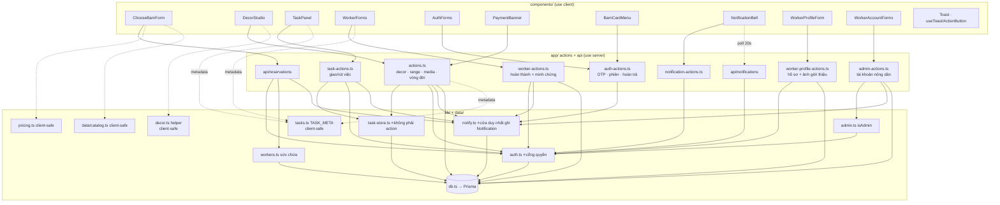
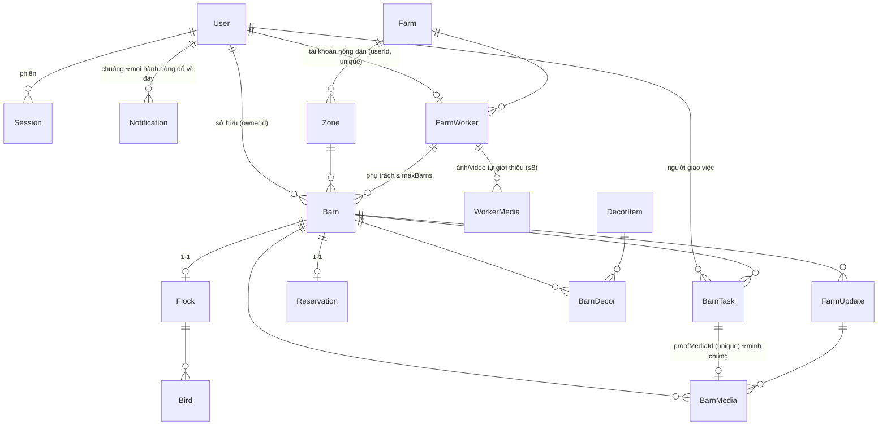

# CODEMAP — bản đồ codebase ChicChic

> **Đọc file này TRƯỚC khi sửa bất cứ thứ gì.** Nó trả lời: *thứ tôi định sửa nằm ở đâu, ai gọi nó, sửa xong thì cái gì gãy theo.*
> Cập nhật: 2026-08-02 · Đối chiếu commit `b16d35e` + nhánh làm việc **Đợt 0** (bịt lỗ quyền admin · upload ảnh thật qua Supabase Storage · bảng `Event` đo đạc).

---

## 0. Cách dùng file này

| Bạn đang cần… | Nhảy tới |
|---|---|
| Hiểu tổng thể trong 60 giây | [§1 Tầng](#1-tầng-và-luật-import) + [§4 Đồ thị module](#4-đồ-thị-module) |
| Biết một URL chạy qua đâu | [§2 Bản đồ route](#2-bản-đồ-route--cổng-quyền--dữ-liệu) |
| Biết chỗ nào GHI vào DB | [§3 Bản đồ ghi](#3-bản-đồ-ghi--ai-được-đụng-vào-bảng-nào) |
| Tra một hàm cụ thể | [§6 Mục lục hàm](#6-mục-lục-hàm-theo-file) |
| Trace một luồng nghiệp vụ | [§7 Bảy vòng lặp](#7-bảy-vòng-lặp-chính--trace-từng-bước) |
| **Sắp sửa code → xem đụng gì** | **[§8 Bảng tra cứu ngược](#8-sửa-x-thì-đụng-vào-đâu)** |
| Sợ phá vỡ ràng buộc nghiệp vụ | [§9 Bất biến](#9-bất-biến-không-được-phá) |

**Quy ước bảo trì:** thêm route / server action / bảng mới → cập nhật §2, §3, §6 và §8 trong **cùng commit**. File này lệch thực tế còn tệ hơn không có.

---

## 1. Tầng và luật import

```
┌─ app/*/page.tsx ────────── Server Component: TRA DỮ LIỆU + KIỂM QUYỀN, không ghi
├─ components/*.tsx ──────── "use client": UI + gọi action, KHÔNG tin được
├─ app/*-actions.ts ──────── "use server": KIỂM QUYỀN rồi mới ghi  ← biên giới an ninh
├─ app/api/**/route.ts ───── HTTP endpoint (dùng khi client cần fetch/poll)
├─ lib/*.ts ─────────────── logic thuần; lib/db.ts là cửa duy nhất xuống Prisma
└─ prisma/schema.prisma ── nguồn sự thật của dữ liệu
```

**Luật import (vi phạm là bug, không phải sở thích):**

1. `components/*` **không bao giờ** import `@/lib/db`, `@/lib/auth`, `@/lib/workers`, `@/lib/task-store`. Chỉ được import action + lib thuần.
2. Lib nào **client dùng chung** thì tuyệt đối không đụng Prisma: `lib/tasks.ts`, `lib/decor.ts`, `lib/pricing.ts`, `data/catalog.ts`.
3. `lib/task-store.ts` **cố tình không có `"use server"`** → không thể gọi từ client. Nó *tin* dữ liệu đưa vào, nên chỉ được gọi từ action đã kiểm quyền.
4. Mọi `"use server"` là **endpoint công khai**. Không có `getSessionUser()` ở đầu hàm = ai cũng gọi được.

---

## 2. Bản đồ route → cổng quyền → dữ liệu

| Route | File | Cổng vào | Đọc | Ghi qua |
|---|---|---|---|---|
| `/` | [page.tsx](src/app/page.tsx) | — (công khai) · **WORKER → `/nong-trai`** | `getSessionUser` · `featuredWorkers` · `farmProof` | — |
| `/dang-nhap` `/dang-ky` | [dang-nhap](src/app/dang-nhap/page.tsx) · [dang-ky](src/app/dang-ky/page.tsx) | đã đăng nhập → `/tai-khoan` | — | `auth-actions` |
| `/quen-mat-khau` | [page.tsx](src/app/quen-mat-khau/page.tsx) | — | — | `auth-actions` |
| `/tai-khoan` | [page.tsx](src/app/tai-khoan/page.tsx) | `getSessionUser` → `/dang-nhap` | Barn+Flock+Reservation của tôi | `auth-actions.returnBarn` |
| `/nhan-chuong` | [page.tsx](src/app/nhan-chuong/page.tsx) | **`requireUser`** · WORKER → `/nong-trai` | `listWorkers()` | `POST /api/reservations` |
| `/chuong` | [page.tsx](src/app/chuong/page.tsx) | **`requireUser`** · WORKER → `/nong-trai` | Barn của tôi (chọn chuồng để vào) | — |
| `/chuong/[id]` | [page.tsx](src/app/chuong/[id]/page.tsx) | **`requireUser` → `canViewBarn`** | Barn + worker + decor + updates + media + **tasks** + flock | `actions.toggleRange`, `task-actions.*` |
| `/chuong/[id]/nhat-ky` | [page.tsx](src/app/chuong/[id]/nhat-ky/page.tsx) | ↑ | FarmUpdate + BarnMedia | — |
| `/chuong/[id]/trang-tri` | [page.tsx](src/app/chuong/[id]/trang-tri/page.tsx) | ↑ | BarnDecor + DecorItem | `actions.*Decor*` |
| `/chuong/[id]/truy-xuat` | [page.tsx](src/app/chuong/[id]/truy-xuat/page.tsx) | ↑ | Flock + Breed + Bird | — |
| `/chuong/[id]/ket-chu-ky` | [page.tsx](src/app/chuong/[id]/ket-chu-ky/page.tsx) | ↑ | Flock (stage END_OF_LAY) | `actions.decideEndOfLay` |
| `/chuong/[id]/tin-nhan` | [page.tsx](src/app/chuong/[id]/tin-nhan/page.tsx) | **`requireUser` → `threadAccess`** (KHÔNG dùng `canViewBarn` — xem được chuồng ≠ được vào hộp thư riêng) | BarnMessage | `message-actions.*` |
| `/nong-dan/[id]` | [page.tsx](src/app/nong-dan/[id]/page.tsx) | **công khai một nửa** — xem `getSessionUser`: khách thấy phần giới thiệu, chuồng/ảnh/ghi chép cần đăng nhập | FarmWorker + `workerLoad` + **WorkerMedia** (tự giới thiệu) · *thêm* BarnMedia + Barn + FarmUpdate khi đã đăng nhập | — |
| `/nong-trai` | [page.tsx](src/app/nong-trai/page.tsx) | **`requireWorker`** | BarnTask của tôi + barns tôi phụ trách | `worker-actions.*` |
| `/nong-trai/ho-so` | [page.tsx](src/app/nong-trai/ho-so/page.tsx) | **`requireWorker`** | FarmWorker + WorkerMedia **của chính mình** | `worker-profile-actions.*` |
| `/nong-trai/chuong/[slug]` | [page.tsx](src/app/nong-trai/chuong/[slug]/page.tsx) | **`requireWorker`** + `barn.workerId === w.workerId` | Barn + decor + tasks | `worker-actions.*` |
| `/admin` | [page.tsx](src/app/admin/page.tsx) | `middleware.ts` (Basic Auth, `ADMIN_PASSWORD`) | tất cả + FarmWorker & tài khoản | `actions.confirmPayment/addMedia/…`, `admin-actions.*` |
| `POST /api/reservations` | [route.ts](src/app/api/reservations/route.ts) | `getSessionUser` → **401 `{needAuth}`** · role WORKER → **403** | Breed/FeedingPlan/Zone | tạo Barn+Flock+Bird+Reservation+BarnTask (+ thông báo nông dân) |
| `GET /api/barns/[slug]/payment` | [route.ts](src/app/api/barns/[slug]/payment/route.ts) | `getSessionUser` → 401 · không phải chủ chuồng → **404** (không lộ chuồng có tồn tại hay không) | Reservation.paymentStatus | — |
| `GET /api/notifications` | [route.ts](src/app/api/notifications/route.ts) | `getSessionUser` → `{list:[]}` | Notification **của chính mình** | — (chuông poll 20s) |

**Ba cổng quyền, đừng nhầm** ([lib/auth.ts](src/lib/auth.ts)):

- `requireUser(nextPath)` → chưa đăng nhập thì `redirect("/dang-nhap?next=…")`. Gọi **ở dòng đầu tiên** của page, **trước** truy vấn nặng (xem [§10](#10-bẫy-đã-gặp-đừng-đạp-lại)).
- `canViewBarn(barn, nextPath)` → gọi `requireUser` bên trong, rồi xét: `isPublic` hoặc chưa có chủ → OK · chủ chuồng / admin → OK · WORKER đúng chuồng mình phụ trách → OK · còn lại `false` → page render `<BarnLocked/>`.
- `requireWorker(nextPath)` → phải đăng nhập, có `FarmWorker` gắn `userId`, **và `active = true`**; không đạt thì `redirect("/tai-khoan")` — trang đó hiện màn "tài khoản tạm dừng" chứ **không** đá ngược sang `/nong-trai` (sẽ thành vòng lặp).
- `activeWorkerSession()` → bản dành cho **server action** của cổng nông dân: giống `getWorkerSession` nhưng trả `null` khi `active = false`. Action không `redirect()` được như page, nên nó cần một cổng trả null để hiện toast từ chối. **Mọi action trong `worker-actions.ts` và `worker-profile-actions.ts` dùng hàm này**, không dùng `getWorkerSession` trần.
- `isAdmin()` ([lib/admin.ts](src/lib/admin.ts)) → cổng cho **server action** của `/admin`: role ADMIN **hoặc** đúng Basic Auth (trình duyệt tự gửi header đó kèm mọi POST tới `/admin`). Chưa đặt `ADMIN_PASSWORD` → **fail-closed ở production**, chỉ cho qua khi chạy dev (middleware.ts giữ đúng luật đó: production thiếu biến thì trả 503).

---

## 3. Bản đồ ghi — ai được đụng vào bảng nào

| Bảng | Được ghi từ | Cổng kiểm |
|---|---|---|
| `User` `Session` `EmailCode` | [auth-actions.ts](src/app/auth-actions.ts) | OTP + mật khẩu |
| `Barn` (tạo) | [api/reservations](src/app/api/reservations/route.ts) | đăng nhập + `workerHasCapacity` |
| `Barn.outside` | **chỉ** [worker-actions.completeTask](src/app/worker-actions.ts) | `task.workerId === w.workerId` |
| `Barn.ownerId = null` | [auth-actions.returnBarn](src/app/auth-actions.ts) | chủ chuồng + gõ đúng `RETURN_PHRASE` |
| `BarnDecor` | [actions.installDecor/removeDecor/saveDecorLayout/resetDecorLayout](src/app/actions.ts) | `ownedBarn()` |
| `BarnDecor.photoUrl` | `completeTask` khi `kind = DECOR` | như trên |
| `BarnTask` (tạo/gộp) | [lib/task-store.upsertTask](src/lib/task-store.ts) ← `task-actions.requestTask`, `actions.toggleRange`, `actions.requestDecorWork` | `ownedBarn()` / owner-check |
| `BarnTask.status` | `completeTask` `declineTask` (nông dân) · `cancelTask` xoá hẳn (chủ chuồng) | chủ sở hữu tương ứng |
| `FarmUpdate` `BarnMedia` | `worker-actions.*` (nông dân) · `actions.addMedia/stamp` (admin) | `activeWorkerSession()` / **`isAdmin()`** |
| `BarnMessage` | **chỉ** [message-actions.ts](src/app/message-actions.ts) | **`threadAccess()`** ([lib/messages.ts](src/lib/messages.ts)) — cửa duy nhất, admin **không** ghi được |
| `Reservation.paymentStatus` | `reportTransfer` (→REPORTED) · `confirmPayment` (→CONFIRMED) | `ownedBarn()` / **`isAdmin()`** |
| `Flock` `Bird` `LifecycleDecision` | [actions.decideEndOfLay](src/app/actions.ts) (chủ chuồng) · [actions.setEndOfLay](src/app/actions.ts) (admin) | `ownedBarn()` / **`isAdmin()`** |
| `Flock.vaccinatedAt` | chỉ `prisma/seed.ts` | — chưa có UI ghi; null ⟹ trang truy xuất hiện "Chưa cập nhật" |
| `Event` | **chỉ** [lib/track.track](src/lib/track.ts) ← action + `/chuong/[id]` | không có — chỉ ghi, không bao giờ đọc từ client |
| `Notification` | **chỉ** [lib/notify.notify](src/lib/notify.ts) ← mọi action sau khi ghi xong · xoá/đọc qua [notification-actions](src/app/notification-actions.ts) | người nhận do action quyết định · đọc/xoá chỉ của `getSessionUser` |
| `User.username` `User.passwordHash` (nông dân) | [admin-actions.createWorkerAccount/resetWorkerPassword](src/app/admin-actions.ts) | **`isAdmin()`** |
| `FarmWorker` (tạo / `active`) | [admin-actions.createWorkerAccount/toggleWorkerActive](src/app/admin-actions.ts) | **`isAdmin()`** |
| `FarmWorker` (hồ sơ: tên, tuổi, bio…) `WorkerMedia` | [worker-profile-actions](src/app/worker-profile-actions.ts) | **`getWorkerSession()`** — chỉ hồ sơ của chính mình, **không nhận `workerId` từ client** |

---

## 4. Đồ thị module



**Nút thắt cần nhớ:** `lib/auth.ts` là cổng quyền của cả app · `lib/task-store.ts` là cửa duy nhất tạo việc · `lib/notify.ts` là cửa duy nhất đẩy thông báo · `lib/db.ts` là cửa duy nhất xuống DB.

---

## 5. Đồ thị dữ liệu



**Ba quan hệ mang toàn bộ nghiệp vụ:**

- `Barn.ownerId` → ai trả tiền và được xem.
- `Barn.workerId` → ai chăm ngoài đời. **Một chuồng đúng một nông dân.**
- `BarnTask.proofMediaId` (unique, nullable) → **`status = DONE` mà cột này null là dữ liệu hỏng.**

---

## 6. Mục lục hàm theo file

### `lib/` — không có UI, không có side-effect ngoài DB

| File | Hàm / hằng | Ai gọi |
|---|---|---|
| [db.ts](src/lib/db.ts) `8` | `prisma` (singleton, giữ qua HMR) | mọi thứ phía server |
| [auth.ts](src/lib/auth.ts) `146` | `hashPassword` `verifyPassword` `passwordProblem` `hashCode` `newOtp` | auth-actions |
| | `createSession` `destroySession` | auth-actions |
| | **`getSessionUser`** — bọc `cache()` | layout, page, mọi action |
| | `myWorker` (private, `cache()`) `myWorkerId` | canViewBarn, getWorkerSession |
| | **`requireUser` `canViewBarn` `requireWorker` `getWorkerSession`** | page + worker-actions |
| [tasks.ts](src/lib/tasks.ts) `68` | `TASK_META` (emoji/label/**doing**/**proof**) · `FEED_SLOTS` · `WORKER_MAX_BARNS` · `nextOccurrence` · `isOverdue` · `STATUS_VI` | TaskPanel, WorkerForms, actions, worker-actions |
| [task-store.ts](src/lib/task-store.ts) `50` | **`upsertTask`** (gộp việc cùng loại đang OPEN) · `openTaskOfKind` | actions.ts, task-actions.ts |
| [workers.ts](src/lib/workers.ts) `160` | `workerLoad` · **`listWorkers`** (1 `groupBy`, không N+1) · **`workerHasCapacity`** | /nhan-chuong, api/reservations, /nong-dan/[id] |
| [decor.ts](src/lib/decor.ts) `101` | `clampPlacement` `DECOR_BOUNDS` · `normalizeMediaUrl` `mediaKind` · `dayLabel` `isToday` `timeAgo` `hhmm` · `flockProgress` · `transferCode` · `RETURN_PHRASE` | khắp nơi, cả 2 phía |
| [pricing.ts](src/lib/pricing.ts) `43` | `clampQty` `priceBreakdown` `fmtVnd` | ChooseBarnForm + api/reservations (**tính lại ở server**) |
| [mailer.ts](src/lib/mailer.ts) `46` | `sendCodeEmail` → `{sent}` hoặc `{devCode}` khi thiếu `RESEND_API_KEY` | auth-actions |
| [notify.ts](src/lib/notify.ts) `77` | **`notify`** (nuốt lỗi, không làm hỏng hành động chính) · `notifyMany` · `workerUserIdOfBarn` · `unreadCount` · `listNotifications` | mọi action + layout + api/notifications |
| [track.ts](src/lib/track.ts) `52` | **`track`** (nuốt lỗi như `notify`) · `EventName` (danh sách đóng) | action ghi tiền/việc/decor + `/chuong/[id]` |
| [storage.ts](src/lib/storage.ts) `66` | `signUpload` (ký URL tải lên Supabase, **fetch trần, 0 dependency**) · `storageReady` · `mediaTypeOfExt` · `BUCKET` | upload-actions |
| [workers.ts](src/lib/workers.ts) | *(cùng file)* **`featuredWorkers`** · **`farmProof`** — "mặt thật" + số liệu sống cho trang chủ; mỗi thẻ bấm được sang `/nong-dan/[id]` | `/` |
| [messages.ts](src/lib/messages.ts) `225` | **`threadAccess`** (cổng quyền DUY NHẤT của hộp thư) · `listMessages` · `unreadFor` · **`unreadByBarn`** (1 `groupBy`, không N+1) · `markRead` · `sendingBlocked` · `shouldNotify` · `looksLikeContactSwap` | message-actions + 3 trang có hộp thư |
| [notify-meta.ts](src/lib/notify-meta.ts) `38` | `NotifyKind` · `NOTIFY_ICON` · `NotificationVM` — **client-safe** | NotificationBell |
| [admin.ts](src/lib/admin.ts) `33` | **`isAdmin()`** — role ADMIN hoặc Basic Auth | admin-actions |
| [data/catalog.ts](src/data/catalog.ts) `86` | `BREEDS` `FEEDING_PLANS` `DECOR_ITEMS` `BASE_PRICES` `FLOCK_QTY` `HEALTH_PACKAGE` `RETIRE_CARE_VND` | seed + form + pricing |

### `app/*-actions.ts` — biên giới an ninh

| File | Hàm | Ai được gọi | Ghi chú |
|---|---|---|---|
| [actions.ts](src/app/actions.ts) `368` | `ownedBarn()` *(private)* | — | **cổng chung**: đăng nhập + là chủ chuồng (admin qua được) |
| | `toggleRange` | chủ chuồng | **tạo việc**, KHÔNG đổi `outside` |
| | `installDecor` `removeDecor` `saveDecorLayout` `resetDecorLayout` | chủ chuồng | đều gọi `requestDecorWork()` → gộp 1 việc DECOR |
| | `reportTransfer` | chủ chuồng | UNPAID → REPORTED |
| | `denyIfNotAdmin()` *(private)* | — | cổng admin dùng chung, bọc `isAdmin()` |
| | `confirmPayment` `addMedia` `deleteMedia` `postUpdate` `setEndOfLay` | admin | **`denyIfNotAdmin()` ở dòng đầu** — middleware KHÔNG chặn lời gọi action |
| | `decideEndOfLay` | chủ chuồng | `ownedBarn()` rồi mới tới guard `stage === END_OF_LAY`; từ chối thì `redirect` về trang chuồng (form không hiện toast được) |
| [task-actions.ts](src/app/task-actions.ts) `79` | `requestTask(slug, kind, note, dueAtIso)` | chủ chuồng/admin | trần `MAX_OPEN_PER_BARN = 6` |
| | `cancelTask(taskId)` | chủ chuồng | chỉ khi `status = OPEN`, xoá hẳn |
| [worker-actions.ts](src/app/worker-actions.ts) `170` | `markTasksSeen()` | nông dân | xoá dấu "MỚI" |
| | **`completeTask(taskId, formData)`** | nông dân đúng việc | ⭐ hạt nhân — [§7.3](#73-nông-dân-làm-xong--transaction-lõi) |
| | `declineTask(taskId, reason)` | nông dân đúng việc | lý do ≥ 5 ký tự, đăng lên nhật ký |
| | `postDailyUpdate(formData)` | nông dân đúng chuồng | **không cần việc** — vòng lặp giữ chân |
| [auth-actions.ts](src/app/auth-actions.ts) `188` | `issueCode` `consumeCode` *(private)* | — | OTP 10 phút, tối đa 5 lần, cooldown 60s |
| | `sendRegisterCode` `verifyAndRegister` `login` `logout` `sendResetCode` `resetPassword` | công khai | `login(identifier, pw)` nhận **email HOẶC username** (có `@` → email) · `resetPassword` **huỷ mọi phiên cũ** |
| | `returnBarn(slug, phrase)` | chủ chuồng | 2 lớp: sở hữu + `RETURN_PHRASE` |
| [admin-actions.ts](src/app/admin-actions.ts) `179` | `createWorkerAccount(input: NewWorkerInput)` | **`isAdmin()`** | tạo/gắn tài khoản nông dân · email nội bộ `<username>@nong-dan.chicchic.vn` (không gửi thư) |
| | `resetWorkerPassword(workerId, password)` | **`isAdmin()`** | `$transaction` [đổi hash + **xoá sạch Session**] · dùng **tham số thường, không FormData** — xem [§10](#10-bẫy-đã-gặp-đừng-đạp-lại) |
| | `toggleWorkerActive(workerId)` | **`isAdmin()`** | tạm dừng = ẩn khỏi `/nhan-chuong` **+ khoá đăng nhập + xoá sạch Session**. Chuồng đang chăm KHÔNG bị gỡ → cảnh báo admin số chuồng sẽ mất tin |
| [upload-actions.ts](src/app/upload-actions.ts) `55` | `createUploadUrl(folder, ext)` | nông dân đang hoạt động · chủ chuồng · admin (thư mục `quan-tri` chỉ admin) | **KHÔNG nhận file** — chỉ ký URL, file đi thẳng điện thoại → Supabase (body serverless giới hạn ~4,5MB) |
| [message-actions.ts](src/app/message-actions.ts) `157` | `sendMessage(barnSlug, body)` | chủ chuồng · nông dân phụ trách **đang hoạt động** | `threadAccess()` ở dòng đầu · admin bị từ chối (chỉ đọc) · chặn tần suất · gắn cờ liên hệ ngoài · chuông chỉ kêu khi chưa có tin chờ đọc |
| | `markThreadRead(barnSlug)` | hai bên trong hộp thư | admin đọc **không** đánh dấu đã đọc thay ai |
| | `reportMessage(messageId)` | hai bên | chỉ báo cáo tin của **phía bên kia** · đây là đường DUY NHẤT mở khoá cho admin đọc |
| | `messageToTask(messageId, kind)` | **chỉ chủ chuồng** | biến ý định thành `BarnTask` qua `upsertTask` — nông dân không tự giao việc cho mình rồi tự đóng |
| [notification-actions.ts](src/app/notification-actions.ts) `29` | `markNotificationsRead` `clearNotifications` | người đang đăng nhập | chỉ đụng `userId` của chính mình |
| [worker-profile-actions.ts](src/app/worker-profile-actions.ts) `111` | `updateMyProfile(input)` | nông dân | đổi tên thì đổi cả `User.name`; năm sinh phải trong khoảng 15–100 tuổi |
| | `addIntroMedia(input)` `deleteIntroMedia(id)` | nông dân | trần `MAX_INTRO_MEDIA = 8` · chặn URL trùng · `deleteMany` kèm `workerId` nên không xoá được của người khác |

### `components/` — client

| File | Xuất | Gọi tới |
|---|---|---|
| [Toast.tsx](src/components/Toast.tsx) `93` | `ToastProvider` `useToast` **`ActionButton`** | — · TTL toast **3800ms** |
| [ChooseBarnForm.tsx](src/components/ChooseBarnForm.tsx) `328` | mặc định + `WorkerOption` | `POST /api/reservations` |
| [TaskPanel.tsx](src/components/TaskPanel.tsx) `207` | mặc định + `TaskVM` | `requestTask` `cancelTask` |
| [WorkerForms.tsx](src/components/WorkerForms.tsx) `236` | `WorkerTaskCard` `DailyUpdateForm` `WorkerTaskVM` | `completeTask` `declineTask` `postDailyUpdate` |
| [DecorStudio.tsx](src/components/DecorStudio.tsx) `258` | mặc định + `Placed` `CatalogItem` | `installDecor` `removeDecor` `saveDecorLayout` `resetDecorLayout` |
| [AuthForms.tsx](src/components/AuthForms.tsx) `204` | `RegisterForm` `LoginForm` `ForgotForm` | auth-actions · đọc `?next=` |
| [BarnCardMenu.tsx](src/components/BarnCardMenu.tsx) `131` | mặc định | `returnBarn` |
| [PaymentBanner.tsx](src/components/PaymentBanner.tsx) `120` | mặc định | `reportTransfer` + poll `/api/barns/[slug]/payment` |
| [MediaGallery.tsx](src/components/MediaGallery.tsx) `211` | `MediaStrip` `MediaGrid` `MediaVM` | — |
| [MediaUpload.tsx](src/components/MediaUpload.tsx) `172` | mặc định | `createUploadUrl` → PUT thẳng lên Supabase · **nén ảnh về ≤1600px/JPEG 0.82 trước khi tải** · video chặn >25MB · `capture="environment"` mở camera sau · kho chưa cấu hình → tự đổi sang ô dán URL |
| [Illustrations.tsx](src/components/Illustrations.tsx) `223` | `Coop` `CoopBackdrop` `DecorSprite` `DecorFigure` `FarmerAvatar` `QRCode` `COOP_VIEWBOX` | SVG thuần, không state |
| [EndOfLayChoices.tsx](src/components/EndOfLayChoices.tsx) `93` | mặc định | `decideEndOfLay` |
| [AdminForms.tsx](src/components/AdminForms.tsx) `123` | `MediaForm` `UpdateForm` | `addMedia` `postUpdate` |
| [BarnLocked.tsx](src/components/BarnLocked.tsx) `20` | mặc định | màn "chuồng riêng tư" |
| [NotificationBell.tsx](src/components/NotificationBell.tsx) `170` | mặc định | `markNotificationsRead` + poll `GET /api/notifications` mỗi **20s** (chỉ khi tab hiện) |
| [WorkerAccountForms.tsx](src/components/WorkerAccountForms.tsx) `389` | `CreateWorkerForm` · **`WorkerAccountRow`** (tên bấm được + nút đổi mật khẩu) · `WorkerAccountDialog` (popup) · `WorkerRow` | `createWorkerAccount` `resetWorkerPassword` |
| [WorkerProfileDialog.tsx](src/components/WorkerProfileDialog.tsx) `129` | mặc định + `WorkerProfileVM` | popup hồ sơ nông dân — mở từ ⋯ ở `/nhan-chuong` và nút "Xem thử" ở `/nong-trai/ho-so` |
| [BarnThread.tsx](src/components/BarnThread.tsx) `211` | mặc định (`role` `ownerName` `workerName` `initial` `compact`) | hộp thư — **một component cho cả hai vai**: nông dân có nút trả lời nhanh, chủ chuồng có "Chuyển thành việc", admin `readOnly`. Cố ý KHÔNG có "đang gõ"/"đã xem" |
| [WorkerProfileForm.tsx](src/components/WorkerProfileForm.tsx) `248` | mặc định + `WorkerProfileData` | `updateMyProfile` `addIntroMedia` `deleteIntroMedia` |

---

## 7. Bảy vòng lặp chính — trace từng bước

### 7.1 Nhận chuồng (chọn nông dân)
```
/            →  role WORKER → /nong-trai (trang chủ là lời mời NHẬN NUÔI, không dành cho cô chú)
   "Những người thật đang chăm chuồng" → bấm vào một người → /nong-dan/<id>

/  "Xem chuồng của tôi"  →  /chuong  →  requireUser (chưa đăng nhập → /dang-nhap?next=/chuong)
       ├ role WORKER          → /nong-trai
       ├ có chuồng            → danh sách để chọn → /chuong/<slug>
       └ chưa có chuồng nào   → màn "nhận nuôi chuồng đầu tiên" + lối xem /chuong/demo

/nhan-chuong  →  requireUser  →  role WORKER → /nong-trai  →  listWorkers()  →  <ChooseBarnForm workers=…>
   người dùng chọn giống · chế độ ăn · số con · TÊN GÀ · NÔNG DÂN
   → POST /api/reservations {workerId, idemKey, …}
       ├ getSessionUser        chưa đăng nhập → 401 {needAuth, loginPath}
       ├ role WORKER           → 403 (cổng THẬT của luật "nông dân không nhận nuôi chuồng")
       ├ idemKey đã tồn tại    → trả lại đúng đơn cũ (reused: true)
       ├ workerHasCapacity()   kín/tạm nghỉ → 409
       ├ priceBreakdown()      TÍNH LẠI ở server, không tin giá client
       ├ gate "còn cọc treo"   → 409 kèm pendingBarnSlug
       └ $transaction: Barn(+workerId+ownerId) → Flock → Bird[] → FarmUpdate
                       → BarnTask CHECK "Chụp hiện trạng chuồng lúc nhận"
                       → Reservation(HELD, idemKey)
   → chuyển tới /chuong/<slug>, hiện <PaymentBanner> (UNPAID)
```

### 7.2 Chủ chuồng giao việc
```
<TaskPanel>  ── nextOccurrence("06:30") tính Ở CLIENT ─→ requestTask(slug, kind, note, ISO)
   ├ getSessionUser + barn.ownerId === me.id
   ├ đếm OPEN < MAX_OPEN_PER_BARN (6)
   └ upsertTask()  ── có việc cùng kind đang OPEN? ─→ CẬP NHẬT + seenAt = null
                                                 └→ không? TẠO MỚI
   → notify(worker.userId, TASK_NEW) — CHỈ khi tạo mới, gộp vào việc cũ thì không báo lại
   → revalidate /chuong/<slug> + /nong-trai
```
Hai đường khác cũng đổ vào `upsertTask` y hệt: `toggleRange` (RANGE_OUT/RANGE_IN) và `requestDecorWork` (DECOR, gọi từ cả 4 hàm decor).

### 7.3 Nông dân làm xong — transaction lõi
```
/nong-trai → requireWorker → hộp việc (quá hạn xếp trước) → <WorkerTaskCard>
   nút "Hoàn thành" KHOÁ tới khi có url  ← lớp chặn 1 (UI)
   → completeTask(taskId, formData)
       ├ getWorkerSession()             không có hồ sơ → từ chối
       ├ task.workerId === w.workerId   việc người khác → từ chối
       ├ status !== DONE                chống bấm 2 lần
       ├ normalizeMediaUrl(url)         RỖNG → TỪ CHỐI  ← lớp chặn 2 (server) ⭐
       └ $transaction:
            FarmUpdate  ← chủ chuồng thấy trong nhật ký
            BarnMedia   ← ảnh/video, capturedAt = now
            BarnTask    → DONE + doneAt + proofMediaId = media.id
            RANGE_OUT → Barn.outside = true
            RANGE_IN  → Barn.outside = false
            DECOR     → BarnDecor.photoUrl (những món chưa có ảnh)
   → notify(barn.ownerId, TASK_DONE) → hiện trên chuông của chủ chuồng
   → touch(): revalidate /nong-trai, /nong-trai/chuong/<slug>, /chuong/<slug>, /nhat-ky, /tai-khoan
```

### 7.6 Nông trại cấp tài khoản cho nông dân
```
/admin (Basic Auth)  →  khối "👩‍🌾 Tài khoản nông dân"
   admin nhập tên · khu vực · TÊN ĐĂNG NHẬP · MẬT KHẨU
   → createWorkerAccount(formData)
       ├ isAdmin()              role ADMIN hoặc Basic Auth — middleware KHÔNG chặn action
       ├ USERNAME_RE + passwordProblem
       ├ username đã có?        → từ chối
       └ $transaction: User(role=WORKER, username, email nội bộ) → FarmWorker(userId)
   → notify(user, ACCOUNT)
   admin đưa tận tay username + mật khẩu
   → nông dân /dang-nhap gõ username  →  login() thấy có "@" không? không → tra theo username
   → /nong-trai: chuồng phụ trách + trạng thái việc từng chuồng
```

### 7.4 Trang trí → việc thật
```
/chuong/<slug>/trang-tri → <DecorStudio> kéo thả (clampPlacement ở client)
   → saveDecorLayout(slug, layout[])
       ├ ownedBarn()
       ├ bỏ qua món client gửi mà chưa lắp thật; clampPlacement LẠI ở server
       ├ so sánh từng món, không đổi thì không ghi
       └ requestDecorWork() → 1 việc DECOR duy nhất
   → cô Lan lắp thật → completeTask → BarnDecor.photoUrl = ảnh
```

### 7.5 Cọc
```
<PaymentBanner> poll GET /api/barns/<slug>/payment mỗi vài giây
   người dùng bấm "Tôi đã chuyển khoản" → reportTransfer → REPORTED
   admin /admin → confirmPayment → CONFIRMED + FarmUpdate mốc son
   → banner tự biến mất; installDecor mở khoá (barnActivated())
```

### 7.7 Hộp thư của chuồng
```
/chuong/<slug>/tin-nhan   (chủ chuồng)      ─┐
/nong-trai/chuong/<slug>  (nông dân, nhúng) ─┴→ threadAccess(slug)  ← CỬA DUY NHẤT
       ├ chuồng chưa có chủ / isPublic  → null (chuồng trưng bày KHÔNG có hộp thư)
       ├ ownerId === me                 → OWNER
       ├ activeWorkerSession() đúng chuồng → WORKER   (tạm dừng ⇒ null, §9.10)
       ├ role ADMIN + có tin flagged/reported → ADMIN (chỉ đọc, không gửi được)
       └ còn lại                        → null
   → markRead()  → listMessages()  → <BarnThread role=… />

sendMessage(slug, body)
   ├ threadAccess         không qua → từ chối
   ├ sendingBlocked()     >10 tin/giờ · >5 tin liên tiếp chưa ai trả lời → từ chối
   ├ looksLikeContactSwap() → flagged = true (VẪN GỬI, chỉ cảnh báo — §R2)
   ├ track("message_sent")
   └ shouldNotify()       chỉ rung chuông khi chưa có tin nào của mình đang chờ đọc (§9.8)

messageToTask(messageId, kind)   ← chỉ CHỦ CHUỒNG
   → upsertTask(FEED|CHECK)  → BarnTask OPEN, proofMediaId = null
   → nông dân vẫn phải đính ảnh mới đóng được (§9.1 nguyên vẹn)

reportMessage(messageId)  → reportedAt  → đường DUY NHẤT mở khoá cho /admin đọc (§9.17)
```

---

## 8. Sửa X thì đụng vào đâu

| Muốn sửa | Sửa ở | Nhớ sửa kèm | Kiểm lại |
|---|---|---|---|
| Thêm **loại việc** mới | `schema.prisma:TaskKind` → `db push` | `lib/tasks.ts:TaskKind` **+ `TASK_META`** · `task-actions.ts:KINDS` · `worker-actions.ts:UPDATE_KIND` | `TASK_META` thiếu key → crash runtime, TS bắt được |
| Đổi **trần 15 chuồng** | `schema.prisma:FarmWorker.maxBarns` (default) | `lib/tasks.ts:WORKER_MAX_BARNS` (hiển thị) · hàng đã có trong DB phải `update` tay | `workerHasCapacity` đọc DB, không đọc hằng |
| Đổi **luật xem chuồng** | `lib/auth.ts:canViewBarn` — **một chỗ duy nhất** | không cần sửa 5 page | quét lại 5 page `/chuong/*` |
| Thêm **trang chuồng** mới | page mới trong `app/chuong/[id]/` | `requireUser` **dòng đầu** → query → `canViewBarn` → `<BarnLocked/>` · thêm vào `revalidateBarn()` | thử bằng tab ẩn danh |
| Thêm **thao tác lên chuồng** | `actions.ts` | **bắt đầu bằng `ownedBarn()`** · kết thúc bằng `revalidateBarn()` | thiếu = ai biết slug cũng ghi được |
| Đổi **giá** | `data/catalog.ts:BASE_PRICES` | `lib/pricing.ts` nếu đổi công thức | server tính lại — không sửa client là đủ |
| Thêm **món decor** | `data/catalog.ts:DECOR_ITEMS` + `db:seed` | `Illustrations.tsx:DecorSprite` cần `svgKey` tương ứng | thiếu SVG → ô trống, không lỗi |
| Đổi **giờ cho ăn** | `lib/tasks.ts:FEED_SLOTS` | — | `nextOccurrence` chạy client, không lệch múi giờ |
| Đổi **luồng đăng nhập** | `lib/auth.ts` + `auth-actions.ts` | `AuthForms.tsx` đọc `?next=` | mọi `requireUser` phải giữ đúng `next` |
| Thêm **cột vào Barn** | `schema.prisma` → `db push` | các `select:` **liệt kê tường minh** trong `ownedBarn`, `completeTask`, `/api/reservations` | quên → `undefined` lúc chạy |
| Đổi **thông điệp cho người dùng** | ngay trong action (chuỗi tiếng Việt) | — | E2E đọc theo text → cập nhật script |
| Thêm **bảng mới** | `schema.prisma` → `db push` → `prisma/seed.ts` | **§3 + §5 của file này** | `npm run db:reset` phải chạy sạch |
| Thêm **hành động mới** cho user/nông dân | action tương ứng | **`notify()` cho phía bên kia** ngay sau khi ghi xong (§9.8) · thêm `NotifyKind` thì sửa cả `schema.prisma` **và** `lib/notify-meta.ts` | thiếu icon trong `NOTIFY_ICON` → TS bắt được |
| Thêm **thao tác ở /admin** | `admin-actions.ts` | **bắt đầu bằng `isAdmin()`** (trong `actions.ts` dùng `denyIfNotAdmin()`) — middleware KHÔNG chặn lời gọi action | gọi thẳng action từ route khác phải bị từ chối |
| Thêm **sự kiện đo đạc** | `lib/track.ts:EventName` (danh sách đóng) → gọi `track()` **sau khi ghi DB xong** | khối "📊 Nhịp 7 ngày" ở `admin/page.tsx` nếu muốn hiện ra | tên gõ sai → TS bắt được; đừng đặt tên tự do |
| Thêm **chỗ tải ảnh/video** | `<MediaUpload folder=… kind=… onUploaded=…/>` | `upload-actions.FOLDERS` phải có thư mục đó **kèm đúng cổng quyền** | thử với `SUPABASE_URL` trống → phải tự đổi sang ô dán URL, không được kẹt |
| Đổi **cách nông dân đăng nhập** | `auth-actions.login` + `User.username` | `AuthForms.LoginForm` (một ô cho cả email lẫn username) · `admin-actions.USERNAME_RE` | thử cả 2 kiểu tài khoản |
| Đổi **luật tạm dừng nông dân** | `FarmWorker.active` | **cả 3 lớp**: `auth-actions.login` · `lib/auth.requireWorker` · `admin-actions.toggleWorkerActive` (xoá `Session`) · `/tai-khoan` phải hiện màn tạm dừng chứ không đá sang `/nong-trai` | thử với phiên **đang mở sẵn**, không chỉ thử đăng nhập mới |
| Thêm **trang/nút mời "nhận nuôi · mua"** | page hoặc route mới | **đá `role = WORKER` về `/nong-trai`** ở page **và** trả 403 ở cửa ghi DB (§9.14) · kiểm chuỗi đá có kết thúc không | đăng nhập bằng `colan` rồi mở trang đó — không được thấy form |
| Thêm **mục vào `/nong-dan/[id]`** | `app/nong-dan/[id]/page.tsx` | mục có dính **chuồng cụ thể** phải nằm trong nhánh `inside` (chỉ khi đã đăng nhập, §9.15) | mở bằng tab ẩn danh — không được lộ slug/nhãn chuồng |
| Thêm **chỗ nhắn tin / mở rộng hộp thư** | `lib/messages.ts` | **`threadAccess()` là cửa duy nhất** — đừng tự kiểm quyền trong action mới · thêm giới hạn tần suất · admin vẫn chỉ đọc khi có cờ (§9.17) | gọi thẳng action bằng phiên nông dân KHÁC và nông dân **tạm dừng** |
| Thêm **trường vào hồ sơ nông dân** | `schema.prisma:FarmWorker` → `db push` | `lib/workers.WorkerCard` + `listWorkers` · `ChooseBarnForm.WorkerOption` · `WorkerProfileDialog.WorkerProfileVM` · `WorkerProfileForm` · `worker-profile-actions.ProfileInput` · `/nong-dan/[id]` | 5 chỗ khai lại kiểu — TS bắt hết nếu sửa thiếu |

---

## 9. Bất biến không được phá

1. **Không minh chứng thì không xong.** `BarnTask.status = DONE` ⟹ `proofMediaId != null`. Chặn ở `completeTask`, và chỉ ở đó — không thêm đường ghi `status = DONE` nào khác.
2. **App không đổi hiện thực.** `Barn.outside` chỉ đổi bên trong `completeTask`. Nút bấm của người dùng **tạo việc**, không đổi trạng thái. Điều này áp dụng cho mọi tính năng "ngoài đời" thêm sau này.
3. **Một chuồng một nông dân, ≤ `maxBarns`.** Kiểm bằng `workerHasCapacity` **ngay trước** khi tạo chuồng, trong cùng request — danh sách client thấy luôn có thể đã cũ.
4. **Chuồng đã hoàn trả không tính tải.** `workerLoad` chỉ đếm `ownerId != null`.
5. **Đăng nhập trước mọi trang chuồng.** Không có "xem thử ẩn danh". `isPublic` chỉ nới cho *tài khoản khác*, không nới cho khách.
6. **Không tin client.** Giá, vị trí decor, danh sách món, số con — tính/ép lại ở server.
7. **Bấm hai lần không nhân đôi.** `idemKey` (đơn) · `upsertTask` (việc) · cửa sổ trùng 60 giây (`stamp`, `addMedia`, `postDailyUpdate`) · check `status` trước khi đổi.
8. **Hành động xong thì phía bên kia phải biết.** Mọi action hoàn tất đều gọi `notify()` cho người còn lại (chủ chuồng ↔ nông dân). Gọi **sau khi** ghi DB xong và không bao giờ để lỗi thông báo làm hỏng hành động chính — `notify` tự nuốt lỗi. Việc gộp vào task đang OPEN thì **không** báo lại (tránh dội chuông).
9. **Nông dân không tự tạo tài khoản.** Chỉ `admin-actions.createWorkerAccount` mới sinh được `User(role=WORKER)` + `FarmWorker`. Không mở đường đăng ký WORKER ở luồng OTP công khai.
10. **`FarmWorker.active = false` là khoá tài khoản, không chỉ là "hết chỗ".** Bốn lớp phải cùng chặn: `login()` từ chối · `requireWorker()` đá đi (page) · `activeWorkerSession()` trả null (action) · và **xoá `Session`** ngay lúc tạm dừng — thiếu lớp cuối thì người đang đăng nhập vẫn dùng tiếp tới 30 ngày. Thêm chỗ nào đọc `active` thì giữ đủ cả bốn.
11. **Nói đúng những gì có trong sổ.** Không viết cứng lời khẳng định về nghiệp vụ ngoài đời (tiêm phòng, kiểm dịch, giết mổ) vào JSX. Chưa có dữ liệu thì hiện "chưa cập nhật". Một dòng `✓ Đã tiêm theo quy định` viết cứng là rủi ro pháp lý, và phá đúng thứ đang bán: sự trung thực.
12. **Ảnh minh chứng phải là ảnh chụp thật.** Không bao giờ đưa lại nút "ảnh mẫu"/ảnh dựng sẵn vào luồng hoàn thành việc — nó biến bất biến §9.1 thành hình thức. Ảnh mẫu chỉ được nằm trong `prisma/seed.ts`.
13. **Đo đạc không được làm hỏng nghiệp vụ.** `track()` gọi **sau khi** ghi DB xong và tự nuốt lỗi, y hệt `notify()`. Không bao giờ đặt `track()` bên trong `$transaction`.
14. **Mỗi vai một cửa vào — nông dân không đi luồng khách hàng.** `role = WORKER` thì `/`, `/chuong`, `/tai-khoan`, `/nhan-chuong` đều đá về `/nong-trai`, và **`POST /api/reservations` trả 403**. Chặn ở trang chỉ là mỹ quan; cửa API mới là luật — để hở thì một tài khoản nông dân tự đặt chuồng rồi tự nhận phần công của chính mình. Thêm route nào mời "nhận nuôi/mua" thì thêm cả cổng này. Chuỗi đá phải **kết thúc**: `/` → `/nong-trai` → (nếu `active = false`) `/tai-khoan` dừng lại ở màn tạm dừng, không quay ngược (xem §9.10).
15. **Mặt thật phải xem được trước khi đăng nhập.** Phần giới thiệu của `/nong-dan/[id]` mở cho khách vãng lai — đó là bằng chứng chống-đa-cấp, khoá sau màn đăng nhập là vứt bỏ tác dụng. Nhưng dữ liệu gắn với **chuồng cụ thể** (danh sách chuồng + slug, ảnh hằng ngày, ghi chép) vẫn phải sau `getSessionUser` — đó là chuồng của người khác (§9.5). Ảnh/video tự giới thiệu chỉ lên trang công khai khi `consentMedia = true`.
16. **Tin nhắn không đổi hiện thực.** Hộp thư là nơi phát sinh **ý định**; `BarnTask` là nơi **thực thi có minh chứng**. Nhắn "cho ăn thêm giúp em" KHÔNG phải là đã giao việc — phải qua `messageToTask` (chỉ chủ chuồng gọi được) mới sinh việc, và việc đó vẫn chịu §9.1. Đừng bao giờ cho nông dân "đóng việc bằng một câu trả lời": làm thế là biến §9.1 thành hình thức, đúng kiểu 7 nút ảnh mẫu đã từng làm.
17. **Quản trị chỉ đọc hộp thư khi có cờ.** `threadAccess()` **cố ý không** cho `role === "ADMIN"` đi qua như `ownedBarn()` — nông trại chỉ mở được hộp thư có tin `flagged` hoặc `reportedAt`, và admin **không gửi được tin**. Luật này được in ngay trong hộp thư cho cả hai bên đọc, nên nới nó ra là nói dối người dùng: muốn đổi thì phải đổi cả dòng chữ đó trước.

---

## 10. Bẫy đã gặp (đừng đạp lại)

| Bẫy | Vì sao | Cách đúng |
|---|---|---|
| `requireUser` đặt **sau** truy vấn | khách ẩn danh vẫn phải chờ query nặng | đặt **dòng đầu** page — đo được 9,3s → 0,09s |
| Gọi `getSessionUser` nhiều lần | layout + page + `canViewBarn` = 3 truy vấn | đã bọc `cache()`; **giữ nguyên**, đừng bỏ |
| `connection_limit=1` | mọi truy vấn xếp hàng một hàng dọc | `.env` để **5** — và **cả biến môi trường trên Vercel** |
| `redirect()` trong Server Component | trả HTTP **200**, redirect nằm trong RSC payload | test bằng cách grep `dang-nhap?next=` trong body, đừng đọc status code |
| Prisma `_count` có filter | cần preview feature `filteredRelationCount` | dùng `groupBy` như `listWorkers` |
| Toast biến mất sau 3,8s | không thấy toast **không chứng minh** thất bại | xác nhận qua DB hoặc trang đã render lại |
| DB ở `ap-south-1` (Mumbai) | ~1,3s mỗi lượt đi–về | biết trước khi "tối ưu" query; chuyển sang `ap-southeast-1` mới là cách sửa thật |
| Sửa `FarmWorker.userId` (unique) | `db push` đòi `--accept-data-loss` | kiểm tra cột đúng là mới & nullable rồi mới chấp nhận |
| Action nhận `FormData` | **không gọi được từ ngoài trình duyệt** để test (multipart + `Next-Action` luôn 500 "Connection closed") | action nào cần test tự động thì nhận **tham số thường** — body JSON `[arg1, arg2]` + header `Next-Action` + `Origin` là gọi được bằng curl/fetch |
| `export const` trong file `"use server"` | Next chỉ cho export **hàm async** → cả module hỏng, mọi trang import nó trả **500**. `tsc` và `lint` **không bắt được**, chỉ mở trang mới lộ | hằng số dùng chung để ở `lib/` client-safe (vd `MAX_INTRO_MEDIA` ở `lib/decor.ts`) · sửa xong luôn **mở thử trang** chứ đừng tin mỗi tsc |
| Định "xem lại mật khẩu" của ai đó | `passwordHash` là scrypt `salt:hash`, **một chiều** | chỉ có đường **đặt mật khẩu mới** rồi hiện đúng một lần cho admin chép |

---

## 11. Khoảng trống đã biết

Ghi ở đây để không ai tưởng là đã xong.

1. ~~Action của admin chưa kiểm role~~ → **đã bịt** (Đợt 0.1): `denyIfNotAdmin()` ở đầu `confirmPayment` `addMedia` `deleteMedia` `postUpdate` `setEndOfLay`.
2. ~~`decideEndOfLay` chưa kiểm sở hữu~~ → **đã bịt**: `ownedBarn()` chạy trước guard `stage`.
3. ~~`GET /api/barns/[slug]/payment` không kiểm quyền~~ → **đã bịt**: 401 khi chưa đăng nhập, 404 khi không phải chủ chuồng.
4. ~~Media chỉ dán URL~~ → **đã có upload thật** (Đợt 0.2): `MediaUpload` + `upload-actions` + `lib/storage` (Supabase Storage). ⚠️ **Còn lại:** chưa có đường xoá file khỏi kho khi `BarnMedia`/`WorkerMedia` bị xoá → kho sẽ tích file mồ côi. `normalizeMediaUrl` vẫn chỉ chặn `javascript:`/`data:`, nên lối "dán URL" vẫn nhận host bất kỳ.
   - ⚠️ Video **không được nén** trên trình duyệt (cần ffmpeg.wasm, quá nặng) — chỉ chặn >25MB. Ảnh thì nén thật qua canvas.
5. ~~Nông dân không tự tạo tài khoản được~~ → đã có: `/admin` → khối **👩‍🌾 Tài khoản nông dân** (`admin-actions.createWorkerAccount`). Đây là *thiết kế*, không phải thiếu sót: tài khoản do nông trại cấp tận tay.
6. Thông báo là **poll 20 giây**, chưa phải push thật (chưa có Web Push/FCM). Đóng tab thì không nhận được gì; mở lại mới thấy.
7. `notify()` gọi **ngoài** `$transaction` của hành động chính — nếu tiến trình chết đúng khe giữa hai bước thì mất một dòng thông báo (dữ liệu nghiệp vụ vẫn đúng). Đổi lại: lỗi thông báo không bao giờ làm rollback việc đã làm.
8. Đổi mật khẩu nông dân xong, **admin phải tự đưa mật khẩu mới** cho cô/chú — hệ thống không gửi đi đâu cả (tài khoản nông dân dùng email nội bộ, không nhận được thư).
9. **Tạm dừng một nông dân đang giữ chuồng thì những chuồng đó im tin.** `active = false` khoá đăng nhập nhưng KHÔNG gỡ `Barn.workerId`, mà app lại chưa có luồng **bàn giao chuồng sang người khác**. Hiện phải sửa `workerId` tay trong DB. Đây là khoảng trống lớn nhất còn lại của cổng nông dân.
10. 🔴 **Đàn gà không bao giờ lớn lên.** `Flock.stage` luôn tạo ở `BROODING` và **không có job nào** đẩy `BROODING → GROWING → LAYING → END_OF_LAY` theo `cycleDays`. Đường duy nhất vào `END_OF_LAY` là nút dev của admin (`setEndOfLay`, chỉ hiện khi `NODE_ENV !== "production"`). ⟹ **chuồng layer thật sẽ không bao giờ tới giai đoạn đẻ.** (Đợt 1.1 của roadmap.)
11. 🔴 **`Product.qty` (số trứng) không có lệnh `update` nào trong `src/`** — chỉ tạo với `qty: 0` (`api/reservations`) và seed cứng. Ô "Trứng chu kỳ này" của mọi chuồng thật sẽ vĩnh viễn là **0 quả**. (Đợt 1.2–1.3.)
12. 🔴 **Không có `Order`/`Delivery`/`Address`/`Payment`/`Subscription`.** Sau khi cọc `CONFIRMED` là hết luồng: trứng/thịt không bao giờ được giao trong hệ thống, không có chu kỳ thu tiền tháng thứ hai. `ReservationStatus.ACTIVE`/`COMPLETED` là enum chết. (Đợt 3.)
13. 🟠 **Nhiều nguồn thu hiển thị giá mà không thu tiền:** decor (10 SKU, tối đa 460k/chuồng — `installDecor` chỉ ghi `BarnDecor`), phí nghỉ hưu `RETIRE_CARE_VND` 60k/tháng. Gói "An tâm" 40k thì **đã nối** ở Đợt 0.4 (`healthPlanOptIn` cộng vào `priceEstimateVnd`) nhưng cũng chưa có cơ chế thu.
14. 🟠 **Bảng giá đang thấp hơn giá trị nông sản.** LAYER 35k/mái/tháng → ~1.750đ/quả trứng (thị trường gà ta 4.500–7.000đ). BROILER 80k/con (thị trường 220–300k). Xem `data/catalog.ts:BASE_PRICES` — số minh hoạ PoC, **phải sửa trước khi bán cho người lạ**.
15. 🟡 **QR ở trang truy xuất không quét được** — `Illustrations.QRCode` là SVG tĩnh, không encode URL nào. Trang truy xuất lại nằm sau `requireUser` nên người được tặng trứng không xem được. (Đợt 2.3.)
16. 🟡 `HealthEvent` / `HealthPackage`: model có, **0 action runtime** — banner "đang ngừng thuốc" chỉ chạy trên dữ liệu seed.
17. 🟡 **`decideEndOfLay` nhánh `RENEW` làm hỏng dữ liệu**: reset cứng **5 con** `NEW-01..05` bất kể đàn 6–10, xoá sạch tên user đặt và `Product`. Không hỏi lại giống/số lượng/tên, không tính lại tiền.
18. 🟡 Vẫn **chưa có test tự động** (0 file test, CI không có bước test). Rate limit hiện chỉ có ở **OTP** và **hộp thư** (`sendingBlocked`) — các action còn lại vẫn để trần.
19. 🟡 **`/nong-dan/[id]` cho *mọi tài khoản đã đăng nhập* xem danh sách chuồng + ảnh hằng ngày của cô/chú đó**, kể cả chuồng của người khác. Đây là chủ ý (bằng chứng "cô chú này có gửi ảnh thật" là thứ khách cần trước khi chọn người chăm) và không lộ nội dung chuồng — bấm vào `/chuong/<slug>` vẫn bị `canViewBarn` chặn thành `<BarnLocked/>`. Nhưng nó **lộ sự tồn tại của slug**, đủ để đếm chuồng của người khác. Nếu sau này chuồng cho phép đổi tên tự do thì phải siết lại. Khách chưa đăng nhập đã không thấy gì trong nhóm này (§9.15).
20. 🟡 **Hộp thư chưa gửi được ảnh** và chưa realtime (dùng lại poll 20s của chuông). Ảnh cố ý để sau: nó phải đi đường `BarnMedia` để còn vào nhật ký và trang truy xuất, chứ không nằm riêng trong tin nhắn. `looksLikeContactSwap` là regex thô — sẽ gắn cờ nhầm số nhà, số cân, ngày tháng; chấp nhận được vì chỉ gắn cờ chứ không chặn. Admin cũng chưa có nút **ẩn** một tin (cột `hiddenAt` đã có, chưa có UI).

---

## 12. Lệnh & môi trường

```bash
npm run dev        # localhost:3000
npm run build      # prisma generate + next build
npm run lint
npx tsc --noEmit   # bắt buộc chạy trước khi commit
npm run db:push    # đẩy schema (KHÔNG migration file)
npm run db:seed    # 4 chuồng · 15 ảnh/video · 6 nhiệm vụ
npm run db:reset   # xoá sạch + seed lại
```

**Biến môi trường** (mẫu ở `.env.example`, giá trị thật ở `.env` — **đã gitignore, không bao giờ commit hay copy sang file được theo dõi**):
`DATABASE_URL` (pooler 6543 + `pgbouncer=true&connection_limit=5`) · `DIRECT_URL` (pooler 5432) · `RESEND_API_KEY` (trống = hiện OTP trên màn hình, chỉ dùng khi demo) · `ADMIN_PASSWORD` (**production thiếu biến này thì /admin trả 503**) · `NEXT_PUBLIC_HOLD_BANK` `NEXT_PUBLIC_HOLD_MOMO` · **`SUPABASE_URL` `SUPABASE_SERVICE_ROLE_KEY` `SUPABASE_BUCKET`** (kho ảnh; trống = nút chụp ảnh tự đổi thành ô dán URL).

⚠️ `NODE_ENV` quyết định ba thứ: nhãn "Bản demo" ở topbar · khối "Dev — END_OF_LAY" ở `/admin` · và `isAdmin()`/middleware có fail-closed hay không. Đừng chạy production với `NODE_ENV=development`.

**Tài khoản seed** — nông dân đăng nhập bằng **tên đăng nhập**: `colan` `chutam` `anhdung` (hoặc email `lan@…`), mật khẩu `chicchic123`, vào `/nong-trai`. `chihoa` seed sẵn `active = false` → **đăng nhập sẽ bị từ chối**, dùng để thử luồng tạm dừng. Chủ chuồng xem log của `npm run db:seed`.

**Tài liệu liên quan:** [HUONG-DAN-SETUP-DEPLOY.md](HUONG-DAN-SETUP-DEPLOY.md) (dựng & deploy từ số 0, mục G = cổng nông dân) · [DEPLOY.md](DEPLOY.md) · [README.md](README.md).
