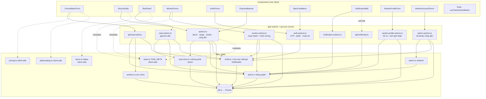
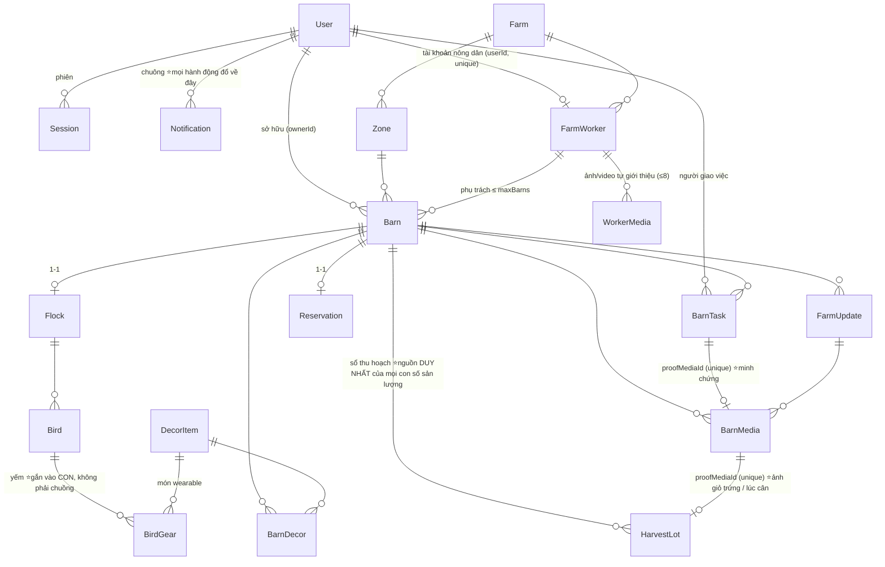

# CODEMAP — bản đồ codebase ChicChic

> **Đọc file này TRƯỚC khi sửa bất cứ thứ gì.** Nó trả lời: *thứ tôi định sửa nằm ở đâu, ai gọi nó, sửa xong thì cái gì gãy theo.*
> Cập nhật: 2026-08-02 · Đối chiếu commit `b16d35e` + nhánh làm việc **Đợt 0** (bịt lỗ quyền admin · upload ảnh thật qua Supabase Storage · bảng `Event` đo đạc).

---

## 0. Cách dùng file này

| Bạn đang cần… | Nhảy tới |
|---|---|
| Hiểu tổng thể trong 60 giây | [§1 Tầng](#1-tầng-và-luật-import) + [§4 Đồ thị module](#4-đồ-thị-module) |
| Biết một URL chạy qua đâu | [§2 Bản đồ route](#2-bản-đồ-route--cổng-quyền--dữ-liệu) |
| Biết chỗ nào GHI vào DB | [§3 Bản đồ ghi](#3-bản-đồ-ghi--ai-được-đụng-vào-bảng-nào) |
| Tra một hàm cụ thể | [§6 Mục lục hàm](#6-mục-lục-hàm-theo-file) |
| Trace một luồng nghiệp vụ | [§7 Bảy vòng lặp](#7-bảy-vòng-lặp-chính--trace-từng-bước) |
| **Sắp sửa code → xem đụng gì** | **[§8 Bảng tra cứu ngược](#8-sửa-x-thì-đụng-vào-đâu)** |
| Sợ phá vỡ ràng buộc nghiệp vụ | [§9 Bất biến](#9-bất-biến-không-được-phá) |

**Quy ước bảo trì:** thêm route / server action / bảng mới → cập nhật §2, §3, §6 và §8 trong **cùng commit**. File này lệch thực tế còn tệ hơn không có.

---

## 1. Tầng và luật import

```
┌─ app/*/page.tsx ────────── Server Component: TRA DỮ LIỆU + KIỂM QUYỀN, không ghi
├─ components/*.tsx ──────── "use client": UI + gọi action, KHÔNG tin được
├─ app/*-actions.ts ──────── "use server": KIỂM QUYỀN rồi mới ghi  ← biên giới an ninh
├─ app/api/**/route.ts ───── HTTP endpoint (dùng khi client cần fetch/poll)
├─ lib/*.ts ─────────────── logic thuần; lib/db.ts là cửa duy nhất xuống Prisma
└─ prisma/schema.prisma ── nguồn sự thật của dữ liệu
```

**Luật import (vi phạm là bug, không phải sở thích):**

1. `components/*` **không bao giờ** import `@/lib/db`, `@/lib/auth`, `@/lib/workers`, `@/lib/task-store`. Chỉ được import action + lib thuần.
2. Lib nào **client dùng chung** thì tuyệt đối không đụng Prisma: `lib/tasks.ts`, `lib/decor.ts`, `lib/pricing.ts`, `data/catalog.ts`.
3. `lib/task-store.ts` **cố tình không có `"use server"`** → không thể gọi từ client. Nó *tin* dữ liệu đưa vào, nên chỉ được gọi từ action đã kiểm quyền.
4. Mọi `"use server"` là **endpoint công khai**. Không có `getSessionUser()` ở đầu hàm = ai cũng gọi được.

---

## 2. Bản đồ route → cổng quyền → dữ liệu

| Route | File | Cổng vào | Đọc | Ghi qua |
|---|---|---|---|---|
| `/` | [page.tsx](src/app/page.tsx) | — (công khai) · **WORKER → `/nong-trai`** | `getSessionUser` · `featuredWorkers` · `farmProof` | — |
| `/dang-nhap` `/dang-ky` | [dang-nhap](src/app/dang-nhap/page.tsx) · [dang-ky](src/app/dang-ky/page.tsx) | đã đăng nhập → `/tai-khoan` | — | `auth-actions` |
| `/quen-mat-khau` | [page.tsx](src/app/quen-mat-khau/page.tsx) | — | — | `auth-actions` |
| `/tai-khoan` | [page.tsx](src/app/tai-khoan/page.tsx) | `getSessionUser` → `/dang-nhap` | Barn+Flock+Reservation của tôi | `auth-actions.returnBarn` |
| `/nhan-chuong` | [page.tsx](src/app/nhan-chuong/page.tsx) | **`requireUser`** · WORKER → `/nong-trai` | `listWorkers()` | `POST /api/reservations` |
| `/chuong` | [page.tsx](src/app/chuong/page.tsx) | **`requireUser`** · WORKER → `/nong-trai` | Barn của tôi (chọn chuồng để vào) | — |
| `/chuong/[id]` | [page.tsx](src/app/chuong/[id]/page.tsx) | **`requireUser` → `canViewBarn`** | Barn + worker + decor + updates + media + **tasks** + flock | `actions.toggleRange`, `task-actions.*` |
| `/chuong/[id]/nhat-ky` | [page.tsx](src/app/chuong/[id]/nhat-ky/page.tsx) | ↑ | FarmUpdate + BarnMedia | — |
| `/chuong/[id]/trang-tri` | [page.tsx](src/app/chuong/[id]/trang-tri/page.tsx) | ↑ | BarnDecor + DecorItem | `actions.*Decor*` |
| `/chuong/[id]/truy-xuat` | [page.tsx](src/app/chuong/[id]/truy-xuat/page.tsx) | ↑ | Flock + Breed + Bird | — |
| `/chuong/[id]/dan-ga` | [page.tsx](src/app/chuong/[id]/dan-ga/page.tsx) | ↑ | Bird + BirdGear + `cachedDecorItems` + `decorStock` — **4 truy vấn PHẲNG trong 1 `Promise.all`**, không `include` lồng từ Bird xuống gear | `actions.wearGear/removeGear` |
| `/chuong/[id]/thu-hoach` | [page.tsx](src/app/chuong/[id]/thu-hoach/page.tsx) | ↑ | HarvestLot (`take: 60`) + `groupBy` tổng — **tổng KHÔNG cộng từ danh sách đã cắt** | — (chỉ đọc; ghi từ cổng nông dân) |
| `/chuong/[id]/ket-chu-ky` | [page.tsx](src/app/chuong/[id]/ket-chu-ky/page.tsx) | ↑ | Flock (stage END_OF_LAY) | `actions.decideEndOfLay` |
| `/chuong/[id]/tin-nhan` | [page.tsx](src/app/chuong/[id]/tin-nhan/page.tsx) | **`requireUser` → `threadAccess`** (KHÔNG dùng `canViewBarn` — xem được chuồng ≠ được vào hộp thư riêng) | BarnMessage | `message-actions.*` |
| `/cho` | [page.tsx](src/app/cho/page.tsx) | **`requireUser`** | MarketListing `LISTED` còn hạn (`take: 20`, lọc hạn **trong `WHERE`**) + chuồng của tôi + **`groupBy` đếm lô bán được từng chuồng** (không dùng `_count` có filter, §10) — ⚠️ **trang DUY NHẤT đọc chéo nhiều chuồng** | `market-actions.reserveListing` |
| `/cho/cua-toi` | [page.tsx](src/app/cho/cua-toi/page.tsx) | **`requireUser`** | tin tôi bán + đơn tôi mua + `PayoutAccount` — 3 truy vấn song song | `market-actions.*` |
| `/api/thanh-toan?code=` | [route.ts](src/app/api/thanh-toan/route.ts) | **`getSessionUser`** + kiểm ĐÚNG người theo từng loại đơn | tra `payCode` (CHICC/CHICD/CHICM) → `{ status, paid }` — **một cửa cho cả ba loại**, vì đơn chợ không thuộc chuồng nào của người mua | — (chỉ đọc) |
| `/nong-dan/[id]` | [page.tsx](src/app/nong-dan/[id]/page.tsx) | **công khai một nửa** — xem `getSessionUser`: khách thấy phần giới thiệu, chuồng/ảnh/ghi chép cần đăng nhập | FarmWorker + `workerLoad` + **WorkerMedia** (tự giới thiệu) · *thêm* BarnMedia + Barn + FarmUpdate khi đã đăng nhập | — |
| `/nong-trai` | [page.tsx](src/app/nong-trai/page.tsx) | **`requireWorker`** | BarnTask của tôi + barns tôi phụ trách | `worker-actions.*` |
| `/nong-trai/ho-so` | [page.tsx](src/app/nong-trai/ho-so/page.tsx) | **`requireWorker`** | FarmWorker + WorkerMedia **của chính mình** | `worker-profile-actions.*` |
| `/nong-trai/chuong/[slug]` | [page.tsx](src/app/nong-trai/chuong/[slug]/page.tsx) | **`requireWorker`** + `barn.workerId === w.workerId` | Barn + decor + tasks | `worker-actions.*` |
| `/admin/tin-nhan/[slug]` | [page.tsx](src/app/admin/tin-nhan/[slug]/page.tsx) | `middleware.ts` + **`adminThread()`** — chỉ mở hộp thư CÓ cờ/báo cáo | BarnMessage (chỉ đọc) | — |
| `/admin` | [page.tsx](src/app/admin/page.tsx) | `middleware.ts` (Basic Auth, `ADMIN_PASSWORD`) | tất cả + FarmWorker & tài khoản | `actions.confirmPayment/addMedia/…`, `admin-actions.*` |
| `POST /api/reservations` | [route.ts](src/app/api/reservations/route.ts) | `getSessionUser` → **401 `{needAuth}`** · role WORKER → **403** | Breed/FeedingPlan/Zone | tạo Barn+Flock+Bird+Reservation+BarnTask (+ thông báo nông dân) |
| `GET /api/barns/[slug]/payment` | [route.ts](src/app/api/barns/[slug]/payment/route.ts) | `getSessionUser` → 401 · không phải chủ chuồng → **404** (không lộ chuồng có tồn tại hay không) | Reservation.paymentStatus | — |
| `GET /api/barns/[slug]/messages` | [route.ts](src/app/api/barns/[slug]/messages/route.ts) | **`threadAccess`** → 403 · cùng cổng với action gửi tin | BarnMessage của chuồng + `markRead` | — (hộp thư poll 12s) |
| `GET /api/notifications` | [route.ts](src/app/api/notifications/route.ts) | `getSessionUser` → `{list:[]}` | Notification **của chính mình** | — (chuông poll 20s) |
| `POST /api/webhooks/sepay` | [route.ts](src/app/api/webhooks/sepay/route.ts) | **khoá API của SePay** (`Authorization: Apikey …`) — thiếu `SEPAY_WEBHOOK_KEY` thì **503, đóng** | Reservation / DecorOrder theo mã chuyển khoản | `BankTxn` (sổ) → `lib/payments.confirm*Paid` |

**Ba cổng quyền, đừng nhầm** ([lib/auth.ts](src/lib/auth.ts)):

- `requireUser(nextPath)` → chưa đăng nhập thì `redirect("/dang-nhap?next=…")`. Gọi **ở dòng đầu tiên** của page, **trước** truy vấn nặng (xem [§10](#10-bẫy-đã-gặp-đừng-đạp-lại)).
- `canViewBarn(barn, nextPath)` → gọi `requireUser` bên trong, rồi xét: `isPublic` hoặc chưa có chủ → OK · chủ chuồng / admin → OK · WORKER đúng chuồng mình phụ trách → OK · còn lại `false` → page render `<BarnLocked/>`.
- `requireWorker(nextPath)` → phải đăng nhập, có `FarmWorker` gắn `userId`, **và `active = true`**; không đạt thì `redirect("/tai-khoan")` — trang đó hiện màn "tài khoản tạm dừng" chứ **không** đá ngược sang `/nong-trai` (sẽ thành vòng lặp).
- `activeWorkerSession()` → bản dành cho **server action** của cổng nông dân: giống `getWorkerSession` nhưng trả `null` khi `active = false`. Action không `redirect()` được như page, nên nó cần một cổng trả null để hiện toast từ chối. **Mọi action trong `worker-actions.ts` và `worker-profile-actions.ts` dùng hàm này**, không dùng `getWorkerSession` trần.
- `isAdmin()` ([lib/admin.ts](src/lib/admin.ts)) → cổng cho **server action** của `/admin`: role ADMIN **hoặc** đúng Basic Auth (trình duyệt tự gửi header đó kèm mọi POST tới `/admin`). Chưa đặt `ADMIN_PASSWORD` → **fail-closed ở production**, chỉ cho qua khi chạy dev (middleware.ts giữ đúng luật đó: production thiếu biến thì trả 503).

---

## 3. Bản đồ ghi — ai được đụng vào bảng nào

| Bảng | Được ghi từ | Cổng kiểm |
|---|---|---|
| `User` `Session` `EmailCode` | [auth-actions.ts](src/app/auth-actions.ts) | OTP + mật khẩu |
| `Barn` (tạo) | [api/reservations](src/app/api/reservations/route.ts) | đăng nhập + `workerHasCapacity` |
| `Barn.outside` | **chỉ** [worker-actions.completeTask](src/app/worker-actions.ts) | `task.workerId === w.workerId` |
| `Barn.ownerId = null` | [auth-actions.returnBarn](src/app/auth-actions.ts) | chủ chuồng + gõ đúng `RETURN_PHRASE` |
| `BarnDecor` | [actions.installDecor/removeDecor/saveDecorLayout/resetDecorLayout/setDecorText](src/app/actions.ts) | `ownedBarn()` + **tồn kho** (`decorStock`) |
| `BarnDecor.photoUrl` | `completeTask` khi `kind = DECOR` | như trên |
| `BarnDecor.colorHex` `.variant` | [actions.setDecorStyle](src/app/actions.ts) | `ownedBarn()` + màu/kiểu phải nằm trong `DECOR_COLORS`/`DECOR_VARIANTS` (danh sách **đóng**, không nhận mã màu tự do) + lọc kèm `barnId` |
| **`DecorItem.stockQty`** (kho thật của nông trại) | **trừ**: [decor-actions.createDecorOrder](src/app/decor-actions.ts) · **cộng**: `cancelDecorOrder` · **nhập/kiểm kê**: [admin-actions.setDecorStock](src/app/admin-actions.ts) | phép trừ là `updateMany({ where: { stockQty: { gte: qty } } })` — **so-sánh-rồi-đặt** (§9.27) · nhập kho cần `isAdmin()` |
| `Barn.label` | [api/reservations](src/app/api/reservations/route.ts) (lúc tạo) · [actions.renameBarn](src/app/actions.ts) | `ownedBarn()` · làm sạch bằng `cleanLine(…, MAX_BARN_NAME)` |
| `BarnTask` (tạo/gộp) | [lib/task-store.upsertTask](src/lib/task-store.ts) ← `task-actions.requestTask`, `actions.toggleRange`, `actions.requestDecorWork` | `ownedBarn()` / owner-check |
| `BarnTask.status` | `completeTask` `declineTask` (nông dân) · `cancelTask` xoá hẳn (chủ chuồng) | chủ sở hữu tương ứng |
| `FarmUpdate` `BarnMedia` | `worker-actions.*` (nông dân) · `actions.addMedia/stamp` (admin) | `activeWorkerSession()` / **`isAdmin()`** |
| **`HarvestLot`** | **chỉ** [worker-actions.logHarvest](src/app/worker-actions.ts) | `activeWorkerSession()` + `barn.workerId === w.workerId` · **ảnh bắt buộc** (§9.1) · chặn khoảng số lượng và **số cân** · chống trùng 60s |
| `DecorOrder` `DecorOrderItem` | tạo/huỷ/báo chuyển: [decor-actions.ts](src/app/decor-actions.ts) · `→CONFIRMED`: **chỉ** [lib/payments.confirmDecorPaid](src/lib/payments.ts) | chủ chuồng · xác nhận cần `isAdmin()` **hoặc** khoá webhook |
| `BarnDecor` (từ hoá đơn) | **chỉ** [lib/payments.confirmDecorPaid](src/lib/payments.ts) | như trên — món chỉ vào chuồng sau khi tiền được đối soát. Món `wearable` (yếm) **bị loại**: nó vào kho, không vào chuồng |
| `BirdGear` (tạo / huỷ) | [actions.wearGear/removeGear](src/app/actions.ts) | `ownedBarn()` + con gà phải thuộc `flock` của chuồng đó + đàn phải là **LAYER** + `decorStock().free > 0` |
| `BirdGear.status` → `WORN`/`OFF` | **chỉ** [worker-actions.completeTask](src/app/worker-actions.ts) | `task.workerId === w.workerId` — §9.2, y hệt `Barn.outside` |
| `BarnMessage` | **chỉ** [message-actions.ts](src/app/message-actions.ts) | **`threadAccess()`** ([lib/messages.ts](src/lib/messages.ts)) — cửa duy nhất, admin **không** ghi được |
| `Reservation.paymentStatus` | `reportTransfer` (→REPORTED) · `→CONFIRMED`: **chỉ** [lib/payments.confirmReservationPaid](src/lib/payments.ts) | `ownedBarn()` · xác nhận cần `isAdmin()` **hoặc** khoá webhook |
| `MarketListing` (tạo/rút) | [market-actions.listLot/cancelListing](src/app/market-actions.ts) | chủ **lô** · lô còn hạn · **có `PayoutAccount`** · trần `MAX_LISTINGS_PER_MONTH` · giá tra từ `MarketPrice`, **client không gửi giá** |
| `MarketListing.status` → `RESERVED` | [market-actions.reserveListing](src/app/market-actions.ts) | **phải đang sở hữu ≥1 chuồng** · không mua lô của chính mình · so-sánh-rồi-đặt, giữ chỗ tự hết hạn trong `WHERE` |
| `MarketListing.status` → `PAID` | **chỉ** [lib/payments.confirmMarketPaid](src/lib/payments.ts) | `isAdmin()` **hoặc** khoá webhook |
| `MarketListing` → `DELIVERED` + **`Payout`** | **chỉ** [worker-actions.completeTask](src/app/worker-actions.ts) nhánh `DELIVER` | ⭐ chỗ DUY NHẤT tiền được phép rời hệ thống — cần ảnh trao tay (§9.29) |
| `Payout.status` → `PAID` | [admin-actions.markPayoutPaid](src/app/admin-actions.ts) | **`isAdmin()`** + **bắt buộc ảnh biên lai** |
| `MarketPrice` | [admin-actions.setMarketPrice](src/app/admin-actions.ts) | **`isAdmin()`** — chỉ **thêm dòng**, không sửa dòng cũ |
| `PayoutAccount` | [market-actions.savePayoutAccount](src/app/market-actions.ts) | chỉ của chính mình |
| `HarvestLot.status` | `listLot`/`cancelListing` (↔ LISTED) · `confirmMarketPaid` (→SOLD) · `completeTask` DELIVER (→DELIVERED) | như các dòng trên |
| `BankTxn` | **chỉ** [api/webhooks/sepay](src/app/api/webhooks/sepay/route.ts) | khoá API · `providerId` unique = chốt chống trùng |
| `Reservation.payCode` `DecorOrder.payCode` | đặt MỘT LẦN lúc tạo đơn (`newPayCode`), không bao giờ sửa | cột **unique** — DB tự chặn trùng, webhook tra bằng chỉ mục |
| `Flock` `Bird` `LifecycleDecision` | [actions.decideEndOfLay](src/app/actions.ts) (chủ chuồng) · [actions.setEndOfLay](src/app/actions.ts) (admin) | `ownedBarn()` / **`isAdmin()`** |
| `Flock.vaccinatedAt` | chỉ `prisma/seed.ts` | — chưa có UI ghi; null ⟹ trang truy xuất hiện "Chưa cập nhật" |
| `Event` | **chỉ** [lib/track.track](src/lib/track.ts) ← action + `/chuong/[id]` | không có — chỉ ghi, không bao giờ đọc từ client |
| `Notification` | **chỉ** [lib/notify.notify](src/lib/notify.ts) ← mọi action sau khi ghi xong · xoá/đọc qua [notification-actions](src/app/notification-actions.ts) | người nhận do action quyết định · đọc/xoá chỉ của `getSessionUser` |
| `User.username` `User.passwordHash` (nông dân) | [admin-actions.createWorkerAccount/resetWorkerPassword](src/app/admin-actions.ts) | **`isAdmin()`** |
| `FarmWorker` (tạo / `active`) | [admin-actions.createWorkerAccount/toggleWorkerActive](src/app/admin-actions.ts) | **`isAdmin()`** |
| `FarmWorker` (hồ sơ: tên, tuổi, bio…) `WorkerMedia` | [worker-profile-actions](src/app/worker-profile-actions.ts) | **`getWorkerSession()`** — chỉ hồ sơ của chính mình, **không nhận `workerId` từ client** |

---

## 4. Đồ thị module



**Nút thắt cần nhớ:** `lib/auth.ts` là cổng quyền của cả app · `lib/task-store.ts` là cửa duy nhất tạo việc · `lib/notify.ts` là cửa duy nhất đẩy thông báo · `lib/db.ts` là cửa duy nhất xuống DB.

---

## 5. Đồ thị dữ liệu



**Ba quan hệ mang toàn bộ nghiệp vụ:**

- `Barn.ownerId` → ai trả tiền và được xem.
- `Barn.workerId` → ai chăm ngoài đời. **Một chuồng đúng một nông dân.**
- `BarnTask.proofMediaId` (unique, nullable) → **`status = DONE` mà cột này null là dữ liệu hỏng.**

---

## 6. Mục lục hàm theo file

### `lib/` — không có UI, không có side-effect ngoài DB

| File | Hàm / hằng | Ai gọi |
|---|---|---|
| [db.ts](src/lib/db.ts) `8` | `prisma` (singleton, giữ qua HMR) | mọi thứ phía server |
| [auth.ts](src/lib/auth.ts) `162` | `hashPassword` `verifyPassword` `passwordProblem` `hashCode` `newOtp` | auth-actions |
| | `createSession` `destroySession` | auth-actions |
| | **`getSessionUser`** — bọc `cache()` | layout, page, mọi action |
| | `myWorker` (private, `cache()`) `myWorkerId` | canViewBarn, getWorkerSession |
| | **`requireUser` `canViewBarn` `requireWorker` `getWorkerSession`** | page + worker-actions |
| [tasks.ts](src/lib/tasks.ts) `68` | `TASK_META` (emoji/label/**doing**/**proof**) · `FEED_SLOTS` · `WORKER_MAX_BARNS` · `nextOccurrence` · `isOverdue` · `STATUS_VI` | TaskPanel, WorkerForms, actions, worker-actions |
| [task-store.ts](src/lib/task-store.ts) `50` | **`upsertTask`** (gộp việc cùng loại đang OPEN) · `openTaskOfKind` | actions.ts, task-actions.ts |
| [workers.ts](src/lib/workers.ts) `160` | `workerLoad` · **`listWorkers`** (1 `groupBy`, không N+1) · **`workerHasCapacity`** | /nhan-chuong, api/reservations, /nong-dan/[id] |
| [decor.ts](src/lib/decor.ts) `194` | `clampPlacement` `DECOR_BOUNDS` · `normalizeMediaUrl` `mediaKind` · `dayLabel` `isToday` `timeAgo` `hhmm` · `flockProgress` · **`payCode`/`transferCode`/`decorCode`/`parsePayCode`** · **`cleanLine`** `MAX_BARN_NAME` `defaultBarnName` **`barnDisplayName`** · **`DECOR_TEXT`** `acceptsText` `MAX_PER_ITEM` `MAX_DECOR_PER_BARN` · `RETURN_PHRASE` | khắp nơi, cả 2 phía |
| [payments.ts](src/lib/payments.ts) `220` | **`confirmReservationPaid`** · **`confirmDecorPaid`** · `resolvePayCode` (tra cột `payCode` unique) — cửa duy nhất biến tiền thành "đơn đã thanh toán"; **không tự kiểm quyền**, chỗ gọi phải kiểm | actions.confirmPayment · decor-actions.confirmDecorPayment · api/webhooks/sepay |
| [cache.ts](src/lib/cache.ts) `68` | **`cachedDecorItems`** `cachedZones` `cachedBreed` `cachedFeedingPlan` (danh mục do seed ghi, TTL 1 giờ) · **`cachedFarmProof`** (số liệu trang chủ, TTL 5 phút) | `/`, `/nhan-chuong`, `/trang-tri`, `api/reservations` |
| [farm-log.ts](src/lib/farm-log.ts) `33` | **`stamp`** (đóng dấu tên nông dân lên `FarmUpdate`, chống double-submit 60s) · `UPDATE_KINDS` `asUpdateKind` | actions.ts, payments.ts |
| [pricing.ts](src/lib/pricing.ts) `43` | `clampQty` `priceBreakdown` `fmtVnd` | ChooseBarnForm + api/reservations (**tính lại ở server**) |
| [mailer.ts](src/lib/mailer.ts) `46` | `sendCodeEmail` → `{sent}` hoặc `{devCode}` khi thiếu `RESEND_API_KEY` | auth-actions |
| [notify.ts](src/lib/notify.ts) `77` | **`notify`** (nuốt lỗi, không làm hỏng hành động chính) · `notifyMany` · `workerUserIdOfBarn` · `unreadCount` · `listNotifications` | mọi action + layout + api/notifications |
| [track.ts](src/lib/track.ts) `52` | **`track`** (nuốt lỗi như `notify`) · `EventName` (danh sách đóng) | action ghi tiền/việc/decor + `/chuong/[id]` |
| [storage.ts](src/lib/storage.ts) `66` | `signUpload` (ký URL tải lên Supabase, **fetch trần, 0 dependency**) · `storageReady` · `mediaTypeOfExt` · `BUCKET` | upload-actions |
| [market.ts](src/lib/market.ts) `115` | **`MARKET_FEE_PERCENT = 20`** · `MAX_LISTINGS_PER_MONTH = 2` · `RESERVE_HOLD_MINUTES` · **`lotMoney`** (`net` LUÔN là hiệu, không tính riêng bằng `×0,8`) · **`priceFor`** (khớp giống → rơi về dòng `null` → mới nhất đã hiệu lực) · `LISTING_STATUS_VI` `PAYOUT_STATUS_VI` — **client-safe** | market-actions, /cho, /thu-hoach, admin |
| [harvest.ts](src/lib/harvest.ts) `95` | **`LOT_KEEP_DAYS = 7`** · `keepUntil` `daysLeft` `isExpired` **`keepLabel`** · `unitOf` `lotSummary` · `LOT_TYPE_VI` `STORAGE_VI` `defaultStorage` · **`WEIGHT_MIN/MAX`** `MAX_EGGS_PER_LOG` `MAX_BIRDS_PER_LOG` — **client-safe**. Hạn giữ hộ **suy ra từ `collectedAt`, KHÔNG lưu cột** | logHarvest, HarvestForm, 2 trang chuồng |
| [vietqr.ts](src/lib/vietqr.ts) `78` | **`payQrUrl(amountVnd, code)`** · `qrReady` — dựng URL ảnh QR chuẩn VietQR/NAPAS 247 (endpoint của **chính SePay**, không thêm bên thứ ba vào đường tiền). Thuần chuỗi, **client-safe**. Thiếu cấu hình ⟹ trả `null` ⟹ ô QR tự ẩn, KHÔNG chặn thanh toán | PayQR |
| [workers.ts](src/lib/workers.ts) | *(cùng file)* **`featuredWorkers`** · **`farmProof`** — "mặt thật" + số liệu sống cho trang chủ; mỗi thẻ bấm được sang `/nong-dan/[id]` | `/` |
| [messages.ts](src/lib/messages.ts) `237` | **`threadAccess`** (cổng quyền của HAI BÊN) · **`adminThread`** (nông trại, chỉ khi có cờ) · `listMessages` · `unreadFor` · **`unreadByBarn`** (1 `groupBy`, không N+1) · `markRead` · `sendingBlocked` · `shouldNotify` · `looksLikeContactSwap` | message-actions + api/messages + 4 trang có hộp thư |
| [messages-meta.ts](src/lib/messages-meta.ts) `48` | `MessageVM` · `ThreadRole` · **`REPORT_REASONS`** · `reportLabel` · `MAX_BODY` — **client-safe** | BarnThread |
| [decor-store.ts](src/lib/decor-store.ts) `140` | **`decorStock`/`decorStockBySlug`** — tồn kho `{owned, installed, worn, free}` mỗi loại món (**3 `groupBy` song song**, không N+1 và không thêm tầng) · `ownedCounts` `installedCounts` **`wornCounts`** · `pendingDecorOrder`. `free = owned − installed − worn`; yếm ở `PENDING_OFF` **vẫn chiếm chỗ**, chỉ `OFF` mới trả về kho | actions.installDecor/wearGear, decor-actions, /trang-tri, /dan-ga |
| [notify-meta.ts](src/lib/notify-meta.ts) `38` | `NotifyKind` · `NOTIFY_ICON` · `NotificationVM` — **client-safe** | NotificationBell |
| [admin.ts](src/lib/admin.ts) `33` | **`isAdmin()`** — role ADMIN hoặc Basic Auth | admin-actions |
| [data/catalog.ts](src/data/catalog.ts) `86` | `BREEDS` `FEEDING_PLANS` `DECOR_ITEMS` `BASE_PRICES` `FLOCK_QTY` `HEALTH_PACKAGE` `RETIRE_CARE_VND` | seed + form + pricing |

### `app/*-actions.ts` — biên giới an ninh

| File | Hàm | Ai được gọi | Ghi chú |
|---|---|---|---|
| [actions.ts](src/app/actions.ts) `478` | `ownedBarn()` *(private)* | — | **cổng chung**: đăng nhập + là chủ chuồng (admin qua được) |
| | `toggleRange` | chủ chuồng | **tạo việc**, KHÔNG đổi `outside` |
| | `installDecor(slug)` | chủ chuồng | lắp **một cái từ kho** — cổng thật là `decorStock().free > 0`, không phải "đã mua chưa" |
| | `removeDecor(decorId)` `setDecorText(decorId, text)` | chủ chuồng | nhận **`BarnDecor.id`**, KHÔNG phải slug — một chuồng có nhiều bản cùng loại. Truy vấn luôn lọc kèm `barnId` nên đoán đúng id của chuồng khác cũng vô ích |
| | **`setDecorStyle(slug, decorId, {colorHex, variant})`** | chủ chuồng | sơn màu / đổi kiểu **từng đoạn** hàng rào. Nhận `BarnDecor.id` (§9.23) · màu & kiểu phải nằm trong danh sách **đóng** `DECOR_COLORS`/`DECOR_VARIANTS` — không nhận mã màu tự do vì nông trại phải sơn thật (§9.11) · `undefined` = không đụng trường đó, `null` = trả về mặc định |
| | `saveDecorLayout` `resetDecorLayout` | chủ chuồng | `DecorPlacement.id` = `BarnDecor.id`; id không thuộc chuồng bị **bỏ qua lặng lẽ** |
| | *(cả nhóm decor)* | | đều gọi `requestDecorWork()` → gộp 1 việc DECOR |
| | **`wearGear(slug, birdId, itemSlug)`** | chủ chuồng | chọn con gà để mặc yếm. 5 cổng: `ownedBarn()` · món phải `wearable` · con gà thuộc `flock` của **chuồng này** · đàn **LAYER** (broiler không đặt tên từng con) · `decorStock().free > 0`. Chỉ tạo `BirdGear{PENDING_ON}` + việc GEAR — **không** mặc luôn (§9.2) |
| | **`removeGear(slug, gearId)`** | chủ chuồng | `PENDING_ON` (chưa mặc thật) → **xoá hẳn**, yếm về kho ngay, không phiền nông dân · `WORN` → `PENDING_OFF` + việc GEAR |
| | `renameBarn(slug, name)` | chủ chuồng | `cleanLine(…, 50)` — cho emoji & dấu tiếng Việt, bỏ ký tự vô hình. **Không** tạo việc: biển thật chỉ đổi qua `setDecorText` (§9.2) |
| | `reportTransfer` | chủ chuồng | UNPAID → REPORTED |
| | `denyIfNotAdmin()` *(private)* | — | cổng admin dùng chung, bọc `isAdmin()` |
| | `confirmPayment` `addMedia` `deleteMedia` `postUpdate` `setEndOfLay` | admin | **`denyIfNotAdmin()` ở dòng đầu** — middleware KHÔNG chặn lời gọi action. `confirmPayment` chỉ còn là cổng quyền, nghiệp vụ ở `lib/payments.ts` |
| | `decideEndOfLay` | chủ chuồng | `ownedBarn()` rồi mới tới guard `stage === END_OF_LAY`; từ chối thì `redirect` về trang chuồng (form không hiện toast được) |
| [task-actions.ts](src/app/task-actions.ts) `79` | `requestTask(slug, kind, note, dueAtIso)` | chủ chuồng/admin | trần `MAX_OPEN_PER_BARN = 6` |
| | `cancelTask(taskId)` | chủ chuồng | chỉ khi `status = OPEN`, xoá hẳn |
| [worker-actions.ts](src/app/worker-actions.ts) `170` | `markTasksSeen()` | nông dân | xoá dấu "MỚI" |
| | **`completeTask(taskId, formData)`** | nông dân đúng việc | ⭐ hạt nhân — [§7.3](#73-nông-dân-làm-xong--transaction-lõi) |
| | `declineTask(taskId, reason)` | nông dân đúng việc | lý do ≥ 5 ký tự, đăng lên nhật ký |
| | `postDailyUpdate(formData)` | nông dân đúng chuồng | **không cần việc** — vòng lặp giữ chân |
| | **`logHarvest(formData)`** | nông dân đúng chuồng | ⭐ nguồn DUY NHẤT của mọi con số sản lượng. **Không cần ai giao việc** (nhặt trứng là việc hằng ngày) · **ảnh bắt buộc** · `weightKg` chặn khoảng ở server và **không sửa được sau khi ghi** — nó nhân thẳng vào tiền trên chợ |
| [auth-actions.ts](src/app/auth-actions.ts) `188` | `issueCode` `consumeCode` *(private)* | — | OTP 10 phút, tối đa 5 lần, cooldown 60s |
| | `sendRegisterCode` `verifyAndRegister` `login` `logout` `sendResetCode` `resetPassword` | công khai | `login(identifier, pw)` nhận **email HOẶC username** (có `@` → email) · `resetPassword` **huỷ mọi phiên cũ** |
| | `returnBarn(slug, phrase)` | chủ chuồng | 2 lớp: sở hữu + `RETURN_PHRASE` |
| [admin-actions.ts](src/app/admin-actions.ts) `240` | **`setDecorStock(slug, {delta} \| {set})`** | **`isAdmin()`** | nhập hàng / kiểm kê kho nông trại. `delta` cộng dồn trong một câu lệnh (hai người trực cùng nhập vẫn đúng), `set` để kiểm kê lại kệ · chặn kho âm ngay trong `WHERE` · gọi `revalidateTag("catalog")` |
| | `createWorkerAccount(input: NewWorkerInput)` | **`isAdmin()`** | tạo/gắn tài khoản nông dân · email nội bộ `<username>@nong-dan.chicchic.vn` (không gửi thư) |
| | `resetWorkerPassword(workerId, password)` | **`isAdmin()`** | `$transaction` [đổi hash + **xoá sạch Session**] · dùng **tham số thường, không FormData** — xem [§10](#10-bẫy-đã-gặp-đừng-đạp-lại) |
| | `toggleWorkerActive(workerId)` | **`isAdmin()`** | tạm dừng = ẩn khỏi `/nhan-chuong` **+ khoá đăng nhập + xoá sạch Session**. Chuồng đang chăm KHÔNG bị gỡ → cảnh báo admin số chuồng sẽ mất tin |
| [upload-actions.ts](src/app/upload-actions.ts) `55` | `createUploadUrl(folder, ext)` | nông dân đang hoạt động · chủ chuồng · admin (thư mục `quan-tri` chỉ admin) | **KHÔNG nhận file** — chỉ ký URL, file đi thẳng điện thoại → Supabase (body serverless giới hạn ~4,5MB) |
| [decor-actions.ts](src/app/decor-actions.ts) `179` | `createDecorOrder(barnSlug, lines: {slug,qty}[])` | chủ chuồng | **mua thêm cái thứ 2, 3 là bình thường** · tổng **tính lại ở server** (§9.6) · một chuồng chỉ một hoá đơn treo · trần 10 LOẠI/hoá đơn và `MAX_PER_ITEM = 8` cái mỗi loại, tính cả số đã sở hữu |
| | `reportDecorTransfer(orderId)` `cancelDecorOrder(orderId)` | chủ chuồng | UNPAID → REPORTED · huỷ được khi chưa CONFIRMED |
| | **`confirmDecorPayment(orderId)`** | **`isAdmin()`** | chỉ là cổng quyền → gọi `lib/payments.confirmDecorPaid` (⭐ chỗ DUY NHẤT `BarnDecor` sinh ra từ hoá đơn) |
| [message-actions.ts](src/app/message-actions.ts) `169` | `sendMessage(barnSlug, body)` | chủ chuồng · nông dân phụ trách **đang hoạt động** | `threadAccess()` ở dòng đầu · admin bị từ chối (chỉ đọc) · chặn tần suất · gắn cờ liên hệ ngoài · chuông chỉ kêu khi chưa có tin chờ đọc |
| | `markThreadRead(barnSlug)` | hai bên trong hộp thư | admin đọc **không** đánh dấu đã đọc thay ai |
| | `reportMessage(messageId, reason)` | hai bên | **bắt buộc chọn loại vi phạm** (`REPORT_REASONS`) · chỉ báo cáo tin của **phía bên kia** · đường DUY NHẤT mở khoá cho admin đọc |
| | `messageToTask(messageId, kind)` | **chỉ chủ chuồng** | biến ý định thành `BarnTask` qua `upsertTask` — nông dân không tự giao việc cho mình rồi tự đóng |
| [notification-actions.ts](src/app/notification-actions.ts) `29` | `markNotificationsRead` `clearNotifications` | người đang đăng nhập | chỉ đụng `userId` của chính mình |
| [worker-profile-actions.ts](src/app/worker-profile-actions.ts) `111` | `updateMyProfile(input)` | nông dân | đổi tên thì đổi cả `User.name`; năm sinh phải trong khoảng 15–100 tuổi |
| | `addIntroMedia(input)` `deleteIntroMedia(id)` | nông dân | trần `MAX_INTRO_MEDIA = 8` · chặn URL trùng · `deleteMany` kèm `workerId` nên không xoá được của người khác |

### `components/` — client

| File | Xuất | Gọi tới |
|---|---|---|
| [Toast.tsx](src/components/Toast.tsx) `93` | `ToastProvider` `useToast` **`ActionButton`** | — · TTL toast **3800ms** |
| [ChooseBarnForm.tsx](src/components/ChooseBarnForm.tsx) `398` | mặc định + `WorkerOption` | `POST /api/reservations` |
| [TaskPanel.tsx](src/components/TaskPanel.tsx) `207` | mặc định + `TaskVM` | `requestTask` `cancelTask` |
| [usePayWatch.ts](src/components/usePayWatch.ts) `78` | `usePayWatch(code, active, onPaid)` — vòng hỏi `/api/thanh-toan` cho **cả ba** ô chờ tiền (cọc · trang trí · chợ). Chỉ hỏi khi **tab đang mở**, giãn 6s→60s, quay lại tab thì đặt lại 6s. Báo đúng **một lần** | PaymentBanner · DecorStudio · MarketPayBox |
| [MarketForms.tsx](src/components/MarketForms.tsx) `183` | `PayoutAccountForm` `ListLotButton` `BuyButton` `CancelListingButton` `MarketPayBox` | `listLot` `cancelListing` `reserveListing` `savePayoutAccount` · `ListLotButton` hiện **đủ ba con số** (giá / phí / thực nhận) trước khi bấm — chợ giấu phí là chợ mất niềm tin · giá hiển thị chỉ để xem trước, server tra lại (§9.6) |
| [MarketAdminForms.tsx](src/components/MarketAdminForms.tsx) `189` | `MarketPriceForm` `PayoutQueue` | `setMarketPrice` `markPayoutPaid` · ô chọn giống **khoá khi loại = trứng** (trứng cùng giá mọi giống) · nút chi trả **disabled tới khi có ảnh biên lai** |
| [WorkerForms.tsx](src/components/WorkerForms.tsx) `345` | `WorkerTaskCard` `DailyUpdateForm` **`HarvestForm`** `WorkerTaskVM` | `completeTask` `declineTask` `postDailyUpdate` `logHarvest` · `HarvestForm` **khoá nút submit tới khi có ảnh**, ô cân chỉ hiện với gà thịt kèm lời nhắc "số này nhân thẳng vào tiền" |
| [DecorStudio.tsx](src/components/DecorStudio.tsx) `455` | mặc định + `Placed` `CatalogItem` `PendingOrder` | `installDecor` `removeDecor` `saveDecorLayout` `resetDecorLayout` · giỏ hàng + hoá đơn (`createDecorOrder` `reportDecorTransfer` `cancelDecorOrder`) |
| [AuthForms.tsx](src/components/AuthForms.tsx) `204` | `RegisterForm` `LoginForm` `ForgotForm` | auth-actions · đọc `?next=` |
| [BarnCardMenu.tsx](src/components/BarnCardMenu.tsx) `170` | mặc định | `returnBarn` |
| [PaymentBanner.tsx](src/components/PaymentBanner.tsx) `120` | mặc định | `reportTransfer` + poll `/api/barns/[slug]/payment` · nhúng `<PayQR>` |
| [PayQR.tsx](src/components/PayQR.tsx) `56` | mặc định | ô quét mã chuyển khoản, dùng chung banner cọc + hoá đơn decor. **Chỉ THÊM một lối, không thay lối cũ**: chưa cấu hình hoặc ảnh tải lỗi (`onError`) thì tự trả `null`, nút "Sao chép" vẫn nguyên. Thẻ `` thường — cố ý không dùng `next/image` (xem §10) |
| [MediaGallery.tsx](src/components/MediaGallery.tsx) `211` | `MediaStrip` `MediaGrid` `MediaVM` | — |
| [MediaUpload.tsx](src/components/MediaUpload.tsx) `172` | mặc định | `createUploadUrl` → PUT thẳng lên Supabase · **nén ảnh về ≤1600px/JPEG 0.82 trước khi tải** · video chặn >25MB · `capture="environment"` mở camera sau · kho chưa cấu hình → tự đổi sang ô dán URL |
| [Illustrations.tsx](src/components/Illustrations.tsx) `250` | `Coop` `CoopBackdrop` `DecorSprite` `DecorFigure` `FarmerAvatar` `QRCode` `COOP_VIEWBOX` | SVG thuần, không state. `DecorSprite` nhận thêm `color` — sprite `yem` vẽ con gà đang đeo, phần đổi màu là cái yếm |
| [BirdGearPanel.tsx](src/components/BirdGearPanel.tsx) `175` | mặc định + `BirdVM` `GearVM` | danh sách đàn + kho yếm ở `/chuong/[id]/dan-ga` → `wearGear` `removeGear`. Chỉ ẩn/hiện cho đỡ bấm hụt — **mọi luật nằm ở action** |
| [DecorStockForms.tsx](src/components/DecorStockForms.tsx) `120` | mặc định + `StockRow` | khối "📦 Kho nông trại" ở `/admin` → `setDecorStock`. Hiện cả số **đang bị hoá đơn chưa thanh toán giữ chỗ** (§11.26) · tô đỏ khi hết, vàng khi ≤3 |
| [EndOfLayChoices.tsx](src/components/EndOfLayChoices.tsx) `93` | mặc định | `decideEndOfLay` |
| [AdminForms.tsx](src/components/AdminForms.tsx) `123` | `MediaForm` `UpdateForm` | `addMedia` `postUpdate` |
| [BarnLocked.tsx](src/components/BarnLocked.tsx) `20` | mặc định | màn "chuồng riêng tư" |
| [NotificationBell.tsx](src/components/NotificationBell.tsx) `170` | mặc định | `markNotificationsRead` + poll `GET /api/notifications` mỗi **20s** (chỉ khi tab hiện) |
| [WorkerAccountForms.tsx](src/components/WorkerAccountForms.tsx) `389` | `CreateWorkerForm` · **`WorkerAccountRow`** (tên bấm được + nút đổi mật khẩu) · `WorkerAccountDialog` (popup) · `WorkerRow` | `createWorkerAccount` `resetWorkerPassword` |
| [WorkerProfileDialog.tsx](src/components/WorkerProfileDialog.tsx) `129` | mặc định + `WorkerProfileVM` | popup hồ sơ nông dân — mở từ ⋯ ở `/nhan-chuong` và nút "Xem thử" ở `/nong-trai/ho-so` |
| [BarnThread.tsx](src/components/BarnThread.tsx) `297` | mặc định (`role` `ownerName` `workerName` `initial` `compact`) | hộp thư — **một component cho cả hai vai**: nông dân có nút trả lời nhanh, chủ chuồng có "Chuyển thành việc", admin `readOnly`. Cố ý KHÔNG có "đang gõ"/"đã xem" |
| [WorkerProfileForm.tsx](src/components/WorkerProfileForm.tsx) `248` | mặc định + `WorkerProfileData` | `updateMyProfile` `addIntroMedia` `deleteIntroMedia` |

---

## 7. Bảy vòng lặp chính — trace từng bước

### 7.1 Nhận chuồng (chọn nông dân)
```
/            →  role WORKER → /nong-trai (trang chủ là lời mời NHẬN NUÔI, không dành cho cô chú)
   "Những người thật đang chăm chuồng" → bấm vào một người → /nong-dan/<id>

/  "Xem chuồng của tôi"  →  /chuong  →  requireUser (chưa đăng nhập → /dang-nhap?next=/chuong)
       ├ role WORKER          → /nong-trai
       ├ có chuồng            → danh sách để chọn → /chuong/<slug>
       └ chưa có chuồng nào   → màn "nhận nuôi chuồng đầu tiên" + lối xem /chuong/demo

/nhan-chuong  →  requireUser  →  role WORKER → /nong-trai  →  listWorkers()  →  <ChooseBarnForm workers=…>
   người dùng chọn giống · chế độ ăn · số con · TÊN GÀ · NÔNG DÂN
   → POST /api/reservations {workerId, idemKey, …}
       ├ getSessionUser        chưa đăng nhập → 401 {needAuth, loginPath}
       ├ role WORKER           → 403 (cổng THẬT của luật "nông dân không nhận nuôi chuồng")
       ├ idemKey đã tồn tại    → trả lại đúng đơn cũ (reused: true)
       ├ workerHasCapacity()   kín/tạm nghỉ → 409
       ├ priceBreakdown()      TÍNH LẠI ở server, không tin giá client
       ├ gate "còn cọc treo"   → 409 kèm pendingBarnSlug
       └ $transaction: Barn(+workerId+ownerId) → Flock → Bird[] → FarmUpdate
                       → BarnTask CHECK "Chụp hiện trạng chuồng lúc nhận"
                       → Reservation(HELD, idemKey)
   → chuyển tới /chuong/<slug>, hiện <PaymentBanner> (UNPAID)
```

### 7.2 Chủ chuồng giao việc
```
<TaskPanel>  ── nextOccurrence("06:30") tính Ở CLIENT ─→ requestTask(slug, kind, note, ISO)
   ├ getSessionUser + barn.ownerId === me.id
   ├ đếm OPEN < MAX_OPEN_PER_BARN (6)
   └ upsertTask()  ── có việc cùng kind đang OPEN? ─→ CẬP NHẬT + seenAt = null
                                                 └→ không? TẠO MỚI
   → notify(worker.userId, TASK_NEW) — CHỈ khi tạo mới, gộp vào việc cũ thì không báo lại
   → revalidate /chuong/<slug> + /nong-trai
```
Hai đường khác cũng đổ vào `upsertTask` y hệt: `toggleRange` (RANGE_OUT/RANGE_IN) và `requestDecorWork` (DECOR, gọi từ cả 4 hàm decor).

### 7.3 Nông dân làm xong — transaction lõi
```
/nong-trai → requireWorker → hộp việc (quá hạn xếp trước) → <WorkerTaskCard>
   nút "Hoàn thành" KHOÁ tới khi có url  ← lớp chặn 1 (UI)
   → completeTask(taskId, formData)
       ├ getWorkerSession()             không có hồ sơ → từ chối
       ├ task.workerId === w.workerId   việc người khác → từ chối
       ├ status !== DONE                chống bấm 2 lần
       ├ normalizeMediaUrl(url)         RỖNG → TỪ CHỐI  ← lớp chặn 2 (server) ⭐
       └ $transaction:
            FarmUpdate  ← chủ chuồng thấy trong nhật ký
            BarnMedia   ← ảnh/video, capturedAt = now
            BarnTask    → DONE + doneAt + proofMediaId = media.id
            RANGE_OUT → Barn.outside = true
            RANGE_IN  → Barn.outside = false
            DECOR     → BarnDecor.photoUrl (những món chưa có ảnh)
   → notify(barn.ownerId, TASK_DONE) → hiện trên chuông của chủ chuồng
   → touch(): revalidate /nong-trai, /nong-trai/chuong/<slug>, /chuong/<slug>, /nhat-ky, /tai-khoan
```

### 7.6 Nông trại cấp tài khoản cho nông dân
```
/admin (Basic Auth)  →  khối "👩‍🌾 Tài khoản nông dân"
   admin nhập tên · khu vực · TÊN ĐĂNG NHẬP · MẬT KHẨU
   → createWorkerAccount(formData)
       ├ isAdmin()              role ADMIN hoặc Basic Auth — middleware KHÔNG chặn action
       ├ USERNAME_RE + passwordProblem
       ├ username đã có?        → từ chối
       └ $transaction: User(role=WORKER, username, email nội bộ) → FarmWorker(userId)
   → notify(user, ACCOUNT)
   admin đưa tận tay username + mật khẩu
   → nông dân /dang-nhap gõ username  →  login() thấy có "@" không? không → tra theo username
   → /nong-trai: chuồng phụ trách + trạng thái việc từng chuồng
```

### 7.4 Trang trí → việc thật

**HAI cái kho khác nhau, đừng nhầm:**

```
KHO NÔNG TRẠI  (DecorItem.stockQty)   — hàng thật trên kệ, dùng chung cho MỌI chuồng
   trừ khi ĐẶT hoá đơn · cộng khi HUỶ · admin nhập thêm ở /admin
   hết ⟹ cửa hàng khoá nút mua, hiện "Hết hàng · chờ bổ sung"

KHO CỦA CHUỒNG (lib/decor-store.decorStock) — thứ chuồng NÀY đã trả tiền
   sở hữu   = SUM(DecorOrderItem.qty) của hoá đơn CONFIRMED   ← mua thêm thì tăng
   đang lắp = COUNT(BarnDecor)                                 ← lắp/gỡ thì đổi
   đang đeo = COUNT(BirdGear) ≠ OFF                            ← yếm trên gà
   còn kho  = sở hữu − đang lắp − đang đeo                     ← gỡ ra là về kho, KHÔNG mất tiền
```

```
mua:   createDecorOrder(slug, [{slug, qty}]) → hoá đơn → tiền về → confirmDecorPaid
          └ tạo ĐÚNG qty dòng BarnDecor, xoè nhẹ vị trí để không chồng khít
lắp:   installDecor(slug)      ├ barnActivated()  ├ free > 0  ├ tổng < MAX_DECOR_PER_BARN
gỡ:    removeDecor(decorId)    → về kho, lắp lại bao nhiêu lần cũng được
khắc:  setDecorText(decorId, t) → chỉ món có mặt chữ (DECOR_TEXT theo svgKey)

xếp:   saveDecorLayout(slug, layout[])
          ├ ownedBarn()
          ├ id KHÔNG thuộc chuồng → bỏ qua lặng lẽ (không tin client)
          ├ clampPlacement LẠI ở server
          ├ so sánh từng món, không đổi thì không ghi
          └ requestDecorWork() → 1 việc DECOR duy nhất

→ cô Lan lắp thật → completeTask → BarnDecor.photoUrl = ảnh
```

⚠️ Mọi thứ ở đây định danh bằng **`BarnDecor.id`**, không phải `itemSlug`: một chuồng lắp
được nhiều bản cùng loại nên slug chỉ nói được "loại món", không nói được "cái nào".
Riêng `installDecor` vẫn nhận slug — lúc đó chưa có cái nào để chỉ.

### 7.8 Tên chuồng
```
/nhan-chuong → ô "Đặt tên chuồng" (tuỳ chọn) → POST /api/reservations { barnName }
   → cleanLine(barnName, 50) hoặc defaultBarnName()  → Barn.label
/tai-khoan → menu ⋯ → "Đổi tên chuồng" → actions.renameBarn

Barn.label hiện NGUYÊN VĂN ở thẻ chuồng, tiêu đề thông báo, hộp việc nông dân.
barnDisplayName(label) chỉ dùng cho BIỂN TÊN trong hình vẽ (chỗ chỉ vừa ~12 ký tự);
nó cũng bóc được tên kiểu cũ `Chuồng "Nhà mình"` nên không cần migrate dữ liệu.
```

### 7.5 Cọc & thu tiền
```
<PaymentBanner> poll GET /api/barns/<slug>/payment mỗi vài giây
   người dùng bấm "Tôi đã chuyển khoản" → reportTransfer → REPORTED

HAI đường tới CONFIRMED, cùng đổ về lib/payments.ts:

 (a) tay:      /admin → confirmPayment(id)      → isAdmin()      ─┐
 (b) tự động:  POST /api/webhooks/sepay         → khoá API       ─┤
                 ├ ghi BankTxn TRƯỚC  (providerId unique = chốt chống trùng)
                 ├ parsePayCode(content)  →  null ⇒ UNMATCHED, DỪNG
                 ├ resolvePayCode(kind, suffix) → nhiều đơn ⇒ UNMATCHED, DỪNG
                 ├ tiền về < số tiền đơn        ⇒ MISMATCH,  DỪNG
                 └ đơn đã CONFIRMED             ⇒ DUPLICATE, DỪNG
                                                                  │
                    confirmReservationPaid(id, source) ◄──────────┘
                       → CONFIRMED + FarmUpdate mốc son + chuông
                       → banner tự biến mất; installDecor mở khoá (barnActivated())

                    confirmDecorPaid(id, source)
                       → $transaction[CONFIRMED + BarnDecor] → upsertTask(DECOR)

Ghi vào sổ rồi thì LUÔN trả 200 — retry của SePay không đổi được gì nữa.
5xx chỉ dành cho hỏng hóc TRƯỚC khi ghi sổ (mạng, cold start, DB nghẽn).
Mọi kết cục ≠ MATCHED hiện ở khối "🏦 Tiền về tài khoản" trong /admin để đối soát tay.
```

### 7.7 Hộp thư của chuồng
```
/chuong/<slug>/tin-nhan   (chủ chuồng)      ─┐
/nong-trai/chuong/<slug>  (nông dân, nhúng) ─┴→ threadAccess(slug)  ← CỬA DUY NHẤT
       ├ chuồng chưa có chủ / isPublic  → null (chuồng trưng bày KHÔNG có hộp thư)
       ├ ownerId === me                 → OWNER
       ├ activeWorkerSession() đúng chuồng → WORKER   (tạm dừng ⇒ null, §9.10)
       ├ role ADMIN + có tin flagged/reported → ADMIN (chỉ đọc, không gửi được)
       └ còn lại                        → null
   → markRead()  → listMessages()  → <BarnThread role=… />

sendMessage(slug, body)
   ├ threadAccess         không qua → từ chối
   ├ sendingBlocked()     >10 tin/giờ · >5 tin liên tiếp chưa ai trả lời → từ chối
   ├ looksLikeContactSwap() → flagged = true (VẪN GỬI, chỉ cảnh báo — §R2)
   ├ track("message_sent")
   └ shouldNotify()       chỉ rung chuông khi chưa có tin nào của mình đang chờ đọc (§9.8)

messageToTask(messageId, kind)   ← chỉ CHỦ CHUỒNG
   → upsertTask(FEED|CHECK)  → BarnTask OPEN, proofMediaId = null
   → nông dân vẫn phải đính ảnh mới đóng được (§9.1 nguyên vẹn)

reportMessage(messageId)  → reportedAt  → đường DUY NHẤT mở khoá cho /admin đọc (§9.17)
```

### 7.9 Thu hoạch → chợ → giao → chi trả
```
(1) NÔNG DÂN GHI LÔ            <HarvestForm> ở /nong-trai/chuong/<slug>
    worker-actions.logHarvest
       ├ activeWorkerSession() + barn.workerId === tôi
       ├ ẢNH BẮT BUỘC (§9.1)          không ảnh ⇒ từ chối
       ├ MEAT: weightKg trong khoảng theo số con — sai một chữ số là sai tiền
       └ HarvestLot(AT_FARM)  → nông trại giữ hộ 7 ngày TÍNH TỪ collectedAt
                                (suy ra, KHÔNG lưu cột — §9.28)

(2) CHỦ CHUỒNG ĐĂNG BÁN        <ListLotButton> ở /chuong/<slug>/thu-hoach
    market-actions.listLot(lotId)      ← client KHÔNG gửi giá
       ├ chủ lô · lô AT_FARM · còn trong 7 ngày
       ├ CHƯA có PayoutAccount        ⇒ từ chối (tiền về mà không biết trả cho ai)
       ├ đã đăng ≥2 lô/30 ngày        ⇒ từ chối (chợ ≠ kênh bán buôn)
       ├ priceFor(MarketPrice)  chưa niêm yết giá ⇒ từ chối
       └ $transaction[ lot→LISTED + MarketListing(priceVnd/feeVnd/netVnd CHỐT) ]

(3) NGƯỜI MUA GIỮ CHỖ          /cho → <BuyButton>
    market-actions.reserveListing
       ├ KHÔNG sở hữu chuồng nào      ⇒ từ chối  ⭐ cổng giữ vòng lặp chính
       ├ lô của chính mình            ⇒ từ chối
       └ updateMany WHERE status=LISTED OR (RESERVED AND reservedAt < 24h trước)
             ↑ giữ chỗ TỰ HẾT HẠN ngay trong WHERE — repo chưa có job nền nào (§11.10)
          → RESERVED + payCode CHICM…   hai người bấm cùng lúc ⇒ chỉ một bên thắng

(4) TIỀN VỀ                    webhook SePay / admin bấm tay → cùng đổ về:
    lib/payments.confirmMarketPaid
       ├ updateMany WHERE status=RESERVED  (so-sánh-rồi-đặt, §9.24)
       ├ lot → SOLD
       ├ hai bên nhận HAI tin khác nhau (người mua: bao giờ có hàng · người bán: bao giờ có tiền)
       └ upsertTask(DELIVER) cho nông dân
          ⚠️ KHÔNG chi tiền ở đây. Đây là ký quỹ — lý do 20% phí tồn tại.

(5) GIAO & CHI TRẢ
    worker-actions.completeTask(kind=DELIVER)     ← ảnh trao tay vẫn bắt buộc
       └ $transaction[ listing→DELIVERED + lot→DELIVERED + Payout(PENDING) ]
             bankSnapshot = CHỤP LẠI số TK lúc chi (đổi TK sau, sổ cũ vẫn đúng)
       ⭐ CHỖ DUY NHẤT TIỀN ĐƯỢC PHÉP RỜI HỆ THỐNG (§9.29)
          không ảnh ⇒ không DELIVERED ⇒ không Payout

    /admin → admin-actions.markPayoutPaid(id, proofUrl)   ← BẮT BUỘC ảnh biên lai
       └ PENDING → PAID + chuông cho người bán
          Chi trả LUÔN làm tay: tự động đẩy tiền ra là chỗ sai một lần mất tiền thật.

Bảng giá: chỉ THÊM dòng MarketPrice, không sửa dòng cũ — tin đăng đã chốt giá lúc đăng.
⚠️ Đổi MarketPrice thì kiểm lại BASE_PRICES: thực nhận sau phí phải ≈ chi phí nuôi (§9.29).
```

---

## 8. Sửa X thì đụng vào đâu

| Muốn sửa | Sửa ở | Nhớ sửa kèm | Kiểm lại |
|---|---|---|---|
| Thêm **loại việc** mới | `schema.prisma:TaskKind` → `db push` | `lib/tasks.ts:TaskKind` **+ `TASK_META`** · `task-actions.ts:KINDS` · `worker-actions.ts:UPDATE_KIND` | `TASK_META` thiếu key → crash runtime, TS bắt được |
| Đổi **trần 15 chuồng** | `schema.prisma:FarmWorker.maxBarns` (default) | `lib/tasks.ts:WORKER_MAX_BARNS` (hiển thị) · hàng đã có trong DB phải `update` tay | `workerHasCapacity` đọc DB, không đọc hằng |
| Đổi **luật xem chuồng** | `lib/auth.ts:canViewBarn` — **một chỗ duy nhất** | không cần sửa 5 page | quét lại 5 page `/chuong/*` |
| Thêm **trang chuồng** mới | page mới trong `app/chuong/[id]/` | `requireUser` **dòng đầu** → query → `canViewBarn` → `<BarnLocked/>` · thêm vào `revalidateBarn()` | thử bằng tab ẩn danh |
| Thêm **thao tác lên chuồng** | `actions.ts` | **bắt đầu bằng `ownedBarn()`** · kết thúc bằng `revalidateBarn()` | thiếu = ai biết slug cũng ghi được |
| Đổi **giá** | `data/catalog.ts:BASE_PRICES` | `lib/pricing.ts` nếu đổi công thức | server tính lại — không sửa client là đủ |
| Thêm **món decor** | `data/catalog.ts:DECOR_ITEMS` + `db:seed` | `Illustrations.tsx:DecorSprite` cần `svgKey` tương ứng | thiếu SVG → ô trống, không lỗi |
| Thêm **màu yếm** | `data/catalog.ts` (`wearable: true` + `colorHex` + `tone`) + `db:seed` | **không đụng schema, không migrate** — sprite `yem` vẽ theo `colorHex` · seed ghi tường minh `wearable/colorHex/tone` kể cả khi undefined, nên đổi một món từ yếm sang decor cũng sạch | mở `/chuong/<slug>/trang-tri` tab "Yếm cho gà", rồi grep mã màu trong HTML |
| Đổi **luật yếm** | `actions.wearGear/removeGear` + `worker-actions.completeTask` nhánh GEAR | `lib/decor-store.wornCounts` (**cổng thật** của "còn cái nào để mặc") · `payments.confirmDecorPaid` lọc `wearable` · `installDecor` từ chối `wearable` | dựng hoá đơn CONFIRMED rồi chạy qua 4 trạng thái, kiểm `free` không bao giờ âm và `BarnDecor` của yếm **luôn = 0** |
| Đổi **luật thu tiền decor** | `decor-actions.ts` | **`lib/decor-store.decorStock`** (cổng thật) · `actions.installDecor` · `lib/payments.confirmDecorPaid` · khối hoá đơn ở `/admin` · `DecorStudio` | thử lắp một món CHƯA thanh toán, và một món đã lắp hết số đã mua — cả hai phải bị từ chối |
| Thêm **món decor CÓ MẶT CHỮ** | `lib/decor.ts:DECOR_TEXT` (svgKey → độ dài) | `Illustrations.DecorSprite` phải vẽ `text` cho svgKey đó | thiếu key trong `DECOR_TEXT` ⟹ `setDecorText` từ chối, nút "Sửa chữ" không hiện — **không** lỗi ồn ào |
| Cho một món **sơn màu / có nhiều kiểu** | `lib/decor.ts:DECOR_COLORS` / `DECOR_VARIANTS` (khoá theo `svgKey`) | `Illustrations.DecorSprite` phải đọc `color`/`variant` cho svgKey đó · **phần tử ĐẦU của `DECOR_VARIANTS` là kiểu mặc định** (`variant = null`), đừng đảo thứ tự — mọi cái đã lắp trước đó đang mang `null` | chọn màu rồi tải lại trang: màu phải giữ nguyên · gọi `setDecorStyle` bằng curl với mã màu lạ phải bị từ chối |
| Đổi **kho hàng của nông trại** | `admin-actions.setDecorStock` | phép trừ ở `createDecorOrder` và phép cộng ở `cancelDecorOrder` phải **cùng transaction** với đơn · mọi chỗ đụng kho gọi `revalidateTag("catalog")` (cửa hàng đọc qua cache 1 giờ) · `prisma/seed.ts` **không** được đặt `stockQty` trong nhánh `update` | đặt kho = 1 rồi bắn hai lời gọi mua song song — đúng **một** bên được trừ |
| Đổi **trần số lượng decor** | `lib/decor.ts:MAX_PER_ITEM` / `MAX_DECOR_PER_BARN` | không có chỗ nào khác chép lại — `createDecorOrder` và `installDecor` cùng đọc hằng này | thử mua 99 cái bằng curl |
| Thêm **chỗ hiện tên chuồng** | dùng thẳng `barn.label` | biển tên trong hình vẽ thì dùng `barnDisplayName(label)` — **đừng chép lại `.replace(/^Chuồng/…)`**, đoạn đó từng nằm ở 5 file | đặt tên có emoji rồi mở cả 5 trang có `<Coop>` |
| Đổi **cách xác nhận đã nhận tiền** | **`lib/payments.ts`** — cả hai đường (admin bấm tay, webhook) đều đi qua đây | giữ dạng **so-sánh-rồi-đặt** (§9.24) · đừng viết lại nghiệp vụ trong action hay route; chúng chỉ được là **cổng quyền** rồi gọi vào | gọi song song hai lần cùng một đơn — chỉ một bên được thắng |
| Đổi **mã chuyển khoản** | `lib/decor.ts:newPayCode` + `parsePayCode` **cùng lúc** | cấu trúc mã bên SePay (Cấu hình chung) phải khớp tiền tố mới · mã đã sinh nằm ở cột `payCode`, đổi công thức **không** đổi mã cũ (đúng ý) · **`lib/vietqr.payQrUrl` lọc `des` về `[A-Z0-9]`** — mã mới có ký tự khác là bị cắt mất | dựng một đơn thử, bắn payload giả vào webhook, xem `BankTxn.status` |
| Thêm **chỗ hiện QR chuyển khoản** | `<PayQR amountVnd={…} code={…}/>` | `code` phải là **`payCode` đã lưu**, không suy ra từ id (§3) · chỗ gọi **bắt buộc** giữ lối gõ tay bên cạnh — `PayQR` trả `null` khi thiếu cấu hình hoặc ảnh lỗi | xoá `NEXT_PUBLIC_HOLD_ACCOUNT` rồi mở lại trang: phải vẫn chuyển khoản được, không có ô ảnh vỡ |
| Thêm **truy vấn cho một trang** | trang đó | ⚠️ mỗi quan hệ trong `include` là **một truy vấn riêng** tới DB cách 1,3s. Truy vấn độc lập thì gói `Promise.all`; danh mục tĩnh thì lấy từ `lib/cache.ts`; danh sách thì **luôn có `take`** | đo bằng thời gian phản hồi thật, đừng đoán (§11.23) |
| **Bề rộng / responsive** | `globals.css` (`.app-shell` `.topbar` `.screen` `.side-nav`) + `layout.tsx` (`<main class="app-main">`) + `components/SideNav.tsx` | Điện thoại `460px` → `sm:560px` giữ NGUYÊN khung dọc. Từ `lg` **đổi cấu trúc**, không phóng to: `.app-shell` thành lưới 2 cột (244px điều hướng + nội dung), `.topbar` xoay dọc thành sidebar, cột chữ trần `820px`. ⚠️ `children` **phải** nằm trong `.app-main`: có trang trả về nhiều phần tử gốc (`/` trả `.screen` + `.dock`), không bọc thì lưới xếp sai — và chỉ vỡ ở đúng một bậc màn hình | thu cửa sổ qua 3 bậc; kiểm `grid-template-columns:244px` và `@media(min-width:1024px)` có trong `.next/static/css/*.css` **sau `npm run build`** |
| Trang nào **chậm** | đo trước, đừng đoán: `curl -H "RSC: 1" -w "%{time_total}"` trên bản `npm start` | gần như luôn là **số lượt đi–về DB nối tiếp** × độ trễ vùng, không phải SQL nặng · xem hai dòng `vercel.json` và `include` lồng ở §10 | so trung vị 5 lần trước/sau, không so một lần |
| Đổi chỗ đứng của **hộp thư** trên trang chuồng | `chuong/[id]/page.tsx` → biến `chatCard` | vẽ ở **đúng một** trong hai chỗ (`!activated` → dưới banner cọc · `activated` → trên lưới lối tắt) — bỏ điều kiện là nhân đôi thẻ · **nhắn tin KHÔNG bao giờ khoá theo tiền cọc**: `threadAccess` chỉ hỏi ai là chủ chuồng, đừng thêm `activated` vào đó | mở chuồng chưa cọc → thẻ 💬 phải nằm **trên** dải trạng thái; chuồng đã cọc → đếm được đúng 1 thẻ |
| Đổi **luật chợ** | `app/market-actions.ts` | **cả ba luật ở §9.29** · `lib/market.lotMoney` (`net` là hiệu) · `lib/payments.confirmMarketPaid` · nhánh `DELIVER` trong `completeTask` (chỗ DUY NHẤT sinh `Payout`) | đăng bán bằng tài khoản không có chuồng → phải bị từ chối · hai người bấm mua cùng lúc → chỉ một bên đặt được |
| Đổi **giá niêm yết chợ** | `/admin` → khối 💰 (thêm dòng `MarketPrice`) | ⚠️ **kiểm lại `BASE_PRICES`**: thực nhận sau phí phải ≈ chi phí nuôi, nếu không là mở lại lỗ chênh lệch (§9.29) | tính tay: `giá × sản lượng × 0,8` so với tiền nuôi một chu kỳ |
| Thêm **nhà cung cấp webhook khác** (Casso/PayOS/MoMo) | route mới trong `app/api/webhooks/` | ghi `BankTxn` **trước** khi xử lý (chống trùng) · xác thực theo cách của nhà cung cấp · rồi gọi `lib/payments.confirm*Paid` | gửi lại đúng payload 2 lần — lần hai không được cộng tiền |
| Thêm **lớp CSS mới** | `globals.css` | tên lớp **ghép động** thì để ngoài `@layer components` (bẫy §10) | `npm run build` rồi grep trong `.next/static/css/*.css` |
| Đổi **giờ cho ăn** | `lib/tasks.ts:FEED_SLOTS` | — | `nextOccurrence` chạy client, không lệch múi giờ |
| Đổi **luồng đăng nhập** | `lib/auth.ts` + `auth-actions.ts` | `AuthForms.tsx` đọc `?next=` | mọi `requireUser` phải giữ đúng `next` |
| Thêm **cột vào Barn** | `schema.prisma` → `db push` | các `select:` **liệt kê tường minh** trong `ownedBarn`, `completeTask`, `/api/reservations` | quên → `undefined` lúc chạy |
| Đổi **thông điệp cho người dùng** | ngay trong action (chuỗi tiếng Việt) | — | E2E đọc theo text → cập nhật script |
| Thêm **bảng mới** | `schema.prisma` → `db push` → `prisma/seed.ts` | **§3 + §5 của file này** | `npm run db:reset` phải chạy sạch |
| Thêm **hành động mới** cho user/nông dân | action tương ứng | **`notify()` cho phía bên kia** ngay sau khi ghi xong (§9.8) · thêm `NotifyKind` thì sửa cả `schema.prisma` **và** `lib/notify-meta.ts` | thiếu icon trong `NOTIFY_ICON` → TS bắt được |
| Thêm **thao tác ở /admin** | `admin-actions.ts` | **bắt đầu bằng `isAdmin()`** (trong `actions.ts` dùng `denyIfNotAdmin()`) — middleware KHÔNG chặn lời gọi action | gọi thẳng action từ route khác phải bị từ chối |
| Thêm **sự kiện đo đạc** | `lib/track.ts:EventName` (danh sách đóng) → gọi `track()` **sau khi ghi DB xong** | khối "📊 Nhịp 7 ngày" ở `admin/page.tsx` nếu muốn hiện ra | tên gõ sai → TS bắt được; đừng đặt tên tự do |
| Thêm **chỗ tải ảnh/video** | `<MediaUpload folder=… kind=… onUploaded=…/>` | `upload-actions.FOLDERS` **và** kiểu `folder` của `MediaUpload` phải khớp nhau (lệch thì TS bắt được) · thư mục mới cần đúng cổng quyền | thử với `SUPABASE_URL` trống → phải tự đổi sang ô dán URL, không được kẹt |
| Đổi **cách tính sản lượng** | `lib/harvest.ts` + `worker-actions.logHarvest` | **hai** chỗ hiện số trứng đọc `HarvestLot`: `/chuong/[id]` và `/nong-trai/chuong/[slug]` — cả hai dùng `aggregate`, **không** cộng từ danh sách đã `take` · đổi `LOT_KEEP_DAYS` là đổi lời hứa với người dùng, sửa cả chữ trên trang | ghi một lô lùi 8 ngày → phải hiện "đã quá hạn" |
| Đổi **cách nông dân đăng nhập** | `auth-actions.login` + `User.username` | `AuthForms.LoginForm` (một ô cho cả email lẫn username) · `admin-actions.USERNAME_RE` | thử cả 2 kiểu tài khoản |
| Đổi **luật tạm dừng nông dân** | `FarmWorker.active` | **cả 3 lớp**: `auth-actions.login` · `lib/auth.requireWorker` · `admin-actions.toggleWorkerActive` (xoá `Session`) · `/tai-khoan` phải hiện màn tạm dừng chứ không đá sang `/nong-trai` | thử với phiên **đang mở sẵn**, không chỉ thử đăng nhập mới |
| Thêm **trang/nút mời "nhận nuôi · mua"** | page hoặc route mới | **đá `role = WORKER` về `/nong-trai`** ở page **và** trả 403 ở cửa ghi DB (§9.14) · kiểm chuỗi đá có kết thúc không | đăng nhập bằng `colan` rồi mở trang đó — không được thấy form |
| Thêm **mục vào `/nong-dan/[id]`** | `app/nong-dan/[id]/page.tsx` | mục có dính **chuồng cụ thể** phải nằm trong nhánh `inside` (chỉ khi đã đăng nhập, §9.15) | mở bằng tab ẩn danh — không được lộ slug/nhãn chuồng |
| Thêm **chỗ nhắn tin / mở rộng hộp thư** | `lib/messages.ts` | **`threadAccess()` là cửa duy nhất** — đừng tự kiểm quyền trong action mới · thêm giới hạn tần suất · admin vẫn chỉ đọc khi có cờ (§9.17) | gọi thẳng action bằng phiên nông dân KHÁC và nông dân **tạm dừng** |
| Thêm **trường vào hồ sơ nông dân** | `schema.prisma:FarmWorker` → `db push` | `lib/workers.WorkerCard` + `listWorkers` · `ChooseBarnForm.WorkerOption` · `WorkerProfileDialog.WorkerProfileVM` · `WorkerProfileForm` · `worker-profile-actions.ProfileInput` · `/nong-dan/[id]` | 5 chỗ khai lại kiểu — TS bắt hết nếu sửa thiếu |

---

## 9. Bất biến không được phá

1. **Không minh chứng thì không xong.** `BarnTask.status = DONE` ⟹ `proofMediaId != null`. Chặn ở `completeTask`, và chỉ ở đó — không thêm đường ghi `status = DONE` nào khác.
2. **App không đổi hiện thực.** `Barn.outside` **và `BirdGear.status → WORN/OFF`** chỉ đổi bên trong `completeTask`. Nút bấm của người dùng **tạo việc**, không đổi trạng thái: bấm "mặc yếm đỏ cho con Miu" chỉ đặt `PENDING_ON` — ngoài đời cô Lan mặc xong và chụp ảnh thì trong app mới thành `WORN`. Điều này áp dụng cho mọi tính năng "ngoài đời" thêm sau này. *(Ngoại lệ DUY NHẤT, có chủ ý: `removeGear` xoá hẳn một `BirdGear` còn `PENDING_ON` — cái đó chưa bao giờ tồn tại ngoài đời, nên rút lại yêu cầu không phải là "đổi hiện thực".)*
3. **Một chuồng một nông dân, ≤ `maxBarns`.** Kiểm bằng `workerHasCapacity` **ngay trước** khi tạo chuồng, trong cùng request — danh sách client thấy luôn có thể đã cũ.
4. **Chuồng đã hoàn trả không tính tải.** `workerLoad` chỉ đếm `ownerId != null`.
5. **Đăng nhập trước mọi trang chuồng.** Không có "xem thử ẩn danh". `isPublic` chỉ nới cho *tài khoản khác*, không nới cho khách.
6. **Không tin client.** Giá, vị trí decor, danh sách món, số con — tính/ép lại ở server.
7. **Bấm hai lần không nhân đôi.** `idemKey` (đơn) · `upsertTask` (việc) · cửa sổ trùng 60 giây (`stamp`, `addMedia`, `postDailyUpdate`) · check `status` trước khi đổi.
8. **Hành động xong thì phía bên kia phải biết.** Mọi action hoàn tất đều gọi `notify()` cho người còn lại (chủ chuồng ↔ nông dân). Gọi **sau khi** ghi DB xong và không bao giờ để lỗi thông báo làm hỏng hành động chính — `notify` tự nuốt lỗi. Việc gộp vào task đang OPEN thì **không** báo lại (tránh dội chuông).
9. **Nông dân không tự tạo tài khoản.** Chỉ `admin-actions.createWorkerAccount` mới sinh được `User(role=WORKER)` + `FarmWorker`. Không mở đường đăng ký WORKER ở luồng OTP công khai.
10. **`FarmWorker.active = false` là khoá tài khoản, không chỉ là "hết chỗ".** Bốn lớp phải cùng chặn: `login()` từ chối · `requireWorker()` đá đi (page) · `activeWorkerSession()` trả null (action) · và **xoá `Session`** ngay lúc tạm dừng — thiếu lớp cuối thì người đang đăng nhập vẫn dùng tiếp tới 30 ngày. Thêm chỗ nào đọc `active` thì giữ đủ cả bốn.
11. **Nói đúng những gì có trong sổ.** Không viết cứng lời khẳng định về nghiệp vụ ngoài đời (tiêm phòng, kiểm dịch, giết mổ) vào JSX. Chưa có dữ liệu thì hiện "chưa cập nhật". Một dòng `✓ Đã tiêm theo quy định` viết cứng là rủi ro pháp lý, và phá đúng thứ đang bán: sự trung thực.
12. **Ảnh minh chứng phải là ảnh chụp thật.** Không bao giờ đưa lại nút "ảnh mẫu"/ảnh dựng sẵn vào luồng hoàn thành việc — nó biến bất biến §9.1 thành hình thức. Ảnh mẫu chỉ được nằm trong `prisma/seed.ts`.
13. **Đo đạc không được làm hỏng nghiệp vụ.** `track()` gọi **sau khi** ghi DB xong và tự nuốt lỗi, y hệt `notify()`. Không bao giờ đặt `track()` bên trong `$transaction`.
14. **Mỗi vai một cửa vào — nông dân không đi luồng khách hàng.** `role = WORKER` thì `/`, `/chuong`, `/tai-khoan`, `/nhan-chuong` đều đá về `/nong-trai`, và **`POST /api/reservations` trả 403**. Chặn ở trang chỉ là mỹ quan; cửa API mới là luật — để hở thì một tài khoản nông dân tự đặt chuồng rồi tự nhận phần công của chính mình. Thêm route nào mời "nhận nuôi/mua" thì thêm cả cổng này. Chuỗi đá phải **kết thúc**: `/` → `/nong-trai` → (nếu `active = false`) `/tai-khoan` dừng lại ở màn tạm dừng, không quay ngược (xem §9.10).
15. **Mặt thật phải xem được trước khi đăng nhập.** Phần giới thiệu của `/nong-dan/[id]` mở cho khách vãng lai — đó là bằng chứng chống-đa-cấp, khoá sau màn đăng nhập là vứt bỏ tác dụng. Nhưng dữ liệu gắn với **chuồng cụ thể** (danh sách chuồng + slug, ảnh hằng ngày, ghi chép) vẫn phải sau `getSessionUser` — đó là chuồng của người khác (§9.5). Ảnh/video tự giới thiệu chỉ lên trang công khai khi `consentMedia = true`.
16. **Tin nhắn không đổi hiện thực.** Hộp thư là nơi phát sinh **ý định**; `BarnTask` là nơi **thực thi có minh chứng**. Nhắn "cho ăn thêm giúp em" KHÔNG phải là đã giao việc — phải qua `messageToTask` (chỉ chủ chuồng gọi được) mới sinh việc, và việc đó vẫn chịu §9.1. Đừng bao giờ cho nông dân "đóng việc bằng một câu trả lời": làm thế là biến §9.1 thành hình thức, đúng kiểu 7 nút ảnh mẫu đã từng làm.
17. **Quản trị chỉ đọc hộp thư khi có cờ.** `threadAccess()` **cố ý không** cho `role === "ADMIN"` đi qua như `ownedBarn()` — nông trại chỉ mở được hộp thư có tin `flagged` hoặc `reportedAt`, và admin **không gửi được tin**. Luật này được in ngay trong hộp thư cho cả hai bên đọc, nên nới nó ra là nói dối người dùng: muốn đổi thì phải đổi cả dòng chữ đó trước.
18. **Trang trí là món TRẢ TIỀN TRƯỚC.** `BarnDecor` chỉ được sinh ra ở đúng hai chỗ: `lib/payments.confirmDecorPaid` (sau khi tiền được đối soát) và `actions.installDecor` — nhưng `installDecor` **bắt buộc** kiểm `decorStock().free > 0` trước, nên nó chỉ lắp được cái đã trả tiền mà đang để trong kho. Đừng mở đường thứ ba: chặn ở giao diện chỉ là mỹ quan, `decorStock` mới là luật.
19. **Xác nhận tiền chỉ có một lõi.** `PaymentStatus → CONFIRMED` chỉ xảy ra bên trong `lib/payments.ts`. Server action và route webhook được phép làm đúng một việc: **kiểm quyền rồi gọi vào**. Viết lại nghiệp vụ ở đường thứ hai là cách chắc chắn để một hôm nào đó tiền về mà chuồng không mở, hoặc món vào chuồng mà nông dân không có việc lắp.
20. **Webhook thiếu khoá thì ĐÓNG, không phải mở.** `SEPAY_WEBHOOK_KEY` trống ⟹ `POST /api/webhooks/sepay` trả **503**, y như `ADMIN_PASSWORD` ở middleware. Endpoint này mở khoá hàng đã trả tiền; "chưa cấu hình nên cho qua" nghĩa là ai đoán được URL cũng tự kích hoạt được chuồng. Cùng luật đó cho mọi nhà cung cấp thêm sau này.
21. **Tiền vào là phải ghi sổ, kể cả khoản không khớp.** Mọi payload hợp lệ đều tạo một dòng `BankTxn` **trước khi** xử lý — vừa là chốt chống trùng (`providerId` unique), vừa là bằng chứng duy nhất phía app khi khách nói "em chuyển rồi mà". Không bao giờ im lặng bỏ qua một khoản tiền vào chỉ vì không bóc được mã.
22. **Không chắc thì không tự xác nhận.** Bóc được mã · tìm đúng **một** đơn · tiền về **đủ** — thiếu bất kỳ điều nào thì chỉ ghi sổ cho người xử lý. `parsePayCode` trả `null` là mệnh lệnh dừng, không phải gợi ý để đoán tiếp.
23. **Một món đã lắp được định danh bằng `BarnDecor.id`, không bao giờ bằng slug.** Một chuồng lắp được nhiều bản cùng loại (`@@unique([barnId, itemId])` đã bị bỏ **có chủ ý**), nên slug chỉ nói được "loại món". Mọi action đụng vào một cái cụ thể (`removeDecor`, `setDecorText`, `saveDecorLayout`) nhận `id` **và luôn lọc kèm `barnId`** — đoán đúng id của chuồng người khác cũng không đụng được. Ai thêm thao tác decor mới mà quay lại tra theo slug sẽ âm thầm sửa nhầm cái đầu tiên tìm thấy.
24. **Đổi trạng thái thanh toán phải là SO-SÁNH-RỒI-ĐẶT trong một câu lệnh.** `PaymentStatus → CONFIRMED` luôn đi qua `updateMany({ where: { id, paymentStatus: { not: "CONFIRMED" } } })` rồi xét `count === 0`. Có **hai đường** xác nhận chạy độc lập (admin bấm tay + webhook ngân hàng); kiểm bằng `if` rồi mới `update` là để hở đúng khe giữa hai câu lệnh, và bên thua sẽ ghi nhật ký, rung chuông, **tạo lại `BarnDecor` lần hai**. Đã dựng lại được bằng hai lời gọi song song.
26. **Yếm gắn vào CON GÀ, và chỉ cho đàn gà đẻ.** `BirdGear.birdId`, không phải `barnId` — đó là toàn bộ giá trị của tính năng: app cho đặt tên từng con mái, nhưng trong ảnh không ai phân biệt được con nào, nên cái tên đang là một lời hứa rỗng. Gắn vào chuồng thì nó chỉ là món trang trí thứ 11. Broiler bị từ chối ngay ở `wearGear` (không đặt tên từng con). Một con **một** yếm: `PENDING_ON`/`WORN`/`PENDING_OFF` đều tính là đang có. Mọi truy vấn đụng một cái cụ thể **lọc kèm `bird.flock.barnId`** (cùng luật §9.23) — đoán trúng id gà của chuồng khác cũng không đụng được. Và ảnh minh chứng phải là **ảnh cận con đó đang đeo**, không phải ảnh góc chuồng: đó vừa là bằng chứng, vừa là thứ đáng xem nhất mà tính năng này tạo ra.

29. **Chợ: hàng không rời nông trại, và tiền chỉ đi sau khi hàng tới tay.** Chợ chuyển **quyền nhận** một lô đang giữ ở nông trại, không phải chuyển hàng giữa hai người dùng — nhờ vậy không có khoảng trống an toàn thực phẩm và truy xuất không đứt. Ba luật không được nới:
    - **Chỉ chủ chuồng đang sở hữu ≥1 chuồng mới MUA được.** Mở cho người lạ thì mua lại dễ hơn nhận nuôi, và vòng lặp chính của sản phẩm chết.
    - **Người bán không đặt giá.** Giá từ `MarketPrice`, tính lại ở server, chốt vào tin đăng lúc đăng. `feeVnd + netVnd === priceVnd`, luôn.
    - **Ký quỹ:** `Payout` chỉ sinh trong `completeTask` nhánh `DELIVER`, cùng lúc với `DELIVERED`. **Không ảnh trao tay ⟹ không DELIVERED ⟹ không chi trả.** Đây là toàn bộ lý do 20% phí tồn tại. Chi trả luôn **làm tay** kèm ảnh biên lai — tự động đẩy tiền ra là chỗ sai một lần mất tiền thật.

    ⚠️ Và luật đứng ngoài code: **`BASE_PRICES` phải giữ cho "thực nhận sau phí ≈ chi phí nuôi"** (đo được 0,98× và 0,99×). Đổi `MarketPrice` mà quên bảng kia là biến sản phẩm thành kênh đầu tư — xem chú thích ở `data/catalog.ts`. Không bao giờ hiện **tổng thu tích luỹ** của một người ở bất kỳ đâu.

28. **Sản lượng chỉ đến từ `HarvestLot`, và mỗi lô phải có ảnh.** Không có đường nào khác ghi số trứng/gà vào hệ thống — `Product.qty` là dữ liệu seed cũ, **đừng đọc nó nữa**. Hạn nông trại giữ hộ luôn là `collectedAt + LOT_KEEP_DAYS`, **suy ra chứ không lưu cột**: lưu thành cột thì sớm muộn có dòng lệch với `collectedAt` và lúc đó không biết tin cột nào. Hạn đếm từ lúc **THU**, không phải lúc đăng bán — đếm từ lúc đăng thì người ta giữ lô 5 ngày rồi đăng thêm 7 ngày, thành ra nông trại phải giữ 12 ngày, trái đúng cái vừa hứa. Và **`weightKg` ghi một lần, không sửa** — trên chợ nó nhân thẳng vào số tiền người mua trả, sửa sau khi đã đăng bán là đổi giá sau lưng người mua.

27. **Trang trí và yếm là HÀNG THẬT, kho có đáy.** `DecorItem.stockQty` là số cái đang nằm trên kệ nông trại. Trừ **ngay lúc đặt hoá đơn** (giữ hàng), không phải lúc tiền về — đợi tới lúc tiền về thì hai người cùng đặt cái cuối cùng, cả hai cùng chuyển khoản, và một người mất tiền mà không có hàng. Phép trừ **luôn** là `updateMany({ where: { id, stockQty: { gte: qty } } })` rồi xét `count === 0` (cùng khuôn §9.24), và nằm **trong cùng transaction** với việc tạo hoá đơn để trừ hụt giữa chừng thì cuộn ngược hết. Huỷ hoá đơn thì **cộng lại** — quên chỗ đó là kho hụt dần mỗi lần ai đó đổi ý, và không ai phát hiện cho tới lúc màn hình báo hết hàng trong khi kệ vẫn đầy. Số hiển thị ở cửa hàng đi qua cache 1 giờ nên **chỉ là mỹ quan**; mọi chỗ đụng vào kho phải gọi `revalidateTag("catalog")`.

25. **Chữ người dùng gõ phải đi qua `cleanLine()`.** Tên chuồng, chữ trên biển — cắt bằng `Array.from` chứ không phải `.slice()`, nếu không emoji bị xẻ đôi thành ô vuông vỡ; và phải bỏ ký tự vô hình (điều khiển, zero-width) vì chúng gõ vào thì không thấy nhưng làm vỡ SVG một dòng. Làm sạch ở **server**, ngay chỗ ghi DB — `maxLength` của ô input chỉ là gợi ý cho người gõ (§9.6).

---

## 10. Bẫy đã gặp (đừng đạp lại)

| Bẫy | Vì sao | Cách đúng |
|---|---|---|
| `requireUser` đặt **sau** truy vấn | khách ẩn danh vẫn phải chờ query nặng | đặt **dòng đầu** page — đo được 9,3s → 0,09s |
| Gọi `getSessionUser` nhiều lần | layout + page + `canViewBarn` = 3 truy vấn | đã bọc `cache()`; **giữ nguyên**, đừng bỏ |
| `connection_limit=1` | mọi truy vấn xếp hàng một hàng dọc | `.env` để **5** — và **cả biến môi trường trên Vercel** |
| `redirect()` trong Server Component | trả HTTP **200**, redirect nằm trong RSC payload | test bằng cách grep `dang-nhap?next=` trong body, đừng đọc status code |
| Prisma `_count` có filter | cần preview feature `filteredRelationCount` | dùng `groupBy` như `listWorkers` |
| Toast biến mất sau 3,8s | không thấy toast **không chứng minh** thất bại | xác nhận qua DB hoặc trang đã render lại |
| DB ở `ap-south-1` (Mumbai) | ~1,3s mỗi lượt đi–về | biết trước khi "tối ưu" query; chuyển sang `ap-southeast-1` mới là cách sửa thật |
| **Không có `vercel.json` → hàm chạy ở `iad1` (Washington DC)** trong khi DB ở Singapore | Đây là bẫy Mumbai lặp lại, nhưng lệch vùng nằm ở phía **máy chủ** chứ không phải phía DB — nên đọc connection string thấy `ap-southeast-1` rồi yên tâm là hụt. Mỗi trang tốn vài lượt **nối tiếp** nên độ trễ bị **nhân lên**, không phải cộng một lần. Không có lỗi nào báo, app chỉ chậm | `vercel.json` → `"regions": ["sin1"]`. Đổi vùng Supabase thì đổi cả dòng này |
| `include`/`select` **lồng nhiều tầng** trong một truy vấn | Prisma bung ra **một câu SQL cho mỗi quan hệ**, chạy nối tiếp. Trang chuồng: 1 `findUnique` → **16 câu, 2,16s** (đo được: một lượt đi–về ~282ms). Nhìn code thì tưởng "một truy vấn" | lọc con theo quan hệ (`where: { barn: { slug } }`) rồi gom vào **một `Promise.all`** — không câu nào chờ câu nào, cả cụm đi một đợt. Đo được: chuồng −35%, /chuong −28%, /tai-khoan −20% |
| Sửa `FarmWorker.userId` (unique) | `db push` đòi `--accept-data-loss` | kiểm tra cột đúng là mới & nullable rồi mới chấp nhận |
| Action nhận `FormData` | **không gọi được từ ngoài trình duyệt** để test (multipart + `Next-Action` luôn 500 "Connection closed") | action nào cần test tự động thì nhận **tham số thường** — body JSON `[arg1, arg2]` + header `Next-Action` + `Origin` là gọi được bằng curl/fetch |
| `export const` trong file `"use server"` | Next chỉ cho export **hàm async** → cả module hỏng, mọi trang import nó trả **500**. `tsc` và `lint` **không bắt được**, chỉ mở trang mới lộ | hằng số dùng chung để ở `lib/` client-safe (vd `MAX_INTRO_MEDIA` ở `lib/decor.ts`) · sửa xong luôn **mở thử trang** chứ đừng tin mỗi tsc |
| Định "xem lại mật khẩu" của ai đó | `passwordHash` là scrypt `salt:hash`, **một chiều** | chỉ có đường **đặt mật khẩu mới** rồi hiện đúng một lần cho admin chép |
| **Webhook xác nhận xong nhưng MÀN HÌNH không đổi** | Server đúng hết: đơn `CONFIRMED`, món đã vào chuồng, nông dân đã có việc — nhưng tab đang mở **không biết gì cả** vì không ai hỏi lại. Chỉ banner cọc có vòng hỏi; hoá đơn trang trí và đơn chợ thì không có gì, nên đứng im ở "chờ chuyển khoản" tới khi người dùng tự F5. `revalidatePath` **không** cứu được: nó chỉ dọn cache cho lần điều hướng sau, không đẩy gì xuống tab đang mở | mọi ô chờ tiền dùng chung `usePayWatch(code, chưaTrả, onPaid)` → `/api/thanh-toan`. Điều kiện phải là **"chưa trả"**, KHÔNG phải "đã bấm tôi-đã-chuyển-khoản" — tiền có thể về trước khi người ta bấm nút |
| **Tên lớp CSS ghép động + `@layer components`** | Tailwind quét **mã nguồn** để giữ lại luật trong `@layer`. `` `toast toast-${tone}` `` không tạo ra chuỗi `toast-ok` nào trong file, nên 3 luật màu bị **xoá sạch lúc build** — toast ra màn hình trong suốt, chữ đen trên nền kem. Dev thì vẫn đúng, chỉ bản build mới lộ | luật có tên lớp ghép động phải để **ngoài `@layer`** (xem cuối `globals.css`) · kiểm chứng bằng `grep toast-ok .next/static/css/*.css` **sau `npm run build`**, đừng tin `npm run dev` |
| Basic Auth chỉ theo **realm đường dẫn** | trình duyệt chỉ tự gửi header `Authorization` cho URL cùng nhánh `/admin`. Link từ `/admin` sang `/chuong/...` làm `isAdmin()` trả false → `requireUser` đá ra `/dang-nhap` | trang nào dành cho quản trị thì đặt **dưới `/admin`** (vd `/admin/tin-nhan/[slug]`), đừng mượn trang của người dùng |
| `.next` nằm trong thư mục OneDrive | OneDrive giữ file → `EBUSY`/`EPERM` khi Next ghi manifest, dev server 500 hàng loạt | dừng node, `Remove-Item -Recurse -Force .next`, chạy lại |
| Mã chuyển khoản có **khoảng trắng** (`CHIC ABC123`) | mỗi app ngân hàng xử lý khoảng trắng một kiểu và người gõ tay hay bỏ sót ⟹ webhook bóc không ra, quay lại đối soát tay | mã là **một chuỗi liền**, chỉ `A–Z 0–9` |
| Cọc chuồng và hoá đơn decor **dùng chung một định dạng mã** | webhook nhận `CHICABC123` không biết tra `Reservation` hay `DecorOrder` — tra nhầm bảng là cộng tiền cho đơn của người khác | ký tự phân loại ngay sau tiền tố: `CHICC…` (cọc) / `CHICD…` (decor) |
| Trả **5xx** cho webhook sau khi đã ghi sổ | SePay gửi lại tới 7 lần, mỗi lần lại vào nhánh xử lý — trong khi giao dịch đã nằm trong `BankTxn` rồi, gửi lại không đổi được gì | ghi sổ xong thì **luôn 200**; 5xx chỉ dành cho hỏng hóc **trước** khi ghi được dòng nào |
| Script test `.mjs` đặt trong scratchpad | `node` không phân giải được `@prisma/client` từ ngoài cây dự án | chạy tạm ở gốc repo rồi **xoá ngay**, đừng để lẫn vào commit |
| Bọc **ảnh QR chuyển khoản** vào `next/image` | Ảnh do nhà cung cấp sinh riêng theo (số tiền + mã đơn) nên **không có gì để tối ưu và không cache lại được** — mỗi hoá đơn một URL khác. Đi qua `next/image` chỉ thêm một chặng proxy của Vercel đúng lúc người dùng đang trả tiền, và bắt phải khai host vào `remotePatterns` (biến build-time ⟹ mỗi lần đổi nhà cung cấp lại phải Redeploy) | thẻ `` thường + `onError` tự ẩn — xem `components/PayQR.tsx`. Lint có cảnh báo `@next/next/no-img-element` thì tắt **đúng một dòng** kèm lý do, đừng tắt cả luật |
| **`previewFeatures = ["relationJoins"]`** | Đo được trang chuồng nhanh **3,9×** (9,1s → 2,3s) nên rất hấp dẫn. Nhưng nó **làm SẬP query engine**: hai `findUnique` cùng khai `relationLoadStrategy` rơi vào cùng một tick bị Prisma gộp lô, engine panic `Option::unwrap()` on None (`query_document/mod.rs:280`). Dựng lại được bằng `Promise.all([q("join"), q("join")])` — tức **hai người cùng mở `/chuong/demo` một lúc**. Prisma 5.22 | **đừng bật.** Muốn nhanh thật thì giảm số tầng truy vấn, hoặc dời DB về `ap-southeast-1` |
| `$transaction` mặc định **5 giây** | Transaction tạo chuồng ghi barn + flock + N gà + nhật ký + việc + đơn, mỗi câu lệnh một lượt đi–về ~1,3s ⟹ vượt trần, ném **P2028** và trả 500 ngay ở bước người dùng trả tiền. Không lộ ra khi DB ở gần | nới `{ timeout, maxWait }` cho đúng khoảng cách thật **và** bớt câu lệnh (`createMany` thay vòng lặp `create`) |
| `Promise.all` **bên trong** `$transaction` | transaction tương tác của Prisma chạy trên MỘT kết nối → các câu lệnh vẫn nối tiếp. Viết `Promise.all` ở đó không nhanh hơn, chỉ dễ tưởng là nhanh | muốn nhanh thì **giảm số câu lệnh**, không phải gói lại cho đẹp |
| `findMany({ distinct: [...] })` | Prisma lọc trùng **ở Node**, nên nó kéo MỌI dòng khớp `where` về chỉ để đếm số giá trị khác nhau | `groupBy` — lọc trong DB |
| Gọi `toast()` / side-effect trong hàm cập nhật state | React gọi updater **hai lần** ở chế độ dev → toast bắn hai lần; và biến đọc từ closure là bản CŨ, không phải `cur` | kiểm tra & báo lỗi **ngoài** `setState`, updater phải thuần |
| **`Get-Content`/`Set-Content` của PowerShell 5.1 trên file UTF-8** | cả hai mặc định dùng codepage ANSI của hệ thống → đọc-rồi-ghi một file tiếng Việt là **hỏng toàn bộ dấu** (`Chuồng` → `Chuồng`). `tsc`/`lint` vẫn qua, chỉ mở file mới thấy | dùng Edit/Write của agent; buộc phải dùng PS thì `[IO.File]::ReadAllText` + `WriteAllText` với `UTF8Encoding $false`. Lỡ hỏng thì `git checkout -- <file>` |
| Cắt chuỗi người dùng gõ bằng `.slice(0, n)` | emoji là cặp surrogate → cắt giữa cặp ra ký tự vỡ hiện thành ô vuông | `Array.from(s).slice(0, n).join("")` — xem `cleanLine` trong lib/decor.ts |
| Bỏ `@@unique` mà quên seed | `prisma/seed.ts` đang `upsert` theo khoá đó → mất khoá là seed lỗi biên dịch; sửa sang `id` tự đặt mà không dọn hàng cũ thì **chạy seed lần nữa là nhân đôi** món trong chuồng demo | `placeDecor` dùng id `${barnId}_decor_${slug}` **và** `deleteMany` các hàng cùng (barn, item) mang id khác |

---

## 11. Khoảng trống đã biết

Ghi ở đây để không ai tưởng là đã xong.

1. ~~Action của admin chưa kiểm role~~ → **đã bịt** (Đợt 0.1): `denyIfNotAdmin()` ở đầu `confirmPayment` `addMedia` `deleteMedia` `postUpdate` `setEndOfLay`.
2. ~~`decideEndOfLay` chưa kiểm sở hữu~~ → **đã bịt**: `ownedBarn()` chạy trước guard `stage`.
3. ~~`GET /api/barns/[slug]/payment` không kiểm quyền~~ → **đã bịt**: 401 khi chưa đăng nhập, 404 khi không phải chủ chuồng.
4. ~~Media chỉ dán URL~~ → **đã có upload thật** (Đợt 0.2): `MediaUpload` + `upload-actions` + `lib/storage` (Supabase Storage). ⚠️ **Còn lại:** chưa có đường xoá file khỏi kho khi `BarnMedia`/`WorkerMedia` bị xoá → kho sẽ tích file mồ côi. `normalizeMediaUrl` vẫn chỉ chặn `javascript:`/`data:`, nên lối "dán URL" vẫn nhận host bất kỳ.
   - ⚠️ Video **không được nén** trên trình duyệt (cần ffmpeg.wasm, quá nặng) — chỉ chặn >25MB. Ảnh thì nén thật qua canvas.
5. ~~Nông dân không tự tạo tài khoản được~~ → đã có: `/admin` → khối **👩‍🌾 Tài khoản nông dân** (`admin-actions.createWorkerAccount`). Đây là *thiết kế*, không phải thiếu sót: tài khoản do nông trại cấp tận tay.
6. Thông báo là **poll 20 giây**, chưa phải push thật (chưa có Web Push/FCM). Đóng tab thì không nhận được gì; mở lại mới thấy.
7. `notify()` gọi **ngoài** `$transaction` của hành động chính — nếu tiến trình chết đúng khe giữa hai bước thì mất một dòng thông báo (dữ liệu nghiệp vụ vẫn đúng). Đổi lại: lỗi thông báo không bao giờ làm rollback việc đã làm.
8. Đổi mật khẩu nông dân xong, **admin phải tự đưa mật khẩu mới** cho cô/chú — hệ thống không gửi đi đâu cả (tài khoản nông dân dùng email nội bộ, không nhận được thư).
9. **Tạm dừng một nông dân đang giữ chuồng thì những chuồng đó im tin.** `active = false` khoá đăng nhập nhưng KHÔNG gỡ `Barn.workerId`, mà app lại chưa có luồng **bàn giao chuồng sang người khác**. Hiện phải sửa `workerId` tay trong DB. Đây là khoảng trống lớn nhất còn lại của cổng nông dân.
10. 🔴 **Đàn gà không bao giờ lớn lên.** `Flock.stage` luôn tạo ở `BROODING` và **không có job nào** đẩy `BROODING → GROWING → LAYING → END_OF_LAY` theo `cycleDays`. Đường duy nhất vào `END_OF_LAY` là nút dev của admin (`setEndOfLay`, chỉ hiện khi `NODE_ENV !== "production"`). ⟹ **chuồng layer thật sẽ không bao giờ tới giai đoạn đẻ.** (Đợt 1.1 của roadmap.)
11. ~~🔴 `Product.qty` (số trứng) không có lệnh `update` nào trong `src/`~~ → **đã vá** bằng **sổ thu hoạch** (`HarvestLot` + `worker-actions.logHarvest`): mỗi lần nhặt trứng / mổ gà là một dòng có ngày thu, người thu, số cân và **một tấm ảnh**. Ô "Trứng chu kỳ này" ở cả hai trang chuồng nay cộng từ bảng này. ⚠️ **Còn lại:** `Product` vẫn còn trong schema và vẫn mang dữ liệu seed cũ — **đừng đọc nó nữa**, mọi con số sản lượng lấy từ `HarvestLot`. Chưa có luồng nào đổi `LotStatus` khỏi `AT_FARM` (LISTED/SOLD/DELIVERED là của chợ, đợt sau), và **chưa có gì tự đặt `EXPIRED`** — hạn 7 ngày hiện chỉ tính khi hiển thị (`daysLeft`), đúng ý ở quy mô này vì repo chưa có job nền nào.
12. 🟠 ~~Không có `Order`/`Delivery`/`Payment`~~ → **đã có một nửa**: chợ (`MarketListing` → `Payout`) khép được vòng *thu hoạch → bán lại → giao → chi trả*, có ký quỹ và có ảnh trao tay. ⚠️ **Còn lại:** vẫn **không có `Address`** và không có luồng giao hàng cho chính chủ chuồng (lô không bán thì hết hạn rồi thôi — chưa có "nhận hàng tận nhà"); chưa có **chu kỳ thu tiền tháng thứ hai** (`Subscription`); `ReservationStatus.ACTIVE`/`COMPLETED` vẫn là enum chết. Chưa có **hoàn tiền/đổi trả** khi người mua nhận hàng không đúng.
13. 🟠 **Nguồn thu chưa nối:** phí nghỉ hưu `RETIRE_CARE_VND` 60k/tháng vẫn chỉ ghi vào `LifecycleDecision` rồi thôi. ~~Decor~~ → **đã thu** (Đợt: `DecorOrder` + đối soát ở `/admin`). Gói "An tâm" 40k thì **đã nối** ở Đợt 0.4 (`healthPlanOptIn` cộng vào `priceEstimateVnd`) nhưng cũng chưa có cơ chế thu.
14. ~~🟠 Bảng giá thấp hơn giá trị nông sản~~ → **đã sửa cùng lúc với chợ**: LAYER 35k→**90k**/mái/tháng, BROILER 80k→**218k**/con/lứa, đặt để *thực nhận sau phí ≈ chi phí nuôi* (đo được **0,98×** và **0,99×**). Bộ số cũ khiến bán lại lời gấp đôi tiền nuôi — tức một máy in tiền, đúng thứ mọi trụ chống-đa-cấp của sản phẩm được dựng để không phải là. ⚠️ **Vẫn là số minh hoạ**: chưa dựa trên giá cám / công / hao hụt thật, phải chốt lại trước khi bán cho người lạ. Đổi `MarketPrice` thì **luôn kiểm lại tỉ lệ này** (§9.29).

31. 🟡 **Mỗi lượt tải trang tốn nhiều câu lệnh "phụ" hơn câu lệnh thật.** Đo bằng cách bật `log: ["query"]` ở `lib/db.ts` rồi đếm: trang chuồng **66 câu lệnh**, trong đó chỉ ~16 là truy vấn dữ liệu — còn lại là **13 `BEGIN` + 13 `COMMIT` + 13 `DEALLOCATE ALL` + 11 `SELECT 1`**. Đó là chi phí Prisma bắt tay với pgBouncer ở chế độ transaction (mỗi lần mượn kết nối là một lần kiểm tra sức khoẻ + xoá prepared statement). Chuỗi kết nối **đã đúng chuẩn** (`pooler:6543`, `pgbouncer=true`, `connection_limit=15`) nên đây không phải lỗi cấu hình. Chưa đo được phần này tốn bao nhiêu lượt đi–về THẬT (nhiều câu đi chung một lô), nên **đừng "tối ưu" nó trước khi đo** — và nhớ rằng ở `sin1` cùng vùng DB thì mỗi lượt chỉ còn vài mili giây, lúc đó cả mục này có thể không còn đáng quan tâm.

30. 🟠 **Chợ: hai chỗ còn hở.** (a) Tin đăng `RESERVED` mà người mua không trả tiền thì tự nhả sau `RESERVE_HOLD_MINUTES` — nhưng chỉ nhả **khi có người khác bấm mua** (lười, kiểm trong `WHERE`), nên nếu không ai vào thì lô nằm treo tới hết hạn giữ hộ. (b) **Chưa có gì đặt `LotStatus.EXPIRED`**: hạn 7 ngày chỉ được tính lúc hiển thị và lúc lọc, chưa có job dọn sổ. Cả hai chờ chung một Vercel Cron với §11.26 (hoá đơn decor bỏ quên).
15. 🟡 **QR ở trang truy xuất không quét được** — `Illustrations.QRCode` là SVG tĩnh, không encode URL nào. Trang truy xuất lại nằm sau `requireUser` nên người được tặng trứng không xem được. (Đợt 2.3.)
16. 🟡 `HealthEvent` / `HealthPackage`: model có, **0 action runtime** — banner "đang ngừng thuốc" chỉ chạy trên dữ liệu seed.
17. 🟡 **`decideEndOfLay` nhánh `RENEW` làm hỏng dữ liệu**: reset cứng **5 con** `NEW-01..05` bất kể đàn 6–10, xoá sạch tên user đặt và `Product`. Không hỏi lại giống/số lượng/tên, không tính lại tiền.
18. 🟡 Vẫn **chưa có test tự động** (0 file test, CI không có bước test). Rate limit hiện chỉ có ở **OTP** và **hộp thư** (`sendingBlocked`) — các action còn lại vẫn để trần.
19. 🟡 **`/nong-dan/[id]` cho *mọi tài khoản đã đăng nhập* xem danh sách chuồng + ảnh hằng ngày của cô/chú đó**, kể cả chuồng của người khác. Đây là chủ ý (bằng chứng "cô chú này có gửi ảnh thật" là thứ khách cần trước khi chọn người chăm) và không lộ nội dung chuồng — bấm vào `/chuong/<slug>` vẫn bị `canViewBarn` chặn thành `<BarnLocked/>`. Nhưng nó **lộ sự tồn tại của slug**, đủ để đếm chuồng của người khác. Nếu sau này chuồng cho phép đổi tên tự do thì phải siết lại. Khách chưa đăng nhập đã không thấy gì trong nhóm này (§9.15).
21. 🟡 ~~Thanh toán vẫn đối soát TAY~~ → **đã có webhook** `POST /api/webhooks/sepay`: tiền về khớp mã và đủ số thì tự xác nhận cả cọc chuồng lẫn hoá đơn decor. ⚠️ **Còn lại:**
    - Xác thực bằng **API Key**, chưa dùng HMAC-SHA256 (SePay khuyến nghị, khoá không đi trên đường truyền). Chưa xác minh được SePay ký vào header nào và ký trên chuỗi gì — đoán mò là hỏng luồng tiền, nên để nguyên API Key cho tới khi hỏi rõ.
    - Chưa có luồng **hoàn tiền / đổi trả**, và chưa có nút xử lý một dòng `BankTxn` không khớp ngay tại `/admin` (hiện chỉ hiện ra để người trực tự tìm đơn tương ứng rồi bấm xác nhận tay).
    - ~~Mã 6 ký tự có thể trùng~~ → **đã dứt điểm**: cột `payCode` **unique** sinh ngẫu nhiên lúc tạo đơn (bảng chữ bỏ `0 O 1 I L` cho khỏi nhìn nhầm). Webhook tra bằng chỉ mục thay vì `id endsWith` (`LIKE '%…'`) quét cả bảng. Đơn cũ đã được bù mã theo công thức cũ nên khách không thấy gì thay đổi.
    - Gói miễn phí của SePay giới hạn **50 giao dịch/tháng** — vượt là webhook im lặng, phải theo dõi.
26. 🟠 **Hoá đơn bỏ quên giữ hàng vĩnh viễn.** Đặt hoá đơn là trừ kho ngay (§9.27), nhưng **không có gì tự huỷ hoá đơn không ai trả tiền** — một chuồng đặt 5 đoạn hàng rào rồi bỏ đó là 5 đoạn nằm treo mãi, không ai mua được. Hiện phải trông vào khối "📦 Kho nông trại" ở `/admin` (có hiện *"N cái đang bị hoá đơn chưa thanh toán giữ chỗ"*) rồi người trực tự liên hệ hoặc huỷ tay. Cần một hạn tự huỷ (vd 48 giờ) — nhưng repo chưa có job nền nào (§11.10), nên phải làm cùng lúc với Vercel Cron của chợ.

25. 🟡 **Yếm mới chỉ có 6 màu TƯỢNG TRƯNG trên hệ thống** — yếm thật do nông trại trang bị. Chủ chuồng đặt màu nông trại chưa có thì nông dân bấm `declineTask` kèm lý do (luồng có sẵn, không cần code thêm), nhưng **chưa có chỗ nào cho nông trại khai báo "hiện có màu nào"** — nên người mua vẫn có thể chọn một màu không tồn tại rồi mới biết. Ngoài ra: một việc `GEAR` gộp nhiều con nên `completeTask` đóng **tất cả** yếm đang chờ của chuồng bằng cùng một tấm ảnh — mặc 3 con thì 3 con dùng chung một ảnh minh chứng, giống hệt cách `DECOR` đang làm. Chấp nhận được ở quy mô này, nhưng đừng tưởng mỗi con có ảnh riêng.

22. 🟡 **Trang trí: mua thêm được nhưng chưa có đường trả lại.** Mua nhầm 5 chậu cây thì chỉ gỡ ra cất kho, không có nút hoàn/đổi. `MAX_PER_ITEM = 8` và `MAX_DECOR_PER_BARN = 24` là số chọn theo *khung vẽ SVG chứa được bao nhiêu*, chưa phải theo chuồng thật. Món có mặt chữ mới chỉ có **biển tên** và **bảng phấn** (`DECOR_TEXT`); chữ hiện một dòng, cỡ chữ tự co — gõ dài quá thì nhỏ tới mức khó đọc chứ không xuống dòng.
23. 🔴 **Độ trễ DB là trần hiệu năng của cả sản phẩm.** DB ở `ap-south-1` (Mumbai), mỗi lượt đi–về ~1,3s. Đo trên bản production (best-of-3): `/chuong/[id]` **~9–10s** · `/tai-khoan` ~7–8s · `/chuong/[id]/trang-tri` ~5–6s. Nguyên nhân là **số TẦNG truy vấn**: Prisma phát một truy vấn riêng cho mỗi quan hệ trong `include`, trang chuồng có ~15 quan hệ xếp 3 tầng. Đã thử và **loại** hai lối tắt: `relationJoins` (nhanh 3,9× nhưng làm sập engine — §10) và nới `connection_limit` 5→15 (chỉ đỡ ~16%, đổi lại rủi ro cạn pool khi nhiều lambda). **Lối ra thật là dời DB sang `ap-southeast-1`** (Singapore); mọi tối ưu ở tầng code chỉ gọt được phần ngọn.
24. 🟡 **Đổi tên chuồng không đổi chữ trên biển thật.** Đúng theo §9.2 (app không tự đổi hiện thực), nhưng người dùng dễ tưởng hai thứ đi cùng nhau: biển chưa khắc chữ riêng thì hiện tên chuồng mới ngay, còn biển đã khắc thì giữ nguyên chữ cũ cho tới khi chủ chuồng tự sửa. Chưa có lời nhắc nào nói rõ điều đó ở màn đổi tên.
20. 🟡 **Hộp thư chưa gửi được ảnh** và chưa realtime (dùng lại poll 20s của chuông). Ảnh cố ý để sau: nó phải đi đường `BarnMedia` để còn vào nhật ký và trang truy xuất, chứ không nằm riêng trong tin nhắn. `looksLikeContactSwap` là regex thô — sẽ gắn cờ nhầm số nhà, số cân, ngày tháng; chấp nhận được vì chỉ gắn cờ chứ không chặn. Admin cũng chưa có nút **ẩn** một tin (cột `hiddenAt` đã có, chưa có UI).

---

## 12. Lệnh & môi trường

```bash
npm run dev        # localhost:3000
npm run build      # prisma generate + next build
npm run lint
npx tsc --noEmit   # bắt buộc chạy trước khi commit
npm run db:push    # đẩy schema (KHÔNG migration file)
npm run db:seed    # danh mục (10 món chuồng + 6 màu yếm) · 4 chuồng · ảnh/video · nhiệm vụ
npm run db:reset   # xoá sạch + seed lại
```

**Biến môi trường** (mẫu ở `.env.example`, giá trị thật ở `.env` — **đã gitignore, không bao giờ commit hay copy sang file được theo dõi**):
`DATABASE_URL` (pooler 6543 + `pgbouncer=true&connection_limit=5`) · `DIRECT_URL` (pooler 5432) · `RESEND_API_KEY` (trống = hiện OTP trên màn hình, chỉ dùng khi demo) · `ADMIN_PASSWORD` (**production thiếu biến này thì /admin trả 503**) · `NEXT_PUBLIC_HOLD_BANK` `NEXT_PUBLIC_HOLD_MOMO` · **`NEXT_PUBLIC_HOLD_BANK_CODE` `NEXT_PUBLIC_HOLD_ACCOUNT` `NEXT_PUBLIC_HOLD_NAME`** (mã QR chuyển khoản; trống = ô QR tự ẩn, gõ tay như cũ) · **`SUPABASE_URL` `SUPABASE_SERVICE_ROLE_KEY` `SUPABASE_BUCKET`** (kho ảnh; trống = nút chụp ảnh tự đổi thành ô dán URL) · `SEPAY_WEBHOOK_KEY` (trống = webhook **503, đóng**).

⚠️ Biến `NEXT_PUBLIC_*` được **thay lúc build**, không đọc lúc chạy. Đổi trên Vercel thì phải **Redeploy** — restart không ăn thua (cùng bẫy với `SUPABASE_URL` trong `next.config.mjs`).

⚠️ `NODE_ENV` quyết định ba thứ: nhãn "Bản demo" ở topbar · khối "Dev — END_OF_LAY" ở `/admin` · và `isAdmin()`/middleware có fail-closed hay không. Đừng chạy production với `NODE_ENV=development`.

**Tài khoản seed** — nông dân đăng nhập bằng **tên đăng nhập**: `colan` `chutam` `anhdung` (hoặc email `lan@…`), mật khẩu `chicchic123`, vào `/nong-trai`. `chihoa` seed sẵn `active = false` → **đăng nhập sẽ bị từ chối**, dùng để thử luồng tạm dừng. Chủ chuồng xem log của `npm run db:seed`.

**Tài liệu liên quan:** [HUONG-DAN-SETUP-DEPLOY.md](HUONG-DAN-SETUP-DEPLOY.md) (dựng & deploy từ số 0, mục G = cổng nông dân) · [DEPLOY.md](DEPLOY.md) · [README.md](README.md).
