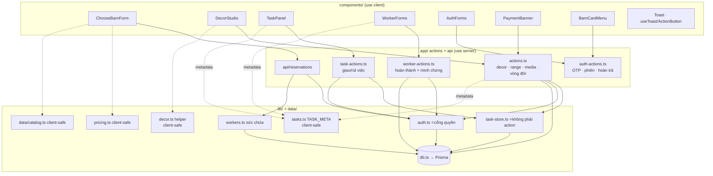
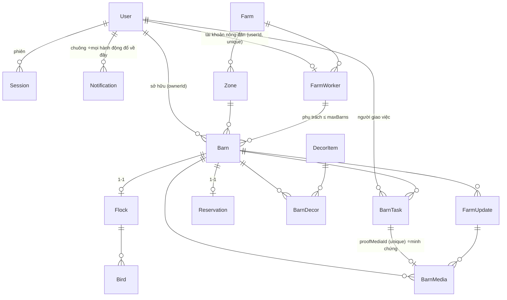

# CODEMAP — bản đồ codebase ChicChic

> **Đọc file này TRƯỚC khi sửa bất cứ thứ gì.** Nó trả lời: *thứ tôi định sửa nằm ở đâu, ai gọi nó, sửa xong thì cái gì gãy theo.*
> Cập nhật: 2026-08-02 · Đối chiếu commit `ebc86c1` + nhánh làm việc (chuông thông báo, tài khoản nông dân do admin cấp).

---

## 0. Cách dùng file này

| Bạn đang cần… | Nhảy tới |
|---|---|
| Hiểu tổng thể trong 60 giây | [§1 Tầng](#1-tầng-và-luật-import) + [§4 Đồ thị module](#4-đồ-thị-module) |
| Biết một URL chạy qua đâu | [§2 Bản đồ route](#2-bản-đồ-route--cổng-quyền--dữ-liệu) |
| Biết chỗ nào GHI vào DB | [§3 Bản đồ ghi](#3-bản-đồ-ghi--ai-được-đụng-vào-bảng-nào) |
| Tra một hàm cụ thể | [§6 Mục lục hàm](#6-mục-lục-hàm-theo-file) |
| Trace một luồng nghiệp vụ | [§7 Sáu vòng lặp](#7-sáu-vòng-lặp-chính--trace-từng-bước) |
| **Sắp sửa code → xem đụng gì** | **[§8 Bảng tra cứu ngược](#8-sửa-x-thì-đụng-vào-đâu)** |
| Sợ phá vỡ ràng buộc nghiệp vụ | [§9 Bất biến](#9-bất-biến-không-được-phá) |

**Quy ước bảo trì:** thêm route / server action / bảng mới → cập nhật §2, §3, §6 và §8 trong **cùng commit**. File này lệch thực tế còn tệ hơn không có.

---

## 1. Tầng và luật import

```
┌─ app/*/page.tsx ────────── Server Component: TRA DỮ LIỆU + KIỂM QUYỀN, không ghi
├─ components/*.tsx ──────── "use client": UI + gọi action, KHÔNG tin được
├─ app/*-actions.ts ──────── "use server": KIỂM QUYỀN rồi mới ghi  ← biên giới an ninh
├─ app/api/**/route.ts ───── HTTP endpoint (dùng khi client cần fetch/poll)
├─ lib/*.ts ─────────────── logic thuần; lib/db.ts là cửa duy nhất xuống Prisma
└─ prisma/schema.prisma ── nguồn sự thật của dữ liệu
```

**Luật import (vi phạm là bug, không phải sở thích):**

1. `components/*` **không bao giờ** import `@/lib/db`, `@/lib/auth`, `@/lib/workers`, `@/lib/task-store`. Chỉ được import action + lib thuần.
2. Lib nào **client dùng chung** thì tuyệt đối không đụng Prisma: `lib/tasks.ts`, `lib/decor.ts`, `lib/pricing.ts`, `data/catalog.ts`.
3. `lib/task-store.ts` **cố tình không có `"use server"`** → không thể gọi từ client. Nó *tin* dữ liệu đưa vào, nên chỉ được gọi từ action đã kiểm quyền.
4. Mọi `"use server"` là **endpoint công khai**. Không có `getSessionUser()` ở đầu hàm = ai cũng gọi được.

---

## 2. Bản đồ route → cổng quyền → dữ liệu

| Route | File | Cổng vào | Đọc | Ghi qua |
|---|---|---|---|---|
| `/` | [page.tsx](src/app/page.tsx) | — (công khai) | `getSessionUser` | — |
| `/dang-nhap` `/dang-ky` | [dang-nhap](src/app/dang-nhap/page.tsx) · [dang-ky](src/app/dang-ky/page.tsx) | đã đăng nhập → `/tai-khoan` | — | `auth-actions` |
| `/quen-mat-khau` | [page.tsx](src/app/quen-mat-khau/page.tsx) | — | — | `auth-actions` |
| `/tai-khoan` | [page.tsx](src/app/tai-khoan/page.tsx) | `getSessionUser` → `/dang-nhap` | Barn+Flock+Reservation của tôi | `auth-actions.returnBarn` |
| `/nhan-chuong` | [page.tsx](src/app/nhan-chuong/page.tsx) | **`requireUser`** | `listWorkers()` | `POST /api/reservations` |
| `/chuong` | [page.tsx](src/app/chuong/page.tsx) | **`requireUser`** · WORKER → `/nong-trai` | Barn của tôi (chọn chuồng để vào) | — |
| `/chuong/[id]` | [page.tsx](src/app/chuong/[id]/page.tsx) | **`requireUser` → `canViewBarn`** | Barn + worker + decor + updates + media + **tasks** + flock | `actions.toggleRange`, `task-actions.*` |
| `/chuong/[id]/nhat-ky` | [page.tsx](src/app/chuong/[id]/nhat-ky/page.tsx) | ↑ | FarmUpdate + BarnMedia | — |
| `/chuong/[id]/trang-tri` | [page.tsx](src/app/chuong/[id]/trang-tri/page.tsx) | ↑ | BarnDecor + DecorItem | `actions.*Decor*` |
| `/chuong/[id]/truy-xuat` | [page.tsx](src/app/chuong/[id]/truy-xuat/page.tsx) | ↑ | Flock + Breed + Bird | — |
| `/chuong/[id]/ket-chu-ky` | [page.tsx](src/app/chuong/[id]/ket-chu-ky/page.tsx) | ↑ | Flock (stage END_OF_LAY) | `actions.decideEndOfLay` |
| `/nong-dan/[id]` | [page.tsx](src/app/nong-dan/[id]/page.tsx) | **`requireUser`** | FarmWorker + media | — |
| `/nong-trai` | [page.tsx](src/app/nong-trai/page.tsx) | **`requireWorker`** | BarnTask của tôi + barns tôi phụ trách | `worker-actions.*` |
| `/nong-trai/chuong/[slug]` | [page.tsx](src/app/nong-trai/chuong/[slug]/page.tsx) | **`requireWorker`** + `barn.workerId === w.workerId` | Barn + decor + tasks | `worker-actions.*` |
| `/admin` | [page.tsx](src/app/admin/page.tsx) | `middleware.ts` (Basic Auth, `ADMIN_PASSWORD`) | tất cả + FarmWorker & tài khoản | `actions.confirmPayment/addMedia/…`, `admin-actions.*` |
| `POST /api/reservations` | [route.ts](src/app/api/reservations/route.ts) | `getSessionUser` → **401 `{needAuth}`** | Breed/FeedingPlan/Zone | tạo Barn+Flock+Bird+Reservation+BarnTask (+ thông báo nông dân) |
| `GET /api/barns/[slug]/payment` | [route.ts](src/app/api/barns/[slug]/payment/route.ts) | ⚠️ không có | Reservation.paymentStatus | — |
| `GET /api/notifications` | [route.ts](src/app/api/notifications/route.ts) | `getSessionUser` → `{list:[]}` | Notification **của chính mình** | — (chuông poll 20s) |

**Ba cổng quyền, đừng nhầm** ([lib/auth.ts](src/lib/auth.ts)):

- `requireUser(nextPath)` → chưa đăng nhập thì `redirect("/dang-nhap?next=…")`. Gọi **ở dòng đầu tiên** của page, **trước** truy vấn nặng (xem [§10](#10-bẫy-đã-gặp-đừng-đạp-lại)).
- `canViewBarn(barn, nextPath)` → gọi `requireUser` bên trong, rồi xét: `isPublic` hoặc chưa có chủ → OK · chủ chuồng / admin → OK · WORKER đúng chuồng mình phụ trách → OK · còn lại `false` → page render `<BarnLocked/>`.
- `requireWorker(nextPath)` → phải đăng nhập **và** có `FarmWorker` gắn `userId`; không có thì `redirect("/tai-khoan")`.
- `isAdmin()` ([lib/admin.ts](src/lib/admin.ts)) → cổng cho **server action** của `/admin`: role ADMIN **hoặc** đúng Basic Auth (trình duyệt tự gửi header đó kèm mọi POST tới `/admin`). Chưa đặt `ADMIN_PASSWORD` → cho qua, giống middleware.

---

## 3. Bản đồ ghi — ai được đụng vào bảng nào

| Bảng | Được ghi từ | Cổng kiểm |
|---|---|---|
| `User` `Session` `EmailCode` | [auth-actions.ts](src/app/auth-actions.ts) | OTP + mật khẩu |
| `Barn` (tạo) | [api/reservations](src/app/api/reservations/route.ts) | đăng nhập + `workerHasCapacity` |
| `Barn.outside` | **chỉ** [worker-actions.completeTask](src/app/worker-actions.ts) | `task.workerId === w.workerId` |
| `Barn.ownerId = null` | [auth-actions.returnBarn](src/app/auth-actions.ts) | chủ chuồng + gõ đúng `RETURN_PHRASE` |
| `BarnDecor` | [actions.installDecor/removeDecor/saveDecorLayout/resetDecorLayout](src/app/actions.ts) | `ownedBarn()` |
| `BarnDecor.photoUrl` | `completeTask` khi `kind = DECOR` | như trên |
| `BarnTask` (tạo/gộp) | [lib/task-store.upsertTask](src/lib/task-store.ts) ← `task-actions.requestTask`, `actions.toggleRange`, `actions.requestDecorWork` | `ownedBarn()` / owner-check |
| `BarnTask.status` | `completeTask` `declineTask` (nông dân) · `cancelTask` xoá hẳn (chủ chuồng) | chủ sở hữu tương ứng |
| `FarmUpdate` `BarnMedia` | `worker-actions.*` (nông dân) · `actions.addMedia/stamp` (admin) | ⚠️ nhánh admin chưa kiểm role |
| `Reservation.paymentStatus` | `reportTransfer` (→REPORTED) · `confirmPayment` (→CONFIRMED) | ⚠️ `confirmPayment` chưa kiểm role |
| `Flock` `Bird` `LifecycleDecision` | [actions.decideEndOfLay/setEndOfLay](src/app/actions.ts) | ⚠️ chưa kiểm chủ sở hữu |
| `Notification` | **chỉ** [lib/notify.notify](src/lib/notify.ts) ← mọi action sau khi ghi xong · xoá/đọc qua [notification-actions](src/app/notification-actions.ts) | người nhận do action quyết định · đọc/xoá chỉ của `getSessionUser` |
| `User.username` `User.passwordHash` (nông dân) | [admin-actions.createWorkerAccount/resetWorkerPassword](src/app/admin-actions.ts) | **`isAdmin()`** |
| `FarmWorker` (tạo / `active`) | [admin-actions.createWorkerAccount/toggleWorkerActive](src/app/admin-actions.ts) | **`isAdmin()`** |

---

## 4. Đồ thị module



**Nút thắt cần nhớ:** `lib/auth.ts` là cổng quyền của cả app · `lib/task-store.ts` là cửa duy nhất tạo việc · `lib/db.ts` là cửa duy nhất xuống DB.

---

## 5. Đồ thị dữ liệu



**Ba quan hệ mang toàn bộ nghiệp vụ:**

- `Barn.ownerId` → ai trả tiền và được xem.
- `Barn.workerId` → ai chăm ngoài đời. **Một chuồng đúng một nông dân.**
- `BarnTask.proofMediaId` (unique, nullable) → **`status = DONE` mà cột này null là dữ liệu hỏng.**

---

## 6. Mục lục hàm theo file

### `lib/` — không có UI, không có side-effect ngoài DB

| File | Hàm / hằng | Ai gọi |
|---|---|---|
| [db.ts](src/lib/db.ts) `8` | `prisma` (singleton, giữ qua HMR) | mọi thứ phía server |
| [auth.ts](src/lib/auth.ts) `146` | `hashPassword` `verifyPassword` `passwordProblem` `hashCode` `newOtp` | auth-actions |
| | `createSession` `destroySession` | auth-actions |
| | **`getSessionUser`** — bọc `cache()` | layout, page, mọi action |
| | `myWorker` (private, `cache()`) `myWorkerId` | canViewBarn, getWorkerSession |
| | **`requireUser` `canViewBarn` `requireWorker` `getWorkerSession`** | page + worker-actions |
| [tasks.ts](src/lib/tasks.ts) `68` | `TASK_META` (emoji/label/**doing**/**proof**) · `FEED_SLOTS` · `WORKER_MAX_BARNS` · `nextOccurrence` · `isOverdue` · `STATUS_VI` | TaskPanel, WorkerForms, actions, worker-actions |
| [task-store.ts](src/lib/task-store.ts) `50` | **`upsertTask`** (gộp việc cùng loại đang OPEN) · `openTaskOfKind` | actions.ts, task-actions.ts |
| [workers.ts](src/lib/workers.ts) `77` | `workerLoad` · **`listWorkers`** (1 `groupBy`, không N+1) · **`workerHasCapacity`** | /nhan-chuong, api/reservations |
| [decor.ts](src/lib/decor.ts) `101` | `clampPlacement` `DECOR_BOUNDS` · `normalizeMediaUrl` `mediaKind` · `dayLabel` `isToday` `timeAgo` `hhmm` · `flockProgress` · `transferCode` · `RETURN_PHRASE` | khắp nơi, cả 2 phía |
| [pricing.ts](src/lib/pricing.ts) `43` | `clampQty` `priceBreakdown` `fmtVnd` | ChooseBarnForm + api/reservations (**tính lại ở server**) |
| [mailer.ts](src/lib/mailer.ts) `46` | `sendCodeEmail` → `{sent}` hoặc `{devCode}` khi thiếu `RESEND_API_KEY` | auth-actions |
| [notify.ts](src/lib/notify.ts) `77` | **`notify`** (nuốt lỗi, không làm hỏng hành động chính) · `notifyMany` · `workerUserIdOfBarn` · `unreadCount` · `listNotifications` | mọi action + layout + api/notifications |
| [notify-meta.ts](src/lib/notify-meta.ts) `38` | `NotifyKind` · `NOTIFY_ICON` · `NotificationVM` — **client-safe** | NotificationBell |
| [admin.ts](src/lib/admin.ts) `33` | **`isAdmin()`** — role ADMIN hoặc Basic Auth | admin-actions |
| [data/catalog.ts](src/data/catalog.ts) `86` | `BREEDS` `FEEDING_PLANS` `DECOR_ITEMS` `BASE_PRICES` `FLOCK_QTY` `HEALTH_PACKAGE` `RETIRE_CARE_VND` | seed + form + pricing |

### `app/*-actions.ts` — biên giới an ninh

| File | Hàm | Ai được gọi | Ghi chú |
|---|---|---|---|
| [actions.ts](src/app/actions.ts) `368` | `ownedBarn()` *(private)* | — | **cổng chung**: đăng nhập + là chủ chuồng (admin qua được) |
| | `toggleRange` | chủ chuồng | **tạo việc**, KHÔNG đổi `outside` |
| | `installDecor` `removeDecor` `saveDecorLayout` `resetDecorLayout` | chủ chuồng | đều gọi `requestDecorWork()` → gộp 1 việc DECOR |
| | `reportTransfer` | chủ chuồng | UNPAID → REPORTED |
| | `confirmPayment` `addMedia` `deleteMedia` `postUpdate` `setEndOfLay` | admin | ⚠️ **chưa kiểm role trong hàm** — xem [§11](#11-khoảng-trống-đã-biết) |
| | `decideEndOfLay` | chủ chuồng | ⚠️ chưa kiểm sở hữu; guard duy nhất là `stage === END_OF_LAY` |
| [task-actions.ts](src/app/task-actions.ts) `79` | `requestTask(slug, kind, note, dueAtIso)` | chủ chuồng/admin | trần `MAX_OPEN_PER_BARN = 6` |
| | `cancelTask(taskId)` | chủ chuồng | chỉ khi `status = OPEN`, xoá hẳn |
| [worker-actions.ts](src/app/worker-actions.ts) `170` | `markTasksSeen()` | nông dân | xoá dấu "MỚI" |
| | **`completeTask(taskId, formData)`** | nông dân đúng việc | ⭐ hạt nhân — [§7.3](#73-nông-dân-làm-xong--transaction-lõi) |
| | `declineTask(taskId, reason)` | nông dân đúng việc | lý do ≥ 5 ký tự, đăng lên nhật ký |
| | `postDailyUpdate(formData)` | nông dân đúng chuồng | **không cần việc** — vòng lặp giữ chân |
| [auth-actions.ts](src/app/auth-actions.ts) `188` | `issueCode` `consumeCode` *(private)* | — | OTP 10 phút, tối đa 5 lần, cooldown 60s |
| | `sendRegisterCode` `verifyAndRegister` `login` `logout` `sendResetCode` `resetPassword` | công khai | `login(identifier, pw)` nhận **email HOẶC username** (có `@` → email) · `resetPassword` **huỷ mọi phiên cũ** |
| | `returnBarn(slug, phrase)` | chủ chuồng | 2 lớp: sở hữu + `RETURN_PHRASE` |
| [admin-actions.ts](src/app/admin-actions.ts) `168` | `createWorkerAccount(formData)` | **`isAdmin()`** | tạo/gắn tài khoản nông dân · email nội bộ `<username>@nong-dan.chicchic.vn` (không gửi thư) |
| | `resetWorkerPassword(workerId, formData)` `toggleWorkerActive(workerId)` | **`isAdmin()`** | đổi mật khẩu **huỷ mọi phiên** của nông dân đó |
| [notification-actions.ts](src/app/notification-actions.ts) `29` | `markNotificationsRead` `clearNotifications` | người đang đăng nhập | chỉ đụng `userId` của chính mình |

### `components/` — client

| File | Xuất | Gọi tới |
|---|---|---|
| [Toast.tsx](src/components/Toast.tsx) `93` | `ToastProvider` `useToast` **`ActionButton`** | — · TTL toast **3800ms** |
| [ChooseBarnForm.tsx](src/components/ChooseBarnForm.tsx) `328` | mặc định + `WorkerOption` | `POST /api/reservations` |
| [TaskPanel.tsx](src/components/TaskPanel.tsx) `207` | mặc định + `TaskVM` | `requestTask` `cancelTask` |
| [WorkerForms.tsx](src/components/WorkerForms.tsx) `236` | `WorkerTaskCard` `DailyUpdateForm` `WorkerTaskVM` | `completeTask` `declineTask` `postDailyUpdate` |
| [DecorStudio.tsx](src/components/DecorStudio.tsx) `258` | mặc định + `Placed` `CatalogItem` | `installDecor` `removeDecor` `saveDecorLayout` `resetDecorLayout` |
| [AuthForms.tsx](src/components/AuthForms.tsx) `204` | `RegisterForm` `LoginForm` `ForgotForm` | auth-actions · đọc `?next=` |
| [BarnCardMenu.tsx](src/components/BarnCardMenu.tsx) `131` | mặc định | `returnBarn` |
| [PaymentBanner.tsx](src/components/PaymentBanner.tsx) `120` | mặc định | `reportTransfer` + poll `/api/barns/[slug]/payment` |
| [MediaGallery.tsx](src/components/MediaGallery.tsx) `211` | `MediaStrip` `MediaGrid` `MediaVM` | — |
| [Illustrations.tsx](src/components/Illustrations.tsx) `223` | `Coop` `CoopBackdrop` `DecorSprite` `DecorFigure` `FarmerAvatar` `QRCode` `COOP_VIEWBOX` | SVG thuần, không state |
| [EndOfLayChoices.tsx](src/components/EndOfLayChoices.tsx) `93` | mặc định | `decideEndOfLay` |
| [AdminForms.tsx](src/components/AdminForms.tsx) `123` | `MediaForm` `UpdateForm` | `addMedia` `postUpdate` |
| [BarnLocked.tsx](src/components/BarnLocked.tsx) `20` | mặc định | màn "chuồng riêng tư" |
| [NotificationBell.tsx](src/components/NotificationBell.tsx) `170` | mặc định | `markNotificationsRead` + poll `GET /api/notifications` mỗi **20s** (chỉ khi tab hiện) |
| [WorkerAccountForms.tsx](src/components/WorkerAccountForms.tsx) `152` | `CreateWorkerForm` `ResetWorkerPassword` | `createWorkerAccount` `resetWorkerPassword` |

---

## 7. Sáu vòng lặp chính — trace từng bước

### 7.1 Nhận chuồng (chọn nông dân)
```
/  "Xem chuồng của tôi"  →  /chuong  →  requireUser (chưa đăng nhập → /dang-nhap?next=/chuong)
       ├ role WORKER          → /nong-trai
       ├ có chuồng            → danh sách để chọn → /chuong/<slug>
       └ chưa có chuồng nào   → màn "nhận nuôi chuồng đầu tiên" + lối xem /chuong/demo

/nhan-chuong  →  requireUser  →  listWorkers()  →  <ChooseBarnForm workers=…>
   người dùng chọn giống · chế độ ăn · số con · TÊN GÀ · NÔNG DÂN
   → POST /api/reservations {workerId, idemKey, …}
       ├ getSessionUser        chưa đăng nhập → 401 {needAuth, loginPath}
       ├ idemKey đã tồn tại    → trả lại đúng đơn cũ (reused: true)
       ├ workerHasCapacity()   kín/tạm nghỉ → 409
       ├ priceBreakdown()      TÍNH LẠI ở server, không tin giá client
       ├ gate "còn cọc treo"   → 409 kèm pendingBarnSlug
       └ $transaction: Barn(+workerId+ownerId) → Flock → Bird[] → FarmUpdate
                       → BarnTask CHECK "Chụp hiện trạng chuồng lúc nhận"
                       → Reservation(HELD, idemKey)
   → chuyển tới /chuong/<slug>, hiện <PaymentBanner> (UNPAID)
```

### 7.2 Chủ chuồng giao việc
```
<TaskPanel>  ── nextOccurrence("06:30") tính Ở CLIENT ─→ requestTask(slug, kind, note, ISO)
   ├ getSessionUser + barn.ownerId === me.id
   ├ đếm OPEN < MAX_OPEN_PER_BARN (6)
   └ upsertTask()  ── có việc cùng kind đang OPEN? ─→ CẬP NHẬT + seenAt = null
                                                 └→ không? TẠO MỚI
   → notify(worker.userId, TASK_NEW) — CHỈ khi tạo mới, gộp vào việc cũ thì không báo lại
   → revalidate /chuong/<slug> + /nong-trai
```
Hai đường khác cũng đổ vào `upsertTask` y hệt: `toggleRange` (RANGE_OUT/RANGE_IN) và `requestDecorWork` (DECOR, gọi từ cả 4 hàm decor).

### 7.3 Nông dân làm xong — transaction lõi
```
/nong-trai → requireWorker → hộp việc (quá hạn xếp trước) → <WorkerTaskCard>
   nút "Hoàn thành" KHOÁ tới khi có url  ← lớp chặn 1 (UI)
   → completeTask(taskId, formData)
       ├ getWorkerSession()             không có hồ sơ → từ chối
       ├ task.workerId === w.workerId   việc người khác → từ chối
       ├ status !== DONE                chống bấm 2 lần
       ├ normalizeMediaUrl(url)         RỖNG → TỪ CHỐI  ← lớp chặn 2 (server) ⭐
       └ $transaction:
            FarmUpdate  ← chủ chuồng thấy trong nhật ký
            BarnMedia   ← ảnh/video, capturedAt = now
            BarnTask    → DONE + doneAt + proofMediaId = media.id
            RANGE_OUT → Barn.outside = true
            RANGE_IN  → Barn.outside = false
            DECOR     → BarnDecor.photoUrl (những món chưa có ảnh)
   → notify(barn.ownerId, TASK_DONE) → hiện trên chuông của chủ chuồng
   → touch(): revalidate /nong-trai, /nong-trai/chuong/<slug>, /chuong/<slug>, /nhat-ky, /tai-khoan
```

### 7.6 Nông trại cấp tài khoản cho nông dân
```
/admin (Basic Auth)  →  khối "👩‍🌾 Tài khoản nông dân"
   admin nhập tên · khu vực · TÊN ĐĂNG NHẬP · MẬT KHẨU
   → createWorkerAccount(formData)
       ├ isAdmin()              role ADMIN hoặc Basic Auth — middleware KHÔNG chặn action
       ├ USERNAME_RE + passwordProblem
       ├ username đã có?        → từ chối
       └ $transaction: User(role=WORKER, username, email nội bộ) → FarmWorker(userId)
   → notify(user, ACCOUNT)
   admin đưa tận tay username + mật khẩu
   → nông dân /dang-nhap gõ username  →  login() thấy có "@" không? không → tra theo username
   → /nong-trai: chuồng phụ trách + trạng thái việc từng chuồng
```

### 7.4 Trang trí → việc thật
```
/chuong/<slug>/trang-tri → <DecorStudio> kéo thả (clampPlacement ở client)
   → saveDecorLayout(slug, layout[])
       ├ ownedBarn()
       ├ bỏ qua món client gửi mà chưa lắp thật; clampPlacement LẠI ở server
       ├ so sánh từng món, không đổi thì không ghi
       └ requestDecorWork() → 1 việc DECOR duy nhất
   → cô Lan lắp thật → completeTask → BarnDecor.photoUrl = ảnh
```

### 7.5 Cọc
```
<PaymentBanner> poll GET /api/barns/<slug>/payment mỗi vài giây
   người dùng bấm "Tôi đã chuyển khoản" → reportTransfer → REPORTED
   admin /admin → confirmPayment → CONFIRMED + FarmUpdate mốc son
   → banner tự biến mất; installDecor mở khoá (barnActivated())
```

---

## 8. Sửa X thì đụng vào đâu

| Muốn sửa | Sửa ở | Nhớ sửa kèm | Kiểm lại |
|---|---|---|---|
| Thêm **loại việc** mới | `schema.prisma:TaskKind` → `db push` | `lib/tasks.ts:TaskKind` **+ `TASK_META`** · `task-actions.ts:KINDS` · `worker-actions.ts:UPDATE_KIND` | `TASK_META` thiếu key → crash runtime, TS bắt được |
| Đổi **trần 15 chuồng** | `schema.prisma:FarmWorker.maxBarns` (default) | `lib/tasks.ts:WORKER_MAX_BARNS` (hiển thị) · hàng đã có trong DB phải `update` tay | `workerHasCapacity` đọc DB, không đọc hằng |
| Đổi **luật xem chuồng** | `lib/auth.ts:canViewBarn` — **một chỗ duy nhất** | không cần sửa 5 page | quét lại 5 page `/chuong/*` |
| Thêm **trang chuồng** mới | page mới trong `app/chuong/[id]/` | `requireUser` **dòng đầu** → query → `canViewBarn` → `<BarnLocked/>` · thêm vào `revalidateBarn()` | thử bằng tab ẩn danh |
| Thêm **thao tác lên chuồng** | `actions.ts` | **bắt đầu bằng `ownedBarn()`** · kết thúc bằng `revalidateBarn()` | thiếu = ai biết slug cũng ghi được |
| Đổi **giá** | `data/catalog.ts:BASE_PRICES` | `lib/pricing.ts` nếu đổi công thức | server tính lại — không sửa client là đủ |
| Thêm **món decor** | `data/catalog.ts:DECOR_ITEMS` + `db:seed` | `Illustrations.tsx:DecorSprite` cần `svgKey` tương ứng | thiếu SVG → ô trống, không lỗi |
| Đổi **giờ cho ăn** | `lib/tasks.ts:FEED_SLOTS` | — | `nextOccurrence` chạy client, không lệch múi giờ |
| Đổi **luồng đăng nhập** | `lib/auth.ts` + `auth-actions.ts` | `AuthForms.tsx` đọc `?next=` | mọi `requireUser` phải giữ đúng `next` |
| Thêm **cột vào Barn** | `schema.prisma` → `db push` | các `select:` **liệt kê tường minh** trong `ownedBarn`, `completeTask`, `/api/reservations` | quên → `undefined` lúc chạy |
| Đổi **thông điệp cho người dùng** | ngay trong action (chuỗi tiếng Việt) | — | E2E đọc theo text → cập nhật script |
| Thêm **bảng mới** | `schema.prisma` → `db push` → `prisma/seed.ts` | **§3 + §5 của file này** | `npm run db:reset` phải chạy sạch |
| Thêm **hành động mới** cho user/nông dân | action tương ứng | **`notify()` cho phía bên kia** ngay sau khi ghi xong (§9.8) · thêm `NotifyKind` thì sửa cả `schema.prisma` **và** `lib/notify-meta.ts` | thiếu icon trong `NOTIFY_ICON` → TS bắt được |
| Thêm **thao tác ở /admin** | `admin-actions.ts` | **bắt đầu bằng `isAdmin()`** — middleware KHÔNG chặn lời gọi action | gọi thẳng action từ route khác phải bị từ chối |
| Đổi **cách nông dân đăng nhập** | `auth-actions.login` + `User.username` | `AuthForms.LoginForm` (một ô cho cả email lẫn username) · `admin-actions.USERNAME_RE` | thử cả 2 kiểu tài khoản |

---

## 9. Bất biến không được phá

1. **Không minh chứng thì không xong.** `BarnTask.status = DONE` ⟹ `proofMediaId != null`. Chặn ở `completeTask`, và chỉ ở đó — không thêm đường ghi `status = DONE` nào khác.
2. **App không đổi hiện thực.** `Barn.outside` chỉ đổi bên trong `completeTask`. Nút bấm của người dùng **tạo việc**, không đổi trạng thái. Điều này áp dụng cho mọi tính năng "ngoài đời" thêm sau này.
3. **Một chuồng một nông dân, ≤ `maxBarns`.** Kiểm bằng `workerHasCapacity` **ngay trước** khi tạo chuồng, trong cùng request — danh sách client thấy luôn có thể đã cũ.
4. **Chuồng đã hoàn trả không tính tải.** `workerLoad` chỉ đếm `ownerId != null`.
5. **Đăng nhập trước mọi trang chuồng.** Không có "xem thử ẩn danh". `isPublic` chỉ nới cho *tài khoản khác*, không nới cho khách.
6. **Không tin client.** Giá, vị trí decor, danh sách món, số con — tính/ép lại ở server.
7. **Bấm hai lần không nhân đôi.** `idemKey` (đơn) · `upsertTask` (việc) · cửa sổ trùng 60 giây (`stamp`, `addMedia`, `postDailyUpdate`) · check `status` trước khi đổi.
8. **Hành động xong thì phía bên kia phải biết.** Mọi action hoàn tất đều gọi `notify()` cho người còn lại (chủ chuồng ↔ nông dân). Gọi **sau khi** ghi DB xong và không bao giờ để lỗi thông báo làm hỏng hành động chính — `notify` tự nuốt lỗi. Việc gộp vào task đang OPEN thì **không** báo lại (tránh dội chuông).
9. **Nông dân không tự tạo tài khoản.** Chỉ `admin-actions.createWorkerAccount` mới sinh được `User(role=WORKER)` + `FarmWorker`. Không mở đường đăng ký WORKER ở luồng OTP công khai.

---

## 10. Bẫy đã gặp (đừng đạp lại)

| Bẫy | Vì sao | Cách đúng |
|---|---|---|
| `requireUser` đặt **sau** truy vấn | khách ẩn danh vẫn phải chờ query nặng | đặt **dòng đầu** page — đo được 9,3s → 0,09s |
| Gọi `getSessionUser` nhiều lần | layout + page + `canViewBarn` = 3 truy vấn | đã bọc `cache()`; **giữ nguyên**, đừng bỏ |
| `connection_limit=1` | mọi truy vấn xếp hàng một hàng dọc | `.env` để **5** — và **cả biến môi trường trên Vercel** |
| `redirect()` trong Server Component | trả HTTP **200**, redirect nằm trong RSC payload | test bằng cách grep `dang-nhap?next=` trong body, đừng đọc status code |
| Prisma `_count` có filter | cần preview feature `filteredRelationCount` | dùng `groupBy` như `listWorkers` |
| Toast biến mất sau 3,8s | không thấy toast **không chứng minh** thất bại | xác nhận qua DB hoặc trang đã render lại |
| DB ở `ap-south-1` (Mumbai) | ~1,3s mỗi lượt đi–về | biết trước khi "tối ưu" query; chuyển sang `ap-southeast-1` mới là cách sửa thật |
| Sửa `FarmWorker.userId` (unique) | `db push` đòi `--accept-data-loss` | kiểm tra cột đúng là mới & nullable rồi mới chấp nhận |

---

## 11. Khoảng trống đã biết

Ghi ở đây để không ai tưởng là đã xong.

1. ⚠️ **Action của admin chưa kiểm role.** `confirmPayment` `addMedia` `deleteMedia` `postUpdate` `setEndOfLay` nằm trong `actions.ts` không có `getSessionUser`. `middleware.ts` chỉ khoá **trang** `/admin`, không khoá lời gọi server action. Ai biết action id là gọi được → tự xác nhận cọc cho chính mình. *Sửa:* thêm `requireAdmin()` vào đầu 5 hàm này.
2. ⚠️ **`decideEndOfLay` chưa kiểm sở hữu** — chỉ chặn bằng `stage === END_OF_LAY`. Người lạ biết slug có thể quyết định thay chủ chuồng.
3. ⚠️ **`GET /api/barns/[slug]/payment` không kiểm quyền** — lộ trạng thái cọc theo slug. Rủi ro thấp, nhưng là chỗ duy nhất còn hở dữ liệu chuồng.
4. Media vẫn là **dán URL**, chưa upload trực tiếp (`normalizeMediaUrl` chỉ chặn `javascript:`/`data:`).
5. ~~Nông dân không tự tạo tài khoản được~~ → đã có: `/admin` → khối **👩‍🌾 Tài khoản nông dân** (`admin-actions.createWorkerAccount`). Đây là *thiết kế*, không phải thiếu sót: tài khoản do nông trại cấp tận tay.
6. Thông báo là **poll 20 giây**, chưa phải push thật (chưa có Web Push/FCM). Đóng tab thì không nhận được gì; mở lại mới thấy.
7. `notify()` gọi **ngoài** `$transaction` của hành động chính — nếu tiến trình chết đúng khe giữa hai bước thì mất một dòng thông báo (dữ liệu nghiệp vụ vẫn đúng). Đổi lại: lỗi thông báo không bao giờ làm rollback việc đã làm.
8. Đổi mật khẩu nông dân xong, **admin phải tự đưa mật khẩu mới** cho cô/chú — hệ thống không gửi đi đâu cả (tài khoản nông dân dùng email nội bộ, không nhận được thư).

---

## 12. Lệnh & môi trường

```bash
npm run dev        # localhost:3000
npm run build      # prisma generate + next build
npm run lint
npx tsc --noEmit   # bắt buộc chạy trước khi commit
npm run db:push    # đẩy schema (KHÔNG migration file)
npm run db:seed    # 4 chuồng · 15 ảnh/video · 6 nhiệm vụ
npm run db:reset   # xoá sạch + seed lại
```

**Biến môi trường** (mẫu ở `.env.example`, giá trị thật ở `.env` — **đã gitignore, không bao giờ commit hay copy sang file được theo dõi**):
`DATABASE_URL` (pooler 6543 + `pgbouncer=true&connection_limit=5`) · `DIRECT_URL` (pooler 5432) · `RESEND_API_KEY` (trống = hiện OTP trên màn hình, chỉ dùng khi demo) · `ADMIN_PASSWORD` (**bắt buộc đặt trên Vercel trước khi chia link**) · `NEXT_PUBLIC_HOLD_BANK` `NEXT_PUBLIC_HOLD_MOMO`.

**Tài khoản seed** — nông dân đăng nhập bằng **tên đăng nhập**: `colan` `chutam` `anhdung` `chihoa` (hoặc email `lan@…`), mật khẩu `chicchic123`, vào `/nong-trai`; chủ chuồng xem log của `npm run db:seed`.

**Tài liệu liên quan:** [HUONG-DAN-SETUP-DEPLOY.md](HUONG-DAN-SETUP-DEPLOY.md) (dựng & deploy từ số 0, mục G = cổng nông dân) · [DEPLOY.md](DEPLOY.md) · [README.md](README.md).
