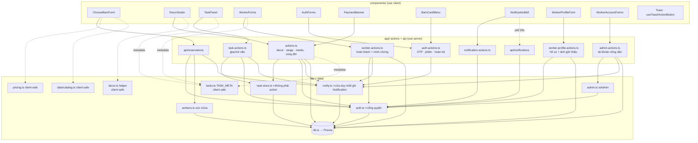
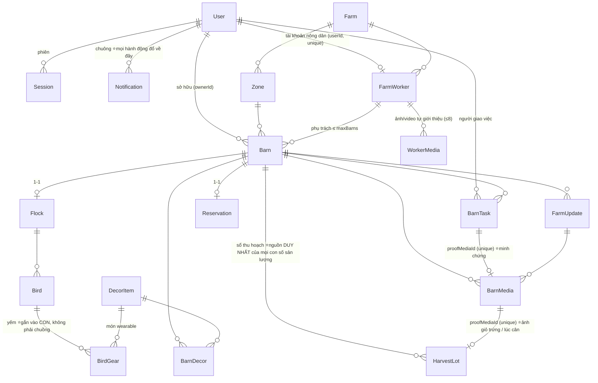

# CODEMAP - bản đồ codebase ChicChic

> **Đọc file này TRƯỚC khi sửa bất cứ thứ gì.** Nó trả lời: *thứ tôi định sửa nằm ở đâu, ai gọi nó, sửa xong thì cái gì gãy theo.*
> Cập nhật: 2026-08-10 · Đối chiếu commit `ea46195` + bốn đợt: **khép hai mắt xích hở** (`TaskKind.HARVEST` §7.11 · `admin-actions.reassignBarn` §7.12) · **vòng nhắc** (`lib/jobs.remindStuff` + bảng `Nudge`, §7.10(5)) · **nhận hàng tận nhà** (`Address` + `LotStatus.CLAIMED` + `TaskKind.HANDOVER`, §7.13) · **QR truy xuất thật** (`lib/qr.ts` + `/tx/[code]` công khai, §7.14 và bất biến §9.31) · **bộ kiểm tự động** (§13).

---

## 0. Cách dùng file này

| Bạn đang cần… | Nhảy tới |
|---|---|
| Hiểu tổng thể trong 60 giây | [§1 Tầng](#1-tầng-và-luật-import) + [§4 Đồ thị module](#4-đồ-thị-module) |
| Biết một URL chạy qua đâu | [§2 Bản đồ route](#2-bản-đồ-route--cổng-quyền--dữ-liệu) |
| Biết chỗ nào GHI vào DB | [§3 Bản đồ ghi](#3-bản-đồ-ghi--ai-được-đụng-vào-bảng-nào) |
| Tra một hàm cụ thể | [§6 Mục lục hàm](#6-mục-lục-hàm-theo-file) |
| Trace một luồng nghiệp vụ | [§7 Bảy vòng lặp](#7-bảy-vòng-lặp-chính--trace-từng-bước) |
| **Sắp sửa code → xem đụng gì** | **[§8 Bảng tra cứu ngược](#8-sửa-x-thì-đụng-vào-đâu)** |
| Sợ phá vỡ ràng buộc nghiệp vụ | [§9 Bất biến](#9-bất-biến-không-được-phá) |
| Viết test / muốn biết test phủ tới đâu | [§13 Bộ kiểm tự động](#13-bộ-kiểm-tự-động) |

**Quy ước bảo trì:** thêm route / server action / bảng mới → cập nhật §2, §3, §6 và §8 trong **cùng commit**. File này lệch thực tế còn tệ hơn không có. Đổi một dòng ở §9 thì rà lại `tests/bat-bien.test.ts` - mỗi `it` ở đó khoá một dòng §9, hai bên lệch nhau nghĩa là một trong hai đang nói dối.

---

## 1. Tầng và luật import

```
┌─ app/*/page.tsx ────────── Server Component: TRA DỮ LIỆU + KIỂM QUYỀN, không ghi
├─ components/*.tsx ──────── "use client": UI + gọi action, KHÔNG tin được
├─ app/*-actions.ts ──────── "use server": KIỂM QUYỀN rồi mới ghi  ← biên giới an ninh
├─ app/api/**/route.ts ───── HTTP endpoint (dùng khi client cần fetch/poll)
├─ lib/*.ts ─────────────── logic thuần; lib/db.ts là cửa duy nhất xuống Prisma
└─ prisma/schema.prisma ── nguồn sự thật của dữ liệu
```

**Luật import (vi phạm là bug, không phải sở thích):**

1. `components/*` **không bao giờ** import `@/lib/db`, `@/lib/auth`, `@/lib/workers`, `@/lib/task-store`. Chỉ được import action + lib thuần.
2. Lib nào **client dùng chung** thì tuyệt đối không đụng Prisma: `lib/tasks.ts`, `lib/decor.ts`, `lib/pricing.ts`, `data/catalog.ts`.
3. `lib/task-store.ts` **cố tình không có `"use server"`** → không thể gọi từ client. Nó *tin* dữ liệu đưa vào, nên chỉ được gọi từ action đã kiểm quyền.
4. Mọi `"use server"` là **endpoint công khai**. Không có `getSessionUser()` ở đầu hàm = ai cũng gọi được.

---

## 2. Bản đồ route → cổng quyền → dữ liệu

| Route | File | Cổng vào | Đọc | Ghi qua |
|---|---|---|---|---|
| `/` | [page.tsx](src/app/page.tsx) | - (công khai) · **WORKER → `/nong-trai`** | `getSessionUser` · `featuredWorkers` · `farmProof` | - |
| `/dang-nhap` `/dang-ky` | [dang-nhap](src/app/dang-nhap/page.tsx) · [dang-ky](src/app/dang-ky/page.tsx) | đã đăng nhập → `/tai-khoan` | - | `auth-actions` |
| `/quen-mat-khau` | [page.tsx](src/app/quen-mat-khau/page.tsx) | - | - | `auth-actions` |
| `/tai-khoan` | [page.tsx](src/app/tai-khoan/page.tsx) | `getSessionUser` → `/dang-nhap` | Barn+Flock+Reservation của tôi | `auth-actions.returnBarn` |
| `/nhan-chuong` | [page.tsx](src/app/nhan-chuong/page.tsx) | **`requireUser`** · WORKER → `/nong-trai` | `listWorkers()` | `POST /api/reservations` |
| `/chuong` | [page.tsx](src/app/chuong/page.tsx) | **`requireUser`** · WORKER → `/nong-trai` | Barn của tôi (chọn chuồng để vào) | - |
| `/chuong/[id]` | [page.tsx](src/app/chuong/[id]/page.tsx) | **`requireUser` → `canViewBarn`** | Barn + worker + decor + updates + media + **tasks** + flock | `actions.toggleRange`, `task-actions.*` |
| `/chuong/[id]/nhat-ky` | [page.tsx](src/app/chuong/[id]/nhat-ky/page.tsx) | ↑ | FarmUpdate + BarnMedia | - |
| `/chuong/[id]/trang-tri` | [page.tsx](src/app/chuong/[id]/trang-tri/page.tsx) | ↑ | BarnDecor + DecorItem | `actions.*Decor*` |
| `/chuong/[id]/truy-xuat` | [page.tsx](src/app/chuong/[id]/truy-xuat/page.tsx) | ↑ | Flock + Breed + Bird | - |
| `/chuong/[id]/dan-ga` | [page.tsx](src/app/chuong/[id]/dan-ga/page.tsx) | ↑ | Bird + BirdGear + `cachedDecorItems` + `decorStock` - **4 truy vấn PHẲNG trong 1 `Promise.all`**, không `include` lồng từ Bird xuống gear | `actions.wearGear/removeGear` |
| `/chuong/[id]/thu-hoach` | [page.tsx](src/app/chuong/[id]/thu-hoach/page.tsx) | ↑ | HarvestLot (`take: 60`) + `groupBy` tổng + `MarketPrice` + **`Address` của NGƯỜI ĐANG XEM** - 4 truy vấn trong 1 `Promise.all` · **tổng KHÔNG cộng từ danh sách đã cắt** | `harvest-actions.*` (nhận về nhà) · `market-actions.listLot` (bán lại) |
| `/chuong/[id]` (hoá đơn) | ↑ cùng trang chuồng | ↑ | Đọc `BarnInvoice` chưa trả trong **cùng đợt `Promise.all`**. Quá hạn → render `<BarnUnpaid>` thay cho nội dung chuồng (**chỉ với CHỦ chuồng**; admin và nông dân đi qua) · sắp tới hạn → banner nhắc · `<InvoiceGate>` gọi phát hành **sau khi trang đã hiện** | `billing-actions.*` |
| `/chuong/[id]/nghi-huu` | [page.tsx](src/app/chuong/[id]/nghi-huu/page.tsx) | ↑ | `CareOrder` (`take: 24`) + `aggregate` hạn xa nhất - 2 truy vấn trong 1 `Promise.all` · **hạn KHÔNG suy từ danh sách đã cắt** · đàn chưa `RETIRED` thì hiện màn "chưa tới lúc", không hiện giá | `care-actions.*` |
| `/chuong/[id]/ket-chu-ky` | [page.tsx](src/app/chuong/[id]/ket-chu-ky/page.tsx) | ↑ | Flock (stage END_OF_LAY) - **cả hai dòng**: gà đẻ hết chu kỳ, gà thịt tới ngày xuất chuồng. Chữ đổi theo `productLine`, cổng thì không (§9.30) | `actions.decideEndOfLay` |
| `/chuong/[id]/tin-nhan` | [page.tsx](src/app/chuong/[id]/tin-nhan/page.tsx) | **`requireUser` → `threadAccess`** (KHÔNG dùng `canViewBarn` - xem được chuồng ≠ được vào hộp thư riêng) | BarnMessage | `message-actions.*` |
| `/cho` | [page.tsx](src/app/cho/page.tsx) | **`requireUser`** | MarketListing `LISTED` còn hạn (`take: 20`, lọc hạn **trong `WHERE`**) + chuồng của tôi + **`groupBy` đếm lô bán được từng chuồng** (không dùng `_count` có filter, §10) - ⚠️ **trang DUY NHẤT đọc chéo nhiều chuồng** · thẻ giỏ đầy đủ đã sang `/cho/gio`, đây chỉ còn **một dòng tóm tắt** (§11.46) | `market-actions.themVaoGio/boKhoiGio` |
| `/cho/gio` | [page.tsx](src/app/cho/gio/page.tsx) | **`requireUser`** + `role === WORKER` → đá về `/nong-trai` (§9.14) | giỏ đang mở (`MarketOrder` `OPEN` + lô `RESERVED`) + `diaChiVaVung` + `vungDangMo` - 3 truy vấn song song | `market-actions.boKhoiGio/chotGio` · `harvest-actions.saveAddress` |
| `/cho/cua-toi` | [page.tsx](src/app/cho/cua-toi/page.tsx) | **`requireUser`** | tin tôi bán + đơn tôi mua + `PayoutAccount` - 3 truy vấn song song | `market-actions.*` |
| `/api/thanh-toan?code=` | [route.ts](src/app/api/thanh-toan/route.ts) | **`getSessionUser`** + kiểm ĐÚNG người theo từng loại đơn | tra `payCode` (CHICC/CHICD/CHICM) → `{ status, paid }` - **một cửa cho cả ba loại**, vì đơn chợ không thuộc chuồng nào của người mua | - (chỉ đọc) |
| **`/tx/[code]`** | [page.tsx](src/app/tx/[code]/page.tsx) | **CÔNG KHAI - ngoại lệ có chủ ý của §9.5**, xem §9.31 · tra `HarvestLot.publicCode` (chìa khoá không đoán được) · `robots: noindex` | HarvestLot + BarnMedia + FarmWorker + Zone/Farm, rồi **truy vấn riêng** `Flock` theo `flockId` - CHỦ Ý: `barn.flock` là đàn *hiện tại*, sau một lứa mới đó là đàn khác | - (chỉ đọc) |
| `/nong-dan/[id]` | [page.tsx](src/app/nong-dan/[id]/page.tsx) | **công khai một nửa** - xem `getSessionUser`: khách thấy phần giới thiệu, chuồng/ảnh/ghi chép cần đăng nhập | FarmWorker + `workerLoad` + **WorkerMedia** (tự giới thiệu) · *thêm* BarnMedia + Barn + FarmUpdate khi đã đăng nhập | - |
| **`/gia-dinh`** | [page.tsx](src/app/gia-dinh/page.tsx) | **`requireUser`** rồi **`batFamily()` → `notFound()`** (cờ tắt ⟹ **404**, không phải trang "sắp có") | `FamilyEnrollment` của tôi (+ `ChildBarnLink`) + `ChildProfile` của tôi - 2 truy vấn song song | `family-actions.ghiNhanAssent/nhanLoiMoiGiaDinh` |
| **`/gia-dinh/xac-minh`** | [page.tsx](src/app/gia-dinh/xac-minh/page.tsx) | ↑ | - | `family-actions.xacMinhLai` · ⚠️ `?next=` đi qua **danh sách trắng**, không phải phép lọc (chống máy chuyển hướng mở) |
| **`/gia-dinh/tre-moi`** | [page.tsx](src/app/gia-dinh/tre-moi/page.tsx) | ↑ + **`daXacMinhGanDay`** → `/gia-dinh/xac-minh` | - | `family-actions.taoHoSoTre` |
| **`/gia-dinh/quyen-rieng-tu`** | [page.tsx](src/app/gia-dinh/quyen-rieng-tu/page.tsx) | ↑ + **`daXacMinhGanDay`** | `ChildProfile` của tôi | `family-actions.rutConsentTre/xoaDuLieuTre` |
| `/nong-trai` | [page.tsx](src/app/nong-trai/page.tsx) | **`requireWorker`** | BarnTask của tôi + barns tôi phụ trách | `worker-actions.*` |
| `/nong-trai/ho-so` | [page.tsx](src/app/nong-trai/ho-so/page.tsx) | **`requireWorker`** | FarmWorker + WorkerMedia **của chính mình** | `worker-profile-actions.*` |
| `/nong-trai/chuong/[slug]` | [page.tsx](src/app/nong-trai/chuong/[slug]/page.tsx) | **`requireWorker`** + `barn.workerId === w.workerId` | Barn + decor + tasks | `worker-actions.*` |
| `/admin/tin-nhan/[slug]` | [page.tsx](src/app/admin/tin-nhan/[slug]/page.tsx) | `middleware.ts` + **`adminThread()`** - chỉ mở hộp thư CÓ cờ/báo cáo | BarnMessage (chỉ đọc) | - |
| `/admin` | [page.tsx](src/app/admin/page.tsx) | `middleware.ts` (Basic Auth, `ADMIN_PASSWORD`) | tất cả + FarmWorker & tài khoản | `actions.confirmPayment/addMedia/…`, `admin-actions.*` |
| `POST /api/reservations` | [route.ts](src/app/api/reservations/route.ts) | `getSessionUser` → **401 `{needAuth}`** · role WORKER → **403** | Breed/FeedingPlan/Zone | tạo Barn+Flock+Bird+Reservation+BarnTask (+ thông báo nông dân) |
| `GET /api/barns/[slug]/payment` | [route.ts](src/app/api/barns/[slug]/payment/route.ts) | `getSessionUser` → 401 · không phải chủ chuồng → **404** (không lộ chuồng có tồn tại hay không) | Reservation.paymentStatus | - |
| `GET /api/barns/[slug]/messages` | [route.ts](src/app/api/barns/[slug]/messages/route.ts) | **`threadAccess`** → 403 · cùng cổng với action gửi tin | BarnMessage của chuồng + `markRead` | - (hộp thư poll 12s) |
| `GET /api/notifications` | [route.ts](src/app/api/notifications/route.ts) | `getSessionUser` → `{list:[]}` | Notification **của chính mình** | - (chuông poll 20s) |
| `POST /api/webhooks/sepay` | [route.ts](src/app/api/webhooks/sepay/route.ts) | **khoá API của SePay** (`Authorization: Apikey …`) - thiếu `SEPAY_WEBHOOK_KEY` thì **503, đóng** | Reservation / DecorOrder theo mã chuyển khoản | `BankTxn` (sổ) → `lib/payments.confirm*Paid` |
| `GET /api/cron` | [route.ts](src/app/api/cron/route.ts) | **`CRON_SECRET`** (`Authorization: Bearer …`, Vercel tự gắn) - thiếu biến thì **503, đóng** (§9.20) · lịch ở `vercel.json` | Flock · MarketListing · HarvestLot · DecorOrder · BarnTask · Barn | **`lib/jobs.runDailyJobs`** - cửa duy nhất của việc nền. **Năm** việc: bốn việc đổi dữ liệu + **vòng nhắc** (`Nudge` + `Notification`, không đổi gì khác) |

**Ba cổng quyền, đừng nhầm** ([lib/auth.ts](src/lib/auth.ts)):

- `requireUser(nextPath)` → chưa đăng nhập thì `redirect("/dang-nhap?next=…")`. Gọi **ở dòng đầu tiên** của page, **trước** truy vấn nặng (xem [§10](#10-bẫy-đã-gặp-đừng-đạp-lại)).
- `canViewBarn(barn, nextPath)` → gọi `requireUser` bên trong, rồi xét: `isPublic` hoặc chưa có chủ → OK · chủ chuồng / admin → OK · WORKER đúng chuồng mình phụ trách → OK · còn lại `false` → page render `<BarnLocked/>`.
- `requireWorker(nextPath)` → phải đăng nhập, có `FarmWorker` gắn `userId`, **và `active = true`**; không đạt thì `redirect("/tai-khoan")` - trang đó hiện màn "tài khoản tạm dừng" chứ **không** đá ngược sang `/nong-trai` (sẽ thành vòng lặp).
- `activeWorkerSession()` → bản dành cho **server action** của cổng nông dân: giống `getWorkerSession` nhưng trả `null` khi `active = false`. Action không `redirect()` được như page, nên nó cần một cổng trả null để hiện toast từ chối. **Mọi action trong `worker-actions.ts` và `worker-profile-actions.ts` dùng hàm này**, không dùng `getWorkerSession` trần.
- `isAdmin()` ([lib/admin.ts](src/lib/admin.ts)) → cổng cho **server action** của `/admin`: role ADMIN **hoặc** đúng Basic Auth (trình duyệt tự gửi header đó kèm mọi POST tới `/admin`). Chưa đặt `ADMIN_PASSWORD` → **fail-closed ở production**, chỉ cho qua khi chạy dev (middleware.ts giữ đúng luật đó: production thiếu biến thì trả 503).

---

### Khu khám phá của bé (§9.40)

| Route | Cổng | Ghi chú |
|---|---|---|
| `/be/[childId]` | `requireUser` → **`moKhuCuaBe`** (5 điều kiện) | Nhà của bé: **1** bài nổi bật + tối đa 2 bài đã xem. Không thanh điều hướng người lớn - lớp bọc nhận dấu `HEADER_KHU_BE` từ middleware |
| `/be/[childId]/khoanh-khac/[momentId]` | như trên + **`moBaiCuaBe`** (bài phải của đúng bé đó) | Nội dung lấy từ **bản chụp trong DB**, không từ catalog hiện tại. Trang **chỉ đọc** - dấu "đã bắt đầu" ghi khi bé bấm sang thẻ 2 |
| `/be/[childId]/nhat-ky` | như `/be/[childId]` | Những điều đã học, trần cứng 30 dòng - **không cuộn vô tận** |

## 3. Bản đồ ghi - ai được đụng vào bảng nào

| Bảng | Được ghi từ | Cổng kiểm |
|---|---|---|
| `User` `Session` `EmailCode` | [auth-actions.ts](src/app/auth-actions.ts) | OTP + mật khẩu |
| `RateLimit` | **chỉ** [lib/nhip.ts](src/lib/nhip.ts) (`chanNhip` ghi, `xoaNhip` xoá) + `jobs.cleanupRateLimits` dọn | không có - **cố ý**: đây là bảng đếm, ai gọi cũng phải được đếm, kể cả người chưa đăng nhập (§11.50) |
| `Barn` (tạo) | [api/reservations](src/app/api/reservations/route.ts) | đăng nhập + `workerHasCapacity` |
| `Barn.outside` | **chỉ** [worker-actions.completeTask](src/app/worker-actions.ts) | `task.workerId === w.workerId` |
| `Barn.ownerId = null` | [auth-actions.returnBarn](src/app/auth-actions.ts) | chủ chuồng + gõ đúng `RETURN_PHRASE` |
| `Refund` (tạo, khi hoàn trả chuồng) | [auth-actions.returnBarn](src/app/auth-actions.ts) - **cùng transaction** với dòng trên | chủ chuồng + `RETURN_PHRASE`; số tiền tính ở server qua `lib/refunds.duKienHoanChuong` (§9.6) |
| `Refund` (tạo, đơn chợ) | [refund-actions.requestMarketRefund](src/app/refund-actions.ts) | `buyerId === me.id` + còn trong cửa sổ `MARKET_REFUND_DAYS` + `@@unique([kind, sourceId])` chống bấm hai lần |
| `Refund.status` | **chỉ** [refund-actions.decideRefund / markRefundPaid](src/app/refund-actions.ts) | `isAdmin()` + so-sánh-rồi-đặt (§9.24). `REQUESTED → APPROVED/REJECTED → PAID`, **không nhảy cóc** |
| **`Barn.workerId`** (đổi người chăm) | **chỉ** [admin-actions.reassignBarn](src/app/admin-actions.ts) | **`isAdmin()`** + người nhận `active = true` + còn dưới `maxBarns` (đọc lại `workerLoad`, không tin số trên màn hình) · đi kèm việc chuyển `BarnTask` đang OPEN ở dòng dưới · ⚠️ `returnBarn` **không** gỡ cột này, chuồng chỉ bị lọc khỏi `/nong-trai` (§11.41) |
| ☠️ **Xoá hàng `Barn`** | **chỉ** [admin-actions.deleteBarn](src/app/admin-actions.ts) | **`isAdmin()`** + gõ lại slug + không còn tin đăng đang giữ tiền. Xem §11.42 trước khi đụng |
| **`BarnTask.workerId`** (việc theo chuồng sang người mới) | **chỉ** `reassignBarn`, cùng `$transaction` với dòng trên | như trên - chỉ đụng `status = OPEN`; việc đã `DONE`/`DECLINED` giữ nguyên tên người đã làm |
| `BarnDecor` | [actions.installDecor/removeDecor/saveDecorLayout/resetDecorLayout/setDecorText](src/app/actions.ts) | `ownedBarn()` + **tồn kho** (`decorStock`) |
| `BarnDecor.photoUrl` | `completeTask` khi `kind = DECOR` | như trên |
| `BarnDecor.colorHex` `.variant` | [actions.setDecorStyle](src/app/actions.ts) | `ownedBarn()` + màu/kiểu phải nằm trong `DECOR_COLORS`/`DECOR_VARIANTS` (danh sách **đóng**, không nhận mã màu tự do) + lọc kèm `barnId` |
| **`DecorItem.stockQty`** (kho thật của nông trại) | **trừ**: [decor-actions.createDecorOrder](src/app/decor-actions.ts) · **cộng**: `cancelDecorOrder` · **nhập/kiểm kê**: [admin-actions.setDecorStock](src/app/admin-actions.ts) | phép trừ là `updateMany({ where: { stockQty: { gte: qty } } })` - **so-sánh-rồi-đặt** (§9.27) · nhập kho cần `isAdmin()` |
| `Barn.label` | [api/reservations](src/app/api/reservations/route.ts) (lúc tạo) · [actions.renameBarn](src/app/actions.ts) | `ownedBarn()` · làm sạch bằng `cleanLine(…, MAX_BARN_NAME)` |
| `BarnTask` (tạo/gộp) | [lib/task-store.upsertTask](src/lib/task-store.ts) ← `task-actions.requestTask`, `actions.toggleRange`, `actions.requestDecorWork`, `actions.requestGearWork`, **`actions.decideEndOfLay`** (`HARVEST` khi chọn nhận thịt · `CHECK` khi chọn lứa mới), `payments.confirmMarketPaid` (`DELIVER`) | `ownedBarn()` / owner-check |
| `BarnTask.status` | `completeTask` `declineTask` (nông dân) · `cancelTask` xoá hẳn (chủ chuồng) | chủ sở hữu tương ứng |
| `FarmUpdate` `BarnMedia` | `worker-actions.*` (nông dân) · `actions.addMedia/stamp` (admin) | `activeWorkerSession()` / **`isAdmin()`** |
| **`HarvestLot`** | **chỉ** [worker-actions.logHarvest](src/app/worker-actions.ts) | `activeWorkerSession()` + `barn.workerId === w.workerId` · **ảnh bắt buộc** (§9.1) · chặn khoảng số lượng và **số cân** · chống trùng 60s |
| `DecorOrder` `DecorOrderItem` | tạo/huỷ/báo chuyển: [decor-actions.ts](src/app/decor-actions.ts) · `→CONFIRMED`: **chỉ** [lib/payments.confirmDecorPaid](src/lib/payments.ts) | chủ chuồng · xác nhận cần `isAdmin()` **hoặc** khoá webhook |
| `BarnInvoice` | phát hành: [lib/invoices.ensureInvoices](src/lib/invoices.ts) (qua `billing-actions.ensureBarnInvoices` **hoặc** `jobs.issueInvoices`) · `→CONFIRMED`: **chỉ** [lib/payments.confirmInvoicePaid](src/lib/payments.ts) · `dueAt`: `billing-actions.extendInvoiceDue` (**admin**) | chủ chuồng (phát hành) · xác nhận cần `isAdmin()` **hoặc** khoá webhook | ⚠️ **`@@unique([barnId, seq])` là chốt chống trùng**, không phải khoá tra cứu: hai tab mở cùng lúc + cron cùng chạy ⟹ đếm-rồi-tạo là đòi tiền hai lần · ⚠️ **§9.33**: khoá chỉ trong app |
| `CareOrder` | tạo/huỷ/báo chuyển: [care-actions.ts](src/app/care-actions.ts) · `→CONFIRMED` **và** đặt `coversFrom`/`coversTo`: **chỉ** [lib/payments.confirmCarePaid](src/lib/payments.ts) | chủ chuồng **và đàn phải đang `RETIRED`** (không có điều kiện thứ hai thì bán được dịch vụ không tồn tại cho chuồng gà đang đẻ) · xác nhận cần `isAdmin()` **hoặc** khoá webhook · ⚠️ **§9.32**: hết hạn KHÔNG được đụng `Flock`/`Bird` |
| `BarnDecor` (từ hoá đơn) | **chỉ** [lib/payments.confirmDecorPaid](src/lib/payments.ts) | như trên - món chỉ vào chuồng sau khi tiền được đối soát. Món `wearable` (yếm) **bị loại**: nó vào kho, không vào chuồng |
| `BirdGear` (tạo / huỷ) | [actions.wearGear/removeGear](src/app/actions.ts) | `ownedBarn()` + con gà phải thuộc `flock` của chuồng đó + đàn phải là **LAYER** + `decorStock().free > 0` |
| `BirdGear.status` → `WORN`/`OFF` | **chỉ** [worker-actions.completeTask](src/app/worker-actions.ts) | `task.workerId === w.workerId` - §9.2, y hệt `Barn.outside` |
| `BarnMessage` | **chỉ** [message-actions.ts](src/app/message-actions.ts) | **`threadAccess()`** ([lib/messages.ts](src/lib/messages.ts)) - cửa duy nhất, admin **không** ghi được |
| `Reservation.paymentStatus` | `reportTransfer` (→REPORTED) · `→CONFIRMED`: **chỉ** [lib/payments.confirmReservationPaid](src/lib/payments.ts) | `ownedBarn()` · xác nhận cần `isAdmin()` **hoặc** khoá webhook |
| `MarketListing` (tạo/rút) | [market-actions.listLot/cancelListing](src/app/market-actions.ts) | chủ **lô** · lô còn hạn · **có `PayoutAccount`** · trần `MAX_LISTINGS_PER_MONTH` · giá tra từ `MarketPrice`, **client không gửi giá** |
| `MarketOrder` → `CANCELLED` (người mua tự huỷ) | [market-actions.huyDon](src/app/market-actions.ts) | **Chỉ `RESERVED`** - `REPORTED` phải qua người trực (§9.34), `PAID` thì đường lùi là xin hoàn tiền · nhả lô + xoá `payCode` trong **cùng transaction** |
| `MarketOrder` (giỏ rỗng cũ) → **xoá hẳn** | [jobs.cleanupEmptyCarts](src/lib/jobs.ts) | Chỉ giỏ `OPEN`, **không lô nào**, quá 24h. Xoá chứ không `CANCELLED`: chưa từng có mã, chưa từng có lô, chưa ai chuyển đồng nào |
| `MarketOrder.status` → `REPORTED` | [market-actions.baoDaChuyenKhoan](src/app/market-actions.ts) | Người mua bấm "Tôi đã chuyển khoản". **Không xác nhận tiền** - chỉ đưa đơn vào bàn đối soát `/admin` và **đóng băng chỗ giữ** (§9.34). So-sánh-rồi-đặt từ `RESERVED` |
| `MarketOrder.status` → `PAID` | [payments.confirmMarketPaid](src/lib/payments.ts) - webhook SePay **hoặc** [admin-actions.confirmMarketPayment](src/app/admin-actions.ts) | Nhận đơn ở **cả `RESERVED` lẫn `REPORTED`** · webhook là TUỲ CHỌN nên đường admin bấm tay là đường duy nhất chắc chắn có (§11.47) |
| `MarketOrder` → `CANCELLED` + nhả lô | [jobs.releaseStaleHolds](src/lib/jobs.ts) | Quá `RESERVE_HOLD_MINUTES` · ⚠️ **KHÔNG đụng đơn `REPORTED`** (§9.34) · huỷ **cả đơn** và xoá `payCode`, không chỉ nhả tin đăng |
| `MarketListing.status` → `RESERVED` (+ `orderId`) | [market-actions.themVaoGio](src/app/market-actions.ts) | ⚠️ tên cũ `reserveListing` đã mất từ Đợt 13 · **mua chỉ cần một tài khoản** - cổng "sở hữu ≥1 chuồng" đã gỡ ở Đợt 12 (§11.40) · `role = WORKER` không mua (§9.14) · không mua lô của chính mình · **phải có địa chỉ + vùng giao** (§11.46 - vào giỏ là giữ chỗ thật) · so-sánh-rồi-đặt, giữ chỗ tự hết hạn trong `WHERE` |
| `MarketListing.status` → `PAID` | **chỉ** [lib/payments.confirmMarketPaid](src/lib/payments.ts) | `isAdmin()` **hoặc** khoá webhook |
| `MarketListing` → `DELIVERED` + **`Payout`** | **chỉ** [worker-actions.completeTask](src/app/worker-actions.ts) nhánh `DELIVER` | ⭐ chỗ DUY NHẤT tiền được phép rời hệ thống - cần ảnh trao tay (§9.29) |
| `Payout.status` → `PAID` | [admin-actions.markPayoutPaid](src/app/admin-actions.ts) | **`isAdmin()`** + **bắt buộc ảnh biên lai** |
| `MarketPrice` | [admin-actions.setMarketPrice](src/app/admin-actions.ts) | **`isAdmin()`** - chỉ **thêm dòng**, không sửa dòng cũ |
| `PayoutAccount` | [market-actions.savePayoutAccount](src/app/market-actions.ts) | chỉ của chính mình |
| `HarvestLot.status` | `listLot`/`cancelListing` (↔ LISTED) · `confirmMarketPaid` (→SOLD) · `completeTask` DELIVER (→DELIVERED) · **`harvest-actions.claimLot`/`cancelClaim`** (↔ CLAIMED) · **`completeTask` HANDOVER** (CLAIMED→DELIVERED) | như các dòng trên · mọi phép đổi mang trạng thái cũ trong `WHERE` |
| **`HarvestLot.deliverTo`** (địa chỉ đã chụp lại) | **chỉ** [harvest-actions.claimLot](src/app/harvest-actions.ts) - xoá ở `cancelClaim` bằng **`Prisma.DbNull`** | chủ lô · cùng luật với `Payout.bankSnapshot`: đổi địa chỉ tháng sau thì sổ cũ vẫn nói đúng hàng đã đi đâu |
| **`Address`** | **chỉ** [harvest-actions.saveAddress](src/app/harvest-actions.ts) | chỉ của chính mình (`userId` unique, `upsert`) - y hệt `PayoutAccount` |
| **`HarvestLot.publicCode`** | **chỉ** [worker-actions.logHarvest](src/app/worker-actions.ts) lúc TẠO lô | sinh bằng `newTraceCode()` (crypto, 10 ký tự, bỏ `0O1IL`) · cột **unique** · **không bao giờ sinh lúc đọc trang** - sinh khi đọc là giấu một phép ghi DB trong một lượt xem, và hai người mở cùng lúc sẽ đua nhau |
| `BankTxn` | **chỉ** [api/webhooks/sepay](src/app/api/webhooks/sepay/route.ts) | khoá API · `providerId` unique = chốt chống trùng |
| `Reservation.payCode` `DecorOrder.payCode` | đặt MỘT LẦN lúc tạo đơn (`newPayCode`), không bao giờ sửa | cột **unique** - DB tự chặn trùng, webhook tra bằng chỉ mục |
| `Flock` `Bird` `LifecycleDecision` | [actions.decideEndOfLay](src/app/actions.ts) (chủ chuồng) · [actions.setEndOfLay](src/app/actions.ts) (admin) | `ownedBarn()` / **`isAdmin()`** · nhánh `RENEW` reset chính flock đó về **`BROODING`** + đúng số con + `vaccinatedAt = null`, và tạo việc cho nông dân thả gà con (§9.30) · nhánh `MEAT` đặt `HARVESTED` **và** tạo việc `HARVEST` - không có việc thì lô gà không bao giờ vào sổ (§7.11) |
| **`Flock.stage`** - theo LỊCH (`GROWING` `FINISHING` `END_OF_LAY`) | **chỉ** [lib/jobs.advanceFlocks](src/lib/jobs.ts) ← `GET /api/cron` | `CRON_SECRET` · luật "cái gì được tự đổi" nằm ở [lib/flock.plannedStage](src/lib/flock.ts) |
| **`Flock.stage` → `LAYING`** | **chỉ** [worker-actions.logHarvest](src/app/worker-actions.ts) khi ghi lô trứng ĐẦU TIÊN | ⭐ có ảnh mới được nói "đang đẻ" (§9.30) - việc nền **không** được đặt trạng thái này |
| `MarketListing` → `LISTED` (nhả chỗ giữ) · → `CANCELLED` (lô hết hạn) | [lib/jobs.ts](src/lib/jobs.ts) | so-sánh-rồi-đặt · **không** đụng `RESERVED` còn hạn, `PAID`, `DELIVERED` |
| `HarvestLot.status` → **`EXPIRED`** | **chỉ** [lib/jobs.expireLots](src/lib/jobs.ts) | quá `LOT_KEEP_DAYS` tính từ `collectedAt` · chỉ lô **chưa ai trả tiền** |
| `DecorOrder` (tự huỷ) + `DecorItem.stockQty` (cộng trả) | [lib/jobs.cancelAbandonedDecorOrders](src/lib/jobs.ts) | **CHỈ `UNPAID`** quá `DECOR_ORDER_EXPIRE_HOURS` - `REPORTED` tuyệt đối không đụng (§9.30) |
| **`FamilyEnrollment`** | **chỉ** [family-admin-actions.inviteFamilyEnrollment](src/app/family-admin-actions.ts) | **`isAdmin()`** + `batFamily()` + bốn điều kiện (§11.51) · khoá **`barnLiveKey` unique** = chốt "một chuồng một suất đang sống" · ⚠️ `Restrict` cả hai chiều: xoá chuồng hoặc xoá tài khoản cha mẹ đều **bị chặn** khi còn suất |
| **`Flock.lifecyclePolicy`** | **chỉ** [family-actions.nhanLoiMoiGiaDinh](src/app/family-actions.ts) | ⚠️⚠️ **ĐƯỜNG GHI DUY NHẤT TRONG CẢ REPO** (§9.37). Cột này là **cam kết đã hứa với một gia đình**, không phải trạng thái. `INVITED` **không** đổi nó; chỉ lúc cha mẹ đồng ý rõ ràng mới khoá, và **không bao giờ** đảo ngược - rút consent, xoá dữ liệu con, admin tạm dừng suất, không cái nào đụng vào (spec §17.3/§17.4). Đọc §9.36 **và** §9.37 trước khi thêm bất kỳ đường ghi nào |
| **`ChildProfile`** | [family-actions.ts](src/app/family-actions.ts): `taoHoSoTre` `ghiNhanAssent` `rutConsentTre` `xoaDuLieuTre` | **`canParentManageChild`** ở mọi đường (§9.37) · ba việc tạo/rút/xoá còn cần **gõ lại mật khẩu** (`daXacMinhGanDay`) · ⚠️ **ba cột, và không được thêm cột thứ tư** mà không đọc spec §17: không ngày sinh, trường lớp, vị trí, ảnh hay giọng của trẻ (FL-D11) · xoá = **bôi trắng + để lại bia mộ**, không `delete` dòng (cuốn sổ consent cascade từ nó) |
| **`ChildConsentEvent`** | **chỉ thêm**, cùng transaction với `ChildProfile` | Cuốn sổ audit. Không sửa, không xoá. `evidence` **chỉ** mang cách xác minh + mốc thời gian + bản chính sách - không mật khẩu, không giấy tờ, không địa chỉ mạng (spec §12.3) |
| **`ChildBarnLink`** | `nhanLoiMoiGiaDinh` tạo · `xoaDuLieuTre` xoá | `Cascade` từ `ChildProfile`, `Restrict` tới `FamilyEnrollment`: xoá dữ liệu bé thì mối nối đi theo, suất tham gia của nông trại **ở lại** |
| **`Session.reauthAt`** | [lib/family.ts](src/lib/family.ts) `dongDauXacMinh`/`xoaDauXacMinh` | Dấu "vừa gõ lại mật khẩu", hiệu lực **10 phút** và **tiêu ngay sau khi dùng**. Nằm trên `Session` chứ không trên `User`: xác minh ở máy này không mở cửa cho phiên treo ở máy khác |
| `Flock.vaccinatedAt` | chỉ `prisma/seed.ts` | - chưa có UI ghi; null ⟹ trang truy xuất hiện "Chưa cập nhật" |
| **`Nudge`** | **chỉ** [lib/jobs.dueNudges](src/lib/jobs.ts) ← `GET /api/cron` | `CRON_SECRET` · dấu "đã nhắc chuyện này rồi", khoá `"<loại>:<id>"` **unique** = chốt chống nhắc lại · tự dọn dòng cũ hơn `NUDGE_KEEP_DAYS` · **không phải khoá ngoại** (xem chú thích ở schema) |
| `Event` | **chỉ** [lib/track.track](src/lib/track.ts) ← action + `/chuong/[id]` | không có - chỉ ghi, không bao giờ đọc từ client |
| ⭐ **`LearningMoment.status`** `missionDoneAt` (đổi trạng thái) | **chỉ** [learning-actions.ts](src/app/learning-actions.ts) `batDauBai`/`xongBai`/`xongNhiemVu` | So-sánh-rồi-đặt **kèm `childId`** ở mọi lệnh (§9.40) · đổi 0 dòng ⟹ **trả `ok` kèm lời tử tế**, không phải lỗi: hai tab cùng mở là chuyện thường, và câu đỏ ở đây rơi vào mắt một đứa trẻ · `missionDoneAt` là **cột riêng**, không phải cờ trong `completion` (hai người ghi một cột JSON là đọc-sửa-ghi đè nhau) |
| ⭐ **`LearningMoment`** `LearningEventReceipt` (tạo) | **chỉ** [lib/bai-hoc.ts](src/lib/bai-hoc.ts) `dungKhoanhKhac` ← `learning-actions.dongBoKhoanhKhac` + `jobs` (§9.39) | Chốt "một sự kiện tối đa một bài mỗi bé" là `@@unique([childId, domainEventId])` **dưới DB** · chỉ sự kiện **sau `acceptedAt`** · biên nhận `SKIPPED`/`FAILED` để khỏi duyệt lại mãi · **KHÔNG Server Component nào được gọi** (§7.14) |
| ⭐ **`DomainEvent`** | **chỉ** [lib/su-kien.ts](src/lib/su-kien.ts) `ghiSuKien`/`ghiNhieuSuKien` ← bảy nơi phát (§9.38) | Khác hẳn `Event` ở trên dù nghe giống tên: `Event` được phép mất dòng, bảng này thì không. `createMany({skipDuplicates})` + `dedupeKey` unique = chống trùng · ghi **trong transaction của việc thật** (trừ `advanceFlocks`, có lý do ghi tại chỗ) · cờ tổng tắt ⟹ không ghi · **không ai được `update`/`delete`** |
| `Notification` | **chỉ** [lib/notify.notify](src/lib/notify.ts) ← mọi action sau khi ghi xong · xoá/đọc qua [notification-actions](src/app/notification-actions.ts) | người nhận do action quyết định · đọc/xoá chỉ của `getSessionUser` |
| `User.username` `User.passwordHash` (nông dân) | [admin-actions.createWorkerAccount/resetWorkerPassword](src/app/admin-actions.ts) | **`isAdmin()`** |
| `FarmWorker` (tạo / `active`) | [admin-actions.createWorkerAccount/toggleWorkerActive](src/app/admin-actions.ts) | **`isAdmin()`** |
| `FarmWorker` (hồ sơ: tên, tuổi, bio…) `WorkerMedia` | [worker-profile-actions](src/app/worker-profile-actions.ts) | **`getWorkerSession()`** - chỉ hồ sơ của chính mình, **không nhận `workerId` từ client** |

---

**Ba phép ghi mới của Đợt 9:**

| Bảng | Ai được ghi | Luật |
|---|---|---|
| `WeighIn` | `worker-actions.logWeighIn` - **cửa duy nhất** | Bắt buộc ảnh cái cân (§9.1) · một tuần một dòng (`@@unique([flockId, weekNo])`), cân lại cùng tuần thì **đè** · chỉ `BROILER` đang nuôi |
| `Bird.name` | `actions.renameBird` - cửa duy nhất | Lọc kèm `flock.barnId` (§9.23/§9.26) · `cleanLine` (§9.25) · xoá trắng về `null` là hợp lệ |
| `Payout.requestedAt` | `market-actions.requestPayout` | **Không phải lệnh chuyển tiền** (§9.29) - chỉ đóng dấu "tôi đang chờ" để hàng đợi ở `/admin` xếp đúng thứ tự |
| `HarvestLot.storage` (sau khi vào sổ) | `worker-actions.completeTask` nhánh `FREEZE` - cửa duy nhất | Chủ lô bấm chỉ **tạo việc**; `storage` đổi khi có ảnh (§9.2) · một chiều, không rã đông |

## 4. Đồ thị module



**Nút thắt cần nhớ:** `lib/auth.ts` là cổng quyền của cả app · `lib/task-store.ts` là cửa duy nhất tạo việc · `lib/notify.ts` là cửa duy nhất đẩy thông báo · `lib/db.ts` là cửa duy nhất xuống DB.

---

## 5. Đồ thị dữ liệu



**Ba quan hệ mang toàn bộ nghiệp vụ:**

- `Barn.ownerId` → ai trả tiền và được xem.
- `Barn.workerId` → ai chăm ngoài đời. **Một chuồng đúng một nông dân.**
- `BarnTask.proofMediaId` (unique, nullable) → **`status = DONE` mà cột này null là dữ liệu hỏng.**

---

## 6. Mục lục hàm theo file

### `lib/` - không có UI, không có side-effect ngoài DB

| File | Hàm / hằng | Ai gọi |
|---|---|---|
| [db.ts](src/lib/db.ts) `8` | `prisma` (singleton, giữ qua HMR) | mọi thứ phía server |
| [gates.ts](src/lib/gates.ts) `185` | `quyenXemChuong` `moDuocTrangChuong` `quyenThaoTacChuong` `boQuaKhoaNo` `quyenHopThu` `bocMatKhauBasic` `laQuanTri` `nongDanVaoDuoc` - **thuần, không Prisma/next/node** | auth.ts · messages.ts · admin.ts · actions.ts · **middleware.ts** (chạy được ở edge runtime) |
| [refund.ts](src/lib/refund.ts) `120` | `hoanTheoTiLe` `tongHoan` `conXinHoanDuoc` `MARKET_REFUND_DAYS` `REFUND_KIND_VI` `REFUND_STATUS_VI` `REFUND_STATUS_MAU` | refunds.ts · refund-actions · /tai-khoan · /cho/cua-toi · RefundQueue |
| [refunds.ts](src/lib/refunds.ts) `95` | `duKienHoanChuong` `duKienHoanNhieuChuong` `tongKhoan` (chạm DB, **không** tự kiểm quyền) | auth-actions.returnBarn · /tai-khoan |
| [auth.ts](src/lib/auth.ts) `162` | `hashPassword` `verifyPassword` `passwordProblem` `hashCode` `newOtp` | auth-actions |
| [nhip-meta.ts](src/lib/nhip-meta.ts) `108` | `NHIP` (5 ngăn) `vuotNguong` `conLaiNhip` `cauChoDoi` `ipTuHeader` - **thuần, không Prisma/next-headers** | nhip.ts · tests/nhip.test.ts |
| [nhip.ts](src/lib/nhip.ts) `113` | `chanNhip` `xoaNhip` `ipHienTai` - hàng rào tần suất, **một câu `INSERT … ON CONFLICT`** cho mỗi ngăn | auth-actions (`login`, hai cửa gửi mã) · market-actions (`traCuuChuTaiKhoan`) |
| [family-gates.ts](src/lib/family-gates.ts) | `coBatFamily` `FAMILY_PROGRAM_VERSION` **`allowedLifecycleChoices`** · Epic 2: `CONSENT_VERSION` `CONSENT_PURPOSES` **`AVATAR_TRE`** (danh sách hình **đóng**) `hopLeAvatar` `avatarEmoji` `hopLeNhomTuoi` `canAssent` `RECENT_AUTH_MS` `conHieuLucXacMinh` **`canParentManageChild`** **`canEnterChildSpace`** - **thuần, không Prisma/next-headers/process.env** | family.ts · **`actions.decideEndOfLay`** · `/ket-chu-ky` · **family-actions** · 4 trang `/gia-dinh` · `ChildProfileForm` · tests/family + tests/gia-dinh |
| [family.ts](src/lib/family.ts) | `batFamily` - cờ tổng, **hỏng thì ĐÓNG** (§11.51) · **`loiVaoGiaDinh`** - có bày mục Gia đình trên thanh điều hướng không: cờ tắt ⟹ **không chạm DB**, và chỉ hiện với người **đã có gì đó ở đó** (lời mời chờ · suất đang chạy · hồ sơ bé); hỏng thì **ẩn** · **`daXacMinhGanDay`** `dongDauXacMinh` `xoaDauXacMinh` - dấu "vừa gõ lại mật khẩu" trên `Session.reauthAt`, đọc thẳng DB **mỗi lần**, không đọc được ⟹ coi như **chưa** xác minh | family-admin-actions · family-actions · `/admin` · 4 trang `/gia-dinh` |
| [su-kien-meta.ts](src/lib/su-kien-meta.ts) | **`MOI_LOAI_SU_KIEN`** (7 loại) `khoaTrung` (mẫu khoá chống trùng) **`TRUONG_PAYLOAD`** (trường được phép, theo loại) `MAX_CHU_PAYLOAD` **`locPayload`** (loại bỏ, **không ném lỗi**) `dungSuKien` - **thuần, không Prisma/next-headers/process.env** | su-kien.ts · jobs.ts (kiểu `NguonSuKien`) · tests/su-kien |
| [su-kien.ts](src/lib/su-kien.ts) | ⭐ **`ghiSuKien` `ghiNhieuSuKien`** - **đường DUY NHẤT ghi `DomainEvent`** (§9.38). `createMany({skipDuplicates})` chứ không `create` · cờ tổng tắt ⟹ không ghi gì · nhận `tx` của nghiệp vụ, hoặc `prisma` khi nguồn không có transaction (chỉ `advanceFlocks`) | worker-actions (`completeTask`, `logHarvest`) · harvest-actions (`claimLot`) · family-actions (`nhanLoiMoiGiaDinh`) · jobs (`advanceFlocks`) |
| [bai-hoc-meta.ts](src/lib/bai-hoc-meta.ts) | **`CATALOG`** (6 chương × 2 nhóm tuổi = 12 đơn vị) `chonDonVi` (chọn bài hoặc **lý do bỏ qua**) **`TU_CAM_NOI_DUNG`** `chuCuaTre` (mọi chữ trẻ đọc - cho bộ kiểm) `chupNoiDung` (sao **sâu**) **`TRUONG_DU_KIEN`** `locDuKien` - **thuần** | bai-hoc.ts · tests/bai-hoc |
| [bai-hoc.ts](src/lib/bai-hoc.ts) | ⭐ **`moKhuCuaBe`** - **cổng DUY NHẤT của khu trẻ em** (§9.40), 5 điều kiện, đọc lại DB **mỗi lần** · **`moBaiCuaBe`** - thêm phép so "bài này của đúng bé này" · **`anhCuaBai`** - đổi id ảnh thành đường dẫn, **lọc theo `barnId`** · ⭐ **`dungKhoanhKhac`** - **đường DUY NHẤT sinh bài** (§9.39) · **`demBaiDangCho`** - chỉ ĐẾM, dùng để vẽ | learning-actions · jobs (`bai-hoc-cho-be`) · `/gia-dinh` (chỉ `demBaiDangCho`) |
| | `createSession` `destroySession` | auth-actions |
| | **`getSessionUser`** - bọc `cache()` | layout, page, mọi action |
| | `myWorker` (private, `cache()`) `myWorkerId` | canViewBarn, getWorkerSession |
| | **`requireUser` `canViewBarn` `requireWorker` `getWorkerSession`** | page + worker-actions |
| [tasks.ts](src/lib/tasks.ts) `68` | `TASK_META` (emoji/label/**doing**/**proof**) · `FEED_SLOTS` · `WORKER_MAX_BARNS` · `nextOccurrence` · `isOverdue` · `STATUS_VI` | TaskPanel, WorkerForms, actions, worker-actions |
| [task-store.ts](src/lib/task-store.ts) `50` | **`upsertTask`** (gộp việc cùng loại đang OPEN) · `openTaskOfKind` | actions.ts, task-actions.ts |
| [workers.ts](src/lib/workers.ts) `160` | `workerLoad` · **`listWorkers`** (1 `groupBy`, không N+1) · **`workerHasCapacity`** | /nhan-chuong, api/reservations, /nong-dan/[id] |
| [decor.ts](src/lib/decor.ts) `194` | `clampPlacement` `DECOR_BOUNDS` · `normalizeMediaUrl` `mediaKind` · `dayLabel` `isToday` `timeAgo` `hhmm` · `flockProgress` · **`payCode`/`transferCode`/`decorCode`/`parsePayCode`** · **`cleanLine`** `MAX_BARN_NAME` `defaultBarnName` **`barnDisplayName`** · **`DECOR_TEXT`** `acceptsText` `MAX_PER_ITEM` `MAX_DECOR_PER_BARN` · `RETURN_PHRASE` | khắp nơi, cả 2 phía |
| [billing.ts](src/lib/billing.ts) `140` | `soHoaDonCanCo` (**quyết định có phát hoá đơn không**) · `kyHoaDon` `phatHanhLuc` `hanChot` · `tienPhaiTra` (cọc trừ vào, kẹp sàn 0) · `invoiceTinhTrang` `hoaDonLabel` · `laDinhKy` · `INVOICE_DELAY_DAYS`=1 `INVOICE_GRACE_DAYS`=7 | invoices · jobs · /chuong · /admin |
| [invoices.ts](src/lib/invoices.ts) `120` | `billingCuaChuong` · **`ensureInvoices`** (idempotent, chống trùng bằng `@@unique([barnId, seq])`) · `hoaDonQuaHan` · **`chuongBiKhoa`** (§9.33) - có Prisma, **không** client-safe | billing-actions · jobs · actions · decor-actions |
| [care.ts](src/lib/care.ts) `85` | `laKhoiHopLe` (§9.6) · `careTotalVnd` · `themThang` (cộng theo LỊCH, không phải 30 ngày) · **`phuTu`** (mua nối tiếp thì phủ từ lúc hạn cũ hết; hết hạn rồi thì từ hôm nay - **không truy thu**, §9.32) · `ngayConLai` `tinhTrang` **`CARE_TINH_TRANG_VI`** (§9.32 neo ở đây) · `CARE_NHAC_TRUOC_NGAY` | care-actions · payments · jobs · /nghi-huu |
| [payments.ts](src/lib/payments.ts) `340` | **`confirmReservationPaid`** · **`confirmDecorPaid`** · **`confirmMarketPaid`** · **`confirmCarePaid`** · `resolvePayCode` (tra cột `payCode` unique) - cửa duy nhất biến tiền thành "đơn đã thanh toán"; **không tự kiểm quyền**, chỗ gọi phải kiểm | actions.confirmPayment · decor-actions.confirmDecorPayment · api/webhooks/sepay |
| [cache.ts](src/lib/cache.ts) `68` | **`cachedDecorItems`** `cachedZones` `cachedBreed` `cachedFeedingPlan` (danh mục do seed ghi, TTL 1 giờ) · **`cachedFarmProof`** (số liệu trang chủ, TTL 5 phút) | `/`, `/nhan-chuong`, `/trang-tri`, `api/reservations` |
| [farm-log.ts](src/lib/farm-log.ts) `33` | **`stamp`** (đóng dấu tên nông dân lên `FarmUpdate`, chống double-submit 60s) · `UPDATE_KINDS` `asUpdateKind` | actions.ts, payments.ts |
| [pricing.ts](src/lib/pricing.ts) `43` | `clampQty` `priceBreakdown` `fmtVnd` | ChooseBarnForm + api/reservations (**tính lại ở server**) |
| [mailer.ts](src/lib/mailer.ts) `46` | `sendCodeEmail` → `{sent}` hoặc `{devCode}` khi thiếu `RESEND_API_KEY` | auth-actions |
| [notify.ts](src/lib/notify.ts) `77` | **`notify`** (nuốt lỗi, không làm hỏng hành động chính) · `notifyMany` · `workerUserIdOfBarn` · `unreadCount` · `listNotifications` | mọi action + layout + api/notifications |
| [track.ts](src/lib/track.ts) `52` | **`track`** (nuốt lỗi như `notify`) · `EventName` (danh sách đóng) | action ghi tiền/việc/decor + `/chuong/[id]` |
| [video.ts](src/lib/video.ts) `120` | `soiVideo` (đọc codec thật trong MP4/MOV) · `timMoov` (đi dọc hộp, **không tải cả file**) · `codecTrongMoov` · `docTuMang` (cho bộ kiểm) - client-safe, không Prisma không `node:*` | MediaUpload |
| [storage.ts](src/lib/storage.ts) `110` | `signUpload` (ký URL tải lên Supabase, **fetch trần, 0 dependency**; trả `{ok}` hoặc `{ok:false, reason}` - xem `SignFail`) · `authHeaders` (**phải có `apikey`**, §10) · `safeFolderName` (thuần, kiểm được offline) · `storageReady` · `mediaTypeOfExt` (**không nhận SVG**) · `BUCKET` | upload-actions |
| [market.ts](src/lib/market.ts) `250` | **`MARKET_FEE_PERCENT = 20`** · `MAX_LISTINGS_PER_MONTH = 2` · **`RESERVE_HOLD_MINUTES = 180`** (3 giờ, tính từ lúc VÀO GIỎ) · `MARKET_REPORTED_NUDGE_HOURS` · **`lotMoney`** (`net` LUÔN là hiệu, không tính riêng bằng `×0,8`) · **`priceFor`** (khớp giống → rơi về dòng `null` → mới nhất đã hiệu lực) · **`trangThaiRao`** ⭐ quyết định lô hiện ra sao dưới mắt một người xem (§9.34) · `hanGiuCho` `conLaiCuaDon` (lấy **min**, lô vào sớm nhất rơi trước) `conLaiVi` · `LISTING_STATUS_VI` `MARKET_ORDER_VI` `PAYOUT_STATUS_VI` - **client-safe** | market-actions, /cho, /cho/gio, /cho/cua-toi, jobs, admin |
| [harvest.ts](src/lib/harvest.ts) `140` | *(thêm)* **`LOT_STATUS_VI`** - một bản duy nhất, trước nay chép trong `thu-hoach/page.tsx`. `DELIVERED` cố ý **không** đọc là "đã giao cho người mua": cùng giá trị enum dùng cho cả lô bán lẫn lô chính chủ nhận về · **`DeliverTo`** `deliverLine()` - hình dạng của `HarvestLot.deliverTo` | /thu-hoach, harvest-actions |
| | **`LOT_KEEP_DAYS = 7`** · `keepUntil` `daysLeft` `isExpired` **`keepLabel`** · `unitOf` `lotSummary` · `LOT_TYPE_VI` `STORAGE_VI` `defaultStorage` · **`WEIGHT_MIN/MAX`** `MAX_EGGS_PER_LOG` `MAX_BIRDS_PER_LOG` - **client-safe**. Hạn giữ hộ **suy ra từ `collectedAt`, KHÔNG lưu cột** | logHarvest, HarvestForm, 2 trang chuồng |
| [qr.ts](src/lib/qr.ts) `105` | **`qrSvg(text)`** - mã QR THẬT, gom mọi ô đen vào MỘT `path` · `qrModuleCount` · **`tracePath`/`traceUrl`** (host lấy từ header của request, **không** từ biến môi trường: một mã in sai tên miền chỉ lộ ra khi hộp trứng đã tới tay người ta). Dựa trên `qrcode-generator` (MIT, **0 dependency**). **Chỉ gọi từ server** | /thu-hoach |
| [vietqr.ts](src/lib/vietqr.ts) `78` | **`payQrUrl(amountVnd, code)`** · `qrReady` - dựng URL ảnh QR chuẩn VietQR/NAPAS 247 (endpoint của **chính SePay**, không thêm bên thứ ba vào đường tiền). Thuần chuỗi, **client-safe**. Thiếu cấu hình ⟹ trả `null` ⟹ ô QR tự ẩn, KHÔNG chặn thanh toán | PayQR |
| [workers.ts](src/lib/workers.ts) | *(cùng file)* **`featuredWorkers`** · **`farmProof`** - "mặt thật" + số liệu sống cho trang chủ; mỗi thẻ bấm được sang `/nong-dan/[id]` | `/` |
| [messages.ts](src/lib/messages.ts) `237` | **`threadAccess`** (cổng quyền của HAI BÊN) · **`adminThread`** (nông trại, chỉ khi có cờ) · `listMessages` · `unreadFor` · **`unreadByBarn`** (1 `groupBy`, không N+1) · `markRead` · `sendingBlocked` · `shouldNotify` · `looksLikeContactSwap` | message-actions + api/messages + 4 trang có hộp thư |
| [messages-meta.ts](src/lib/messages-meta.ts) `48` | `MessageVM` · `ThreadRole` · **`REPORT_REASONS`** · `reportLabel` · `MAX_BODY` - **client-safe** | BarnThread |
| [decor-store.ts](src/lib/decor-store.ts) `140` | **`decorStock`/`decorStockBySlug`** - tồn kho `{owned, installed, worn, free}` mỗi loại món (**3 `groupBy` song song**, không N+1 và không thêm tầng) · `ownedCounts` `installedCounts` **`wornCounts`** · `pendingDecorOrder`. `free = owned − installed − worn`; yếm ở `PENDING_OFF` **vẫn chiếm chỗ**, chỉ `OFF` mới trả về kho | actions.installDecor/wearGear, decor-actions, /trang-tri, /dan-ga |
| [flock.ts](src/lib/flock.ts) `140` | `STAGE_VI` (trước nay chép y hệt ở 4 trang) · **`stageLabel(stage, productLine)`** ⭐ dùng cái này khi có `productLine`: `END_OF_LAY` đọc là *"Hết lứa"* cho gà thịt, *"Hết chu kỳ đẻ"* cho gà đẻ · `BROOD_DAYS = 21` `FINISH_LEAD_DAYS = 10` `CLOSED_STAGES` · `flockAgeDays` · **`plannedStage`** (giai đoạn mà LỊCH nói đàn đang ở) · `stageMilestone(stage, productLine)` - **client-safe**. ⭐ `plannedStage` **cố ý không bao giờ** trả `LAYING`/`HARVESTED`: xem §9.30 | lib/jobs + 5 trang hiện tên giai đoạn |
| [jobs.ts](src/lib/jobs.ts) `520` | **`runDailyJobs`** → `advanceFlocks` · `releaseStaleHolds` · `expireLots` · `cancelAbandonedDecorOrders` · **`remindStuff`** · `cleanupNudges`. Cửa duy nhất của **việc nền**; không có `"use server"`, chỉ gọi từ `api/cron` đã kiểm khoá. Mỗi việc tự bắt lỗi (một việc hỏng không kéo những việc kia chết) và đều **so-sánh-rồi-đặt** vì chạy song song với người dùng thật | `GET /api/cron` |
| | **`remindStuff`** *(private)* - vòng nhắc: **không đổi dữ liệu nghiệp vụ, chỉ nói.** Năm chuyện ở §7.10(5) · chạy **SAU** bốn việc kia (chúng vừa đổi đúng thứ nó soi) · **`dueNudges(keys)`** là chốt "nhắc một lần" | ↑ |
| [flock.ts](src/lib/flock.ts) | *(thêm)* `ENDOFLAY_NUDGE_DAYS = 5` · **`daysSinceCycleEnd`** - suy từ `startDate + cycleDays`, repo cố ý không lưu mốc đổi giai đoạn | lib/jobs |
| [harvest.ts](src/lib/harvest.ts) | *(thêm)* **`LOT_EXPIRY_WARN_DAYS = 2`** - nhắc **TRƯỚC** khi hết hạn; "lô đã hết hạn" là tin không làm gì được nữa | lib/jobs |
| [tasks.ts](src/lib/tasks.ts) | *(thêm)* **`TASK_STALE_DAYS = 4`** - khác `isOverdue`: phần lớn việc **không có `dueAt`** nên `isOverdue` không bắt được chúng | lib/jobs |
| [decor.ts](src/lib/decor.ts) | *(thêm)* `DECOR_REPORTED_NUDGE_HOURS = 24` - loại `REPORTED` cố ý không tự huỷ (§9.30), không huỷ được thì ít nhất phải kêu lên | lib/jobs |
| [notify-meta.ts](src/lib/notify-meta.ts) `38` | `NotifyKind` · `NOTIFY_ICON` · `NotificationVM` - **client-safe** | NotificationBell |
| [admin.ts](src/lib/admin.ts) `33` | **`isAdmin()`** - role ADMIN hoặc Basic Auth | admin-actions |
| [data/catalog.ts](src/data/catalog.ts) `86` | `BREEDS` `FEEDING_PLANS` `DECOR_ITEMS` `BASE_PRICES` `FLOCK_QTY` `HEALTH_PACKAGE` `RETIRE_CARE_VND` | seed + form + pricing |

**Ba lib mới của đợt 9** (client-safe, không import Prisma - §1.2):

| File | Xuất | Ghi chú |
|---|---|---|
| [lib/banks.ts](src/lib/banks.ts) `95` | `BANKS` `bankTheoTen` `laBankHopLe` `donSoTaiKhoan` | 38 ngân hàng VN kèm **BIN NAPAS**, dữ liệu tĩnh **không gọi mạng**. Ô "Ngân hàng" từ ô-gõ-tự-do thành ô-chọn: "VCB"/"Vietcom"/"ngoại thương" là cùng một nhà, và người trực phải đoán lúc ngồi chuyển tiền. `donSoTaiKhoan` **cố ý không** kiểm độ dài theo từng ngân hàng - mỗi nhà một kiểu, đoán sai là từ chối một số tài khoản có thật |
| [lib/weighin.ts](src/lib/weighin.ts) `95` | `tuanThu` `clampGram` `clampSample` `canLabel` `tangSoVoiTruoc` `tuanCanCan` `mauLabel` | Sổ lớn của đàn gà thịt. **Không bịa số**: không nội suy tuần bỏ lỡ, không đường cong chuẩn, không dự đoán. `clampGram` **từ chối** thay vì ép về biên (ép về biên là âm thầm ghi một con số khác cái cô chú gõ) |
| [hang-doi.ts](src/lib/hang-doi.ts) `95` | `NHAC_HOAN_GIO = 24` · `NHAC_CHI_TRA_GIO = 48` · `daCho` `daChoVi` `quaHanXuLy` **`cauDangCho`** - **client-safe**. Hàng đợi TIỀN ĐI RA, cả hai chiều (`Refund` ra người mua, `Payout` ra người bán). ⚠️ `cauDangCho` **không bao giờ hứa một ngày cụ thể** (chi trả do người thật làm, §9.29) - nó chỉ thừa nhận thời gian đã trôi · mốc rỗng ⟹ `null`/`false`, KHÔNG phải 0/true: `Payout.requestedAt = null` là "chưa ai đòi", nhắc về nó là làm phiền | jobs, /tai-khoan, /cho/cua-toi, RefundQueue, PayoutQueue |
| [lib/wallet.ts](src/lib/wallet.ts) `78` | `tinhVi` `rutDuoc` `ViState` | Ví người bán. **Cố ý KHÔNG có ô "tổng đã kiếm"** - §9.29 cấm hiện tổng thu tích luỹ, và `tests/vi-tien.test.ts` quét bề mặt module để chặn ai đó thêm lại |
| [lib/showcase.ts](src/lib/showcase.ts) `56` | `chuongTrungBay` `loiVaoChuong` | "Bấm vào thì đi đâu" cho mọi lời mời ở trang chủ: chuồng của chính bạn nếu có, không thì chuồng trưng bày, không nữa thì `null` (chỗ gọi phải tự lo, đừng dựng link chết) |

### `app/*-actions.ts` - biên giới an ninh

| File | Hàm | Ai được gọi | Ghi chú |
|---|---|---|---|
| [actions.ts](src/app/actions.ts) `478` | `ownedBarn()` *(private)* | - | **cổng chung**: đăng nhập + là chủ chuồng (admin qua được) |
| | `toggleRange` | chủ chuồng | **tạo việc**, KHÔNG đổi `outside` |
| | `installDecor(slug)` | chủ chuồng | lắp **một cái từ kho** - cổng thật là `decorStock().free > 0`, không phải "đã mua chưa" |
| | `removeDecor(decorId)` `setDecorText(decorId, text)` | chủ chuồng | nhận **`BarnDecor.id`**, KHÔNG phải slug - một chuồng có nhiều bản cùng loại. Truy vấn luôn lọc kèm `barnId` nên đoán đúng id của chuồng khác cũng vô ích |
| | **`setDecorStyle(slug, decorId, {colorHex, variant})`** | chủ chuồng | sơn màu / đổi kiểu **từng đoạn** hàng rào. Nhận `BarnDecor.id` (§9.23) · màu & kiểu phải nằm trong danh sách **đóng** `DECOR_COLORS`/`DECOR_VARIANTS` - không nhận mã màu tự do vì nông trại phải sơn thật (§9.11) · `undefined` = không đụng trường đó, `null` = trả về mặc định |
| | `saveDecorLayout` `resetDecorLayout` | chủ chuồng | `DecorPlacement.id` = `BarnDecor.id`; id không thuộc chuồng bị **bỏ qua lặng lẽ** |
| | *(cả nhóm decor)* | | đều gọi `requestDecorWork()` → gộp 1 việc DECOR |
| | **`wearGear(slug, birdId, itemSlug)`** | chủ chuồng | chọn con gà để mặc yếm. 5 cổng: `ownedBarn()` · món phải `wearable` · con gà thuộc `flock` của **chuồng này** · đàn **LAYER** (broiler không đặt tên từng con) · `decorStock().free > 0`. Chỉ tạo `BirdGear{PENDING_ON}` + việc GEAR - **không** mặc luôn (§9.2) |
| | **`removeGear(slug, gearId)`** | chủ chuồng | `PENDING_ON` (chưa mặc thật) → **xoá hẳn**, yếm về kho ngay, không phiền nông dân · `WORN` → `PENDING_OFF` + việc GEAR |
| | `renameBarn(slug, name)` | chủ chuồng | `cleanLine(…, 50)` - cho emoji & dấu tiếng Việt, bỏ ký tự vô hình. **Không** tạo việc: biển thật chỉ đổi qua `setDecorText` (§9.2) |
| | `reportTransfer` | chủ chuồng | UNPAID → REPORTED |
| | `denyIfNotAdmin()` *(private)* | - | cổng admin dùng chung, bọc `isAdmin()` |
| | `confirmPayment` `addMedia` `deleteMedia` `postUpdate` `setEndOfLay` | admin | **`denyIfNotAdmin()` ở dòng đầu** - middleware KHÔNG chặn lời gọi action. `confirmPayment` chỉ còn là cổng quyền, nghiệp vụ ở `lib/payments.ts` |
| | `decideEndOfLay` | chủ chuồng | `ownedBarn()` → guard `stage === END_OF_LAY` → **`allowedLifecycleChoices`** (§9.36 - đàn gắn với gia đình chỉ còn `RETIRE`); từ chối thì `redirect` về trang chuồng (form không hiện toast được) |
| [task-actions.ts](src/app/task-actions.ts) `79` | `requestTask(slug, kind, note, dueAtIso)` | chủ chuồng/admin | trần `MAX_OPEN_PER_BARN = 6` |
| | `cancelTask(taskId)` | chủ chuồng | chỉ khi `status = OPEN`, xoá hẳn |
| [worker-actions.ts](src/app/worker-actions.ts) `170` | `markTasksSeen()` | nông dân | xoá dấu "MỚI" |
| | **`completeTask(taskId, formData)`** | nông dân đúng việc | ⭐ hạt nhân - [§7.3](#73-nông-dân-làm-xong--transaction-lõi) |
| | `declineTask(taskId, reason)` | nông dân đúng việc | lý do ≥ 5 ký tự, đăng lên nhật ký |
| | `postDailyUpdate(formData)` | nông dân đúng chuồng | **không cần việc** - vòng lặp giữ chân |
| | **`logHarvest(formData)`** | nông dân đúng chuồng | ⭐ nguồn DUY NHẤT của mọi con số sản lượng. **Không cần ai giao việc** (nhặt trứng là việc hằng ngày) · **ảnh bắt buộc** · `weightKg` chặn khoảng ở server và **không sửa được sau khi ghi** - nó nhân thẳng vào tiền trên chợ |
| [auth-actions.ts](src/app/auth-actions.ts) `188` | `issueCode` `consumeCode` *(private)* | - | OTP 10 phút, tối đa 5 lần, cooldown 60s |
| | `sendRegisterCode` `verifyAndRegister` `login` `logout` `sendResetCode` `resetPassword` | công khai | `login(identifier, pw)` nhận **email HOẶC username** (có `@` → email) · `resetPassword` **huỷ mọi phiên cũ** |
| | `returnBarn(slug, phrase)` | chủ chuồng | 2 lớp: sở hữu + `RETURN_PHRASE` |
| [admin-actions.ts](src/app/admin-actions.ts) `355` | **`reassignBarn(barnSlug, toWorkerId)`** | **`isAdmin()`** | ⭐ **cửa DUY NHẤT đổi `Barn.workerId`**. Một `$transaction` làm hai việc không tách rời được: đổi người phụ trách **và** chuyển mọi `BarnTask` đang `OPEN` sang tên người mới (`completeTask` kiểm `task.workerId === w.workerId`, bỏ lại là việc treo vĩnh viễn). Đọc lại `workerLoad` ngay trước khi ghi (§9.3) · từ chối người nhận `active = false` · báo cho **cả ba** bên + ghi một dòng `FarmUpdate` vào nhật ký chuồng. Lịch sử (`HarvestLot`, `BarnMedia`, việc đã xong) **không đụng tới** |
| | **`setDecorStock(slug, {delta} \| {set})`** | **`isAdmin()`** | nhập hàng / kiểm kê kho nông trại. `delta` cộng dồn trong một câu lệnh (hai người trực cùng nhập vẫn đúng), `set` để kiểm kê lại kệ · chặn kho âm ngay trong `WHERE` · gọi `revalidateTag("catalog")` |
| | `createWorkerAccount(input: NewWorkerInput)` | **`isAdmin()`** | tạo/gắn tài khoản nông dân · email nội bộ `<username>@nong-dan.chicchic.vn` (không gửi thư) |
| | `resetWorkerPassword(workerId, password)` | **`isAdmin()`** | `$transaction` [đổi hash + **xoá sạch Session**] · dùng **tham số thường, không FormData** - xem [§10](#10-bẫy-đã-gặp-đừng-đạp-lại) |
| | `toggleWorkerActive(workerId)` | **`isAdmin()`** | tạm dừng = ẩn khỏi `/nhan-chuong` **+ khoá đăng nhập + xoá sạch Session**. Chuồng đang chăm KHÔNG bị gỡ → cảnh báo admin số chuồng sẽ mất tin |
| | ☠️ **`deleteBarn(barnSlug, typedSlug)`** | **`isAdmin()`** + gõ lại slug (kiểm ở server) | ⭐ **thao tác PHÁ HUỶ duy nhất của cả sản phẩm** - xoá dòng, không đổi trạng thái (§11.42). Từ chối khi lô còn tin đăng `RESERVED`/`PAID`/`DELIVERED` (`Payout` cascade theo lô). **Tiền sống sót:** `Refund` `SetNull` + `barnLabel` chụp sẵn · `Reservation` gỡ khỏi chuồng rồi `CANCELLED` · chuồng còn chủ thì ghi khoản hoàn tiền nuôi **trong cùng transaction**. Bảng không cascade (`Flock`+`Bird`/`HealthEvent`/`Product`, `BarnDecor`, `FarmUpdate`, `LifecycleDecision`) phải dọn tay đúng thứ tự. `Event("barn_deleted")` là dấu vết duy nhất còn lại · ⚠️ **file trong Storage KHÔNG xoá** |
| [billing-actions.ts](src/app/billing-actions.ts) `115` | `ensureBarnInvoices(slug)` · `reportInvoiceTransfer` · `confirmInvoicePayment` · **`extendInvoiceDue`** | chủ chuồng · xác nhận **và gia hạn** cần `isAdmin()` | `ensureBarnInvoices` gọi từ `<InvoiceGate>` **sau khi trang đã hiện** - render là phép ĐỌC, không được ghi (§10) · gia hạn tính từ **hôm nay**, không cộng vào hạn cũ (cộng vào hạn cũ thì hoá đơn quá hạn 2 tháng bấm xong vẫn khoá) |
| [care-actions.ts](src/app/care-actions.ts) `185` | `createCareOrder(barnSlug, months)` · `reportCareTransfer` · `cancelCareOrder` · `confirmCarePayment` | chủ chuồng **+ đàn phải `RETIRED`** · xác nhận cần `isAdmin()` | `months` qua `laKhoiHopLe`, tiền **tính lại ở server** (§9.6) · một kỳ đang chờ tại một thời điểm · huỷ dùng `deleteMany` kèm điều kiện chưa-CONFIRMED |
| [upload-actions.ts](src/app/upload-actions.ts) `55` | `createUploadUrl(folder, ext)` | nông dân đang hoạt động · chủ chuồng · admin (thư mục `quan-tri` chỉ admin) | **KHÔNG nhận file** - chỉ ký URL, file đi thẳng điện thoại → Supabase (body serverless giới hạn ~4,5MB) |
| [decor-actions.ts](src/app/decor-actions.ts) `179` | `createDecorOrder(barnSlug, lines: {slug,qty}[])` | chủ chuồng | **mua thêm cái thứ 2, 3 là bình thường** · tổng **tính lại ở server** (§9.6) · một chuồng chỉ một hoá đơn treo · trần 10 LOẠI/hoá đơn và `MAX_PER_ITEM = 8` cái mỗi loại, tính cả số đã sở hữu |
| | `reportDecorTransfer(orderId)` `cancelDecorOrder(orderId)` | chủ chuồng | UNPAID → REPORTED · huỷ được khi chưa CONFIRMED |
| | **`confirmDecorPayment(orderId)`** | **`isAdmin()`** | chỉ là cổng quyền → gọi `lib/payments.confirmDecorPaid` (⭐ chỗ DUY NHẤT `BarnDecor` sinh ra từ hoá đơn) |
| [harvest-actions.ts](src/app/harvest-actions.ts) `210` | `saveAddress(input)` | chính mình | Một người MỘT địa chỉ (`upsert` theo `userId` unique), giống `PayoutAccount`. Làm sạch bằng `cleanLine`, số điện thoại lọc về chữ số (§9.25) |
| | **`claimLot(lotId)`** | **chủ lô** | ⭐ lối ra thứ HAI của một lô, cạnh `listLot`. Cổng: chủ lô · `status = AT_FARM` · còn trong `LOT_KEEP_DAYS` · **có `Address`** · chuồng có nông dân **đang hoạt động**. `updateMany` mang `status: AT_FARM` trong `WHERE` (§9.24) rồi mới tạo việc - không bao giờ sinh việc cho một lô không còn ở nông trại. **Gộp theo chuồng**: xin nhận 3 lô là MỘT chuyến giao, ghi chú đọc lại từ DB chứ không cộng dồn trong đầu |
| | `cancelClaim(lotId)` | chủ lô | trả về `AT_FARM`, xoá `deliverTo` bằng **`Prisma.DbNull`** (§10) · rút lô CUỐI thì xoá luôn việc `HANDOVER` - để lại "việc giao 0 lô" là bắt cô chú tự đoán có phải đi hay không · hạn giữ hộ **không** được kéo dài thêm (§9.28) |
| [message-actions.ts](src/app/message-actions.ts) `169` | `sendMessage(barnSlug, body)` | chủ chuồng · nông dân phụ trách **đang hoạt động** | `threadAccess()` ở dòng đầu · admin bị từ chối (chỉ đọc) · chặn tần suất · gắn cờ liên hệ ngoài · chuông chỉ kêu khi chưa có tin chờ đọc |
| | `markThreadRead(barnSlug)` | hai bên trong hộp thư | admin đọc **không** đánh dấu đã đọc thay ai |
| | `reportMessage(messageId, reason)` | hai bên | **bắt buộc chọn loại vi phạm** (`REPORT_REASONS`) · chỉ báo cáo tin của **phía bên kia** · đường DUY NHẤT mở khoá cho admin đọc |
| | `messageToTask(messageId, kind)` | **chỉ chủ chuồng** | biến ý định thành `BarnTask` qua `upsertTask` - nông dân không tự giao việc cho mình rồi tự đóng |
| [notification-actions.ts](src/app/notification-actions.ts) `29` | `markNotificationsRead` `clearNotifications` | người đang đăng nhập | chỉ đụng `userId` của chính mình |
| [worker-profile-actions.ts](src/app/worker-profile-actions.ts) `111` | `updateMyProfile(input)` | nông dân | đổi tên thì đổi cả `User.name`; năm sinh phải trong khoảng 15–100 tuổi |
| | `addIntroMedia(input)` `deleteIntroMedia(id)` | nông dân | trần `MAX_INTRO_MEDIA = 8` · chặn URL trùng · `deleteMany` kèm `workerId` nên không xoá được của người khác |
| [family-admin-actions.ts](src/app/family-admin-actions.ts) | `inviteFamilyEnrollment({barnSlug, cohortKey})` | **`isAdmin()`** rồi **`batFamily()`** | Mời một chuồng vào ChicChic Gia đình (§11.51). Bốn điều kiện: có chủ · `LAYER` · đàn chưa khép vòng đời · chuồng chưa có suất nào đang sống. ⚠️ **KHÔNG đụng `Flock.lifecyclePolicy`** - cam kết chỉ khoá khi cha mẹ đồng ý rõ ràng (`nhanLoiMoiGiaDinh`) · chốt "một chuồng một suất" là khoá **`barnLiveKey` unique dưới DB**, không phải phép tra bên trên (đo được: 8 lệnh `INSERT` song song ⟹ 1 qua, 7 dính `P2002`) · chuông dẫn về **`/gia-dinh`** |
| [family-actions.ts](src/app/family-actions.ts) | `xacMinhLai({password})` | đăng nhập + `batFamily()`, rồi **`chanNhip` TRƯỚC `verifyPassword`** | Gõ lại mật khẩu, đóng dấu `Session.reauthAt`. Dùng lại `verifyPassword` + `lib/nhip` sẵn có, **không dựng cơ chế auth mới** (spec v1.1 §C.2). Gõ đúng ⟹ `xoaNhip` nên không ai tự khoá mình. Ngăn `xac-minh-lai`: **8 lượt/15 phút/tài khoản** |
| | `taoHoSoTre({nickname, ageBand, avatarKey})` | + **`daXacMinhGanDay`** + `chanNhip` | Tạo hồ sơ bé. **Đúng ba trường** (FL-D11); `nickname` qua `cleanLine` trần 20; `ageBand`/`avatarKey` phải nằm trong danh sách **đóng**. Nhóm 5–6 ⟹ `ACTIVE`, nhóm **7–8 ⟹ `DRAFT`** chờ chính bé trả lời. Hồ sơ + dấu mốc `GRANTED` cùng **một transaction** |
| | `ghiNhanAssent({childId, dongY})` | `canParentManageChild` + nhóm 7–8 + hồ sơ `DRAFT` | Bé tự nói có/không. ⚠️ **"Không" là câu trả lời thật** - hồ sơ ở lại `DRAFT`, không ai vào được khu của bé. Dấu mốc `ASSENTED` ghi **dù bé trả lời gì**. Cố ý **không** đòi gõ lại mật khẩu: đây là màn hình cha mẹ mở cho bé xem ngay lúc đó |
| | **`nhanLoiMoiGiaDinh({enrollmentId, childId, xacNhan})`** | `parentId === me` **và** `barn.ownerId === me` + hồ sơ bé `ACTIVE` | ⚠️⚠️ **ĐƯỜNG DUY NHẤT GHI `Flock.lifecyclePolicy`** (§9.37). Một transaction: suất `INVITED→ACTIVE` (so-sánh-rồi-đặt, `count !== 1` thì ném) · `ChildBarnLink` · khoá cột trên `Flock`. `xacNhan` là chốt chống-bấm-nhầm, **không phải cổng quyền**. `DomainEvent.FAMILY_ENROLLED` chưa ghi - Epic 3 |
| | `rutConsentTre({childId})` | + **`daXacMinhGanDay`** | `CONSENT_WITHDRAWN` + dấu mốc `WITHDRAWN`. Khoá khu của bé ngay (`canEnterChildSpace` đòi `ACTIVE`). ⚠️ **KHÔNG xoá gì và KHÔNG đụng `Flock`** - rút ≠ xoá, người ta thường muốn rút trước |
| | `xoaDuLieuTre({childId})` | + **`daXacMinhGanDay`** | Bôi trắng `nickname`/`avatarKey`, xoá hẳn `ChildBarnLink`, `status=DELETED`. ⚠️ **KHÔNG `delete` dòng `ChildProfile`** - `ChildConsentEvent` cascade từ nó, xoá dòng là mất cuốn sổ chứng minh mình làm đúng (§17.4). ⚠️ **KHÔNG đụng `Flock`** |

### `components/` - client

| File | Xuất | Gọi tới |
|---|---|---|
| [Toast.tsx](src/components/Toast.tsx) `93` | `ToastProvider` `useToast` **`ActionButton`** | - · TTL toast **3800ms** |
| [ChooseBarnForm.tsx](src/components/ChooseBarnForm.tsx) `398` | mặc định + `WorkerOption` | `POST /api/reservations` |
| [TaskPanel.tsx](src/components/TaskPanel.tsx) `207` | mặc định + `TaskVM` | `requestTask` `cancelTask` |
| [usePayWatch.ts](src/components/usePayWatch.ts) `78` | `usePayWatch(code, active, onPaid)` - vòng hỏi `/api/thanh-toan` cho **cả ba** ô chờ tiền (cọc · trang trí · chợ). Chỉ hỏi khi **tab đang mở**, giãn 6s→60s, quay lại tab thì đặt lại 6s. Báo đúng **một lần** | PaymentBanner · DecorStudio · MarketPayBox |
| [MarketForms.tsx](src/components/MarketForms.tsx) `470` | `PayoutAccountForm` `ListLotButton` `BuyButton` `GioHang` `CancelListingButton` `MarketPayBox` `XinHoanTienButton` `RutTienButton` | `listLot` `cancelListing` `themVaoGio` `boKhoiGio` `chotGio` `savePayoutAccount` `requestPayout` · `ListLotButton` và `GioHang` đều hiện **đủ ba con số** trước khi bấm (giá/phí/thực nhận · tiền hàng/phí giao/phải chuyển) - chợ giấu phí là chợ mất niềm tin · giá hiển thị chỉ để xem trước, server tra lại (§9.6) · `BuyButton` nhận `vuongMac` để **khoá nút kèm lý do + đường đi**, không cho bấm rồi mới báo (§11.46) · `GioHang` vẽ ở `/cho/gio`, **không** ở `/cho` - hai nút "Chốt đơn" là hai chỗ phải sửa cho một luật |
| [MarketAdminForms.tsx](src/components/MarketAdminForms.tsx) `189` | `MarketPriceForm` `PayoutQueue` | `setMarketPrice` `markPayoutPaid` · ô chọn giống **khoá khi loại = trứng** (trứng cùng giá mọi giống) · nút chi trả **disabled tới khi có ảnh biên lai** |
| [WorkerForms.tsx](src/components/WorkerForms.tsx) `345` | `WorkerTaskCard` `DailyUpdateForm` **`HarvestForm`** `WorkerTaskVM` | `completeTask` `declineTask` `postDailyUpdate` `logHarvest` · `HarvestForm` **khoá nút submit tới khi có ảnh**, ô cân chỉ hiện với gà thịt kèm lời nhắc "số này nhân thẳng vào tiền" |
| [DecorStudio.tsx](src/components/DecorStudio.tsx) `455` | mặc định + `Placed` `CatalogItem` `PendingOrder` | `installDecor` `removeDecor` `saveDecorLayout` `resetDecorLayout` · giỏ hàng + hoá đơn (`createDecorOrder` `reportDecorTransfer` `cancelDecorOrder`) |
| [AuthForms.tsx](src/components/AuthForms.tsx) `204` | `RegisterForm` `LoginForm` `ForgotForm` | auth-actions · đọc `?next=` |
| [BarnCardMenu.tsx](src/components/BarnCardMenu.tsx) `170` | mặc định | `returnBarn` |
| [PaymentBanner.tsx](src/components/PaymentBanner.tsx) `120` | mặc định | `reportTransfer` + poll `/api/barns/[slug]/payment` · nhúng `<PayQR>` |
| [PayQR.tsx](src/components/PayQR.tsx) `56` | mặc định | ô quét mã chuyển khoản, dùng chung banner cọc + hoá đơn decor. **Chỉ THÊM một lối, không thay lối cũ**: chưa cấu hình hoặc ảnh tải lỗi (`onError`) thì tự trả `null`, nút "Sao chép" vẫn nguyên. Thẻ `` thường - cố ý không dùng `next/image` (xem §10) |
| [CareForms.tsx](src/components/CareForms.tsx) `95` | `ChonKhoi` `CarePayBox` | Dùng lại `PayQR` + `usePayWatch` của cọc/decor/chợ - **không dựng đường tiền thứ hai** (§9.19) · giá hiện thẳng trên nút, không bắt bấm vào mới biết mất bao nhiêu · nói rõ **vì sao kỳ dài không rẻ hơn** (im lặng ở đó trông như quên giảm giá) |
| [MediaGallery.tsx](src/components/MediaGallery.tsx) `265` | `MediaStrip` `MediaGrid` `MediaVM` | Ô xem trước: có `posterUrl` thì dùng, **video không poster thì để `<video preload="metadata">` tự vẽ khung đầu** (đừng nhét URL video vào `` - §10) · trình phát tự phát hiện **chỉ-có-tiếng** (`videoWidth === 0`) rồi nói rõ, thay vì để người xem nhìn ô đen |
| [MediaUpload.tsx](src/components/MediaUpload.tsx) `215` | mặc định | `createUploadUrl` → PUT thẳng lên Supabase · **nén ảnh về ≤1600px/JPEG 0.82 trước khi tải** · video chặn >45MB (**trần thật của kho là 50MB, đã đo**) · **hai ô chọn file**: nút chính có `capture` mở máy ảnh, nút phụ vào kho ảnh - bày theo `(pointer: coarse)` · từ chối ảnh trình duyệt không mở nổi (HEIC) ngay tại máy · kho chưa cấu hình → tự đổi sang ô dán URL |
| [Illustrations.tsx](src/components/Illustrations.tsx) `250` | `Coop` `CoopBackdrop` `DecorSprite` `DecorFigure` `FarmerAvatar` `QRCode` `COOP_VIEWBOX` | SVG thuần, không state. `DecorSprite` nhận thêm `color` - sprite `yem` vẽ con gà đang đeo, phần đổi màu là cái yếm |
| [BirdGearPanel.tsx](src/components/BirdGearPanel.tsx) `175` | mặc định + `BirdVM` `GearVM` | danh sách đàn + kho yếm ở `/chuong/[id]/dan-ga` → `wearGear` `removeGear`. Chỉ ẩn/hiện cho đỡ bấm hụt - **mọi luật nằm ở action** |
| [DecorStockForms.tsx](src/components/DecorStockForms.tsx) `120` | mặc định + `StockRow` | khối "📦 Kho nông trại" ở `/admin` → `setDecorStock`. Hiện cả số **đang bị hoá đơn chưa thanh toán giữ chỗ** (§11.26) · tô đỏ khi hết, vàng khi ≤3 |
| [HarvestForms.tsx](src/components/HarvestForms.tsx) `140` | `AddressForm` `ClaimLotButton` `CancelClaimButton` `AddressVM` | `harvest-actions.*`. Ô địa chỉ nằm **ngay chỗ người ta cần nó**, không đẩy sang trang cài đặt riêng (cùng khuôn `PayoutAccountForm` ở `/cho/cua-toi`) - vẽ ở **hai** nơi: `/chuong/[id]/thu-hoach` (chủ lô lấy hàng về) và **`/cho/gio`** (người mua trên chợ). ⚠️ **Phải giữ ít nhất một nơi NGOÀI `app/chuong/`** - người mua có thể không có chuồng nào (§11.46), `tests/giao-hang.test.ts` quét để khoá · chưa có địa chỉ thì nút **hiện dạng khoá kèm lý do, không ẩn**: ẩn đi thì người ta không biết tính năng tồn tại |
| [BarnHandoverForms.tsx](src/components/BarnHandoverForms.tsx) `127` | mặc định + `HandoverBarn` `HandoverWorker` | khối "🔄 Chuồng đang không có người chăm" ở `/admin` → `reassignBarn`. **Tự trả `null` khi không có chuồng nào kẹt** - đây là màn cứu hoả, không phải màn thường ngày. Mỗi dòng hiện số **việc đang treo** (con số nói lên chuồng đã im bao lâu); ô chọn chỉ liệt kê người `active` còn chỗ, nhưng đó chỉ là mỹ quan - luật nằm ở action (§9.6) |
| [EndOfLayChoices.tsx](src/components/EndOfLayChoices.tsx) `152` | mặc định (`broiler`, **`duocChon`**) | `decideEndOfLay` · ba lựa chọn giống nhau cho hai dòng nhưng **chữ thì không dùng chung** (`optionsFor`): gà mái đã đẻ một mùa và gà thịt tơ là hai món khác nhau, hứa nhầm là nói sai về chính thứ người ta sắp nhận · nút xác nhận đi qua `useTransition` (**không** `useFormStatus`: sheet chỉ mở bằng `onClick` nên không-có-JS thì không ai tới được form) - đây là nút chạy lâu nhất và nặng nhất repo, im lặng vài giây ở đó là mời người ta bấm lần hai |
| [Skeletons.tsx](src/components/Skeletons.tsx) `95` | `O` `Khung` `KhungQuayLai` `KhungDau` `KhungThe` `KhungDanhSach` `KhungLuoi` `KhungTrangCon` `KhungDaiAnh` | Bộ khung chờ dùng chung của **19 file `loading.tsx`**. Component **máy chủ**, markup tĩnh, **không một chữ nào** cho người dùng đọc (`aria-busy` nói với trình đọc màn hình là đủ; chữ giả kiểu "Đang tải…" đứng im trông như trang đã hỏng). Luật duy nhất: **khung phải cùng hình với trang thật** - khung sai hình còn tệ hơn không có khung, vì mắt bám vào một bố cục rồi trang nhảy sang bố cục khác. Khoá bằng `tests/khung-cho.test.ts` |
| [AdminForms.tsx](src/components/AdminForms.tsx) `123` | `MediaForm` `UpdateForm` | `addMedia` `postUpdate` |
| [BarnLocked.tsx](src/components/BarnLocked.tsx) `20` | mặc định | màn "chuồng riêng tư" |
| [NotificationBell.tsx](src/components/NotificationBell.tsx) `170` | mặc định | `markNotificationsRead` + poll `GET /api/notifications` mỗi **20s** (chỉ khi tab hiện) |
| [WorkerAccountForms.tsx](src/components/WorkerAccountForms.tsx) `389` | `CreateWorkerForm` · **`WorkerAccountRow`** (tên bấm được + nút đổi mật khẩu) · `WorkerAccountDialog` (popup) · `WorkerRow` | `createWorkerAccount` `resetWorkerPassword` |
| [WorkerProfileDialog.tsx](src/components/WorkerProfileDialog.tsx) `129` | mặc định + `WorkerProfileVM` | popup hồ sơ nông dân - mở từ ⋯ ở `/nhan-chuong` và nút "Xem thử" ở `/nong-trai/ho-so` |
| [BarnThread.tsx](src/components/BarnThread.tsx) `297` | mặc định (`role` `ownerName` `workerName` `initial` `compact`) | hộp thư - **một component cho cả hai vai**: nông dân có nút trả lời nhanh, chủ chuồng có "Chuyển thành việc", admin `readOnly`. Cố ý KHÔNG có "đang gõ"/"đã xem" |
| [WorkerProfileForm.tsx](src/components/WorkerProfileForm.tsx) `248` | mặc định + `WorkerProfileData` | `updateMyProfile` `addIntroMedia` `deleteIntroMedia` |

---

## 7. Bảy vòng lặp chính - trace từng bước

### 7.1 Nhận chuồng (chọn nông dân)
```
/            →  role WORKER → /nong-trai (trang chủ là lời mời NHẬN NUÔI, không dành cho cô chú)
   "Những người thật đang chăm chuồng" → bấm vào một người → /nong-dan/<id>

/  "Xem chuồng của tôi"  →  /chuong  →  requireUser (chưa đăng nhập → /dang-nhap?next=/chuong)
       ├ role WORKER          → /nong-trai
       ├ có chuồng            → danh sách để chọn → /chuong/<slug>
       └ chưa có chuồng nào   → màn "nhận nuôi chuồng đầu tiên" + lối xem /chuong/demo

/nhan-chuong  →  requireUser  →  role WORKER → /nong-trai  →  listWorkers()  →  <ChooseBarnForm workers=…>
   người dùng chọn giống · chế độ ăn · số con · TÊN GÀ · NÔNG DÂN
   → POST /api/reservations {workerId, idemKey, …}
       ├ getSessionUser        chưa đăng nhập → 401 {needAuth, loginPath}
       ├ role WORKER           → 403 (cổng THẬT của luật "nông dân không nhận nuôi chuồng")
       ├ idemKey đã tồn tại    → trả lại đúng đơn cũ (reused: true)
       ├ workerHasCapacity()   kín/tạm nghỉ → 409
       ├ priceBreakdown()      TÍNH LẠI ở server, không tin giá client
       ├ gate "còn cọc treo"   → 409 kèm pendingBarnSlug
       └ $transaction: Barn(+workerId+ownerId) → Flock → Bird[] → FarmUpdate
                       → BarnTask CHECK "Chụp hiện trạng chuồng lúc nhận"
                       → Reservation(HELD, idemKey)
   → chuyển tới /chuong/<slug>, hiện <PaymentBanner> (UNPAID)
```

### 7.2 Chủ chuồng giao việc
```
<TaskPanel>  ── nextOccurrence("06:30") tính Ở CLIENT ─→ requestTask(slug, kind, note, ISO)
   ├ getSessionUser + barn.ownerId === me.id
   ├ đếm OPEN < MAX_OPEN_PER_BARN (6)
   └ upsertTask()  ── có việc cùng kind đang OPEN? ─→ CẬP NHẬT + seenAt = null
                                                 └→ không? TẠO MỚI
   → notify(worker.userId, TASK_NEW) - CHỈ khi tạo mới, gộp vào việc cũ thì không báo lại
   → revalidate /chuong/<slug> + /nong-trai
```
Hai đường khác cũng đổ vào `upsertTask` y hệt: `toggleRange` (RANGE_OUT/RANGE_IN) và `requestDecorWork` (DECOR, gọi từ cả 4 hàm decor).

### 7.3 Nông dân làm xong - transaction lõi
```
/nong-trai → requireWorker → hộp việc (quá hạn xếp trước) → <WorkerTaskCard>
   nút "Hoàn thành" KHOÁ tới khi có url  ← lớp chặn 1 (UI)
   → completeTask(taskId, formData)
       ├ getWorkerSession()             không có hồ sơ → từ chối
       ├ task.workerId === w.workerId   việc người khác → từ chối
       ├ status !== DONE                chống bấm 2 lần
       ├ normalizeMediaUrl(url)         RỖNG → TỪ CHỐI  ← lớp chặn 2 (server) ⭐
       └ $transaction:
            FarmUpdate  ← chủ chuồng thấy trong nhật ký
            BarnMedia   ← ảnh/video, capturedAt = now
            BarnTask    → DONE + doneAt + proofMediaId = media.id
            RANGE_OUT → Barn.outside = true
            RANGE_IN  → Barn.outside = false
            DECOR     → BarnDecor.photoUrl (những món chưa có ảnh)
   → notify(barn.ownerId, TASK_DONE) → hiện trên chuông của chủ chuồng
   → touch(): revalidate /nong-trai, /nong-trai/chuong/<slug>, /chuong/<slug>, /nhat-ky, /tai-khoan
```

### 7.6 Nông trại cấp tài khoản cho nông dân
```
/admin (Basic Auth)  →  khối "👩‍🌾 Tài khoản nông dân"
   admin nhập tên · khu vực · TÊN ĐĂNG NHẬP · MẬT KHẨU
   → createWorkerAccount(formData)
       ├ isAdmin()              role ADMIN hoặc Basic Auth - middleware KHÔNG chặn action
       ├ USERNAME_RE + passwordProblem
       ├ username đã có?        → từ chối
       └ $transaction: User(role=WORKER, username, email nội bộ) → FarmWorker(userId)
   → notify(user, ACCOUNT)
   admin đưa tận tay username + mật khẩu
   → nông dân /dang-nhap gõ username  →  login() thấy có "@" không? không → tra theo username
   → /nong-trai: chuồng phụ trách + trạng thái việc từng chuồng
```

### 7.4 Trang trí → việc thật

**HAI cái kho khác nhau, đừng nhầm:**

```
KHO NÔNG TRẠI  (DecorItem.stockQty)   - hàng thật trên kệ, dùng chung cho MỌI chuồng
   trừ khi ĐẶT hoá đơn · cộng khi HUỶ · admin nhập thêm ở /admin
   hết ⟹ cửa hàng khoá nút mua, hiện "Hết hàng · chờ bổ sung"

KHO CỦA CHUỒNG (lib/decor-store.decorStock) - thứ chuồng NÀY đã trả tiền
   sở hữu   = SUM(DecorOrderItem.qty) của hoá đơn CONFIRMED   ← mua thêm thì tăng
   đang lắp = COUNT(BarnDecor)                                 ← lắp/gỡ thì đổi
   đang đeo = COUNT(BirdGear) ≠ OFF                            ← yếm trên gà
   còn kho  = sở hữu − đang lắp − đang đeo                     ← gỡ ra là về kho, KHÔNG mất tiền
```

```
mua:   createDecorOrder(slug, [{slug, qty}]) → hoá đơn → tiền về → confirmDecorPaid
          └ tạo ĐÚNG qty dòng BarnDecor, xoè nhẹ vị trí để không chồng khít
lắp:   installDecor(slug)      ├ barnActivated()  ├ free > 0  ├ tổng < MAX_DECOR_PER_BARN
gỡ:    removeDecor(decorId)    → về kho, lắp lại bao nhiêu lần cũng được
khắc:  setDecorText(decorId, t) → chỉ món có mặt chữ (DECOR_TEXT theo svgKey)

xếp:   saveDecorLayout(slug, layout[])
          ├ ownedBarn()
          ├ id KHÔNG thuộc chuồng → bỏ qua lặng lẽ (không tin client)
          ├ clampPlacement LẠI ở server
          ├ so sánh từng món, không đổi thì không ghi
          └ requestDecorWork() → 1 việc DECOR duy nhất

→ cô Lan lắp thật → completeTask → BarnDecor.photoUrl = ảnh
```

⚠️ Mọi thứ ở đây định danh bằng **`BarnDecor.id`**, không phải `itemSlug`: một chuồng lắp
được nhiều bản cùng loại nên slug chỉ nói được "loại món", không nói được "cái nào".
Riêng `installDecor` vẫn nhận slug - lúc đó chưa có cái nào để chỉ.

### 7.8 Tên chuồng
```
/nhan-chuong → ô "Đặt tên chuồng" (tuỳ chọn) → POST /api/reservations { barnName }
   → cleanLine(barnName, 50) hoặc defaultBarnName()  → Barn.label
/tai-khoan → menu ⋯ → "Đổi tên chuồng" → actions.renameBarn

Barn.label hiện NGUYÊN VĂN ở thẻ chuồng, tiêu đề thông báo, hộp việc nông dân.
barnDisplayName(label) chỉ dùng cho BIỂN TÊN trong hình vẽ (chỗ chỉ vừa ~12 ký tự);
nó cũng bóc được tên kiểu cũ `Chuồng "Nhà mình"` nên không cần migrate dữ liệu.
```

### 7.5 Cọc & thu tiền
```
<PaymentBanner> poll GET /api/barns/<slug>/payment mỗi vài giây
   người dùng bấm "Tôi đã chuyển khoản" → reportTransfer → REPORTED

HAI đường tới CONFIRMED, cùng đổ về lib/payments.ts:

 (a) tay:      /admin → confirmPayment(id)      → isAdmin()      ─┐
 (b) tự động:  POST /api/webhooks/sepay         → khoá API       ─┤
                 ├ ghi BankTxn TRƯỚC  (providerId unique = chốt chống trùng)
                 ├ parsePayCode(content)  →  null ⇒ UNMATCHED, DỪNG
                 ├ resolvePayCode(kind, suffix) → nhiều đơn ⇒ UNMATCHED, DỪNG
                 ├ tiền về < số tiền đơn        ⇒ MISMATCH,  DỪNG
                 └ đơn đã CONFIRMED             ⇒ DUPLICATE, DỪNG
                                                                  │
                    confirmReservationPaid(id, source) ◄──────────┘
                       → CONFIRMED + FarmUpdate mốc son + chuông
                       → banner tự biến mất; installDecor mở khoá (barnActivated())

                    confirmDecorPaid(id, source)
                       → $transaction[CONFIRMED + BarnDecor] → upsertTask(DECOR)

Ghi vào sổ rồi thì LUÔN trả 200 - retry của SePay không đổi được gì nữa.
5xx chỉ dành cho hỏng hóc TRƯỚC khi ghi sổ (mạng, cold start, DB nghẽn).
Mọi kết cục ≠ MATCHED hiện ở khối "🏦 Tiền về tài khoản" trong /admin để đối soát tay.
```

### 7.7 Hộp thư của chuồng
```
/chuong/<slug>/tin-nhan   (chủ chuồng)      ─┐
/nong-trai/chuong/<slug>  (nông dân, nhúng) ─┴→ threadAccess(slug)  ← CỬA DUY NHẤT
       ├ chuồng chưa có chủ / isPublic  → null (chuồng trưng bày KHÔNG có hộp thư)
       ├ ownerId === me                 → OWNER
       ├ activeWorkerSession() đúng chuồng → WORKER   (tạm dừng ⇒ null, §9.10)
       ├ role ADMIN + có tin flagged/reported → ADMIN (chỉ đọc, không gửi được)
       └ còn lại                        → null
   → markRead()  → listMessages()  → <BarnThread role=… />

sendMessage(slug, body)
   ├ threadAccess         không qua → từ chối
   ├ sendingBlocked()     >10 tin/giờ · >5 tin liên tiếp chưa ai trả lời → từ chối
   ├ looksLikeContactSwap() → flagged = true (VẪN GỬI, chỉ cảnh báo - §R2)
   ├ track("message_sent")
   └ shouldNotify()       chỉ rung chuông khi chưa có tin nào của mình đang chờ đọc (§9.8)

messageToTask(messageId, kind)   ← chỉ CHỦ CHUỒNG
   → upsertTask(FEED|CHECK)  → BarnTask OPEN, proofMediaId = null
   → nông dân vẫn phải đính ảnh mới đóng được (§9.1 nguyên vẹn)

reportMessage(messageId)  → reportedAt  → đường DUY NHẤT mở khoá cho /admin đọc (§9.17)
```

### 7.9 Thu hoạch → chợ → giao → chi trả
```
(1) NÔNG DÂN GHI LÔ            <HarvestForm> ở /nong-trai/chuong/<slug>
    worker-actions.logHarvest
       ├ activeWorkerSession() + barn.workerId === tôi
       ├ ẢNH BẮT BUỘC (§9.1)          không ảnh ⇒ từ chối
       ├ MEAT: weightKg trong khoảng theo số con - sai một chữ số là sai tiền
       └ HarvestLot(AT_FARM)  → nông trại giữ hộ 7 ngày TÍNH TỪ collectedAt
                                (suy ra, KHÔNG lưu cột - §9.28)

(2) CHỦ CHUỒNG ĐĂNG BÁN        <ListLotButton> ở /chuong/<slug>/thu-hoach
    market-actions.listLot(lotId)      ← client KHÔNG gửi giá
       ├ chủ lô · lô AT_FARM · còn trong 7 ngày
       ├ CHƯA có PayoutAccount        ⇒ từ chối (tiền về mà không biết trả cho ai)
       ├ đã đăng ≥2 lô/30 ngày        ⇒ từ chối (chợ ≠ kênh bán buôn)
       ├ priceFor(MarketPrice)  chưa niêm yết giá ⇒ từ chối
       └ $transaction[ lot→LISTED + MarketListing(priceVnd/feeVnd/netVnd CHỐT) ]

(3) NGƯỜI MUA BỎ VÀO GIỎ       /cho → <BuyButton>
    market-actions.themVaoGio          (tên cũ reserveListing - mất từ Đợt 13)
       ├ role = WORKER                ⇒ từ chối (§9.14)
       ├ lô của chính mình            ⇒ từ chối
       ├ CHƯA có địa chỉ + vùng giao  ⇒ từ chối  ⭐ §11.46 - vào giỏ LÀ giữ chỗ thật,
       │                                  nên cổng phải đứng ở đây, không đợi tới (3b)
       ├ (KHÔNG còn cổng "phải sở hữu chuồng" - gỡ ở Đợt 12, §11.40)
       └ updateMany WHERE status=LISTED OR (RESERVED AND reservedAt < 24h trước)
             ↑ giữ chỗ TỰ HẾT HẠN ngay trong WHERE - lười, không cần cron
          → RESERVED + orderId = giỏ đang mở   hai người bấm cùng lúc ⇒ một bên thắng
          ⚠️ KHÔNG báo người bán ở bước này (§9.8) - vào rồi ra là chuyện thường

(3b) CHỐT GIỎ                  /cho/gio → <GioHang>
     market-actions.chotGio
        ├ lô nào rơi khỏi RESERVED    ⇒ từ chối TRƯỚC khi sinh mã
        ├ kiểm lại địa chỉ + vùng     (địa chỉ có thể hỏng sau lúc (3))
        └ updateMany WHERE status=OPEN  ⇒ RESERVED + payCode CHICM… + goodsVnd/shipVnd/
          totalVnd + deliverTo CHỤP LẠI     ⭐ chỗ DUY NHẤT sinh MarketOrder.payCode
             MỘT phí giao cho cả chuyến, dù giỏ có bao nhiêu lô (§11.43)

(4) TIỀN VỀ                    webhook SePay / admin bấm tay → cùng đổ về:
    lib/payments.confirmMarketPaid(orderId)
       ├ updateMany WHERE status=RESERVED  (so-sánh-rồi-đặt, §9.24)
       ├ lot → SOLD
       ├ hai bên nhận HAI tin khác nhau (người mua: bao giờ có hàng · người bán: bao giờ có tiền)
       └ TẠO ĐÚNG MỘT BarnTask(DELIVER) mang orderId + địa chỉ giao
          ⚠️ orderId @unique - KHÔNG gộp theo chuồng (§11.44): gộp theo chuồng là để
             một tấm ảnh đóng đơn của người khác và chi tiền cho người chưa giao hàng.
          ⚠️ KHÔNG chi tiền ở đây. Đây là ký quỹ - lý do 20% phí tồn tại.

(5) GIAO & CHI TRẢ
    worker-actions.completeTask(kind=DELIVER)     ← ảnh trao tay vẫn bắt buộc
       ├ việc KHÔNG có orderId ⇒ TỪ CHỐI (thà dừng còn hơn đoán rồi chi nhầm người)
       └ $transaction[ lọc theo task.orderId: order→DELIVERED
                       + listing→DELIVERED + lot→DELIVERED + Payout(PENDING) ]
             bankSnapshot = CHỤP LẠI số TK lúc chi (đổi TK sau, sổ cũ vẫn đúng)
       ⭐ CHỖ DUY NHẤT TIỀN ĐƯỢC PHÉP RỜI HỆ THỐNG (§9.29)
          không ảnh ⇒ không DELIVERED ⇒ không Payout

    /admin → admin-actions.markPayoutPaid(id, proofUrl)   ← BẮT BUỘC ảnh biên lai
       └ PENDING → PAID + chuông cho người bán
          Chi trả LUÔN làm tay: tự động đẩy tiền ra là chỗ sai một lần mất tiền thật.

Bảng giá: chỉ THÊM dòng MarketPrice, không sửa dòng cũ - tin đăng đã chốt giá lúc đăng.
⚠️ Đổi MarketPrice thì kiểm lại BASE_PRICES: thực nhận sau phí phải ≈ chi phí nuôi (§9.29).
```

### 7.10 Việc nền theo ngày - những thứ chỉ xảy ra khi thời gian trôi
```
Vercel Cron (vercel.json: "0 1 * * *" = 8h sáng giờ VN)
   → GET /api/cron   Authorization: Bearer $CRON_SECRET   (Vercel TỰ gắn)
       ├ thiếu CRON_SECRET → 503, ĐÓNG (§9.20, cùng luật với webhook)
       ├ khoá sai          → 401
       └ lib/jobs.runDailyJobs()   ← cửa duy nhất, mỗi việc tự bắt lỗi

 (1) advanceFlocks()          đàn gà lớn lên theo LỊCH
       BROODING → GROWING (21 ngày) · gà thịt → FINISHING (còn 10 ngày)
       CẢ HAI DÒNG → END_OF_LAY khi hết cycleDays  → mở màn /ket-chu-ky
       findMany(stage ∉ đã khép)  →  plannedStage() từng đàn
       gom theo cặp (từ→sang)     →  ≤4 câu updateMany, WHERE mang stage cũ
       ĐỌC LẠI rồi mới báo tin    →  không ghi mốc son cho đàn thật ra không đổi được
       → FarmUpdate(MILESTONE) createMany  +  notify chủ chuồng
          END_OF_LAY: href = /chuong/<slug>/ket-chu-ky  ← mở màn quyết định

 (2) releaseStaleHolds()      chỗ giữ trên chợ quá RESERVE_HOLD_MINUTES
       RESERVED + reservedAt cũ → LISTED, XOÁ buyerId/payCode/reservedAt
       ⚠️ xoá payCode là bắt buộc: giữ lại thì tiền của người mua cũ về muộn sẽ
          khớp vào tin mà NGƯỜI KHÁC vừa đặt. Xoá đi ⟹ khoản đó thành BankTxn
          UNMATCHED cho người trực xử lý - đúng §9.22.

 (3) expireLots()             lô quá LOT_KEEP_DAYS tính từ collectedAt
       (a) tin đang LISTED mà lô hết hạn → CANCELLED, lô → EXPIRED, báo người bán
       (b) lô AT_FARM nằm im quá hạn     → EXPIRED, báo chủ lô (GỘP 1 tin/người)
       ⚠️ KHÔNG đụng SOLD / DELIVERED / tin RESERVED còn hạn / tin PAID:
          có người đã trả tiền thì nông trại còn nợ một lần giao hàng.

 (4) cancelAbandonedDecorOrders()   hoá đơn trang trí bỏ quên
       UNPAID + quá DECOR_ORDER_EXPIRE_HOURS → xoá đơn + CỘNG TRẢ kho (1 transaction)
       → revalidateTag("catalog")  (số tồn ở cửa hàng qua cache 1 giờ)
       ⚠️ REPORTED thì KHÔNG BAO GIỜ đụng - tiền của họ có thể đang trên đường.

 (5) remindStuff()            ⭐ KHÔNG đổi dữ liệu nghiệp vụ - chỉ NÓI
       Dành cho lớp khoảng trống app không được phép tự quyết thay người ta (§9.2):
        (a) đàn END_OF_LAY quá ENDOFLAY_NUDGE_DAYS chưa quyết định → chủ chuồng
        (b) lô AT_FARM còn ≤ LOT_EXPIRY_WARN_DAYS ngày giữ hộ      → chủ lô, GỘP 1 tin
        (c) việc OPEN nằm im quá TASK_STALE_DAYS                    → NÔNG DÂN
              ⚠️ cố ý KHÔNG mách chủ chuồng ở lần nhắc đầu: mách trước khi hỏi là
                 cách nhanh nhất làm hỏng quan hệ hai bên - thứ sản phẩm này bán
              ⚠️ bỏ qua chuồng có nông dân tạm dừng: cô chú không đăng nhập được
                 để đọc, và chuồng đó đã có lối riêng ở (e)
        (d) hoá đơn REPORTED quá DECOR_REPORTED_NUDGE_HOURS         → ADMIN
        (e) chuồng có worker.active = false                          → ADMIN

       ⭐ NHẮC MỘT LẦN, KHÔNG NHẮC MỖI NGÀY. Job chạy hằng ngày trên cùng tập dữ
          liệu, nên không có dấu thì mỗi sáng người dùng nhận lại đúng dòng chuông
          cũ - và người bị dội chuông sẽ TẮT chuông, tức mất luôn vòng lặp giữ chân
          (§9.8). Dấu đó là bảng `Nudge`, khoá `"<loại>:<id>"`, nhắc lại sau
          NUDGE_COOLDOWN_DAYS nếu chuyện vẫn chưa được xử lý.

       ⚠️ (d) và (e) chỉ gửi được khi có tài khoản `role = ADMIN`. Quản trị của repo
          này đi bằng Basic Auth nên hoàn toàn có thể KHÔNG có `User` nào - lúc đó
          **không claim dấu nhắc** (claim mà không gửi được là chôn chuyện đó 14
          ngày), và hai con số hiện trạng vẫn đi vào JobReport để có mặt trong log.

 (6) cleanupEmptyCarts()      giỏ chợ OPEN quá 24h mà KHÔNG còn lô nào → deleteMany
       XOÁ hẳn chứ không CANCELLED: một giỏ rỗng không phải chuyện đã xảy ra với ai

 (7) cleanupRateLimits()      dòng RateLimit có windowAt quá 24h → deleteMany  (§11.50)
       Ngưỡng rộng nhất là 60 phút nên 24h là thừa an toàn. Khoá gồm cả email người
       gọi TỰ BỊA lẫn địa chỉ mạng ⟹ tập không có trần, không dọn thì bảng lớn mãi
       vì một thứ chỉ có ý nghĩa trong vài chục phút.

 (8) cleanupNudges()          xoá dấu cũ hơn NUDGE_KEEP_DAYS - bảng này không cần lịch sử

THỨ TỰ (2)→(3) có ý nghĩa: nhả chỗ trước thì lô mới đủ điều kiện đóng sổ ngay
trong cùng lần chạy, không phải nằm treo thêm trọn một ngày.
THỨ TỰ (5) SAU CÙNG cũng có ý nghĩa: bốn việc trên vừa đổi đúng những thứ vòng nhắc
đi soi. Chạy trước thì nó nhắc về một lô mà một giây sau chính job này đóng sổ.

Chạy lại bao nhiêu lần cũng vô hại: mọi phép đổi đều so-sánh-rồi-đặt (§9.24), và
vòng nhắc thì im lặng ở lần chạy thứ hai (đã đo: `nudges = {}`).
Có việc hỏng → trả 500 (hiện ĐỎ ở tab Cron Jobs) nhưng những việc kia VẪN chạy xong.
```

### 7.11 Nhận thịt → lô gà vào sổ (khép vòng đời)
```
/chuong/<slug>/ket-chu-ky  →  <EndOfLayChoices>  →  actions.decideEndOfLay(choice=MEAT)
   ├ ownedBarn()                  chỉ CHỦ CHUỒNG quyết định mổ đàn
   ├ guard stage === END_OF_LAY   bấm 2 lần / F5 form cũ → không làm gì thêm
   ├ LifecycleDecision(MEAT)
   ├ Bird[] → HARVESTED · Flock → HARVESTED
   ├ upsertTask(HARVEST) ⭐        "Sơ chế đàn & ghi lô vào sổ" cho nông dân
   └ stamp(MILESTONE) + MỘT thông báo cho nông dân (không bắn thêm TASK_NEW - §9.8)

nông dân: /nong-trai/chuong/<slug>
   (1) <HarvestForm> → logHarvest(type=MEAT, qty, weightKg, ẢNH LÚC CÂN)
          → HarvestLot vào sổ thu hoạch của chủ chuồng
   (2) <WorkerTaskCard> → completeTask(HARVEST, ảnh lô đã sơ chế)
          ├ CHƯA CÓ LÔ MEAT nào ghi sau lúc giao việc  ⇒ TỪ CHỐI ⭐
          │     "Ghi lô gà vào sổ thu hoạch trước đã nhé…"
          └ có rồi → DONE + proofMediaId (đường ghi DONE vẫn DUY NHẤT - §9.1)

⭐ Thứ chủ chuồng thật sự nhận được là DÒNG TRONG SỔ, không phải một tấm ảnh. Nên
   việc này không đóng được bằng ảnh suông: cổng ở `completeTask` bắt phải có lô
   trước. Trước bản này nhánh MEAT chỉ đặt `stage = HARVESTED` rồi ghi nhật ký, còn
   câu "nông dân sẽ cân và ghi vào sổ" là lời hứa không ai giữ (§11.10 cũ).
   Hai tấm ảnh KHÔNG thừa: một là lúc cân (vào sổ, nhân vào tiền trên chợ),
   một là lô đã sơ chế đóng gói (minh chứng của việc).
```

### 7.13 Nhận hàng tận nhà - lối ra THỨ HAI của một lô
```
Trước bản này một lô chỉ có HAI kết cục: bán trên chợ, hoặc EXPIRED. Người nuôi 5
tháng, có lô trứng trong sổ, mà KHÔNG có cách nào nhận trứng của chính mình - trong
khi lời mời của cả sản phẩm là "nhận nuôi một chuồng gà để có trứng sạch". Cron còn
bắn cho họ một thông báo "lô đã hết hạn" dẫn thẳng vào tường (§11.12 cũ).

/chuong/<slug>/thu-hoach   <AddressForm>  → harvest-actions.saveAddress
       Address: một người MỘT dòng (userId unique), y hệt PayoutAccount

   <ClaimLotButton>  → harvest-actions.claimLot(lotId)
       ├ chủ lô · status = AT_FARM · còn trong LOT_KEEP_DAYS
       ├ CHƯA có Address              ⇒ từ chối (không biết giao đi đâu)
       ├ chuồng không có nông dân / nông dân đang tạm dừng ⇒ từ chối
       │    ↑ đừng hứa một chuyến giao mà không ai có việc phải làm
       ├ updateMany WHERE status = AT_FARM   (§9.24 - tab khác có thể vừa đăng bán)
       │    → CLAIMED + claimedAt + deliverTo (CHỤP LẠI địa chỉ, xem dưới)
       └ upsertTask(HANDOVER) - GỘP theo chuồng: xin nhận 3 lô = MỘT chuyến xe

   <CancelClaimButton> → cancelClaim(lotId)
       → AT_FARM, xoá deliverTo bằng Prisma.DbNull (§10)
       → rút lô CUỐI thì xoá luôn việc HANDOVER (đừng để "việc giao 0 lô")
       → hạn giữ hộ KHÔNG được kéo dài: vẫn đếm từ collectedAt (§9.28)

nông dân: completeTask(HANDOVER, ảnh trao tay)
       → mọi lô CLAIMED của chuồng → DELIVERED
       ⚠️ KHÔNG sinh Payout. Đây là hàng của chính chủ, không có đồng nào rời hệ thống.

⭐ VÌ SAO `HANDOVER` LÀ MỘT LOẠI VIỆC RIÊNG, không dùng lại `DELIVER`:
   nhánh DELIVER đóng mọi MarketListing `PAID` của chuồng và sinh `Payout`. Gộp hai
   loại thì một chuồng vừa có lô đã bán vừa có lô nhận về sẽ bị đóng CẢ HAI chuyến
   bằng MỘT tấm ảnh - tức một lần giao không có minh chứng (§9.1), và tiền được chi
   dựa trên ảnh của một chuyến khác.

⭐ VÌ SAO CHỤP LẠI ĐỊA CHỈ VÀO LÔ (`deliverTo`) thay vì đọc `Address` lúc giao:
   cùng luật với `Payout.bankSnapshot`. Người ta đổi địa chỉ tháng sau thì sổ cũ vẫn
   phải nói đúng hàng đã đi về đâu - và cô chú đang cầm đơn không bị đổi đích giữa đường.
```

### 7.16 Hoá đơn tiền nuôi - khoản chính, và là lỗ doanh thu lớn nhất từng có

```
Trước đợt này: thu ĐÚNG 50.000đ cọc rồi thôi. priceEstimateVnd (tiền nuôi + công +
thức ăn + gói "An tâm") nằm im như một con số ƯỚC TÍNH không ai đòi, trong khi nông
trại nuôi thật và tốn thật.

cọc CONFIRMED  →  reservation.paidAt = MỐC
                     │
                     │  + INVOICE_DELAY_DAYS (1 ngày)   ← không dí hoá đơn vào đúng
                     ▼                                     khoảnh khắc người ta vừa
   BROILER: 1 hoá đơn, phủ trọn lứa (cycleDays)            nhận chuồng và đang đặt tên
   LAYER:   1 hoá đơn MỖI THÁNG, seq tăng dần               cho mấy con gà
                     │
   hoá đơn seq=1: totalVnd = priceEstimateVnd − depositVnd   ← cọc trừ vào, CHỈ kỳ đầu
   hoá đơn seq≥2: totalVnd = priceEstimateVnd

HAI ĐƯỜNG PHÁT HÀNH, cùng gọi lib/invoices.ensureInvoices (idempotent):
 (a) chủ chuồng mở trang → <InvoiceGate> → billing-actions.ensureBarnInvoices
 (b) cron hằng ngày      → jobs.issueInvoices     ← "không mở app" KHÔNG được thành
                                                     cách trốn tiền

dueAt = phatHanhLuc + INVOICE_GRACE_DAYS (7 ngày)
   ├ còn ≤3 ngày  → banner trên trang chuồng + một lời nhắc qua cron (một lần)
   └ quá hạn      → <BarnUnpaid> thay cho nội dung chuồng, và ownedBarn()/ownerOf()
                     từ chối mọi thao tác của CHỦ CHUỒNG                    (§9.33)

HAI ĐƯỜNG TỚI CONFIRMED, cùng đổ về lib/payments.confirmInvoicePaid (§9.19):
 (a) tay:      /admin → confirmInvoicePayment(id) → isAdmin()
 (b) tự động:  POST /api/webhooks/sepay           → resolvePayCode("INVOICE", …)

/admin còn có extendInvoiceDue(id, days) - gia hạn cho người có hoàn cảnh thật.
```

**Vì sao phát hành lúc mở trang chứ không chỉ trong cron:** chủ dự án muốn "vào lại web là tự kiểm". Nhưng **render không được ghi DB** (bot và prefetch cũng kích hoạt, `revalidatePath` không gọi được trong render, React dev render hai lần) - nên trang chỉ ĐỌC, còn phép ghi đi qua `<InvoiceGate>` sau khi trang đã hiện.

**Vì sao cọc trừ vào hoá đơn:** chốt với chủ dự án. Kéo theo: mọi câu "cọc hoàn lại" trên app **đã phải sửa** (`PaymentBanner`, `ChooseBarnForm`) - để nguyên là nói dối người trả tiền.

⚠️ **§9.33 chi phối phần khoá.** Đọc trước khi sửa bất cứ dòng nào ở đây.

### 7.15 Nuôi dưỡng đàn nghỉ hưu - nguồn thu cuối cùng còn hở

```
/ket-chu-ky → decideEndOfLay(RETIRE)
   ├ Bird → RETIRED · Flock → RETIRED · mốc son vào nhật ký
   └ notify chủ chuồng → /chuong/<slug>/nghi-huu     ← lối đi tiếp, KHÔNG tự tạo hoá đơn
                                                       (dựng sẵn "bạn nợ 180.000đ" ngay
                                                        sau khoảnh khắc đó là làm hỏng nó)

/chuong/<slug>/nghi-huu  →  <ChonKhoi>  →  care-actions.createCareOrder(slug, 3|6|12)
   ├ cổng: chủ chuồng  VÀ  flock.stage === "RETIRED"
   ├ months qua laKhoiHopLe() · tiền TÍNH LẠI Ở SERVER (§9.6)
   ├ tối đa MỘT kỳ đang chờ (nhiều kỳ chưa trả = mời chuyển nhầm mã)
   └ CareOrder(UNPAID) + payCode CHICR……

<CarePayBox> ─ usePayWatch(payCode) ─→ GET /api/thanh-toan?code=…
   └ "Tôi đã chuyển khoản" → reportCareTransfer → REPORTED

HAI đường tới CONFIRMED, cùng đổ về lib/payments.confirmCarePaid (§9.19):
 (a) tay:      /admin → confirmCarePayment(id) → isAdmin()
 (b) tự động:  POST /api/webhooks/sepay        → khoá API → resolvePayCode("CARE", …)

confirmCarePaid:
   ├ $transaction: updateMany(chưa CONFIRMED) → so-sánh-rồi-đặt (§9.24)
   │              rồi aggregate max(coversTo) của các kỳ ĐÃ TRẢ khác
   ├ coversFrom = phuTu(hạn cũ)   ← còn hạn thì nối tiếp; hết hạn thì từ hôm nay
   ├ coversTo   = themThang(coversFrom, months)
   ├ mốc son + chuông cho chủ chuồng
   └ upsertTask(CHECK "Chụp ảnh đàn gà nghỉ hưu")  ← thứ chủ chuồng THỰC SỰ mua

cron (jobs.remindStuff a2): còn ≤ CARE_NHAC_TRUOC_NGAY thì nhắc MỘT lần (bảng Nudge).
   Quá hạn rồi thì THÔI - nhắc tiếp mỗi ngày là đòi nợ, không phải nhắc (§9.32).
```

**Vì sao trả trước theo khối, không phải hoá đơn hằng tháng:** mọi khoản tiền ở đây đi bằng chuyển khoản tay + đối soát tay. Hằng tháng = 12 lần chuyển khoản mỗi năm cho một đàn, và mỗi lần lỡ là một cuộc trò chuyện khó xử về con vật người ta có tình cảm. Khối 3/6/12 tháng hợp hạ tầng đang có, và hợp cách sản phẩm đã bán gói "An tâm".

**Không giảm giá theo khối** (`CARE_MONTH_BLOCKS`): bớt tiền cho người mua 12 tháng nghe hợp lý, nhưng nó biến một lựa chọn tình cảm thành phép tính và đẩy người ta cam kết xa hơn mức họ thật sự muốn cho một con vật đang sống.

⚠️ **§9.32 chi phối toàn bộ vòng này.** Đọc trước khi sửa bất cứ dòng nào ở đây.

### 7.14 Mã QR truy xuất - thứ người ĐƯỢC TẶNG cầm điện thoại lên quét
```
Trước bản này `Illustrations.QRCode` vẽ một lưới ô vuông NGẪU NHIÊN, không mã hoá gì
cả, và nó nằm ngay trên trang truy xuất - đúng chỗ sản phẩm bán niềm tin. Đó không
phải "chưa làm xong", đó là một lời nói dối nhỏ đặt đúng chỗ nhạy cảm nhất (§11.15).
Trang truy xuất lại nằm sau `requireUser`, nên người được tặng trứng - người DUY NHẤT
cần kiểm chứng - là người không xem được.

logHarvest  →  HarvestLot.publicCode = newTraceCode()   ← sinh LÚC GHI LÔ, không lúc đọc
                 10 ký tự, crypto, bỏ 0/O/1/I/L (có thể phải gõ tay khi camera chịu)

/chuong/<slug>/thu-hoach   (chủ lô)
   <details> "🔖 Mã truy xuất"  →  qrSvg(traceUrl(headers().get("host"), publicCode))
       · <details> chứ không phải client component - hình vẽ xong là xong, không đáng
         gửi thêm JavaScript xuống máy người dùng chỉ để mở/đóng một khối
       · host lấy từ REQUEST, không từ biến môi trường (§12 đã có một lớp bẫy
         NEXT_PUBLIC_* thay lúc build; mã in sai tên miền chỉ lộ ra khi đã tặng đi)

người được tặng quét  →  GET /tx/<mã>   ← CÔNG KHAI, không đăng nhập (§9.31)
       ├ normalizeTraceCode  (chữ thường / có gạch nối vẫn ra đúng mã)
       ├ tra HarvestLot theo publicCode  →  không có ⇒ màn "Không đọc được mã này"
       │    ⚠️ mã sai và lô không tồn tại trả VỀ CÙNG MỘT MÀN - không xác nhận giúp
       │       người dò rằng họ đoán gần đúng tới đâu
       └ tra Flock theo lot.flockId  ← KHÔNG qua barn.flock: sau một lứa mới thì đó
                                        là một đàn gà khác hẳn

HIỆN:    lô là gì · thu ngày nào · ẢNH nông dân chụp lúc thu · giống · chế độ ăn ·
         người chăm (hồ sơ vốn công khai) · khu nuôi · tiêm phòng ("Chưa cập nhật"
         nếu chưa có - §9.11) · thời gian ngừng thuốc
KHÔNG:   tên chuồng · slug (§11.19) · danh tính chủ chuồng · các lô khác · nhật ký ·
         hộp thư · tiền nong.
         Người được tặng cần biết quả trứng từ đâu ra, KHÔNG cần biết ai đã tặng -
         và người tặng cũng chưa đồng ý cho biết điều đó.
```

### 7.12 Bàn giao chuồng khi nông dân tạm dừng
```
/admin → toggleWorkerActive(w)      active = false, xoá sạch Session (§9.10)
   ⚠️ KHÔNG gỡ Barn.workerId → những chuồng đó lập tức im tin

/admin → khối "🔄 Chuồng đang không có người chăm"   <BarnHandoverForms>
   nguồn: Barn WHERE worker.active = false  (+ groupBy đếm việc OPEN, không dùng
          `_count` có filter - §10)
   → admin-actions.reassignBarn(barnSlug, toWorkerId)
       ├ isAdmin()
       ├ người nhận tồn tại · active = true · KHÁC người đang giữ
       ├ workerLoad(to) < maxBarns      ĐỌC LẠI, không tin số trên màn hình (§9.3)
       └ $transaction:
            Barn.workerId          = to        ← cửa của MỌI cổng quyền phía nông dân
            BarnTask(OPEN).workerId = to, seenAt = null   ← không chuyển thì việc treo mãi
       → stamp(NOTE) vào nhật ký chuồng  (chủ chuồng đọc lại được, không chỉ là chuông)
       → notify ×3: người nhận (BARN_ASSIGNED) · người cũ (BARN_RETURNED) · CHỦ CHUỒNG
       → track("barn_reassigned")

KHÔNG đụng lịch sử: HarvestLot.workerId · BarnMedia.workerId · FarmUpdate · việc đã
DONE/DECLINED giữ nguyên tên người đã làm ra chúng - sổ cũ phải nói đúng ai làm gì.
Hộp thư đi theo chuồng: `threadAccess` tra `barn.workerId`, nên người mới đọc được
lịch sử trò chuyện của chuồng (cần cho bàn giao) và người cũ mất quyền ngay.
```

---

## 8. Sửa X thì đụng vào đâu

| Muốn sửa | Sửa ở | Nhớ sửa kèm | Kiểm lại |
|---|---|---|---|
| Thêm **loại việc** mới | `schema.prisma:TaskKind` → `db push` | `lib/tasks.ts:TaskKind` **+ `TASK_META`** · `worker-actions.ts:UPDATE_KIND` · `task-actions.ts:KINDS` **chỉ khi** chủ chuồng được tự giao loại đó - `GEAR`/`DELIVER`/`HARVEST` cố ý KHÔNG có trong danh sách, chúng chỉ sinh từ một sự kiện có thật | `TASK_META` thiếu key → crash runtime, TS bắt được · `db push` thêm enum là một câu `ALTER TYPE … ADD VALUE`, kiểm trước bằng `prisma migrate diff --script` |
| Đổi **luật bàn giao chuồng** | `admin-actions.reassignBarn` - **cửa duy nhất** đổi `Barn.workerId` | phải đổi **kèm** `BarnTask` đang `OPEN` trong cùng transaction, nếu không việc treo vĩnh viễn (`completeTask` kiểm `task.workerId === w.workerId`) · `components/BarnHandoverForms` chỉ là mỹ quan · nghĩ trước xem thứ mình thêm là *hiện trạng* (đi theo chuồng) hay *lịch sử* (giữ tên người cũ) | bàn giao một chuồng có 1 việc OPEN + 1 việc DONE + 1 lô trong sổ: việc OPEN phải đổi tên, hai thứ kia **không** · gọi lại lần hai phải bị từ chối |
| Đổi **chỗ chốt "đàn đã mổ xong"** | `actions.decideEndOfLay` nhánh `MEAT` + guard `HARVEST` trong `worker-actions.completeTask` | guard bắt phải có `HarvestLot` loại `MEAT` ghi **sau** `task.createdAt` - bỏ nó đi là quay lại cảnh chủ chuồng thấy "đã xong" mà sổ thu hoạch trống (§7.11) | tích việc khi sổ còn trống → phải bị từ chối; ghi lô rồi tích lại → phải qua |
| Đổi **trần 15 chuồng** | `schema.prisma:FarmWorker.maxBarns` (default) | `lib/tasks.ts:WORKER_MAX_BARNS` (hiển thị) · hàng đã có trong DB phải `update` tay | `workerHasCapacity` đọc DB, không đọc hằng |
| Đổi **luật xem chuồng** | **`lib/gates.ts:quyenXemChuong`** - một chỗ duy nhất, dùng chung cho `canViewBarn` **và** `barnViewer` | ⚠️ **`isPublic` là cột DUY NHẤT mở chuồng ra**, không bao giờ `!ownerId` (§11.37) · thứ tự nhánh là một phần của luật: chủ chuồng phải ra `"chu"` trước khi rơi xuống `"xem-thu"` · đổi luật thì **điền lại bảng 28 ô** trong `tests/cong-quyen.test.ts`, bộ kiểm bắt bảng không được thiếu ô | `npm test` (bộ `cong-quyen`) phủ trọn bảng quyết định; rồi mở tab ẩn danh thử một chuồng riêng tư, một chuồng trưng bày, một chuồng vừa hoàn trả |
| Thêm **hàng rào tần suất** cho một cửa | thêm ngăn vào `lib/nhip-meta.ts:NHIP` → gọi `chanNhip([[ten, khoa]])` ở đầu action | ⚠️ **Chọn khoá cho đúng**: khoá phải là thứ kẻ tấn công KHÔNG tự bịa vô hạn được. Khoá theo email ở cửa gửi mã là vô nghĩa (họ đổi email mỗi lượt) - phải kèm địa chỉ mạng. Đã đăng nhập rồi thì `me.id` là khoá chắc nhất · ⚠️ **đặt trước mọi phép tra DB có thể trả lời sớm**, nếu không thì lượt bị chặn sớm không được đếm (§11.50) · khoá `null` thì `chanNhip` bỏ qua ngăn đó, **đừng** tự đặt chuỗi mặc định | `tests/nhip.test.ts` quét **vị trí** của lời gọi, không chỉ sự tồn tại · thử thật thì bắn song song (`Promise.all`) chứ đừng bắn tuần tự - đọc-rồi-ghi chỉ lộ ra ở đó |
| Đụng vào **dữ liệu của trẻ** (hồ sơ · consent · quyền riêng tư) | [family-actions.ts](src/app/family-actions.ts) + `lib/family-gates` (phần thuần) + `lib/family` (xác minh lại) + 4 trang `/gia-dinh` + `tests/gia-dinh.test.ts` | ⚠️ **Đọc §9.37 TRƯỚC.** Bốn thứ không được nới: một phép so `canParentManageChild` dùng chung mọi đường · `Flock.lifecyclePolicy` có **đúng một** đường ghi và **một chiều** · ba việc (tạo/rút/xoá) phải **gõ lại mật khẩu** · **không thêm cột nào** vào `ChildProfile` mà chưa đọc spec §17. Thêm hình đại diện = sửa `AVATAR_TRE` trong code, **không** sửa dữ liệu. Đo đạc chỉ được mang `ageBand`, không `childId`/biệt danh (§17.5) | `npm test` (bộ `gia-dinh`, 59 phép - quét cả **vị trí** hàng rào lẫn **danh sách chữ cấm** trong schema và biểu mẫu) · rồi chạy thật theo công thức §13: dựng hai tài khoản cha mẹ, thử **chéo** cả ba đường, và kiểm `lifecyclePolicy` **sau khi** rút consent và xoá dữ liệu |
| Đổi **luật kết chu kỳ** / thêm một chính sách vòng đời | **`lib/family-gates.allowedLifecycleChoices`** - một chỗ duy nhất | ⚠️ **Ba nơi phải cùng một câu trả lời**: `actions.decideEndOfLay` (luật thật) · `ket-chu-ky/page.tsx` (vẽ thẻ) · bộ kiểm. Lọc ở component **chỉ là mỹ quan** - `decideEndOfLay` nhận `FormData` qua một endpoint công khai, một dòng `curl` là gửi được `choice=MEAT` · thêm chính sách mới thì thêm giá trị vào `FlockLifecyclePolicy` **và** một nhánh ở hàm này, đừng rắc `if` ra các trang · rơi vào chính sách không đọc được thì về `STANDARD`, **không** về rỗng (rỗng = chủ chuồng kẹt không quyết được gì, hỏng im lặng) | `npm test` (bộ `family`) quét **vị trí**: phép kiểm phải đứng trước `lifecycleDecision.create` · rồi chạy thật: đặt `lifecyclePolicy = FAMILY_RETIRE_ONLY` cho một đàn `END_OF_LAY` rồi bắn `choice=MEAT` - phải **0 dòng `LifecycleDecision`**, `stage` không đổi, đàn còn `ALIVE` |
| Thêm **server action** bất kỳ | file `*-actions.ts` | ⚠️ mỗi `"use server"` là **một endpoint công khai** (§1.2 luật 4) - middleware KHÔNG chặn. Phải gọi một cổng ở đầu hàm, hoặc khai vào `CONG_KHAI` trong `tests/cong-quyen.test.ts` **kèm lý do viết thành lời** · cổng phụ nội bộ (`ownedBarn`, `ownerOf`, `chuongNghiHuu`) cũng tính | `npm test` (bộ `cong-quyen`) liệt kê từng action một, quên là đỏ ngay |
| Thêm **trang chuồng** mới | page mới trong `app/chuong/[id]/` | `requireUser` **dòng đầu** → query → `canViewBarn` → `<BarnLocked/>` · thêm vào `revalidateBarn()` · **`loading.tsx` cùng thư mục** (xem dòng dưới) | thử bằng tab ẩn danh |
| Thêm **route mới** bất kỳ | `page.tsx` | **`loading.tsx` cùng thư mục**, dựng từ `components/Skeletons`. Không có thì route rơi về khung mặc định ở gốc - đúng hình *một trang chung chung*, sai hình trang của bạn, và mỗi lượt tải ở đây tốn **vài giây thật** (§11.23) nên người dùng nhìn cái khung đó lâu hơn bạn tưởng. ⚠️ `loading.tsx` **không được `async`, không `await`, không đụng DB** - khung chờ mà phải chờ thì chỉ là một trang trắng thứ hai xếp trước trang thật | `npm test` (bộ `khung-cho`) bắt được cả bốn lỗi: quên file, đặt lạc thư mục, lỡ `await`, và nhét chữ "Đang tải…" vào khung |
| Thêm **thao tác lên chuồng** | `actions.ts` | **bắt đầu bằng `ownedBarn()`** · kết thúc bằng `revalidateBarn()` | thiếu = ai biết slug cũng ghi được |
| Đổi **giá** | `data/catalog.ts:BASE_PRICES` | `lib/pricing.ts` nếu đổi công thức | server tính lại - không sửa client là đủ |
| Thêm **món decor** | `data/catalog.ts:DECOR_ITEMS` + `db:seed` | `Illustrations.tsx:DecorSprite` cần `svgKey` tương ứng | thiếu SVG → ô trống, không lỗi |
| Thêm **màu yếm** | `data/catalog.ts` (`wearable: true` + `colorHex` + `tone`) + `db:seed` | **không đụng schema, không migrate** - sprite `yem` vẽ theo `colorHex` · seed ghi tường minh `wearable/colorHex/tone` kể cả khi undefined, nên đổi một món từ yếm sang decor cũng sạch | mở `/chuong/<slug>/trang-tri` tab "Yếm cho gà", rồi grep mã màu trong HTML |
| Đổi **luật yếm** | `actions.wearGear/removeGear` + `worker-actions.completeTask` nhánh GEAR | `lib/decor-store.wornCounts` (**cổng thật** của "còn cái nào để mặc") · `payments.confirmDecorPaid` lọc `wearable` · `installDecor` từ chối `wearable` | dựng hoá đơn CONFIRMED rồi chạy qua 4 trạng thái, kiểm `free` không bao giờ âm và `BarnDecor` của yếm **luôn = 0** |
| Đổi **luật thu tiền decor** | `decor-actions.ts` | **`lib/decor-store.decorStock`** (cổng thật) · `actions.installDecor` · `lib/payments.confirmDecorPaid` · khối hoá đơn ở `/admin` · `DecorStudio` | thử lắp một món CHƯA thanh toán, và một món đã lắp hết số đã mua - cả hai phải bị từ chối |
| Thêm **món decor CÓ MẶT CHỮ** | `lib/decor.ts:DECOR_TEXT` (svgKey → độ dài) | `Illustrations.DecorSprite` phải vẽ `text` cho svgKey đó | thiếu key trong `DECOR_TEXT` ⟹ `setDecorText` từ chối, nút "Sửa chữ" không hiện - **không** lỗi ồn ào |
| Cho một món **sơn màu / có nhiều kiểu** | `lib/decor.ts:DECOR_COLORS` / `DECOR_VARIANTS` (khoá theo `svgKey`) | `Illustrations.DecorSprite` phải đọc `color`/`variant` cho svgKey đó · **phần tử ĐẦU của `DECOR_VARIANTS` là kiểu mặc định** (`variant = null`), đừng đảo thứ tự - mọi cái đã lắp trước đó đang mang `null` | chọn màu rồi tải lại trang: màu phải giữ nguyên · gọi `setDecorStyle` bằng curl với mã màu lạ phải bị từ chối |
| Đổi **kho hàng của nông trại** | `admin-actions.setDecorStock` | phép trừ ở `createDecorOrder` và phép cộng ở `cancelDecorOrder` phải **cùng transaction** với đơn · mọi chỗ đụng kho gọi `revalidateTag("catalog")` (cửa hàng đọc qua cache 1 giờ) · `prisma/seed.ts` **không** được đặt `stockQty` trong nhánh `update` | đặt kho = 1 rồi bắn hai lời gọi mua song song - đúng **một** bên được trừ |
| Đổi **trần số lượng decor** | `lib/decor.ts:MAX_PER_ITEM` / `MAX_DECOR_PER_BARN` | không có chỗ nào khác chép lại - `createDecorOrder` và `installDecor` cùng đọc hằng này | thử mua 99 cái bằng curl |
| Thêm **chỗ hiện tên chuồng** | dùng thẳng `barn.label` | biển tên trong hình vẽ thì dùng `barnDisplayName(label)` - **đừng chép lại `.replace(/^Chuồng/…)`**, đoạn đó từng nằm ở 5 file | đặt tên có emoji rồi mở cả 5 trang có `<Coop>` |
| Đổi **cách xác nhận đã nhận tiền** | **`lib/payments.ts`** - cả hai đường (admin bấm tay, webhook) đều đi qua đây | giữ dạng **so-sánh-rồi-đặt** (§9.24) · đừng viết lại nghiệp vụ trong action hay route; chúng chỉ được là **cổng quyền** rồi gọi vào | gọi song song hai lần cùng một đơn - chỉ một bên được thắng |
| Thêm **một nguồn thu mới** | `lib/decor.PayKind` + `KIND_CHAR`/`CHAR_KIND` · `payments.resolvePayCode` + một `confirm…Paid` · `api/webhooks/sepay` bảng `CUA` · `api/thanh-toan` một nhánh · `/admin` một khối đối soát | ⚠️ **bốn chỗ phải sửa CÙNG LÚC**, thiếu một là tiền về không ai nhận · `PAY_RE` dựng lớp ký tự từ `KIND_CHAR` - nhớ `[...]` chứ đừng `(...)` (§10) · nghiệp vụ đặt trong `lib/payments.ts`, action chỉ kiểm quyền rồi gọi vào (§9.19) | `npm test` quét theo `PAY_KINDS` nên bắt được chỗ quên · rồi bắn payload giả vào webhook, xem `BankTxn.status` phải là `MATCHED` |
| Đổi **mã chuyển khoản** | `lib/decor.ts:newPayCode` + `parsePayCode` **cùng lúc** | cấu trúc mã bên SePay (Cấu hình chung) phải khớp tiền tố mới · mã đã sinh nằm ở cột `payCode`, đổi công thức **không** đổi mã cũ (đúng ý) · **`lib/vietqr.payQrUrl` lọc `des` về `[A-Z0-9]`** - mã mới có ký tự khác là bị cắt mất | dựng một đơn thử, bắn payload giả vào webhook, xem `BankTxn.status` |
| Thêm **mục vào trang truy xuất công khai `/tx`** | `app/tx/[code]/page.tsx` | ⚠️ **đọc §9.31 trước.** Hỏi đúng một câu: *"người được tặng có cần biết điều này để tin quả trứng không?"* - không cần thì nó thuộc về người nuôi và không được lên trang này · thêm quan hệ nào thì kiểm lại `select` không kéo theo `barn.label`/`slug`/`owner` | mở bằng tab ẩn danh rồi **grep tên chuồng, slug, tên chủ chuồng trong HTML** - đúng cách script tay đã dùng |
| Đổi **mã QR truy xuất** | `lib/qr.ts` | `traceUrl` lấy host từ **request**, đừng đổi sang biến môi trường (§12) · đổi độ dài `TRACE_CODE_LEN` thì mã dài ra và QR phình - kiểm lại `qrModuleCount` còn ≤45 · mã đã in ra ngoài đời thì **không đổi được nữa** | `npm test` (bộ `qr-truy-xuat`) rồi **quét thử bằng điện thoại thật** - không có bộ giải mã offline nên bước này không tự động được |
| Thêm **chỗ hiện QR chuyển khoản** | `<PayQR amountVnd={…} code={…}/>` | `code` phải là **`payCode` đã lưu**, không suy ra từ id (§3) · chỗ gọi **bắt buộc** giữ lối gõ tay bên cạnh - `PayQR` trả `null` khi thiếu cấu hình hoặc ảnh lỗi | xoá `NEXT_PUBLIC_HOLD_ACCOUNT` rồi mở lại trang: phải vẫn chuyển khoản được, không có ô ảnh vỡ |
| Thêm **truy vấn cho một trang** | trang đó | ⚠️ mỗi quan hệ trong `include` là **một truy vấn riêng** tới DB cách 1,3s. Truy vấn độc lập thì gói `Promise.all`; danh mục tĩnh thì lấy từ `lib/cache.ts`; danh sách thì **luôn có `take`** | đo bằng thời gian phản hồi thật, đừng đoán (§11.23) |
| **Bề rộng / responsive** | `globals.css` (`.app-shell` `.topbar` `.screen` `.side-nav`) + `layout.tsx` (`<main class="app-main">`) + `components/SideNav.tsx` | Điện thoại `460px` → `sm:560px` giữ NGUYÊN khung dọc. Từ `lg` **đổi cấu trúc**, không phóng to: `.app-shell` thành lưới 2 cột (244px điều hướng + nội dung), `.topbar` xoay dọc thành sidebar, cột chữ trần `820px`. ⚠️ `children` **phải** nằm trong `.app-main`: có trang trả về nhiều phần tử gốc (`/` trả `.screen` + `.dock`), không bọc thì lưới xếp sai - và chỉ vỡ ở đúng một bậc màn hình | thu cửa sổ qua 3 bậc; kiểm `grid-template-columns:244px` và `@media(min-width:1024px)` có trong `.next/static/css/*.css` **sau `npm run build`** |
| Trang nào **chậm** | đo trước, đừng đoán: `curl -H "RSC: 1" -w "%{time_total}"` trên bản `npm start` | gần như luôn là **số lượt đi–về DB nối tiếp** × độ trễ vùng, không phải SQL nặng · xem hai dòng `vercel.json` và `include` lồng ở §10 | so trung vị 5 lần trước/sau, không so một lần |
| Đổi chỗ đứng của **hộp thư** trên trang chuồng | `chuong/[id]/page.tsx` → biến `chatCard` | vẽ ở **đúng một** trong hai chỗ (`!activated` → dưới banner cọc · `activated` → trên lưới lối tắt) - bỏ điều kiện là nhân đôi thẻ · **nhắn tin KHÔNG bao giờ khoá theo tiền cọc**: `threadAccess` chỉ hỏi ai là chủ chuồng, đừng thêm `activated` vào đó | mở chuồng chưa cọc → thẻ 💬 phải nằm **trên** dải trạng thái; chuồng đã cọc → đếm được đúng 1 thẻ |
| Đổi **phí giao / vùng giao** | `/admin` khối 🚚 (`admin-actions.setDeliveryZone`) cho số liệu · `lib/delivery.ts` cho công thức | ⚠️ **phí là của MỘT CHUYẾN, không phải một lô** (§11.43) - `tienDon()` nhận cả danh sách giá rồi cộng đúng một lần phí; "sửa cho nhất quán" thành phí-mỗi-lô là thu tiền cho thứ không xảy ra · đổi `feeVnd` **không** đổi đơn đã chốt (đơn chụp lại số lúc chốt, cùng luật với giá tin đăng) · **tắt** vùng chứ đừng xoá - địa chỉ người dùng đang trỏ vào | `npm test` (bộ `giao-hang`) phủ trọn phần tính · rồi tắt hết vùng và xem `/admin` có in cảnh báo đỏ không, và người mua có bị chặn kèm **đúng lý do** không |
| Đổi **mốc nhắc tiền treo** / thêm một loại tiền nợ người dùng | `lib/hang-doi.ts` (mốc + câu chữ) · `jobs.remindStuff` (truy vấn + chuông) · hàng đợi tương ứng ở `/admin` · và **mặt người dùng đang chờ** | ⚠️ **ba chỗ, không phải một**: thêm truy vấn mà quên mặt người dùng thì họ vẫn ngồi trong im lặng, thêm câu chữ mà quên `/admin` thì không ai xử lý · chỉ đếm từ mốc NGƯỜI DÙNG ĐÃ ĐÒI (`requestedAt`), không từ lúc khoản sinh ra · **một chuông cho cả nhóm**, đừng một chuông mỗi khoản (§9.8) · câu chữ **không được hứa ngày cụ thể** | dựng một khoản quá mốc + một khoản còn mới + một khoản **chưa ai đòi**, rồi chạy đúng câu `WHERE` đó: phải chọn **đúng một** dòng · và mở trang người dùng xem hai nhánh câu chữ có khác nhau không |
| Đổi **hạn giữ chỗ** hoặc cách hiện lô đang bị giữ | `lib/market.RESERVE_HOLD_MINUTES` + `trangThaiRao` (quyết định) · `/cho` (hiển thị) · `jobs.releaseStaleHolds` (nhả) · `themVaoGio` (nhả lười) | ⚠️ **đọc §9.34 trước.** Ba đường nhả phải cùng một luật, và **không đường nào** được đụng đơn `REPORTED` · hạn đếm từ `MarketListing.reservedAt` (lúc vào giỏ), `chotGio` KHÔNG đặt lại · tầng hiển thị phải tự coi chỗ giữ quá hạn là "còn mua được" - cron Hobby chỉ chạy 1 lần/ngày · rút ngắn hạn thì đọc `market_reported` trong `Event` trước: khoảng `order_placed → market_reported` là thời gian người thật cần để đi chuyển khoản | `npm test` (bộ `giu-cho`) phủ trọn bảng quyết định · rồi lùi `reservedAt` về quá hạn trong DB và mở `/cho` bằng tài khoản KHÁC: phải thấy nút "Bỏ vào giỏ" **ngay**, không cần chạy cron |
| Đổi **luồng mua** (giỏ hàng, chốt đơn) | `market-actions.themVaoGio/boKhoiGio/chotGio/baoDaChuyenKhoan` · `lib/payments.confirmMarketPaid` · `admin-actions.confirmMarketPayment` · trang `/cho/gio` | ⚠️ **đọc §11.45 và §11.46 trước.** `chotGio` là chỗ DUY NHẤT sinh `MarketOrder.payCode`, và ba con số tiền **chụp lại tại đó** - đừng tính lại lúc hiển thị · trạng thái `OPEN` chính là cái giỏ, đừng thêm bảng giỏ thứ hai · vào giỏ **không** báo người bán (§9.8) · ⚠️ **cổng địa chỉ ở `themVaoGio`, không chỉ ở `chotGio`** (§9.29) - vào giỏ là giữ chỗ thật · nhưng `boKhoiGio` **không** được gác cổng đó: khoá đường lùi là nhốt lô của người bán trong một cái giỏ không ai chốt được · thêm trạng thái vào `MarketOrderStatus` thì sửa cả `market.MARKET_ORDER_VI` | bỏ 2 lô của **hai người bán khác nhau** vào một giỏ → chốt → `shipVnd` phải là **một** lần phí, `totalVnd = goodsVnd + shipVnd` · chốt hai lần → đơn thứ hai không sinh ra · tiền về → đúng **một** việc `DELIVER` mang địa chỉ · xoá `Address` rồi bấm "Bỏ vào giỏ" → **bị từ chối và lô còn `LISTED`**, không sinh giỏ mồ côi |
| Thêm mục vào **thanh điều hướng** | `layout.tsx` (danh sách `items`) · `components/SideNav.tsx` | ⚠️ thanh này **chỉ sống ở laptop** (`.side-nav { display:none }` dưới `lg`) - mục mới là lối đi DUY NHẤT tới đâu đó thì điện thoại mất đường, phải để thêm một lối trong thân trang (§11.46) · huy hiệu số phải lấy trong **cùng `Promise.all`** với chuông, đừng thêm một lượt chờ nối tiếp cho mọi trang · mục "đang mở" khớp theo **ranh giới `/`**, không `startsWith` trần (bẫy §10) | mở một trang con (`/cho/gio`) → đếm được **đúng một** `aria-current="page"` trong HTML · thu cửa sổ xuống điện thoại → vẫn tới được chỗ đó |
| Đổi **việc giao đơn chợ** | `payments.confirmMarketPaid` (tạo việc) · `worker-actions.completeTask` nhánh `DELIVER` (đóng việc) | ⚠️ **lọc theo `task.orderId`, TUYỆT ĐỐI không theo `barnId`** (§11.44) - lọc theo chuồng là để một tấm ảnh đóng đơn của người khác và sinh `Payout` cho người chưa nhận hàng · `BarnTask.orderId @unique` là chốt "một đơn một việc" · việc thiếu `orderId` phải **từ chối**, đừng đoán | dựng **hai người mua khác nhau cùng một chuồng**, cho cả hai trả tiền, rồi tích việc của người thứ nhất: đơn người thứ hai phải **vẫn `PAID`**, và **không** có `Payout` nào của họ |
| Đổi **luật chợ** | `app/market-actions.ts` | **cả ba luật ở §9.29** · `lib/market.lotMoney` (`net` là hiệu) · `lib/payments.confirmMarketPaid` · nhánh `DELIVER` trong `completeTask` (chỗ DUY NHẤT sinh `Payout`) · ⚠️ **mua và bán không đối xứng** (§11.40): bán đòi có chuồng vì phải có `HarvestLot`, mua thì chỉ cần một tài khoản - đừng "sửa cho cân" | đăng bán bằng tài khoản không có chuồng → phải bị từ chối · **mua** bằng tài khoản không có chuồng → phải ĐƯỢC · mua bằng tài khoản `WORKER` → phải bị từ chối · hai người bấm mua cùng lúc → chỉ một bên đặt được |
| **Xoá một chuồng** / đổi luật xoá | `admin-actions.deleteBarn` - cửa DUY NHẤT | ⚠️ **đọc §11.42 trước.** Thêm bảng nào có `barnId` thì phải hỏi: cascade theo chuồng, hay là **sổ tiền phải sống sót**? Sổ tiền thì để `onDelete: SetNull` + chụp `barnLabel`, và bảng không cascade phải được **dọn tay đúng thứ tự** trong transaction · trần chặn `MarketListing` ở `RESERVED`/`PAID`/`DELIVERED` là thứ giữ cho `Payout` không bị xoá theo · câu gõ-lại-slug kiểm ở **server**, client chỉ là mỹ quan | dựng một chuồng đủ bộ (ảnh · việc · lô · hoá đơn CONFIRMED còn hạn · tin nhắn · decor · đơn cọc) rồi xoá: mọi bảng con về 0, **`Refund` còn nguyên với `barnId = null`**, `Reservation` còn nguyên ở `CANCELLED`, có `Event("barn_deleted")` · rồi thử một chuồng có tin đăng `PAID` → phải bị TỪ CHỐI và chuồng còn nguyên |
| Đổi **thứ nông dân nhìn thấy ở `/nong-trai`** | `app/nong-trai/page.tsx` + `nong-trai/chuong/[slug]/page.tsx` | ⚠️ `ownerId: { not: null }` lặp ở **cả bốn** truy vấn của trang chủ (§11.41) - sót một cái là việc của chuồng đã hoàn trả vẫn nằm trong hộp việc · lọc danh sách **không thay** cho phép đá ở trang chi tiết | hoàn trả một chuồng rồi mở `/nong-trai` bằng phiên nông dân: **slug chuồng đó phải xuất hiện 0 lần** trong HTML (đừng đo bằng tiêu đề việc - nhiều chuồng trùng tên việc) · gõ tay URL chuồng đó → không lộ nội dung |
| Đổi **giá niêm yết chợ** | `/admin` → khối 💰 (thêm dòng `MarketPrice`) | ⚠️ **kiểm lại `BASE_PRICES`**: thực nhận sau phí phải ≈ chi phí nuôi, nếu không là mở lại lỗ chênh lệch (§9.29) | tính tay: `giá × sản lượng × 0,8` so với tiền nuôi một chu kỳ |
| Thêm **nhà cung cấp webhook khác** (Casso/PayOS/MoMo) | route mới trong `app/api/webhooks/` | ghi `BankTxn` **trước** khi xử lý (chống trùng) · xác thực theo cách của nhà cung cấp · rồi gọi `lib/payments.confirm*Paid` | gửi lại đúng payload 2 lần - lần hai không được cộng tiền |
| Thêm **lớp CSS mới** | `globals.css` | tên lớp **ghép động** thì để ngoài `@layer components` (bẫy §10) | `npm run build` rồi grep trong `.next/static/css/*.css` |
| Đổi **giờ cho ăn** | `lib/tasks.ts:FEED_SLOTS` | - | `nextOccurrence` chạy client, không lệch múi giờ |
| Đổi **luồng đăng nhập** | `lib/auth.ts` + `auth-actions.ts` | `AuthForms.tsx` đọc `?next=` | mọi `requireUser` phải giữ đúng `next` |
| Thêm **cột vào Barn** | `schema.prisma` → `db push` | các `select:` **liệt kê tường minh** trong `ownedBarn`, `completeTask`, `/api/reservations` | quên → `undefined` lúc chạy |
| Đổi **thông điệp cho người dùng** | ngay trong action (chuỗi tiếng Việt) | - | E2E đọc theo text → cập nhật script |
| Thêm **bảng mới** | `schema.prisma` → `db push` → `prisma/seed.ts` | **§3 + §5 của file này** | `npm run db:reset` phải chạy sạch |
| Thêm **hành động mới** cho user/nông dân | action tương ứng | **`notify()` cho phía bên kia** ngay sau khi ghi xong (§9.8) · thêm `NotifyKind` thì sửa cả `schema.prisma` **và** `lib/notify-meta.ts` | thiếu icon trong `NOTIFY_ICON` → TS bắt được |
| Thêm **thao tác ở /admin** | `admin-actions.ts` | **bắt đầu bằng `isAdmin()`** (trong `actions.ts` dùng `denyIfNotAdmin()`) - middleware KHÔNG chặn lời gọi action | gọi thẳng action từ route khác phải bị từ chối |
| Thêm **sự kiện đo đạc** | `lib/track.ts:EventName` (danh sách đóng) → gọi `track()` **sau khi ghi DB xong** | khối "📊 Nhịp 7 ngày" ở `admin/page.tsx` nếu muốn hiện ra | tên gõ sai → TS bắt được; đừng đặt tên tự do |
| Thêm màn hình / hành động vào **khu của bé** | `src/app/be/**` · `src/components/be/**` · `learning-actions.ts` | ⚠️ **Đọc §9.40 trước.** Bốn thứ không được nới: mọi trang gọi `moKhuCuaBe`/`moBaiCuaBe` (đừng chép lại phép so) · **không import** action tiền/chợ/hoá đơn · **không `Link`** nào sang khu người lớn (lối ra duy nhất là `ExitGate`) · **vẽ trang không ghi DB**. Thêm route mới dưới `/be` thì matcher của middleware đã phủ sẵn `"/be/:path*"`, nhưng **lớp bọc chỉ bỏ thanh điều hướng khi có dấu đó** | `npm test` (bộ `khu-cua-be`) · rồi **mở trình duyệt**: grep HTML tìm `href="/cho`, `href="/chuong`, `side-nav` - phải ra **0**. Bộ kiểm mã nguồn KHÔNG thấy được thanh điều hướng của lớp bọc |
| Sửa/thêm **nội dung bài học của trẻ** | `lib/bai-hoc-meta.ts` (`CATALOG`) | ⚠️ **Đọc §9.39 trước.** Sửa nội dung có nghĩa ⟹ **tăng `version`** của đúng đơn vị đó, đừng sửa lặng lẽ - bài đã sinh giữ bản chụp cũ, nên hai bản phải phân biệt được (§13.3 của spec) · thêm chương mới thì phải có **cả hai** nhóm tuổi, nếu không bộ kiểm đỏ · **nội dung phải có chuyên gia giáo dục duyệt** trước khi mời gia đình thật (NO-GO §23) - đó không phải việc code làm thay được | `npm test` (bộ `bai-hoc` - quét danh sách chữ cấm, con số viết cứng, URL ngoài, độ dài, và cấu trúc từng loại thẻ) |
| Thêm **sự kiện nghiệp vụ** (nguồn sinh bài học cho bé) | `schema.prisma:DomainEventType` → `db push` · `lib/su-kien-meta.ts`: thêm nhánh vào `NguonSuKien` + `khoaTrung` + `goc` + **`TRUONG_PAYLOAD`** · gọi `ghiSuKien(tx, …)` **bên trong transaction của việc thật** | ⚠️ **Đọc §9.38 trước.** Đây **không phải** `track()` - bảng này không được phép mất dòng · trường mới phải khai ở `TRUONG_PAYLOAD`, và bộ kiểm soi tên trường đó theo danh sách chữ cấm · khoá chống trùng đã chạy thật thì **đừng đổi mẫu**: mọi sự kiện cũ sẽ thành "chưa từng ghi" và mỗi đứa trẻ nhận lại toàn bộ bài học cũ | `npm test` (bộ `su-kien`) · rồi chạy thật: gọi hành động **hai lần** → đúng **một** dòng · làm nghiệp vụ hỏng giữa transaction → **không** dòng nào · tắt cờ tổng → việc vẫn xong, không sinh dòng nào |
| Thêm **chỗ tải ảnh/video** | `<MediaUpload folder=… kind=… onUploaded=…/>` | `upload-actions.FOLDERS` **và** kiểu `folder` của `MediaUpload` phải khớp nhau (lệch thì TS bắt được) · thư mục mới cần đúng cổng quyền | thử với `SUPABASE_URL` trống → phải tự đổi sang ô dán URL, không được kẹt |
| Đổi **luật lứa mới** (`RENEW`) | `actions.decideEndOfLay` nhánh cuối | ⚠️ **hai nửa, đừng làm một nửa**: nửa *đàn gà* (reset `Flock`, sinh `Bird`, tạo việc thả gà con) và nửa *tiền* (`Barn.billingFrom` + `billingSeqBase`). Bỏ nửa tiền là tặng trọn một lứa - đúng lỗ §11.17 · giá lứa mới phải hiện **trước** khi bấm ở `EndOfLayChoices`, đừng để hoá đơn tự xuất hiện sau một ngày | dựng chuồng gà thịt đã trả hoá đơn lứa 1 → bấm lứa mới → lùi `billingFrom` 2 ngày → `ensureBarnInvoices` phải ra hoá đơn **seq 2, trọn giá, không trừ cọc, chưa quá hạn** · gọi lại 3 lần vẫn đúng 2 hoá đơn |
| Đổi **cách tính tiền nuôi** (giá, nhịp thu, ân hạn) | `data/catalog.BASE_PRICES` (giá) · `lib/billing.ts` (nhịp + hạn) · `lib/invoices.ensureInvoices` (phát hành) | ⚠️ đổi `BASE_PRICES` **không** đổi hoá đơn đã phát và không đổi `Reservation.priceEstimateVnd` của chuồng cũ - đó là chủ ý, đừng "sửa" · đổi `laDinhKy` là đổi số hoá đơn một chuồng nhận trong đời · nới `INVOICE_GRACE_DAYS` thì nhớ `INVOICE_NHAC_TRUOC_NGAY` phải nhỏ hơn | `npm test` phủ trọn phần tính; rồi chạy tay: dựng chuồng với `reservation.paidAt` lùi 70 ngày → gọi `ensureBarnInvoices` → phải ra đúng 3 hoá đơn, kỳ nối nhau, **gọi lại 5 lần song song vẫn 3** |
| Mở một trang chuồng cho **khách vãng lai** | `lib/auth.barnViewer` + trang đó | ⚠️ **Đọc §9.5 trước.** Chỉ mở trang CHỈ-ĐỂ-XEM, và chỉ khi `isPublic`. Mọi khối thuộc về người chủ (banner cọc mang `payCode`, hoá đơn, bảng giao việc, hộp thư) phải gác `quyen === "chu"` - thiếu một chỗ là đưa mã tiền của người khác lên trang công khai · dòng "‹ Quay lại" phải đi đâu đó khách vào được | mở bằng tab ẩn danh, rồi **grep `payCode`, tên chủ chuồng, `/dang-nhap` trong HTML** · thử luôn một chuồng `isPublic = false` - phải bị đá về đăng nhập và **không lộ một chữ nội dung nào** |
| Thêm **loại việc nông dân làm ngoài đời** (cân, cấp đông…) | `schema.prisma:TaskKind` → `db push` · `lib/tasks.TASK_META` · `worker-actions.UPDATE_KIND` · nhánh trong `completeTask` | ⚠️ **§9.2**: nút của chủ chuồng chỉ được **tạo việc**, trạng thái đổi trong `completeTask` khi có ảnh · muốn chốt thêm điều kiện (như `WEIGH` đòi có `WeighIn`, `HARVEST` đòi có `HarvestLot`) thì thêm **điều kiện**, đừng thêm đường ghi thứ hai | bấm nút → kiểm trạng thái **CHƯA đổi** · tích việc khi chưa đủ điều kiện → phải bị từ chối · bấm hai lần → vẫn một việc |
| Đổi **luật hoàn tiền** | `lib/refund.ts` (phép chia) · `lib/refunds.ts` (gom kỳ đã trả) · `app/refund-actions.ts` (quyết + đóng sổ) · `auth-actions.returnBarn` (chỗ DUY NHẤT sinh khoản hoàn của tiền nuôi) | ⚠️ đây là chỗ **duy nhất** tiền đi ngược chiều, nên **hướng làm tròn ngược với cả repo**: phần lẻ về phía người được trả lại. Đừng "sửa cho nhất quán" · phần ghi nợ phải nằm **trong cùng transaction** với phép gỡ quyền sở hữu, tách ra là mở khe "chuồng đã mất mà nợ chưa ghi" · tiền cọc 50k **không** hoàn (đi vào tiền hàng kỳ đầu) - đổi luật đó thì sửa **cả** `lib/refunds.ts` **và** câu chữ trong `BarnCardMenu`, đừng đổi một nửa | dựng chuồng có 3 hoá đơn (kỳ đã trọn · kỳ dùng dở · kỳ chưa trả) rồi hoàn trả: **chỉ** kỳ dùng dở ra tiền, đúng tỉ lệ ngày · bấm hai lần → vẫn một dòng nợ |
| Thêm **trạng thái hoàn tiền** mới | `schema.prisma:RefundStatus` → `db push` | `lib/refund.RefundStatus` **+ `REFUND_STATUS_VI` + `REFUND_STATUS_MAU`** · nhánh trong `RefundQueue` | `npm test` (bộ `hoan-tien`) đọc thẳng enum trong `schema.prisma` nên bắt được chỗ quên |
| Đổi **cách người bán nhận tiền** | `lib/wallet.ts` (tính) · `market-actions.requestPayout` (yêu cầu) · `worker-actions.completeTask` nhánh `DELIVER` (**chỗ DUY NHẤT sinh `Payout`**) | ⚠️ **§9.29 hai vế**: ① tiền chỉ rời ký quỹ khi có **ảnh trao tay** - đừng "cho rút sớm cho nhanh", đó là lúc phí 20% mất hết lý do tồn tại; ② **không bao giờ hiện tổng thu tích luỹ** - `tests/vi-tien.test.ts` quét bề mặt module để chặn | dựng chuỗi: tin đăng `PAID` nhưng chưa giao → **không rút được** · có `Payout` → rút được · bấm hai lần → không ghi đè dấu thời gian |
| Đổi **header an ninh** | `next.config.mjs` → `securityHeaders` | ⚠️ **đừng khai `camera` vào `Permissions-Policy`** - tắt nhầm là chết nút 📸 của nông dân, thứ chỉ lộ ra trên điện thoại thật · thêm `Content-Security-Policy` thì **phải mở trình duyệt soi console**, Next có script inline cho hydration (§11.32) | `npm run build && npx next start -p 3011` rồi `curl -D - -o /dev/null` **cả trang tĩnh lẫn route động** (`/`, `/dang-nhap`, `/tx/xxx`) - `headers()` khớp theo `source` nên dễ sót đúng nhóm route mình quan tâm |
| Đổi **định dạng ảnh/video được nhận** | `MediaUpload.ANH_MO_DUOC` + `lib/video.soiVideo` (phía máy người dùng) **và** `lib/storage.mediaTypeOfExt` (phía server) | ⚠️ hai chỗ này hỏi **hai câu khác nhau**: server hỏi *"đuôi file có nằm trong danh sách trắng không"*, máy người dùng hỏi *"NGƯỜI NHẬN có mở được không"* - đừng gộp · thứ trình duyệt người gửi mở được **không** đồng nghĩa người nhận mở được (HEIC và HEVC đều là bẫy đó) · đọc không ra codec thì **cho qua**, chặn thứ mình không đọc nổi là chặn nhầm người thật | `npm test` phủ trọn phần đọc codec. Định dạng mới thì kiếm **một file thật** rồi chạy `soiVideo` lên nó - dựng file giả chỉ chứng minh được cái mình đã tưởng |
| Sửa **kho ảnh** (đuôi file, dung lượng, cách xác thực) | `lib/storage.ts` - đây là **cửa duy nhất** ra Supabase Storage | ⚠️ **đừng bỏ `apikey` khỏi `authHeaders()`** (§10 - đã giết cả tính năng một lần) · thêm đuôi file thì nhớ vì sao **không có `svg`** · nới `MAX_VIDEO_MB` thì phải đo lại trần thật của kho, đừng đoán · lý do hỏng mới thì thêm vào `SignFail` **và** thêm câu tương ứng ở `createUploadUrl`, đừng gộp vào câu sẵn có | `npm test` chỉ phủ phần thuần logic - **bắt buộc** chạy tay tròn vòng: ký → PUT → đọc lại bằng URL công khai → xoá (§13). Nghi kho hỏng thì thử `object/upload/sign`, **không** phải `bucket` |
| Thêm **chỗ hiện tên giai đoạn đàn** | `lib/flock.stageLabel(stage, productLine)` | **đừng tra thẳng `STAGE_VI`** khi có `productLine` trong tay: `END_OF_LAY` phải đọc là *"Hết lứa"* cho gà thịt · `select` của trang đó phải lấy kèm `productLine` | mở một chuồng gà thịt ở `END_OF_LAY` - không được thấy chữ "đẻ" ở đâu cả |
| Đổi **chữ ở màn kết chu kỳ** | `EndOfLayChoices.optionsFor(broiler)` + `ket-chu-ky/page.tsx` | ba lựa chọn **giống nhau** cho hai dòng, chỉ khác cách gọi - đừng thêm lựa chọn cho riêng một dòng mà quên `EndOfLayChoice` trong schema · `decideEndOfLay` cũng có chữ theo dòng (nhật ký + chuông cho nông dân) | mở màn đó bằng cả một chuồng gà đẻ lẫn một chuồng gà thịt |
| Đổi **lịch vòng đời đàn** (số ngày úm, mốc "sắp thu hoạch") | `lib/flock.ts` - `BROOD_DAYS` / `FINISH_LEAD_DAYS` / `plannedStage` | ⚠️ **đọc §9.30 trước**: thêm nhánh trả về `LAYING` hoặc `HARVESTED` là phá bất biến · `cycleDays` nằm ở `Flock` (đặt lúc tạo chuồng trong `api/reservations`), không phải ở đây · tên tiếng Việt của giai đoạn chỉ có **một** bản (`STAGE_VI`), đừng chép lại vào trang | đặt `startDate` lùi vài chục ngày bằng SQL rồi gọi `/api/cron` - chạy 2 lần, lần 2 phải không làm gì thêm |
| Thêm **một việc nền mới** | `lib/jobs.ts` (thêm hàm + một dòng `run(...)` trong `runDailyJobs`) | **không** tạo route cron thứ hai - Vercel gói Hobby chỉ cho 2 cron và 1 lần/ngày · so-sánh-rồi-đặt ở mọi phép đổi · thêm trường vào `JobReport` để đọc được kết quả trong log · §9.30 cấm đụng vào tiền đã trả · việc chỉ ĐỌC-rồi-NHẮC thì đặt **sau** mọi việc có ghi | gọi `/api/cron` hai lần liên tiếp: lần hai mọi con số phải về 0 |
| Thêm **một lời nhắc mới** | `lib/jobs.remindStuff` (thêm truy vấn vào `Promise.all` + một khối nhắc) | **bắt buộc** đi qua `dueNudges()` với khoá riêng, nếu không là dội chuông mỗi ngày (§9.8) · hằng số ngưỡng để ở lib client-safe tương ứng, đừng viết số vào `jobs.ts` · nhắc đúng người **làm được việc đó** - nhắc chủ chuồng về việc của nông dân là mách, không phải nhắc · nhắc **trước** khi mất, đừng báo sau | chạy `/api/cron` hai lần: lần hai `nudges` phải là `{}` · dựng một đối tượng KHÔNG thoả điều kiện và xác nhận nó không bị nhắc |
| Đổi **ngưỡng nhắc** | hằng số ở `lib/flock` `lib/harvest` `lib/tasks` `lib/decor` | không có bản chép lại nào - `jobs.ts` đọc thẳng · đổi `LOT_EXPIRY_WARN_DAYS` thì kiểm nó vẫn `< LOT_KEEP_DAYS`, bằng nhau là nhắc đúng lúc lô đã mất | đặt `collectedAt` lùi vài ngày bằng SQL rồi gọi cron |
| Đổi **luật nhận hàng tận nhà** | `app/harvest-actions.ts` | `HANDOVER` phải giữ **riêng** với `DELIVER` (§7.13 giải thích vì sao) · cột Json nullable xoá bằng `Prisma.DbNull`, **không** phải `undefined` (§10) · `claimLot` và `listLot` là hai lối ra của **cùng một** trạng thái `AT_FARM` - thêm lối thứ ba thì cả hai cái kia phải biết | xin nhận rồi thử đăng bán chính lô đó → phải bị từ chối · xin nhận 2 lô → đúng **một** việc `HANDOVER` · nông dân tích xong → chỉ lô `CLAIMED` đổi, lô khác không đụng · **không** có `Payout` nào sinh ra |
| Thêm **một trạng thái `LotStatus` mới** | `schema.prisma:LotStatus` → `db push` | `lib/harvest.ts:LotStatus` **+ `LOT_STATUS_VI`** · và **rà lại 3 chỗ lọc theo `AT_FARM`**: `market-actions.listLot`, `harvest-actions.claimLot`, `lib/jobs.expireLots` + lời nhắc lô sắp hết hạn. Trạng thái mới không nằm trong `AT_FARM` nghĩa là cron **không** đóng sổ nó - cân nhắc xem có đúng ý không | dựng một lô ở trạng thái mới rồi chạy `/api/cron`: xem nó có bị đụng vào không |
| Đổi **cách tính sản lượng** | `lib/harvest.ts` + `worker-actions.logHarvest` | **hai** chỗ hiện số trứng đọc `HarvestLot`: `/chuong/[id]` và `/nong-trai/chuong/[slug]` - cả hai dùng `aggregate`, **không** cộng từ danh sách đã `take` · đổi `LOT_KEEP_DAYS` là đổi lời hứa với người dùng, sửa cả chữ trên trang | ghi một lô lùi 8 ngày → phải hiện "đã quá hạn" |
| Đổi **cách nông dân đăng nhập** | `auth-actions.login` + `User.username` | `AuthForms.LoginForm` (một ô cho cả email lẫn username) · `admin-actions.USERNAME_RE` | thử cả 2 kiểu tài khoản |
| Đổi **luật tạm dừng nông dân** | `FarmWorker.active` | **cả 3 lớp**: `auth-actions.login` · `lib/auth.requireWorker` · `admin-actions.toggleWorkerActive` (xoá `Session`) · `/tai-khoan` phải hiện màn tạm dừng chứ không đá sang `/nong-trai` · **và lối thoát**: chuồng của người bị tạm dừng phải hiện ở khối bàn giao trong `/admin` (§7.12), nếu không là chuồng có chủ mà không ai chăm | thử với phiên **đang mở sẵn**, không chỉ thử đăng nhập mới · tạm dừng một cô/chú đang giữ chuồng rồi mở `/admin`: chuồng đó phải hiện ra để bàn giao |
| Thêm **trang/nút mời "nhận nuôi · mua"** | page hoặc route mới | **đá `role = WORKER` về `/nong-trai`** ở page **và** trả 403 ở cửa ghi DB (§9.14) · kiểm chuỗi đá có kết thúc không | đăng nhập bằng `colan` rồi mở trang đó - không được thấy form |
| Thêm **mục vào `/nong-dan/[id]`** | `app/nong-dan/[id]/page.tsx` | mục có dính **chuồng cụ thể** phải nằm trong nhánh `inside` (chỉ khi đã đăng nhập, §9.15) | mở bằng tab ẩn danh - không được lộ slug/nhãn chuồng |
| Thêm **chỗ nhắn tin / mở rộng hộp thư** | `lib/messages.ts` | **`threadAccess()` là cửa duy nhất** - đừng tự kiểm quyền trong action mới · thêm giới hạn tần suất · admin vẫn chỉ đọc khi có cờ (§9.17) | gọi thẳng action bằng phiên nông dân KHÁC và nông dân **tạm dừng** |
| Thêm **trường vào hồ sơ nông dân** | `schema.prisma:FarmWorker` → `db push` | `lib/workers.WorkerCard` + `listWorkers` · `ChooseBarnForm.WorkerOption` · `WorkerProfileDialog.WorkerProfileVM` · `WorkerProfileForm` · `worker-profile-actions.ProfileInput` · `/nong-dan/[id]` | 5 chỗ khai lại kiểu - TS bắt hết nếu sửa thiếu |

---

## 9. Bất biến không được phá

1. **Không minh chứng thì không xong.** `BarnTask.status = DONE` ⟹ `proofMediaId != null`. Chặn ở `completeTask`, và chỉ ở đó - không thêm đường ghi `status = DONE` nào khác. *(Thêm điều kiện vào `completeTask` thì được, và có một cái như vậy: việc `HARVEST` còn phải có `HarvestLot` loại `MEAT` trong sổ mới đóng được - §7.11. Thêm điều kiện ≠ thêm đường ghi.)*
2. **App không đổi hiện thực.** `Barn.outside` **và `BirdGear.status → WORN/OFF`** chỉ đổi bên trong `completeTask`. Nút bấm của người dùng **tạo việc**, không đổi trạng thái: bấm "mặc yếm đỏ cho con Miu" chỉ đặt `PENDING_ON` - ngoài đời cô Lan mặc xong và chụp ảnh thì trong app mới thành `WORN`. Điều này áp dụng cho mọi tính năng "ngoài đời" thêm sau này. *(Ngoại lệ DUY NHẤT, có chủ ý: `removeGear` xoá hẳn một `BirdGear` còn `PENDING_ON` - cái đó chưa bao giờ tồn tại ngoài đời, nên rút lại yêu cầu không phải là "đổi hiện thực".)*
3. **Một chuồng một nông dân, ≤ `maxBarns`.** Kiểm bằng `workerHasCapacity` **ngay trước** khi tạo chuồng, trong cùng request - danh sách client thấy luôn có thể đã cũ.
4. **Chuồng đã hoàn trả không tính tải.** `workerLoad` chỉ đếm `ownerId != null`.
5. **Đăng nhập trước mọi trang chuồng - TRỪ ba trang chỉ-để-xem của chuồng trưng bày.**

    Nới ở Đợt 9 (`lib/auth.barnViewer`), và ranh giới **là** lý do nó được phép tồn tại:

    | Mở cho khách vãng lai | Vẫn bắt đăng nhập |
    |---|---|
    | `/chuong/[slug]` · `/nhat-ky` · `/truy-xuat` - **chỉ khi `isPublic`** | mọi chuồng `isPublic = false` (mặc định của người dùng thật) |
    | hiện trạng đàn, ảnh, giai đoạn, hồ sơ lô nuôi | trang trí · đàn gà & yếm · sổ thu hoạch · hộp thư · nghỉ hưu · kết chu kỳ |
    | | banner cọc, hoá đơn, bảng giao việc - gác bằng `quyen === "chu"` |

    Vì sao nới: cả sản phẩm bán câu *"chuồng này có thật, ảnh chụp thật"*, và người cần
    được thuyết phục nhất là **người chưa có tài khoản**. Bắt đăng ký trước rồi mới cho
    nhìn là đòi lòng tin trước khi đưa ra bằng chứng. Cùng lập luận đã mở nửa công khai
    của `/nong-dan/[id]` (§9.15) và trang `/tx` (§9.31) - đây là mảnh thứ ba.

    ⚠️ **`isPublic` hiện chỉ do `prisma/seed.ts` đặt**, không một action nào trong `src/`
    ghi vào cột đó. Ai định làm nút "chia sẻ chuồng của tôi" thì phải quay lại đọc mục
    này trước: lúc đó cột này thôi là dữ liệu trưng bày và thành dữ liệu người dùng.

    ⚠️⚠️ **`isPublic` là cột DUY NHẤT mở chuồng ra - tuyệt đối không `!ownerId`.** Cả hai
    cổng từng viết `isPublic || !barn.ownerId`, và mệnh đề thứ hai là một **lỗ rò thật, đã
    đo trên bản chạy thật** (§11.37): `returnBarn` đặt `ownerId = null`, nên mọi chuồng
    người ta **hoàn trả** lập tức mở toang cho khách vãng lai - tên chuồng, cả cuốn nhật
    ký ảnh, lời nông dân viết dưới từng tấm. Lúc phát hiện đã có **3 chuồng thật** như
    vậy. Mệnh đề đó vốn định phục vụ chuồng seed chưa có chủ, nhưng chuồng seed **đã**
    mang `isPublic = true` từ đầu nên nó chưa bao giờ cần thiết. Trưng bày là một *quyết
    định* ghi vào cột riêng; "chưa có chủ" chỉ là một *khoảng trống dữ liệu*, và khoảng
    trống thì không bao giờ được tự dịch thành quyền xem. `tests/hoan-tien.test.ts` quét
    bề mặt `lib/auth.ts` để chặn nó quay lại.
    Và chuồng trưng bày **không phát hoá đơn tiền nuôi** (§7.16) - không ai trả tiền cho
    chuồng mẫu, mà một cửa hàng mẫu treo biển "đang nợ tiền" là ấn tượng đầu tiên tệ nhất.
6. **Không tin client.** Giá, vị trí decor, danh sách món, số con - tính/ép lại ở server.
7. **Bấm hai lần không nhân đôi.** `idemKey` (đơn) · `upsertTask` (việc) · cửa sổ trùng 60 giây (`stamp`, `addMedia`, `postDailyUpdate`) · check `status` trước khi đổi.
8. **Hành động xong thì phía bên kia phải biết - nhưng chuông kêu hai lần cho một chuyện là mất luôn cái chuông.** Mọi action hoàn tất đều gọi `notify()` cho người còn lại (chủ chuồng ↔ nông dân). Gọi **sau khi** ghi DB xong và không bao giờ để lỗi thông báo làm hỏng hành động chính - `notify` tự nuốt lỗi. Ba cách chống dội đang dùng, đừng bỏ cái nào: việc **gộp** vào task đang OPEN thì không báo lại · nhiều lô hết hạn cùng lúc thì **gộp một tin theo người nhận** · và mọi lời nhắc của việc nền phải đi qua **`dueNudges()`** (job chạy hằng ngày trên cùng tập dữ liệu - không có dấu thì mỗi sáng người ta nhận lại đúng dòng cũ). Người bị dội chuông sẽ tắt chuông, và chuông tắt là mất vòng lặp giữ chân của cả sản phẩm.
9. **Nông dân không tự tạo tài khoản.** Chỉ `admin-actions.createWorkerAccount` mới sinh được `User(role=WORKER)` + `FarmWorker`. Không mở đường đăng ký WORKER ở luồng OTP công khai.
10. **`FarmWorker.active = false` là khoá tài khoản, không chỉ là "hết chỗ".** Bốn lớp phải cùng chặn: `login()` từ chối · `requireWorker()` đá đi (page) · `activeWorkerSession()` trả null (action) · và **xoá `Session`** ngay lúc tạm dừng - thiếu lớp cuối thì người đang đăng nhập vẫn dùng tiếp tới 30 ngày. Thêm chỗ nào đọc `active` thì giữ đủ cả bốn. **Và luôn phải có lối thoát:** khoá một tài khoản là để lại N chuồng có chủ mà không ai chăm, nên `/admin` bắt buộc còn khối bàn giao (§7.12). Khoá mà không có đường chuyển đi thì tính năng tạm dừng chỉ đang chuyển thiệt hại sang người trả tiền.
11. **Nói đúng những gì có trong sổ.** Không viết cứng lời khẳng định về nghiệp vụ ngoài đời (tiêm phòng, kiểm dịch, giết mổ) vào JSX. Chưa có dữ liệu thì hiện "chưa cập nhật". Một dòng `✓ Đã tiêm theo quy định` viết cứng là rủi ro pháp lý, và phá đúng thứ đang bán: sự trung thực.
12. **Ảnh minh chứng phải là ảnh chụp thật.** Không bao giờ đưa lại nút "ảnh mẫu"/ảnh dựng sẵn vào luồng hoàn thành việc - nó biến bất biến §9.1 thành hình thức. Ảnh mẫu chỉ được nằm trong `prisma/seed.ts`.
13. **Đo đạc không được làm hỏng nghiệp vụ.** `track()` gọi **sau khi** ghi DB xong và tự nuốt lỗi, y hệt `notify()`. Không bao giờ đặt `track()` bên trong `$transaction`.
14. **Mỗi vai một cửa vào - nông dân không đi luồng khách hàng.** `role = WORKER` thì `/`, `/chuong`, `/tai-khoan`, `/nhan-chuong` đều đá về `/nong-trai`, và **`POST /api/reservations` trả 403**. Chặn ở trang chỉ là mỹ quan; cửa API mới là luật - để hở thì một tài khoản nông dân tự đặt chuồng rồi tự nhận phần công của chính mình. Thêm route nào mời "nhận nuôi/mua" thì thêm cả cổng này. Chuỗi đá phải **kết thúc**: `/` → `/nong-trai` → (nếu `active = false`) `/tai-khoan` dừng lại ở màn tạm dừng, không quay ngược (xem §9.10).
15. **Mặt thật phải xem được trước khi đăng nhập.** Phần giới thiệu của `/nong-dan/[id]` mở cho khách vãng lai - đó là bằng chứng chống-đa-cấp, khoá sau màn đăng nhập là vứt bỏ tác dụng. Nhưng dữ liệu gắn với **chuồng cụ thể** (danh sách chuồng + slug, ảnh hằng ngày, ghi chép) vẫn phải sau `getSessionUser` - đó là chuồng của người khác (§9.5). Ảnh/video tự giới thiệu chỉ lên trang công khai khi `consentMedia = true`.
16. **Tin nhắn không đổi hiện thực.** Hộp thư là nơi phát sinh **ý định**; `BarnTask` là nơi **thực thi có minh chứng**. Nhắn "cho ăn thêm giúp em" KHÔNG phải là đã giao việc - phải qua `messageToTask` (chỉ chủ chuồng gọi được) mới sinh việc, và việc đó vẫn chịu §9.1. Đừng bao giờ cho nông dân "đóng việc bằng một câu trả lời": làm thế là biến §9.1 thành hình thức, đúng kiểu 7 nút ảnh mẫu đã từng làm.
17. **Quản trị chỉ đọc hộp thư khi có cờ.** `threadAccess()` **cố ý không** cho `role === "ADMIN"` đi qua như `ownedBarn()` - nông trại chỉ mở được hộp thư có tin `flagged` hoặc `reportedAt`, và admin **không gửi được tin**. Luật này được in ngay trong hộp thư cho cả hai bên đọc, nên nới nó ra là nói dối người dùng: muốn đổi thì phải đổi cả dòng chữ đó trước.
18. **Trang trí là món TRẢ TIỀN TRƯỚC.** `BarnDecor` chỉ được sinh ra ở đúng hai chỗ: `lib/payments.confirmDecorPaid` (sau khi tiền được đối soát) và `actions.installDecor` - nhưng `installDecor` **bắt buộc** kiểm `decorStock().free > 0` trước, nên nó chỉ lắp được cái đã trả tiền mà đang để trong kho. Đừng mở đường thứ ba: chặn ở giao diện chỉ là mỹ quan, `decorStock` mới là luật.
19. **Xác nhận tiền chỉ có một lõi.** `PaymentStatus → CONFIRMED` chỉ xảy ra bên trong `lib/payments.ts`. Server action và route webhook được phép làm đúng một việc: **kiểm quyền rồi gọi vào**. Viết lại nghiệp vụ ở đường thứ hai là cách chắc chắn để một hôm nào đó tiền về mà chuồng không mở, hoặc món vào chuồng mà nông dân không có việc lắp.
20. **Webhook thiếu khoá thì ĐÓNG, không phải mở.** `SEPAY_WEBHOOK_KEY` trống ⟹ `POST /api/webhooks/sepay` trả **503**, y như `ADMIN_PASSWORD` ở middleware. Endpoint này mở khoá hàng đã trả tiền; "chưa cấu hình nên cho qua" nghĩa là ai đoán được URL cũng tự kích hoạt được chuồng. Cùng luật đó cho mọi nhà cung cấp thêm sau này.
21. **Tiền vào là phải ghi sổ, kể cả khoản không khớp.** Mọi payload hợp lệ đều tạo một dòng `BankTxn` **trước khi** xử lý - vừa là chốt chống trùng (`providerId` unique), vừa là bằng chứng duy nhất phía app khi khách nói "em chuyển rồi mà". Không bao giờ im lặng bỏ qua một khoản tiền vào chỉ vì không bóc được mã.
22. **Không chắc thì không tự xác nhận.** Bóc được mã · tìm đúng **một** đơn · tiền về **đủ** - thiếu bất kỳ điều nào thì chỉ ghi sổ cho người xử lý. `parsePayCode` trả `null` là mệnh lệnh dừng, không phải gợi ý để đoán tiếp.
23. **Một món đã lắp được định danh bằng `BarnDecor.id`, không bao giờ bằng slug.** Một chuồng lắp được nhiều bản cùng loại (`@@unique([barnId, itemId])` đã bị bỏ **có chủ ý**), nên slug chỉ nói được "loại món". Mọi action đụng vào một cái cụ thể (`removeDecor`, `setDecorText`, `saveDecorLayout`) nhận `id` **và luôn lọc kèm `barnId`** - đoán đúng id của chuồng người khác cũng không đụng được. Ai thêm thao tác decor mới mà quay lại tra theo slug sẽ âm thầm sửa nhầm cái đầu tiên tìm thấy.
24. **Đổi trạng thái thanh toán phải là SO-SÁNH-RỒI-ĐẶT trong một câu lệnh.** `PaymentStatus → CONFIRMED` luôn đi qua `updateMany({ where: { id, paymentStatus: { not: "CONFIRMED" } } })` rồi xét `count === 0`. Có **hai đường** xác nhận chạy độc lập (admin bấm tay + webhook ngân hàng); kiểm bằng `if` rồi mới `update` là để hở đúng khe giữa hai câu lệnh, và bên thua sẽ ghi nhật ký, rung chuông, **tạo lại `BarnDecor` lần hai**. Đã dựng lại được bằng hai lời gọi song song.
26. **Yếm gắn vào CON GÀ, và chỉ cho đàn gà đẻ.** `BirdGear.birdId`, không phải `barnId` - đó là toàn bộ giá trị của tính năng: app cho đặt tên từng con mái, nhưng trong ảnh không ai phân biệt được con nào, nên cái tên đang là một lời hứa rỗng. Gắn vào chuồng thì nó chỉ là món trang trí thứ 11. Broiler bị từ chối ngay ở `wearGear` (không đặt tên từng con). Một con **một** yếm: `PENDING_ON`/`WORN`/`PENDING_OFF` đều tính là đang có. Mọi truy vấn đụng một cái cụ thể **lọc kèm `bird.flock.barnId`** (cùng luật §9.23) - đoán trúng id gà của chuồng khác cũng không đụng được. Và ảnh minh chứng phải là **ảnh cận con đó đang đeo**, không phải ảnh góc chuồng: đó vừa là bằng chứng, vừa là thứ đáng xem nhất mà tính năng này tạo ra.

29. **Chợ: hàng không rời nông trại, và tiền chỉ đi sau khi hàng tới tay.** Chợ chuyển **quyền nhận** một lô đang giữ ở nông trại, không phải chuyển hàng giữa hai người dùng - nhờ vậy không có khoảng trống an toàn thực phẩm và truy xuất không đứt. Ba luật không được nới:
    - **Bán thì phải có chuồng; MUA thì chỉ cần một tài khoản** *(đổi ở Đợt 12 - §11.40)*. Vế bán tự khoá, không cần cổng: `listLot` đòi một `HarvestLot` của chính người bán, mà lô chỉ sinh ra từ chuồng đang nuôi. Vế mua từng có thêm cổng "phải sở hữu ≥1 chuồng" với lý do *"mua lại dễ hơn nhận nuôi thì vòng lặp chết"* - đã gỡ: nhận nuôi là 75 ngày + vài trăm nghìn, mua một lô là một lần chuyển khoản, hai thứ không thay thế nhau, còn người bị chặn thì đang muốn trả tiền cho hàng của người nuôi thật. **Hai cổng còn lại đừng gỡ:** `role = WORKER` không mua (§9.14), và không ai mua lô của chính mình.
    - **Người bán không đặt giá.** Giá từ `MarketPrice`, tính lại ở server, chốt vào tin đăng lúc đăng. `feeVnd + netVnd === priceVnd`, luôn.
    - **Ký quỹ:** `Payout` chỉ sinh trong `completeTask` nhánh `DELIVER`, cùng lúc với `DELIVERED`. **Không ảnh trao tay ⟹ không DELIVERED ⟹ không chi trả.** Đây là toàn bộ lý do 20% phí tồn tại. Chi trả luôn **làm tay** kèm ảnh biên lai - tự động đẩy tiền ra là chỗ sai một lần mất tiền thật. ⚠️ Và từ Đợt 13: nhánh đó lọc theo **`task.orderId`**, không theo chuồng (§11.44) - lọc theo chuồng là để một tấm ảnh đóng đơn của người khác.
    - **Phí giao là của nông trại, không của người bán** *(Đợt 13)*. `MarketOrder.shipVnd` cộng vào số người mua chuyển, và **không** đi vào `netVnd`: người bán vẫn nhận đúng `priceVnd − feeVnd` như trước. Đừng gộp phí giao vào phép chia 20%.
    - **Cổng giao hàng đứng ở chỗ GIỮ CHỖ, không ở chỗ trả tiền** *(Đợt 14 - §11.46)*. Cả ba đường đặt hàng (`themVaoGio`, `chotGio`, `claimLot`) phải hỏi `vuongMacGiaoHang` **trước khi đụng vào `status`**. Lý do nằm ở chỗ vào giỏ **là giữ chỗ thật**: đặt cổng ở mỗi `chotGio` thì người chưa có địa chỉ vẫn rút được lô khỏi chợ 24 giờ - người khác không mua được, người bán mất một lượt - rồi mới đọc được rằng mình không đặt nổi. `tests/giao-hang.test.ts` quét mã nguồn để khoá đủ ba đường.

    ⚠️ Và luật đứng ngoài code: **`BASE_PRICES` phải giữ cho "thực nhận sau phí ≈ chi phí nuôi"** (đo được 0,98× và 0,99×). Đổi `MarketPrice` mà quên bảng kia là biến sản phẩm thành kênh đầu tư - xem chú thích ở `data/catalog.ts`. Không bao giờ hiện **tổng thu tích luỹ** của một người ở bất kỳ đâu.

28. **Sản lượng chỉ đến từ `HarvestLot`, và mỗi lô phải có ảnh.** Không có đường nào khác ghi số trứng/gà vào hệ thống - `Product.qty` là dữ liệu seed cũ, **đừng đọc nó nữa**. Hạn nông trại giữ hộ luôn là `collectedAt + LOT_KEEP_DAYS`, **suy ra chứ không lưu cột**: lưu thành cột thì sớm muộn có dòng lệch với `collectedAt` và lúc đó không biết tin cột nào. Hạn đếm từ lúc **THU**, không phải lúc đăng bán - đếm từ lúc đăng thì người ta giữ lô 5 ngày rồi đăng thêm 7 ngày, thành ra nông trại phải giữ 12 ngày, trái đúng cái vừa hứa. Và **`weightKg` ghi một lần, không sửa** - trên chợ nó nhân thẳng vào số tiền người mua trả, sửa sau khi đã đăng bán là đổi giá sau lưng người mua.

27. **Trang trí và yếm là HÀNG THẬT, kho có đáy.** `DecorItem.stockQty` là số cái đang nằm trên kệ nông trại. Trừ **ngay lúc đặt hoá đơn** (giữ hàng), không phải lúc tiền về - đợi tới lúc tiền về thì hai người cùng đặt cái cuối cùng, cả hai cùng chuyển khoản, và một người mất tiền mà không có hàng. Phép trừ **luôn** là `updateMany({ where: { id, stockQty: { gte: qty } } })` rồi xét `count === 0` (cùng khuôn §9.24), và nằm **trong cùng transaction** với việc tạo hoá đơn để trừ hụt giữa chừng thì cuộn ngược hết. Huỷ hoá đơn thì **cộng lại** - quên chỗ đó là kho hụt dần mỗi lần ai đó đổi ý, và không ai phát hiện cho tới lúc màn hình báo hết hàng trong khi kệ vẫn đầy. Số hiển thị ở cửa hàng đi qua cache 1 giờ nên **chỉ là mỹ quan**; mọi chỗ đụng vào kho phải gọi `revalidateTag("catalog")`.

30. **Việc nền được đổi thứ suy ra từ LỊCH, không được khẳng định thứ chỉ ngoài đời mới biết.**
    Đây là §9.2 và §9.11 áp cho một loại tác nhân mới: cái đồng hồ. Ranh giới:

    | Suy từ lịch → việc nền tự đổi | Sự thật ngoài đời → phải có ảnh |
    |---|---|
    | `BROODING → GROWING` (21 ngày tuổi) | `→ LAYING` - **quả trứng đầu tiên** trong `logHarvest`, lô đó bắt buộc kèm ảnh |
    | `→ FINISHING` (gà thịt, còn 10 ngày tới lứa) | `→ HARVESTED`/`RETIRED` - quyết định của chủ chuồng ở `/ket-chu-ky` |
    | `→ END_OF_LAY` (hết `cycleDays`, **cả hai dòng**) - là lời **mời quyết định**, không phải lời khẳng định về đàn gà | `Barn.outside`, `BirdGear` - vẫn chỉ đổi trong `completeTask` (§9.2) |

    Cùng luật đó áp cho **lứa mới** (`decideEndOfLay` nhánh `RENEW`): lứa mới bắt đầu ở
    `BROODING` chứ không phải `LAYING`, `vaccinatedAt` về `null` (chưa ai tiêm cho lứa
    này), và nông dân nhận một `BarnTask` để thả gà con thật rồi chụp ảnh - gà con không
    xuất hiện vì ai đó bấm nút trong app.

    ⚠️ `FlockStage.END_OF_LAY` mang nghĩa *"hết chu kỳ, chờ chủ chuồng quyết định"* và
    dùng cho **cả hai dòng** - cố ý không tách thành hai giá trị enum, vì hai giá trị
    cùng một ý nghĩa nghiệp vụ sẽ bắt mọi guard và mọi việc nền phải nhớ kiểm cả hai
    (quên một chỗ là một dòng chuồng im lặng không bao giờ được hỏi). Khác biệt nằm ở
    **cách gọi**, và nó nằm ở `lib/flock.stageLabel()`.

    Một cái nhãn *"Đang đẻ"* bật lên chỉ vì hôm nay là ngày thứ 140 là lời khẳng định không
    có gì bảo chứng - và sản phẩm này bán đúng cái sự bảo chứng đó. `lib/flock.plannedStage()`
    **cố ý không có** nhánh trả về `LAYING` hay `HARVESTED`; ai thêm vào là phá bất biến này.

    Hai luật nữa của mọi việc nền, vì chúng chạy **song song với người dùng thật**:
    - **Không đụng vào tiền đã trả.** Hoá đơn `REPORTED`, lô `SOLD`/`DELIVERED`, tin đăng
      `PAID` - nằm ngoài tầm với. Người đã nói *"tôi chuyển rồi"* phải để người thật đối
      soát; tự huỷ là cách chắc chắn nhất để một hôm nào đó nuốt mất tiền của khách. Và
      hoá đơn tự huỷ thì **phải nói trước hạn cho người mua đọc** (ô hoá đơn trong `DecorStudio`).
    - **So-sánh-rồi-đặt, luôn luôn** (§9.24): đúng lúc job định nhả một chỗ giữ thì webhook
      có thể vừa xác nhận tiền về. Và trước khi ghi một dòng nhật ký *"đàn đã qua giai đoạn
      úm"* thì **đọc lại** xem đàn có thật sự đổi được không - một mốc son sai nằm vĩnh viễn
      trong sổ của chủ chuồng.

31. **Trang truy xuất công khai chỉ nói về LÔ HÀNG, không nói về NGƯỜI NUÔI.**
    `/tx/<mã>` là ngoại lệ có chủ ý của §9.5 ("đăng nhập trước mọi trang chuồng"), cùng lập luận với nửa công khai của `/nong-dan/[id]` (§9.15): cả sản phẩm bán câu *"gà này có thật, ảnh chụp thật"*, mà câu đó chỉ có sức nặng khi **người được tặng** kiểm được - và họ thì không có tài khoản.

    Ranh giới **là** lý do nó được phép tồn tại, nên đừng nới:

    | Được hiện (thuộc về lô hàng) | Không bao giờ (thuộc về người nuôi) |
    |---|---|
    | lô là gì · ngày thu · ảnh lúc thu | tên chuồng · `slug` (§11.19) |
    | giống · chế độ ăn · giai đoạn đàn | danh tính / email chủ chuồng |
    | người chăm (hồ sơ vốn công khai) · khu nuôi | các lô khác · nhật ký · hộp thư · tiền nong |

    Ba luật kèm theo: mã là **chìa khoá không đoán được** (`publicCode` riêng, **không dùng `id`** - id rò ra ở nhiều chỗ nội bộ) · trang đặt `robots: noindex` (đây là link gửi cho đúng một người, không phải trang để tìm kiếm) · **mã sai và lô không tồn tại trả về cùng một màn**. Thêm mục nào vào trang này thì hỏi trước: *"người được tặng có cần biết điều này để tin quả trứng không?"* - không cần thì nó thuộc về cột bên phải.

32. **Chuyện tiền KHÔNG BAO GIỜ được chạm tới con gà.**

    Đây là bất biến duy nhất trong §9 không nói về dữ liệu mà nói về **đạo đức của sản phẩm** - và nó ở đây chính vì loại luật đó rất dễ bị nới ra từng chút một, mỗi lần một câu chữ, không lần nào trông giống một quyết định.

    Cụ thể, kỳ nuôi dưỡng đàn nghỉ hưu (`CareOrder`) hết hạn thì **chỉ** được sinh ra một thứ: **một lời nhắc gửi cho NGƯỜI**. Không được sinh ra bất cứ thứ gì dưới đây:

    | Cấm | Vì sao |
    |---|---|
    | đổi `Flock.stage` / `Bird.status` vì chưa đóng tiền | biến một con vật đang sống thành đòn bẩy thu tiền |
    | dừng việc chăm, dừng ảnh, khoá trang chuồng | cùng chuyện, chỉ gián tiếp hơn |
    | truy thu quãng chưa đóng | quãng đó nông trại **đã** nuôi rồi; `phuTu()` cố ý bắt đầu từ *hôm nay* khi hạn đã hết, không phải từ mốc cũ |
    | đếm ngược, chữ đỏ, "nếu không đóng thì…" | doạ bằng con vật của người ta |
    | nhắc lại mỗi ngày sau khi đã quá hạn | nhắc một lần trước hạn là nhắc; sau đó là đòi nợ |

    Lý do không phải lòng tốt suông: cả sản phẩm bán một quan hệ tin cậy giữa người nuôi hộ và người trả tiền. Ngày đầu tiên app nói *"đóng tiền không thì gà của bạn…"* là ngày quan hệ đó thành một hợp đồng con tin, và **không có tính năng nào sau đó mua lại được**.

    Neo bằng code: `CARE_TINH_TRANG_VI` trong [lib/care.ts](src/lib/care.ts) - `tests/nuoi-duong.test.ts` quét mọi câu trong bảng đó tìm chữ doạ dẫm, và bắt buộc câu *"quá hạn"* phải nói rõ **đàn vẫn được chăm**. Sửa câu chữ ở đó mà test đỏ thì đọc lại mục này trước khi sửa test.

33. **"Khoá chuồng" chỉ khoá TRONG APP - không bao giờ chạm tới con gà.**

    Hoá đơn tiền nuôi quá hạn thì chủ chuồng không xem được trang chuồng, không giao việc, không mua trang trí. Hết. Ranh giới:

    | Bị khoá | Tuyệt đối KHÔNG bị đụng |
    |---|---|
    | trang `/chuong/[slug]` của chủ chuồng | việc chăm đàn ngoài đời |
    | `ownedBarn()` trong actions.ts | **cổng nông dân** (`/nong-trai`) - cô chú vẫn nhận việc, vẫn gửi ảnh |
    | `ownerOf()` trong decor-actions.ts | `Flock.stage`, `Bird.status` |
    | | sổ thu hoạch, lô hàng, tiền đã có của chủ chuồng |

    Ba luật kèm theo, và cả ba đều đã có phép kiểm:
    - **Admin đi qua được.** Người trực phải xem được chuồng để xử lý, và phải **gia hạn** được (`extendInvoiceDue`) cho người có hoàn cảnh thật. Không có nút đó thì cách duy nhất để giúp ai đó là sửa DB bằng tay - thứ không ai ghi lại được.
    - **Trạng thái khoá SUY RA từ hoá đơn**, không có cột `locked`. Một cột song song thì sớm muộn cũng có ngày tiền đã về mà chuồng vẫn khoá vì quên cập nhật - kiểu lỗi người dùng không tha thứ.
    - **Màn khoá phải nói rõ đàn gà vẫn được chăm**, và phải có lối nhắn cho nông trại. Để người ta tự tưởng tượng điều tệ nhất cũng là gây áp lực, chỉ gián tiếp hơn. Xem `components/BarnUnpaid.tsx`.

    Anh em ruột của **§9.32** (phí nuôi dưỡng đàn nghỉ hưu). Khác biệt: §9.32 cấm **mọi** hậu quả vì đó là con vật đã sống ở nông trại nhiều tháng và người ta có tình cảm; §9.33 cho phép hậu quả **trong app** vì đây là tiền hàng của một dịch vụ chưa trả. Ranh giới chung của cả hai: **con vật không bao giờ là đòn bẩy.**

35. **Cửa nào tiêu tài nguyên ngoài mỗi lượt gọi thì phải có hàng rào tần suất, và hàng rào đó phải nguyên tử.**

    "Tài nguyên ngoài" = một email Resend, một lượt gọi VietQR, hoặc một lần thử mật khẩu. Ba luật, đều có phép kiểm ở `tests/nhip.test.ts`:

    - **Phép cộng và phép so nằm CHUNG một câu lệnh** (`INSERT … ON CONFLICT DO UPDATE … RETURNING`). Kẻ tấn công không bắn tuần tự - họ bắn hàng trăm lượt song song, và "đọc bộ đếm, thấy dưới ngưỡng, rồi ghi tăng" thì cả trăm lượt cùng đọc được số cũ. Một hàng rào như thế **có mặt trong mã nguồn, xanh trong bộ kiểm, và không chặn được gì**. Đo được: 40 lượt song song ⟹ bộ đếm phải đúng 40.
    - **Khoá phải là thứ người gọi KHÔNG tự bịa vô hạn được.** Khoá theo email ở cửa gửi mã không cản ai cả (đổi email mỗi lượt là xong) - phải kèm địa chỉ mạng, và địa chỉ đó phải lấy từ header **do nền tảng đặt** (`x-vercel-forwarded-for`, `x-real-ip`), **không** phải `x-forwarded-for` mà người gọi tự chèn được.
    - **Không đọc được khoá thì bỏ qua ngăn đó, không gộp thành một khoá chung.** Gộp là để mọi người không đọc được địa chỉ dùng chung một bộ đếm rồi cùng bị chặn - chặn nhầm người thật tệ hơn bỏ lọt vài lượt. Cùng lý do, bộ đếm hỏng thì **mở cửa chứ không đóng**, nhưng phải `console.error`.

34. **Giữ chỗ trên chợ: hiện ra, đếm ngược, và không ai bị đoạt sau khi đã trả tiền.**

    Bỏ một lô vào giỏ là **rút nó khỏi chợ thật** - người khác không mua được nữa. Vì thế bốn luật dưới đây, và cả bốn đều có phép kiểm ở `tests/giu-cho.test.ts`:

    - **Hạn là `RESERVE_HOLD_MINUTES` (3 giờ) tính từ lúc VÀO GIỎ**, một khoảng duy nhất cho cả bước chốt lẫn bước chuyển khoản. Mốc nằm ở `MarketListing.reservedAt`, và `chotGio` **không** đặt lại nó - đếm lại từ lúc chốt là mở đường giữ lô vĩnh viễn bằng cách chốt đi chốt lại.
    - **Lô đang bị giữ vẫn HIỆN trên chợ**, kèm nhãn và đồng hồ. Lọc thẳng `status: "LISTED"` là nó biến mất: người bán không hiểu vì sao hàng mình không còn ở đó, người mua quay lại tưởng đã bán hết.
    - **Hết hạn là mua được NGAY, ở tầng hiển thị.** `trangThaiRao` coi chỗ giữ quá hạn là "đang rao" mà không cần job nào chạy trước - gói Vercel Hobby chỉ chạy cron 1 lần/ngày, nên đọc trạng thái DB trần thì một chỗ giữ 3 giờ hiện là "có người giữ" suốt gần một ngày.
    - ⭐ **Bấm "Tôi đã chuyển khoản" ĐÓNG BĂNG chỗ giữ.** Đơn `REPORTED` thì **không đường nào** được nhả lô ra: không `themVaoGio`, không `releaseStaleHolds`. Cùng luật đã có với hoá đơn trang trí - tiền của họ có thể đang trên đường, nhả hàng cho người khác là vừa mất hàng vừa nhận tiền của họ. Và `themVaoGio` cũng **không đoạt được lô của đơn đã chốt** dù quá hạn: với hạn 3 giờ, "chốt lúc 2h50, ra ngân hàng, quay lại 3h10" là một buổi chiều bình thường, không phải trường hợp hiếm.

    Hệ quả cho giao diện: nút "Tôi đã chuyển khoản" **không được ẩn đi khi quá hạn**. Đó đúng là lúc nó cứu người dùng - ẩn nó là bỏ mất cái nút duy nhất để người vừa chuyển tiền nói ra điều đó.

36. **Đàn đã hứa với một gia đình thì chỉ còn một chặng: NGHỈ HƯU.**

    Anh em ruột của §9.32 và §9.33 - cùng một câu: **con vật không bao giờ là đòn bẩy, và lời hứa về nó không bao giờ được rút lại trong im lặng.** Khác biệt: hai mục kia cấm nông trại dùng đàn gà để đòi tiền; mục này cấm chính *chủ chuồng* đảo một quyết định họ đã đưa ra khi có một đứa trẻ đang xem.

    `Flock.lifecyclePolicy = FAMILY_RETIRE_ONLY` ⟹ `allowedLifecycleChoices` trả **đúng `["RETIRE"]`**, và `actions.decideEndOfLay` từ chối mọi thứ khác. Bốn luật kèm theo:

    - **Luật nằm ở ACTION, không ở màn hình.** `EndOfLayChoices` có lọc thẻ, nhưng nó là component client và `decideEndOfLay` là một `"use server"` nhận `FormData` - một dòng `curl` gửi được `choice=MEAT`. Chặn ở giao diện mà quên chặn ở đây nghĩa là cam kết được bảo vệ bởi đúng một cái `<div>` không được vẽ ra. **Đã đo trên máy chủ thật**: `MEAT` và `RENEW` đều để lại **0 dòng `LifecycleDecision`**, `stage` không đổi, 5 con vẫn `ALIVE`; `RETIRE` thì qua.
    - **Cột nằm trên `Flock`, không trên hồ sơ trẻ.** Cha mẹ rút consent hoặc xoá dữ liệu con thì cam kết với đàn gà thật **vẫn còn**. Đây là dữ liệu vận hành của nông trại, không phải dữ liệu trẻ em - không cascade, không reset (spec §17.4).
    - **Lời MỜI chưa khoá gì cả.** `inviteFamilyEnrollment` cố ý không đụng `Flock`. Khoá lúc mời là quyết định thay người khác về số phận một đàn gà thật, dựa trên một cái bấm của người thứ ba. Việc khoá thuộc về lúc cha mẹ đồng ý rõ ràng - xem §9.37.
    - **Nói ra vì sao, đừng lặng lẽ bớt thẻ.** Hai lựa chọn biến mất không kèm giải thích thì đọc ra thành lỗi, không ra thành cam kết - và một cam kết người ta không nhận ra là một cam kết thì lần sau nó giống cái bẫy. Màn kết chu kỳ hiện một dòng nói rõ đây là điều nông trại đã hứa lúc họ nhận lời mời.

    Neo bằng code: `tests/family.test.ts`. Đã **thử ngược 2 ca** (cho `FAMILY_RETIRE_ONLY` chọn cả ba; gỡ hẳn hàng rào khỏi `decideEndOfLay`) - mỗi ca làm đỏ đúng phép kiểm của nó.

37. **Dữ liệu của một đứa trẻ: một cửa vào, một cửa khoá, và không cửa nào đảo ngược.**

    Bốn luật, và cả bốn đều là loại hỏng-thì-không-sửa-lại-được. Neo bằng code: `tests/gia-dinh.test.ts` (59 phép).

    - ⭐ **Cha mẹ A không chạm được hồ sơ con của cha mẹ B.** Một phép so duy nhất, ở `canParentManageChild` ([lib/family-gates.ts](src/lib/family-gates.ts)), **dùng chung cho mọi đường** - không chép tay bản thứ hai, vì §11.37 đã rò đúng vì hai bản chép tay lệch nhau. Không có ngoại lệ, kể cả admin: hồ sơ trẻ không phải dữ liệu vận hành của nông trại. Hồ sơ đã xoá thì **không ai** quản lý được nữa, kể cả chính cha mẹ - dòng còn lại là bia mộ. **Đã đo trên máy chủ thật**: cha B đã gõ đúng mật khẩu của chính mình vẫn bị từ chối cả ba đường (ghi assent · rút consent · xoá dữ liệu) trên con của cha A, và không nhận được lời mời của cha A.

    - ⭐ **`Flock.lifecyclePolicy` có ĐÚNG MỘT đường ghi**, là `family-actions.nhanLoiMoiGiaDinh`, và nó **một chiều**. Không có `boLoiMoi` nào đặt lại `STANDARD`. Rút consent, xoá dữ liệu con, admin tạm dừng suất - không cái nào đụng vào cột đó. Lý do không phải kỹ thuật: cái ghi vào đó là lời hứa rằng con gà đứa bé đặt tên sẽ già đi ở nông trại, và nông trại phải giữ lời đó bằng thức ăn và công người thật trong nhiều tháng sau khi đàn hết đẻ. **Đã đo**: sau khi cha mẹ rút consent **và** xoá sạch dữ liệu con, `lifecyclePolicy` vẫn là `FAMILY_RETIRE_ONLY`.

    - ⭐ **Ba việc phải gõ lại mật khẩu**: tạo hồ sơ · rút consent · xoá dữ liệu (spec §17.1). Phiên sống **30 ngày**, nên "đã đăng nhập" không đồng nghĩa với "đúng người ấy đang ngồi đây" - cái máy trong nhà, cái điện thoại đưa cho bé chơi. Dấu nằm trên **`Session.reauthAt`** (không phải `User`: xác minh ở máy này không mở cửa cho phiên treo ở máy khác), hiệu lực **10 phút**, và **tiêu ngay sau khi việc xong** - một cửa mở thêm 10 phút sau khi đã dùng là 10 phút thừa. Dùng lại `verifyPassword` + `lib/nhip` sẵn có, **không dựng cơ chế auth mới**.

    - ⭐ **Không thu gì ngoài ba trường**: biệt danh do cha mẹ đặt · nhóm tuổi · một hình từ danh sách **đóng** (FL-D11). Không ngày sinh, trường lớp, vị trí, ảnh hay giọng nói. `avatarKey` là **khoá**, không phải đường dẫn - một cột nhận đường dẫn tự do là một cột nhận ảnh tự do. Bộ kiểm quét **cả schema lẫn biểu mẫu** theo một danh sách chữ cấm: một cái ô hỏi ngày sinh trên màn hình đã là thu dữ liệu, kể cả khi server không lưu.

    Hai điều kèm theo, dễ bị làm sai vì nghe hợp lý:

    - **Rút ≠ xoá.** Rút đóng khu của bé lại ngay và giữ nguyên dữ liệu; xoá thì bôi trắng, không lấy lại được. Gộp hai cái vào một nút nghĩa là có ngày ai đó mất cuốn album của con mình vì tưởng chỉ đang tạm dừng.
    - **Xoá KHÔNG `delete` dòng `ChildProfile`.** `ChildConsentEvent` cascade từ nó, nên xoá dòng là xoá luôn cuốn sổ chứng minh mình đã làm đúng (§17.4 dặn giữ tối thiểu). Cách làm: bôi trắng `nickname`/`avatarKey`, xoá hẳn `ChildBarnLink`, để lại **bia mộ** không đọc ra được gì. ⚠️ **Lệch với spec §17.4 một điểm, ghi ra chứ không im lặng**: cột `ageBand` `NOT NULL` nên ở lại trên bia mộ - trên một dòng vô danh thì "5–6 hay 7–8" không lần ra ai.

    Đã **thử ngược 3 ca**, mỗi ca làm đỏ đúng phép kiểm của nó: gỡ `daXacMinhGanDay` khỏi `taoHoSoTre` · cho `rutConsentTre` đặt lại `lifecyclePolicy: "STANDARD"` · đảo `canParentManageChild` thành cho phép khi hai tài khoản khác nhau.

38. **Hộp thư đi (`DomainEvent`): một đường ghi, đúng một lần, và không chở dữ liệu cấm.**

    Bảng này khác hẳn `Event` của `lib/track.ts` dù nghe giống tên (FL-D14). `Event` là **đo đạc**: nuốt lỗi, mất một dòng không sao. `DomainEvent` là **lời hứa**: một bài học của đứa trẻ phải xuất hiện đúng một lần vì ngoài đời vừa có một việc thật. Neo bằng code: `tests/su-kien.test.ts` (36 phép).

    - ⭐ **Đúng MỘT đường ghi**, là `ghiSuKien`/`ghiNhieuSuKien` ở [lib/su-kien.ts](src/lib/su-kien.ts). Không file nào khác được gọi `prisma.domainEvent.create*`, và **không ai** được `update`/`delete` - sự kiện là bản ghi lịch sử, sửa một dòng ở đây là sửa lại chuyện đã xảy ra ngoài đời. Cả ba luật dưới đây đều sống ở đúng cái cửa đó, nên một đường ghi thứ hai là mất cả ba cùng lúc.

    - ⭐ **Ghi bằng `createMany({ skipDuplicates: true })`, KHÔNG phải `create`.** Không phải chuyện gọn gàng: trong Postgres một lỗi khoá trùng **làm hỏng cả transaction đang mở**, nên kiểu "cứ `create` rồi bắt P2002" sẽ kéo theo việc của nông dân quay đầu ở câu lệnh kế tiếp. `ON CONFLICT DO NOTHING` thì lần bấm thứ hai lặng lẽ không ghi gì - đúng nghĩa "đây là một lần thử lại hợp lệ". **Đã đo trên DB thật**: ghi lại cùng khoá ⟹ 0 dòng, không lỗi, và câu lệnh kế tiếp trong cùng transaction **vẫn chạy**.

    - ⭐ **Sự kiện nằm TRONG transaction của việc thật** (spec §14.3): nghiệp vụ quay đầu ⟹ sự kiện không tồn tại. Sáu trong bảy nguồn làm được thế. Ngoại lệ **duy nhất** là `advanceFlocks`, và lý do ghi ngay tại chỗ: `updateMany` gom nhiều đàn và không nói đàn nào đã đổi, nên phải đọc lại mới biết sự thật - lúc đó transaction đã đóng. Bộ kiểm chốt cứng con số một: nguồn thứ hai muốn ra ngoài thì phải làm nó đỏ trước.

    - ⭐ **`payload` không chở dữ liệu cấm** - đây là thứ chảy vào màn hình một đứa trẻ 5 tuổi qua materializer (Epic 4). Danh sách trường được phép khai theo từng loại ở `TRUONG_PAYLOAD` ([lib/su-kien-meta.ts](src/lib/su-kien-meta.ts)); trường lạ và chuỗi dài quá 60 ký tự bị **loại bỏ, không ném lỗi**. Hướng của hai kiểu hỏng không cân nhau: một dữ kiện thiếu thì vá được, một địa chỉ nhà đã hiện lên trong màn hình của trẻ thì không. Chỗ nguy nhất là `LOT_CLAIMED`/`HANDOVER_COMPLETED` - hành động ngay cạnh đó đang ghi `deliverTo` (tên, số điện thoại, địa chỉ nhà) vào `HarvestLot`.

    - **Cờ tổng tắt ⟹ không ghi dòng nào.** Cầu dao phải cắt tận gốc: lõi nông trại không gánh thêm một phép ghi nào cho tính năng đang tắt. Hệ quả đã cân nhắc: việc xảy ra trong lúc cờ tắt không sinh sự kiện, nên bật lại sẽ không có bài học cho quãng đó - chấp nhận được, vì materializer vốn chỉ lấy sự kiện **sau `acceptedAt`**, và dựng lịch sử giả cho một đứa trẻ còn tệ hơn là thiếu.

    **Đã đo trên máy chủ thật** (bộ dữ liệu dùng-một-lần, đã dọn sạch): sáu trong bảy loại sinh ra đủ và đúng khoá qua hành động thật · `LOT_CLAIMED` **không** mang `deliverTo` dù hành động vừa ghi nó · transaction ném lỗi ⟹ 0 dòng · cờ tắt ⟹ việc của nông dân vẫn xong mà không thêm sự kiện nào. `FLOCK_STAGE_CHANGED` chưa chạy thật (nằm trong `runDailyJobs`, cấm chạy trên DB thật - §12).

    Đã **thử ngược 4 ca**, mỗi ca làm đỏ đúng phép kiểm của nó: đổi `createMany` thành `create` · nhét `deliverTo` vào sự kiện giao hàng · cho `claimLot` ghi bằng `prisma` thay vì `tx` · thêm một `prisma.domainEvent.create` ở file khác.

39. **Bài học của trẻ: một cửa sinh, đúng một lần, và không con số nào bịa ra.**

    Bảng `LearningMoment` là thứ một đứa trẻ đọc, nên bốn luật dưới đây không phải chuyện kỹ thuật. Neo bằng code: `tests/bai-hoc.test.ts` (48 phép).

    - ⭐ **Một sự kiện sinh tối đa MỘT bài cho mỗi bé**, và chốt nằm ở `@@unique([childId, domainEventId])` **dưới DB**, không ở phép `if` nào. Hai lượt đồng bộ song song - việc nền ban đêm và nút của cha mẹ - là chuyện bình thường; bên thua nhận `P2002` và **đi tiếp**, không phải báo lỗi. **Đã đo trên DB thật**: hai lượt song song có việc mới ⟹ một lượt tạo 2 bài, lượt kia tạo 0, và **0 cặp (bé, sự kiện) bị nhân đôi**.

    - ⭐ **Chỉ sự kiện xảy ra SAU `acceptedAt`.** Chuồng có thể đã nuôi cả năm trước khi gia đình tham gia; đổ hết quá khứ đó vào nhật ký của bé là dựng một lịch sử bé chưa từng sống (§14.4 của spec). Ngoại lệ **duy nhất** là `FAMILY_ENROLLED` - nó xảy ra đúng tại `acceptedAt` nên lọt vào tự nhiên, và đó là bài chào. **Đã đo**: một sự kiện có `happenedAt` sớm hơn `acceptedAt` 30 ngày ⟹ **0 bài, 0 biên nhận**.

    - ⭐ **Không con số nào về đàn gà được viết cứng trong catalog.** Số trứng tới từ `factSnapshot` (dữ kiện thật của chính sự kiện đó). Viết "hôm nay được 12 quả" vào nội dung nghĩa là mọi đứa trẻ ở mọi chuồng đều đọc đúng con số đó - nói dối một đứa trẻ về chính đàn gà của nó, và làm hỏng đúng điều sản phẩm này hứa.

    - ⭐ **`factSnapshot` chỉ mang số, nhãn đóng và id ảnh** - danh sách trắng ở `TRUONG_DU_KIEN`. Không tên người, không nhãn chuồng, không chữ ai gõ tự do. Chỗ nguy nhất là `LOT_CLAIMED`: hành động ngay cạnh vừa ghi `deliverTo` (tên · số điện thoại · địa chỉ nhà) vào `HarvestLot`. **Đã đo**: bài chương 5 chỉ mang `{qty, lotType}`. Tên cô chú **cố ý không chụp lại** - người chăm đổi được, và một bài học gọi tên người không còn chăm đàn thì sai; tên hiện tại tra lúc vẽ (Epic 5).

    Ba điều kèm theo, dễ làm sai vì nghe hợp lý:

    - **Bỏ qua là kết quả HỢP LỆ, không phải lỗi.** Nông dân ghi lô mỗi sáng; mỗi lô một bài nghĩa là đứa trẻ nhận cùng một bài lặp lại mỗi ngày - vừa nhàm vừa đúng kiểu "kéo trẻ vào app mỗi ngày" mà §8.3 của spec cấm. **Bài gắn với MỐC, không gắn với nhịp.** Biên nhận `SKIPPED` phải được ghi, nếu không mỗi đêm lại duyệt lại đúng những sự kiện đó mãi mãi.

    - **`FAILED` thì KHÔNG tự thử lại**, và đó là lựa chọn: hàng đợi xếp theo `happenedAt` tăng dần, nên một sự kiện hỏng ở đầu hàng sẽ chặn mọi sự kiện sau nó, mỗi đêm, vĩnh viễn. Đổi lại nó phải hiện ở khối chẩn đoán `/admin` cho người thật nhìn thấy; sửa xong thì xoá dòng biên nhận là lượt sau sinh lại.

    - **Không Server Component nào được gọi `dungKhoanhKhac`** (§7.14). Trang `/gia-dinh` chỉ `demBaiDangCho`. Vẽ trang mà ghi DB nghĩa là hai người mở cùng lúc là hai lượt sinh bài đua nhau, nấp trong một lượt xem trang.

    ⚠️ **Nội dung trong `CATALOG` chưa có chuyên gia giáo dục duyệt** - một mục NO-GO của spec §23, và không phải thứ code làm thay được. Cấu trúc thì đã khoá: bốn cơ chế được phép, không cơ chế bị cấm nào, không chữ cấm nào, không URL ngoài.

    Đã **thử ngược 5 ca**, mỗi ca làm đỏ đúng phép kiểm của nó: nhét "nhờ bố mẹ mua" vào lời chúc mừng · cho `HARVEST_LOGGED` sinh bài mỗi ngày · gỡ bộ lọc `happenedAt >= acceptedAt` · chụp nông thay vì sao sâu · để `deliverTo` lọt vào danh sách dữ kiện.

40. **Khu của bé: một cổng, không cửa sau, và không một chữ nào về tiền.**

    Đây là màn hình duy nhất trong repo mà người dùng là **một đứa trẻ 5 tuổi**. Neo bằng code: `tests/khu-cua-be.test.ts` (33 phép).

    - ⭐ **Một cổng duy nhất**: `moKhuCuaBe` (5 điều kiện: cờ tổng · cha mẹ sở hữu · hồ sơ `ACTIVE` · mối nối chưa gỡ · suất `ACTIVE`), rồi `moBaiCuaBe` thêm phép so `momentChildId === childId`. **Không file nào khác được gọi `canEnterChildSpace`/`canViewMoment`** - §11.37 đã rò đúng vì hai bản chép tay lệch nhau. Cổng **đọc lại DB mỗi lần**, không nhớ đệm: cha mẹ rút consent trong lúc một tab của bé đang mở là ca có thật. **Đã đo**: rút xong ⟹ cả ba trang trả `not-found` **và không còn một chữ nào của tên bé**, cả ba hành động từ chối.

    - ⭐ **Id trên thanh địa chỉ là thứ ai cũng sửa được.** `/be/<con-nhà-khác>/khoanh-khac/<bài-của-mình>` phải ra `not-found`. **Đã đo trên máy chủ thật.**

    - ⭐ **Bề mặt của trẻ và bề mặt người lớn không chạm nhau** (§15.3 của spec): không import `decor/market/billing/care/refund/harvest-actions`, `lib/pricing`, `lib/wallet`…; **không một `Link` nào** sang `/chuong`, `/cho`, `/tai-khoan`; và **không một chữ nào** về tiền (`giá`, `đồng`, `thanh toán`, `hoá đơn`) trong bất cứ file nào của khu.

    - ⚠️⚠️ **Thanh điều hướng người lớn nằm ở `app/layout.tsx`, KHÔNG nằm trong `/be`** - và đó chính là chỗ lỗi đã xảy ra thật ở đợt này. Bốn phép kiểm quét `/be/**` đều xanh, `tsc`/`lint`/`build` đều xanh, mà màn hình của đứa trẻ vẫn có SideNav với "Chuồng của tôi · Chợ nông trại · Giỏ hàng · Tài khoản" - bốn cánh cửa mở sẵn. Cách sửa: middleware gắn `HEADER_KHU_BE` cho `/be/*`, lớp bọc đọc dấu đó và **trả về sớm** một khung trần (không thanh trên, không điều hướng, không chân trang, **không một truy vấn nào**). Bài học chung: **quét mã nguồn không thấy được thứ do lớp bọc vẽ ra** - phải mở trình duyệt.

    - ⭐ **Cổng ra là mật khẩu, và nó KHÔNG đóng dấu `Session.reauthAt`.** Dùng chung dấu với `xacMinhLai` nghĩa là mỗi lần cha mẹ thoát khu của bé sẽ **âm thầm mở 10 phút** cho ba việc nhạy cảm nhất (tạo hồ sơ · rút consent · xoá dữ liệu) - quyền leo thang vì một thao tác UX. **Đã đo**: qua cổng xong, `reauthAt` vẫn `null`. Cố ý **không dựng mã PIN**: một mã PIN là một bí mật mới phải băm, lưu và bảo vệ, đổi lại chút tiện cho một việc hiếm.

    - ⭐ **Đổi trạng thái là so-sánh-rồi-đặt kèm `childId`, và trùng thì tử tế.** Hai tab cùng bấm "Mình xong rồi": một tab nhận *"Giỏi lắm! 🎉"*, tab kia nhận *"Bé làm xong bài này rồi 🎉"* - **cả hai đều `ok`**. Một câu đỏ ở đây rơi vào mắt một đứa trẻ. **Đã đo trên máy chủ thật.**

    - ⭐ **Lựa chọn của bé lọc theo BẢN CHỤP của chính bài đó**, không theo catalog hiện tại (sửa nội dung không được làm lựa chọn hợp lệ của một đứa trẻ thành "khoá lạ"). Khoá lạ bị **bỏ đi, không ném lỗi**. **Đã đo**: gửi kèm một khoá bịa ⟹ chỉ khoá thật được lưu.

    Ba điều kèm theo:

    - **Vẽ trang không ghi DB** (§7.14) - kể cả dấu "đã bắt đầu". Nó ghi khi bé bấm sang thẻ thứ hai. Vẽ mà ghi thì hai lượt mở trang là hai phép ghi đua nhau, và con số "bé đã bắt đầu học chưa" cũng sai theo.
    - **Không cơ chế bị cấm** (§8.3): không tự mở bài kế, không cuộn vô tận (trần cứng), không điểm số, không đếm ngày liên tiếp, không "Sai rồi".
    - **Không nút chết** (§9.2): nút "Vào khu của bé" ở `/gia-dinh` chỉ hiện khi bé **thật sự** gắn với một chuồng đang chạy - bé `ACTIVE` mà chưa có mối nối thì khu vẫn đóng, và một cái nút dẫn tới `not-found` sẽ làm cha mẹ tưởng app hỏng. Cũng là lỗi đã vấp thật ở đợt này.

    Đã **thử ngược 5 ca**, mỗi ca làm đỏ đúng phép kiểm của nó: thêm một `Link` sang `/cho` · import `market-actions` vào màn hình của trẻ · gỡ phép so `momentChildId === childId` · cho cổng ra đóng dấu xác minh · ghi DB lúc vẽ trang.

25. **Chữ người dùng gõ phải đi qua `cleanLine()`.** Tên chuồng, chữ trên biển - cắt bằng `Array.from` chứ không phải `.slice()`, nếu không emoji bị xẻ đôi thành ô vuông vỡ; và phải bỏ ký tự vô hình (điều khiển, zero-width) vì chúng gõ vào thì không thấy nhưng làm vỡ SVG một dòng. Làm sạch ở **server**, ngay chỗ ghi DB - `maxLength` của ô input chỉ là gợi ý cho người gõ (§9.6).

---

## 10. Bẫy đã gặp (đừng đạp lại)

| Bẫy | Vì sao | Cách đúng |
|---|---|---|
| `requireUser` đặt **sau** truy vấn | khách ẩn danh vẫn phải chờ query nặng | đặt **dòng đầu** page - đo được 9,3s → 0,09s |
| **Đổi chỗ một cột rồi để chỗ tra cũ nằm lại** | `payCode` dời từ `MarketListing` sang `MarketOrder` ở Đợt 13, nhưng `/api/thanh-toan` vẫn tra bảng cũ. Không lỗi biên dịch (cột vẫn tồn tại, vẫn `@unique`), không lỗi chạy - chỉ **luôn trả 404**, và phía gọi thì cố ý nuốt 404. Chết câm hai đợt (§11.47) | dời một cột thì `grep` **tên cột** trên cả repo, đừng chỉ sửa chỗ ghi · và khi một nhánh im lặng nuốt lỗi (`if (!res.ok) return`), phải có phép kiểm đọc mã nguồn buộc nó tra đúng bảng |
| **`path.startsWith(href)` để tô mục điều hướng đang mở** | Tiền tố CHUỖI không phải tiền tố ĐƯỜNG DẪN: `"/chuong/demo".startsWith("/cho")` là **true**, nên mở chuồng của mình thì "Chợ nông trại" cũng sáng - thanh điều hướng sai đúng ở chỗ nó tồn tại để trả lời. Và trang con làm sáng luôn mục cha (`/cho/gio` sáng cả hai mục chợ). Sống lặng lẽ từ lúc có `/cho`, chỉ lộ ra khi thêm `/cho/gio` (Đợt 14) | khớp cắt ở dấu `/`: `path === href \|\| path.startsWith(href + "/")`, rồi trong các mục cùng khớp lấy mục **dài nhất** · kiểm bằng cách đếm `aria-current="page"` trong HTML: phải đúng **một** |
| Gọi `getSessionUser` nhiều lần | layout + page + `canViewBarn` = 3 truy vấn | đã bọc `cache()`; **giữ nguyên**, đừng bỏ |
| `connection_limit=1` | mọi truy vấn xếp hàng một hàng dọc | `.env` để **5** - và **cả biến môi trường trên Vercel** |
| `redirect()` trong Server Component | trả HTTP **200**, redirect nằm trong RSC payload | test bằng cách grep `dang-nhap?next=` trong body, đừng đọc status code |
| **`notFound()` trong route động cũng trả HTTP 200** | Cùng họ với dòng trên, và cùng cách phát hiện muộn. Đo trên `npm run build` + `npm start`: `/tx/<mã sai>` render đúng màn không-tìm-thấy nhưng trả **200**. **Bỏ `force-dynamic` KHÔNG sửa được** (đã thử) | kiểm bằng **nội dung** (`grep` một câu chỉ có ở màn not-found), đừng kiểm bằng mã trạng thái · trang công khai nào dựa vào 404 để giấu thứ gì thì phải nghĩ lại cách giấu |
| Đặt `not-found.tsx` chung cho một trang **công khai** có ngữ cảnh riêng | Màn chung của repo nói *"Không tìm thấy chuồng này - xem chuồng demo"*, đúng cho người lạc trong app nhưng vô nghĩa với người vừa quét mã trên hộp trứng được tặng | đặt `not-found.tsx` **cạnh route đó** (`app/tx/[code]/not-found.tsx`) |
| Prisma `_count` có filter | cần preview feature `filteredRelationCount` | dùng `groupBy` như `listWorkers` |
| Toast biến mất sau 3,8s | không thấy toast **không chứng minh** thất bại | xác nhận qua DB hoặc trang đã render lại |
| ~~DB ở `ap-south-1` (Mumbai)~~ → nay **`ap-southeast-1` (Singapore)** | Hồi ở Mumbai: **~1,3s** mỗi lượt đi–về, và đó là trần hiệu năng của cả sản phẩm. Sau khi dời: **~282ms** (đo ở dòng dưới). Bài học còn nguyên giá trị - **vùng DB là thứ phải kiểm TRƯỚC khi ngồi tối ưu truy vấn**, vì không tối ưu nào bù được một khoảng cách địa lý | đọc host trong connection string. `aws-*-ap-southeast-1.*` là đúng; thấy `ap-south-1` là sai vùng, và mọi phép đo hiệu năng sau đó đều vô nghĩa cho tới khi dời |
| **Không có `vercel.json` → hàm chạy ở `iad1` (Washington DC)** trong khi DB ở Singapore | Đây là bẫy Mumbai lặp lại, nhưng lệch vùng nằm ở phía **máy chủ** chứ không phải phía DB - nên đọc connection string thấy `ap-southeast-1` rồi yên tâm là hụt. Mỗi trang tốn vài lượt **nối tiếp** nên độ trễ bị **nhân lên**, không phải cộng một lần. Không có lỗi nào báo, app chỉ chậm | `vercel.json` → `"regions": ["sin1"]`. Đổi vùng Supabase thì đổi cả dòng này |
| `include`/`select` **lồng nhiều tầng** trong một truy vấn | Prisma bung ra **một câu SQL cho mỗi quan hệ**, chạy nối tiếp. Trang chuồng: 1 `findUnique` → **16 câu, 2,16s** (đo được: một lượt đi–về ~282ms). Nhìn code thì tưởng "một truy vấn" | lọc con theo quan hệ (`where: { barn: { slug } }`) rồi gom vào **một `Promise.all`** - không câu nào chờ câu nào, cả cụm đi một đợt. Đo được: chuồng −35%, /chuong −28%, /tai-khoan −20% |
| Sửa `FarmWorker.userId` (unique) | `db push` đòi `--accept-data-loss` | kiểm tra cột đúng là mới & nullable rồi mới chấp nhận |
| Action nhận `FormData` | **không gọi được từ ngoài trình duyệt** để test (multipart + `Next-Action` luôn 500 "Connection closed") | action nào cần test tự động thì nhận **tham số thường** - body JSON `[arg1, arg2]` + header `Next-Action` + `Origin` là gọi được bằng curl/fetch |
| Định gọi thẳng một server action từ script `tsx` để test | `cookies()` và `revalidatePath()` **cần ngữ cảnh request của Next**, ngoài đó là ném lỗi ngay dòng đầu (`getSessionUser` chết trước khi tới nghiệp vụ) | dựng một **route tạm** (`app/api/tmpxxx/route.ts`) gọi vào action đó, rồi fetch nó kèm cookie phiên thật tạo sẵn trong DB - route là request thật nên `cookies()`/`revalidatePath` chạy bình thường. Xoá route tạm + phiên tạm **trước khi commit**, và `rm -rf .next` vì `.next/types` còn giữ route đã xoá làm `tsc` đỏ |
| `export const` trong file `"use server"` | Next chỉ cho export **hàm async** → cả module hỏng, mọi trang import nó trả **500**. `tsc` và `lint` **không bắt được**, chỉ mở trang mới lộ | hằng số dùng chung để ở `lib/` client-safe (vd `MAX_INTRO_MEDIA` ở `lib/decor.ts`) · sửa xong luôn **mở thử trang** chứ đừng tin mỗi tsc |
| Định "xem lại mật khẩu" của ai đó | `passwordHash` là scrypt `salt:hash`, **một chiều** | chỉ có đường **đặt mật khẩu mới** rồi hiện đúng một lần cho admin chép |
| **Webhook xác nhận xong nhưng MÀN HÌNH không đổi** | Server đúng hết: đơn `CONFIRMED`, món đã vào chuồng, nông dân đã có việc - nhưng tab đang mở **không biết gì cả** vì không ai hỏi lại. Chỉ banner cọc có vòng hỏi; hoá đơn trang trí và đơn chợ thì không có gì, nên đứng im ở "chờ chuyển khoản" tới khi người dùng tự F5. `revalidatePath` **không** cứu được: nó chỉ dọn cache cho lần điều hướng sau, không đẩy gì xuống tab đang mở | mọi ô chờ tiền dùng chung `usePayWatch(code, chưaTrả, onPaid)` → `/api/thanh-toan`. Điều kiện phải là **"chưa trả"**, KHÔNG phải "đã bấm tôi-đã-chuyển-khoản" - tiền có thể về trước khi người ta bấm nút |
| **Tên lớp CSS ghép động + `@layer components`** | Tailwind quét **mã nguồn** để giữ lại luật trong `@layer`. `` `toast toast-${tone}` `` không tạo ra chuỗi `toast-ok` nào trong file, nên 3 luật màu bị **xoá sạch lúc build** - toast ra màn hình trong suốt, chữ đen trên nền kem. Dev thì vẫn đúng, chỉ bản build mới lộ | luật có tên lớp ghép động phải để **ngoài `@layer`** (xem cuối `globals.css`) · kiểm chứng bằng `grep toast-ok .next/static/css/*.css` **sau `npm run build`**, đừng tin `npm run dev` |
| Basic Auth chỉ theo **realm đường dẫn** | trình duyệt chỉ tự gửi header `Authorization` cho URL cùng nhánh `/admin`. Link từ `/admin` sang `/chuong/...` làm `isAdmin()` trả false → `requireUser` đá ra `/dang-nhap` | trang nào dành cho quản trị thì đặt **dưới `/admin`** (vd `/admin/tin-nhan/[slug]`), đừng mượn trang của người dùng |
| `.next` nằm trong thư mục OneDrive | OneDrive giữ file → `EBUSY`/`EPERM` khi Next ghi manifest, dev server 500 hàng loạt | dừng node, `Remove-Item -Recurse -Force .next`, chạy lại |
| Mã chuyển khoản có **khoảng trắng** (`CHIC ABC123`) | mỗi app ngân hàng xử lý khoảng trắng một kiểu và người gõ tay hay bỏ sót ⟹ webhook bóc không ra, quay lại đối soát tay | mã là **một chuỗi liền**, chỉ `A–Z 0–9` |
| Cọc chuồng và hoá đơn decor **dùng chung một định dạng mã** | webhook nhận `CHICABC123` không biết tra `Reservation` hay `DecorOrder` - tra nhầm bảng là cộng tiền cho đơn của người khác | ký tự phân loại ngay sau tiền tố: `CHICC…` (cọc) / `CHICD…` (decor) |
| Trả **5xx** cho webhook sau khi đã ghi sổ | SePay gửi lại tới 7 lần, mỗi lần lại vào nhánh xử lý - trong khi giao dịch đã nằm trong `BankTxn` rồi, gửi lại không đổi được gì | ghi sổ xong thì **luôn 200**; 5xx chỉ dành cho hỏng hóc **trước** khi ghi được dòng nào |
| Script test `.mjs` đặt trong scratchpad | `node` không phân giải được `@prisma/client` từ ngoài cây dự án | chạy tạm ở gốc repo rồi **xoá ngay**, đừng để lẫn vào commit |
| Bọc **ảnh QR chuyển khoản** vào `next/image` | Ảnh do nhà cung cấp sinh riêng theo (số tiền + mã đơn) nên **không có gì để tối ưu và không cache lại được** - mỗi hoá đơn một URL khác. Đi qua `next/image` chỉ thêm một chặng proxy của Vercel đúng lúc người dùng đang trả tiền, và bắt phải khai host vào `remotePatterns` (biến build-time ⟹ mỗi lần đổi nhà cung cấp lại phải Redeploy) | thẻ `` thường + `onError` tự ẩn - xem `components/PayQR.tsx`. Lint có cảnh báo `@next/next/no-img-element` thì tắt **đúng một dòng** kèm lý do, đừng tắt cả luật |
| **`previewFeatures = ["relationJoins"]`** | Đo được trang chuồng nhanh **3,9×** (9,1s → 2,3s) nên rất hấp dẫn. Nhưng nó **làm SẬP query engine**: hai `findUnique` cùng khai `relationLoadStrategy` rơi vào cùng một tick bị Prisma gộp lô, engine panic `Option::unwrap()` on None (`query_document/mod.rs:280`). Dựng lại được bằng `Promise.all([q("join"), q("join")])` - tức **hai người cùng mở `/chuong/demo` một lúc**. Prisma 5.22 | **đừng bật.** Muốn nhanh thật thì giảm số tầng truy vấn (dời DB về `ap-southeast-1` đã làm rồi) |
| `$transaction` mặc định **5 giây** | Transaction tạo chuồng ghi barn + flock + N gà + nhật ký + việc + đơn, mỗi câu lệnh một lượt đi–về ~1,3s ⟹ vượt trần, ném **P2028** và trả 500 ngay ở bước người dùng trả tiền. Không lộ ra khi DB ở gần | nới `{ timeout, maxWait }` cho đúng khoảng cách thật **và** bớt câu lệnh (`createMany` thay vòng lặp `create`) |
| `Promise.all` **bên trong** `$transaction` | transaction tương tác của Prisma chạy trên MỘT kết nối → các câu lệnh vẫn nối tiếp. Viết `Promise.all` ở đó không nhanh hơn, chỉ dễ tưởng là nhanh | muốn nhanh thì **giảm số câu lệnh**, không phải gói lại cho đẹp |
| `findMany({ distinct: [...] })` | Prisma lọc trùng **ở Node**, nên nó kéo MỌI dòng khớp `where` về chỉ để đếm số giá trị khác nhau | `groupBy` - lọc trong DB |
| Gọi `toast()` / side-effect trong hàm cập nhật state | React gọi updater **hai lần** ở chế độ dev → toast bắn hai lần; và biến đọc từ closure là bản CŨ, không phải `cur` | kiểm tra & báo lỗi **ngoài** `setState`, updater phải thuần |
| **`Get-Content`/`Set-Content` của PowerShell 5.1 trên file UTF-8** | cả hai mặc định dùng codepage ANSI của hệ thống → đọc-rồi-ghi một file tiếng Việt là **hỏng toàn bộ dấu** (`Chuồng` → `Chuồng`). `tsc`/`lint` vẫn qua, chỉ mở file mới thấy | dùng Edit/Write của agent; buộc phải dùng PS thì `[IO.File]::ReadAllText` + `WriteAllText` với `UTF8Encoding $false`. Lỡ hỏng thì `git checkout -- <file>` |
| Cắt chuỗi người dùng gõ bằng `.slice(0, n)` | emoji là cặp surrogate → cắt giữa cặp ra ký tự vỡ hiện thành ô vuông | `Array.from(s).slice(0, n).join("")` - xem `cleanLine` trong lib/decor.ts |
| Xoá giá trị của một cột **Json nullable** bằng `undefined` | Prisma hiểu `undefined` là **"đừng đụng tới trường này"**, nên câu lệnh chạy thành công mà giá trị cũ nằm nguyên. `tsc` không bắt được, và với `HarvestLot.deliverTo` thì hậu quả là một địa chỉ giao hàng cũ nằm lại trên lô đã rút khỏi chuyến - im lặng cho tới lúc ai đó đọc nó | dùng **`Prisma.DbNull`** (SQL NULL) hoặc `Prisma.JsonNull` (JSON `null`). Đã bị bắt lúc chạy thử `cancelClaim`, không phải lúc review |
| Bỏ `@@unique` mà quên seed | `prisma/seed.ts` đang `upsert` theo khoá đó → mất khoá là seed lỗi biên dịch; sửa sang `id` tự đặt mà không dọn hàng cũ thì **chạy seed lần nữa là nhân đôi** món trong chuồng demo | `placeDecor` dùng id `${barnId}_decor_${slug}` **và** `deleteMany` các hàng cùng (barn, item) mang id khác |
| Dựng **regex bằng cách nối chuỗi** rồi quên dấu ngoặc vuông | Đổi `([CDM])` viết tay thành `(${Object.values(KIND_CHAR).join("")})` cho tự bảo trì - ra `(CDMR)`, tức một **nhóm khớp nguyên chuỗi "CDMR"** chứ không phải lớp ký tự. Hậu quả: `parsePayCode` trả `null` cho **mọi** mã, nghĩa là **mọi khoản tiền về rơi hết vào đối soát tay** - không lỗi, không log, chỉ là webhook lặng lẽ ngừng khớp. `tsc` và `lint` mù hoàn toàn | nhớ `[...]` khi ghép lớp ký tự · và quan trọng hơn: **`npm test` đã bắt được ngay** vì phép kiểm §9.22 quét theo `PAY_KINDS` thay vì viết cứng ba loại. Danh sách viết cứng trong test sẽ vui vẻ báo xanh - đó mới là chỗ nguy hiểm thật |
| Chạy script kiểm thử rồi **nối vào `head`/`tail`** | `head -32` đóng ống khi đủ dòng → script nhận SIGPIPE và **chết trước khi chạy phần dọn dẹp**, để lại dữ liệu tạm trong DB **thật**. Nhìn output thì thấy toàn dấu ✔ nên rất dễ tưởng đã xong | ghi ra file rồi đọc (`node x.mjs > out.txt; cat out.txt`) · hoặc chạy một script dọn **độc lập** ở cuối, tra theo tiền tố (`tmpcare-`) chứ không theo mảng id giữ trong bộ nhớ của lần chạy đó |
| Xoá dữ liệu tạm **sai thứ tự khoá ngoại** | `farm.deleteMany` trước `farmWorker.deleteMany` → `P2003`, script chết giữa chừng và phần rác còn lại nằm luôn trong DB thật | con trước, cha sau · và luôn có bước **kiểm lại** ở cuối (`count()` theo tiền tố) thay vì tin là đã xoá |
| **Supabase Storage: gửi mỗi `Authorization`, thiếu `apikey`** | Supabase có hai đời key: JWT cũ (`eyJ…`, ~220 ký tự) và `sb_secret_…` mới (~40). Với key đời mới, endpoint `object/upload/sign` cố **giải mã chuỗi đó như JWT** rồi trả `400 {"message":"Invalid Compact JWS"}`. Ác ở chỗ **không phải endpoint nào cũng vậy**: `bucket` (liệt kê) và `object` (tải thẳng) nhận mỗi `Authorization` bình thường, nên thử sơ bộ thấy key "vẫn tốt" - đúng cái endpoint tính năng này cần thì hỏng. Hậu quả: **chụp ảnh chết câm ở cả điện thoại lẫn máy tính**, biến môi trường có đủ, log không ai đọc | gửi **cả `apikey` lẫn `Authorization`** cho mọi lời gọi (`authHeaders()` trong `lib/storage.ts`) - cả hai đời key đều nhận, đừng bỏ đi cho gọn · nghi kho hỏng thì thử thẳng `object/upload/sign`, đừng thử `bucket` rồi kết luận |
| Một hàm trả `null` cho **nhiều lý do khác hẳn nhau** | `signUpload` cũ trả `null` cho cả "chưa cấu hình kho", "sai đuôi file" và "kho từ chối". Bên gọi chỉ có một câu để nói nên nói câu dễ đoán nhất - *"Định dạng này chưa nhận được. Dùng ảnh JPG/PNG…"*. Thành ra kho ảnh dựng sai, nhưng người dùng **được bảo là ảnh JPG của họ có vấn đề**, và họ đi đổi ảnh mãi không xong. Không lỗi, không cảnh báo, chỉ mất thời gian của đúng người không sửa được gì | trả **kiểu phân biệt được** (`{ ok: false; reason: SignFail }`) và mỗi lý do một câu · lý do người dùng không sửa nổi thì `console.error` **nguyên văn** phản hồi của bên kia |
| `capture="environment"` trên ô chọn file | Nó **thay thế** hộp chọn file chứ không thêm vào: trên điện thoại, ô có `capture` thì không còn đường nào vào kho ảnh. Ai đã quay sẵn một đoạn video thì không tài nào gửi lên được. Máy tính bỏ qua thuộc tính này nên **thử trên máy tính không bao giờ thấy** | **hai** ô `<input type="file">`: một có `capture` (nút chính trên điện thoại), một không (lối vào kho ảnh) · bày nút chụp thẳng theo `matchMedia("(pointer: coarse)")`, và lần dựng đầu coi như máy tính - chiều an toàn |
| Tải ảnh lên mà **không đặt `Content-Type`** | Blob lấy từ máy ảnh có thể không mang `type`; kho lưu thành `application/octet-stream` rồi trả lại đúng vậy, nên trình duyệt **tải file về** thay vì mở trong ``/`<video>` | `xhr.setRequestHeader("Content-Type", body.type \|\| MIME[ext])` |
| **Video iPhone: có tiếng mà không có hình** | iPhone để mặc định *"High Efficiency"* quay ra **H.265/HEVC**. Safari và máy Apple mở tốt, nhưng Chrome/Edge trên Windows thường **không giải mã nổi luồng hình** trong khi vẫn phát luồng tiếng AAC ⟹ ô đen kèm tiếng nói. **`onError` KHÔNG kêu** (tiếng vẫn chạy), không log, không cảnh báo - người xem tự kết luận là mạng lỗi hoặc nông dân gửi video rỗng. Anh em ruột với bẫy HEIC ở dòng dưới: **cùng một công tắc trên iPhone đẻ ra cả hai** | đọc codec **thật trong file** (`lib/video.ts` - đi dọc hộp MP4 tìm `moov`, tra `hvc1`/`hev1`) rồi chặn ngay lúc chọn · ⚠️ **đừng hỏi trình duyệt** (`canPlayType`, thử phát rồi xem `videoWidth`): nó chỉ trả lời *"MÁY NÀY xem được không"*, mà người quyết định là **người nhận** ngồi máy khác - iPhone quay thì iPhone xem tốt, laptop mới đen · video đã trót nằm trong sổ thì trình phát tự nhận ra bằng `videoWidth === 0` sau `loadedmetadata` và nói rõ |
| Nhét URL **video** vào thẻ `` | Không trình duyệt nào hiện được `.mp4` trong `` → **biểu tượng ảnh vỡ**. `Thumb` cũ làm `src = posterUrl ?? url`, mà video tải lên thì **không có `posterUrl`** nên rơi thẳng vào URL video. Không lộ khi thử bằng ảnh, và **không lộ trên chuồng demo** vì dữ liệu seed có sẵn `posterUrl` | video không poster thì để **`<video preload="metadata">`** tự vẽ khung đầu (thêm `#t=0.1` để đừng ra ô đen) · `onError` rơi về một ô thay thế tử tế, đừng để biểu tượng vỡ · thử bằng dữ liệu **mới tải lên**, đừng thử bằng seed |
| Nhận **ảnh HEIC** của iPhone | `EXT_OK` cho qua, upload trót lọt - nhưng trình duyệt ngoài Safari **không hiển thị được**. Ảnh minh chứng thành ô vỡ, mà §9.1 thì bảo việc chỉ `DONE` khi có ảnh ⟹ bằng chứng rỗng nhưng sổ ghi là đủ | `compressImage` trả cờ `nenDuoc`; giải mã không nổi **và** đuôi không thuộc `ANH_MO_DUOC` thì từ chối ngay tại máy, kèm cách sửa cụ thể (Cài đặt › Camera › "Tương thích nhất") |

---

## 11. Khoảng trống đã biết

Ghi ở đây để không ai tưởng là đã xong.

1. ~~Action của admin chưa kiểm role~~ → **đã bịt** (Đợt 0.1): `denyIfNotAdmin()` ở đầu `confirmPayment` `addMedia` `deleteMedia` `postUpdate` `setEndOfLay`.
2. ~~`decideEndOfLay` chưa kiểm sở hữu~~ → **đã bịt**: `ownedBarn()` chạy trước guard `stage`.
3. ~~`GET /api/barns/[slug]/payment` không kiểm quyền~~ → **đã bịt**: 401 khi chưa đăng nhập, 404 khi không phải chủ chuồng.
4. ~~Media chỉ dán URL~~ → **đã có upload thật** (Đợt 0.2): `MediaUpload` + `upload-actions` + `lib/storage` (Supabase Storage). ~~Nhưng chưa từng chạy được lần nào~~ → **đã sửa (Đợt 5)**: thiếu header `apikey` nên kho từ chối ký URL, mà người dùng lại bị báo là *sai định dạng ảnh* (§10). Kho lúc phát hiện **rỗng cả 5 thư mục** - tức chưa có ảnh minh chứng nào từng lên được kể từ khi dựng.
   - ⚠️ **Còn lại:** chưa có đường xoá file khỏi kho khi `BarnMedia`/`WorkerMedia` bị xoá → kho sẽ tích file mồ côi. `normalizeMediaUrl` vẫn chỉ chặn `javascript:`/`data:`, nên lối "dán URL" vẫn nhận host bất kỳ.
   - ⚠️ Video **không được nén** trên trình duyệt (cần ffmpeg.wasm, quá nặng) - chỉ chặn >45MB (trần kho 50MB, đã đo). Ảnh thì nén thật qua canvas.
   - ⚠️ **Chỉ CHẶN được video HEVC, chưa CHUYỂN được.** Nông dân dùng iPhone để mặc định *"High Efficiency"* sẽ bị từ chối cho tới khi họ tự đổi cài đặt máy - một việc app không làm hộ được, và là **rào cản thật** với người không rành máy. Chuyển mã ngay trên trình duyệt cần ffmpeg.wasm (~30MB tải về, chạy vài phút cho một clip 30 giây, trên điện thoại giữa vườn thì không xong); chuyển ở server thì cần một tầng hạ tầng repo này chưa có. Lời chỉ dẫn trong toast là thứ tốt nhất làm được lúc này.
   - ⚠️ **Không có `posterUrl` cho video tải lên.** Ô xem trước phải nhờ `<video preload="metadata">` tự vẽ khung đầu - chạy được, nhưng mỗi ô là một lượt tải metadata, và video quay dọc thì khung đầu hay bị cắt xấu trong khung 16:9. Sinh poster thật cần một lần vẽ canvas lúc tải lên (làm được, chưa làm).
   - ⚠️ **Không có gì canh chừng biên giới này.** Nó đã hỏng âm thầm một lần rồi: `tsc`/`lint`/`npm test`/`build` đều xanh, log chỉ có ở server mà không ai đọc, và câu báo cho người dùng thì đổ lỗi sai chỗ. Muốn yên tâm thì cần một phép kiểm **định kỳ có nối mạng** (ký thử một URL rồi vứt) - chưa có.
5. ~~Nông dân không tự tạo tài khoản được~~ → đã có: `/admin` → khối **👩‍🌾 Tài khoản nông dân** (`admin-actions.createWorkerAccount`). Đây là *thiết kế*, không phải thiếu sót: tài khoản do nông trại cấp tận tay.
6. Thông báo là **poll 20 giây**, chưa phải push thật (chưa có Web Push/FCM). Đóng tab thì không nhận được gì; mở lại mới thấy.
7. `notify()` gọi **ngoài** `$transaction` của hành động chính - nếu tiến trình chết đúng khe giữa hai bước thì mất một dòng thông báo (dữ liệu nghiệp vụ vẫn đúng). Đổi lại: lỗi thông báo không bao giờ làm rollback việc đã làm.
8. Đổi mật khẩu nông dân xong, **admin phải tự đưa mật khẩu mới** cho cô/chú - hệ thống không gửi đi đâu cả (tài khoản nông dân dùng email nội bộ, không nhận được thư).
9. ~~🔴 **Tạm dừng một nông dân đang giữ chuồng thì những chuồng đó im tin**~~ → **đã vá**: [admin-actions.reassignBarn](src/app/admin-actions.ts) + khối "🔄 Chuồng đang không có người chăm" ở `/admin` (§7.12). `active = false` vẫn KHÔNG gỡ `Barn.workerId` - cố ý, vì tạm dừng vài giờ rồi mở lại thì chuồng phải về đúng người cũ - nhưng giờ có một màn liệt kê đúng những chuồng đang kẹt và chuyển được sang người khác kèm cả việc đang treo. ⚠️ **Còn lại:**
   - Bàn giao là việc **của admin**, chưa tự động: tạm dừng xong không có gì tự chuyển. ~~Cũng chưa có cảnh báo nếu người trực quên~~ → **đã có**: cron nhắc (§7.10(5e)) và luôn in `orphanBarns` vào log. ⚠️ Lời nhắc chỉ tới được **tài khoản `role = ADMIN`**, mà repo này quản trị bằng Basic Auth nên có thể chưa có `User` nào như vậy - lúc đó con số chỉ nằm trong log Vercel.
   - Chưa có luồng nông dân **tự xin nghỉ** hay **tự trả chuồng** - mọi đường đều đi qua nông trại.
   - Người nhận đọc được **lịch sử hộp thư** của chuồng (`threadAccess` tra `barn.workerId`). Cần cho bàn giao, nhưng chưa ai nói trước với hai bên rằng điều đó có thể xảy ra.
10. ~~🔴 **Đàn gà không bao giờ lớn lên**~~ → **đã vá**: `GET /api/cron` + [lib/jobs.advanceFlocks](src/lib/jobs.ts) đẩy `BROODING → GROWING`, `→ FINISHING` (gà thịt) và `→ END_OF_LAY` (gà đẻ) theo `cycleDays`; `LAYING` đến từ **quả trứng đầu tiên có ảnh** trong `logHarvest` (§9.30). Đây cũng là **job nền đầu tiên** của repo - bốn việc dùng chung một cron, xem §7.10. ⚠️ **Còn lại:**
    - ~~Gà thịt hết lứa nằm ở `FINISHING` rồi thôi~~ → **đã vá**: gà thịt cũng sang `END_OF_LAY` ở `cycleDays` và `/ket-chu-ky` mở cho **cả hai dòng** (chữ đổi theo `productLine`, cổng thì không). Cron vẫn **cố ý không** tự đặt `HARVESTED` - một lô `MEAT` có thể chỉ là mổ dần 2/10 con (§9.30).
    - `BROOD_DAYS = 21` và `FINISH_LEAD_DAYS = 10` là **số minh hoạ theo lịch nuôi chung**, chưa hỏi nông trại thật.
    - ~~Chưa có gì xử lý đàn `END_OF_LAY` mà chủ chuồng **không quyết định gì**~~ → **đã nhắc**: cron gõ cửa sau `ENDOFLAY_NUDGE_DAYS` (§7.10(5a)). ⚠️ **Còn lại:** vẫn không có **mặc định** - không quyết định thì đàn cứ nằm đó, chỉ là giờ người ta biết mình đang được chờ. Cố ý: chọn thay người khác việc mổ hay không mổ một đàn gà là thứ app không được phép làm (§9.2).
    - ~~Chọn `MEAT` chưa tạo việc cho nông dân~~ → **đã vá**: `TaskKind.HARVEST` + guard "phải có lô `MEAT` trong sổ mới tích xong được" (§7.11). ⚠️ **Còn lại:** cron vẫn **cố ý không** tự đặt `HARVESTED` (một lô `MEAT` có thể chỉ là mổ dần 2/10 con - §9.30), và việc `HARVEST` **không tự đóng** khi lô được ghi: nông dân vẫn phải quay lại tích, chỉ là giờ không tích khống được. Việc bỏ quên thì rơi vào lời nhắc chung của §7.10(5c).
11. ~~🔴 `Product.qty` (số trứng) không có lệnh `update` nào trong `src/`~~ → **đã vá** bằng **sổ thu hoạch** (`HarvestLot` + `worker-actions.logHarvest`): mỗi lần nhặt trứng / mổ gà là một dòng có ngày thu, người thu, số cân và **một tấm ảnh**. Ô "Trứng chu kỳ này" ở cả hai trang chuồng nay cộng từ bảng này. ⚠️ **Còn lại:** `Product` vẫn còn trong schema và vẫn mang dữ liệu seed cũ - **đừng đọc nó nữa**, mọi con số sản lượng lấy từ `HarvestLot`. Chưa có luồng nào đổi `LotStatus` khỏi `AT_FARM` (LISTED/SOLD/DELIVERED là của chợ, đợt sau), và **chưa có gì tự đặt `EXPIRED`** - hạn 7 ngày hiện chỉ tính khi hiển thị (`daysLeft`), đúng ý ở quy mô này vì repo chưa có job nền nào.
12. 🟠 ~~Không có `Order`/`Delivery`/`Payment`~~ → **đã khép vòng**: chợ (`MarketListing` → `Payout`) lo đường *bán lại → giao → chi trả*, và ~~không có `Address`, lô không bán thì hết hạn rồi thôi~~ → **đã vá**: `Address` + `LotStatus.CLAIMED` + `TaskKind.HANDOVER` (§7.13). Một lô giờ có **hai lối ra thật**: nhận về nhà hoặc bán lại. ⚠️ **Còn lại:**
    - **Không có phí giao hàng** - nông trại chở miễn phí, và không có giới hạn khoảng cách nào. Ổn ở quy mô Ba Vì + Hà Nội, sai ngay khi có khách tỉnh khác.
    - Lô `CLAIMED` **không bao giờ hết hạn** (`expireLots` chỉ đụng `AT_FARM`) - cố ý, vì có người đang chờ hàng; nhưng nghĩa là một chuyến giao bị bỏ quên sẽ giữ lô vô hạn. Hiện chỉ có lời nhắc việc nằm im (§7.10(5c)) đỡ chỗ này.
    - Chưa có **chu kỳ thu tiền tháng thứ hai** (`Subscription`); `ReservationStatus.ACTIVE`/`COMPLETED` vẫn là enum chết. Chưa có **hoàn tiền/đổi trả** khi người mua nhận hàng không đúng.
    - `Address` là **một dòng một người**, không có sổ nhiều địa chỉ. Đủ ở quy mô này (và mỗi lô đã tự chụp lại địa chỉ), nhưng ai muốn gửi trứng cho bố mẹ ở quê thì phải sửa địa chỉ trước mỗi lần.
13. ~~🟠 **Nguồn thu chưa nối**~~ → **phí nghỉ hưu đã thu được** (Đợt 6): `CareOrder` + `/chuong/[id]/nghi-huu` + webhook + đối soát ở `/admin` (§7.15). Trước đó `RETIRE_CARE_VND` chỉ nằm trong `LifecycleDecision.retireFeeVnd` - trong khi màn kết chu kỳ đã **hứa với người dùng** *"Phí nuôi dưỡng 60.000đ/tháng, đối soát tay như các khoản khác"*. ~~Decor~~ → đã thu từ trước.
    - ~~⚠️ Gói "An tâm" và tiền nuôi chưa thu~~ → **đã thu** (Đợt 7): `BarnInvoice` + `/chuong/[id]` + webhook + `/admin` (§7.16). Gà thịt một hoá đơn trọn lứa, gà đẻ một hoá đơn mỗi tháng; cọc 50k trừ vào kỳ đầu. Gói "An tâm" nằm trong `priceEstimateVnd` nên **đi theo hoá đơn**, không cần đường thu riêng.
    - ⚠️ **Chưa có đường HOÀN TIỀN.** Chủ chuồng trả tiền tháng 3 rồi hôm sau hoàn trả chuồng thì tiền đó ở lại nông trại, không có nút nào trả lại theo tỉ lệ. Cũng chưa có luồng huỷ giữa kỳ. Đây là lỗ tiếp theo, và nó lệch **về phía bất lợi cho người dùng** nên đáng vá sớm.
    - ⚠️ **`priceEstimateVnd` chốt lúc đặt và không bao giờ đổi.** Bảng giá lên thì chuồng cũ vẫn trả giá cũ mãi mãi - đúng về mặt giữ lời hứa, nhưng chưa có cơ chế nào để báo giá mới cho lứa sau.
    - ⚠️ Chưa có gì xử lý **kỳ quá hạn lâu**: app nhắc đúng một lần trước hạn rồi im (§9.32 cấm nhắc tiếp), và nông trại vẫn nuôi. Đúng về đạo đức, nhưng nghĩa là **nông trại gánh chi phí không giới hạn** nếu người ta lặng lẽ bỏ. Lối ra đúng là một cuộc gọi của người thật, không phải một tính năng - nhưng `/admin` hiện chưa có danh sách "kỳ quá hạn" để ai đó gọi.
14. ~~🟠 Bảng giá thấp hơn giá trị nông sản~~ → **đã sửa cùng lúc với chợ**: LAYER 35k→**90k**/mái/tháng, BROILER 80k→**218k**/con/lứa, đặt để *thực nhận sau phí ≈ chi phí nuôi* (đo được **0,98×** và **0,99×**). Bộ số cũ khiến bán lại lời gấp đôi tiền nuôi - tức một máy in tiền, đúng thứ mọi trụ chống-đa-cấp của sản phẩm được dựng để không phải là. ⚠️ **Vẫn là số minh hoạ**: chưa dựa trên giá cám / công / hao hụt thật, phải chốt lại trước khi bán cho người lạ. Đổi `MarketPrice` thì **luôn kiểm lại tỉ lệ này** (§9.29).

31. 🟡 **Mỗi lượt tải trang tốn nhiều câu lệnh "phụ" hơn câu lệnh thật.** Đo bằng cách bật `log: ["query"]` ở `lib/db.ts` rồi đếm: trang chuồng **66 câu lệnh**, trong đó chỉ ~16 là truy vấn dữ liệu - còn lại là **13 `BEGIN` + 13 `COMMIT` + 13 `DEALLOCATE ALL` + 11 `SELECT 1`**. Đó là chi phí Prisma bắt tay với pgBouncer ở chế độ transaction (mỗi lần mượn kết nối là một lần kiểm tra sức khoẻ + xoá prepared statement). Chuỗi kết nối **đã đúng chuẩn** (`pooler:6543`, `pgbouncer=true`, `connection_limit=15`) nên đây không phải lỗi cấu hình. Chưa đo được phần này tốn bao nhiêu lượt đi–về THẬT (nhiều câu đi chung một lô), nên **đừng "tối ưu" nó trước khi đo** - và nhớ rằng ở `sin1` cùng vùng DB thì mỗi lượt chỉ còn vài mili giây, lúc đó cả mục này có thể không còn đáng quan tâm.

30. ~~🟠 **Chợ: hai chỗ còn hở**~~ → **đã vá** bằng cron (§7.10): `releaseStaleHolds` nhả chỗ giữ quá hạn mà không cần chờ ai bấm mua, `expireLots` đặt `LotStatus.EXPIRED` và rút tin của lô hết hạn. ~~Lô hết hạn chỉ có một kết cục là EXPIRED, thông báo hết hạn là một ngõ cụt~~ → **đã hết ngõ cụt**: chính chủ nhận hàng tận nhà được (§7.13), và cron nhắc **trước** khi lô hết hạn (§7.10(5b)) chứ không báo sau. ⚠️ **Còn lại:** gói **Hobby của Vercel chỉ chạy cron 1 lần/ngày**, nên chỗ giữ 24 giờ có thể nằm thêm tối đa một ngày nữa (đường nhả lười trong `reserveListing` vẫn còn, nên có người bấm mua là đoạt được ngay). Lên Pro thì đổi lịch thành `"0 * * * *"`.
15. ~~🟡 **QR ở trang truy xuất không quét được**~~ → **đã vá**: mã QR thật (`lib/qr.ts`, `qrcode-generator` MIT 0-dependency) trên **từng lô** trong sổ thu hoạch, quét ra `/tx/<mã>` công khai (§7.14, bất biến §9.31). `Illustrations.QRCode` đã **xoá hẳn** để không ai dựng lại. ⚠️ **Còn lại:**
    - **Chưa ai quét thử bằng điện thoại thật.** Không có bộ giải mã QR chạy offline nên bộ kiểm chỉ khoá được mọi thứ *quanh* cái mã (URL đúng, cỡ mã đủ nhỏ để in, đổi nội dung thì đổi hình). Bước nghiệm thu bằng mắt nằm ở `HUONG-DAN-SETUP-DEPLOY` mục **K**.
    - Lô tạo **trước** bản này có `publicCode = null` ⟹ không có mã (lúc `db push` bảng đang 0 dòng nên thực tế không có lô nào như vậy).
    - Chưa có đường **thu hồi** một mã đã in (cột đã tách riêng khỏi `id` để sau này làm được, nhưng chưa có UI).
    - Chưa có **bản in**: hiện chỉ xem trên màn hình rồi tự chụp/in lại, chưa có khổ nhãn hay nút tải ảnh.
16. 🟡 `HealthEvent` / `HealthPackage`: model có, **0 action runtime** - banner "đang ngừng thuốc" chỉ chạy trên dữ liệu seed.
17. ~~🟡 **`decideEndOfLay` nhánh `RENEW` làm hỏng dữ liệu**~~ → **đã vá**: lứa mới giữ **đúng số con** của đàn cũ (`flock.size`, rơi về số con đang có nếu là 0), vòng chân theo dòng (`L-01`/`B-01`, cùng cách với `api/reservations`), bắt đầu ở **`BROODING`** thay vì `LAYING` (§9.30), `vaccinatedAt` về `null` (lứa này chưa ai tiêm - §9.11), và nông dân nhận việc **"Thả lứa mới vào chuồng"** kèm ảnh (§9.2). ✅ **Nửa TIỀN đã vá (Đợt 10.2):** lứa mới nay **tính tiền như một lứa nuôi mới**. `Barn.billingFrom` + `Barn.billingSeqBase` đặt lại mốc tính tiền ngay trong nhánh này, nên `soHoaDonCanCo` đếm kỳ từ ngày bắt đầu lứa chứ không từ ngày cọc. Trước đó **gà thịt** bấm lứa mới là được nuôi trọn 75 ngày **không tốn đồng nào** (`soHoaDonCanCo` trả đúng 1 mãi mãi) - bấm ba lần là ba lứa miễn phí, lỗ doanh thu lớn nhất còn lại của repo. Cùng cột đó chữa một lỗi **ngược chiều, thiệt cho người dùng**: chuồng **gà đẻ** nằm ở `END_OF_LAY` hai tháng rồi mới bấm lứa mới thì bị **truy thu** cả hai tháng không ai nuôi. Giá hiện **ngay trên thẻ lựa chọn và trong ô xác nhận** trước lúc bấm (§9.6, tính ở server) - im lặng ở chỗ có tiền thì người đọc mặc định là miễn phí. Cọc **chỉ trừ vào hoá đơn đầu tiên của cả chuồng**, không trừ lại mỗi lứa. ⚠️ **Còn lại:** vẫn **không hỏi lại giống / số lượng / tên gà** - lứa mới là "y như lứa cũ". Và đàn mới xuất hiện trong app **ngay khi bấm**, trước khi cô chú thật sự thả gà con; việc kèm ảnh là lớp bù, chưa phải một trạng thái "chờ xác nhận" đúng nghĩa. `Barn.outside` cũng không được reset (§9.2 cấm) nên lứa gà con có thể hiện "đang ở ngoài vườn" cho tới lần thả vườn kế tiếp.
18. 🟡 ~~Chưa có test tự động~~ → **đã có hai tầng**: `npm test` (vitest, **432 phép kiểm, ~4 giây**, có trong CI) — xem [§13](#13-bộ-kiểm-tự-động). ✅ **Tầng cổng quyền đã có (Đợt 11)**: `lib/gates.ts` tách phần **quyết định** của mọi cổng ra thành hàm thuần, `tests/cong-quyen.test.ts` quét **bảng 28 ô** đầy đủ + đọc mã nguồn để bắt trang/action quên cổng. Lý do làm bây giờ: §11.37 nằm **ngay trong `canViewBarn`/`barnViewer`** và cả bốn lệnh kiểm đều xanh suốt thời gian nó tồn tại - lần thứ hai chuyện đó xảy ra. Đã **thử ngược 7 ca**, cả 7 đều làm bộ này đỏ.
    - ⚠️ **Vẫn KHÔNG phủ**: truy vấn Prisma có đúng không (`select` quên `isPublic`, `where` quên `ownerId`), so-sánh-rồi-đặt của tiền, hai lời gọi chạy đua. Đó là *đường dây* và *tương tranh*, không phải *quyết định* - vẫn phải kiểm tay theo công thức §13. Bộ mới chỉ chốt được một mệnh đề về truy vấn: `chuong/page.tsx` phải lọc `ownerId: me.id`.
    - Muốn phủ nốt thì phải dựng máy chủ **và một DB riêng** trong test - một tầng khác hẳn về chi phí lẫn hạ tầng, và **cố ý chưa làm**: DB của repo là Supabase thật có dữ liệu thật, còn dựng DB thứ hai thì cần Docker hoặc một Supabase nữa. Cách rẻ hơn đã chọn: kéo phần rủi ro ra thành hàm thuần rồi phủ kín nó (cùng mẹo với `kyConThieu`, `hoanTheoTiLe`, `tinhVi`).
    - ~~Rate limit vẫn chỉ có ở **OTP** và **hộp thư** (`sendingBlocked`); các action còn lại để trần.~~ → **đã có hàng rào chung** (§11.50): `lib/nhip.ts` + bảng `RateLimit`, phủ hai cửa gửi mã, `login` và `traCuuChuTaiKhoan`. ⚠️ **Còn lại:** mọi action khác vẫn để trần - chúng không tiêu tài nguyên bên ngoài, nhưng cũng chưa ai đo xem gọi dồn dập một `"use server"` nặng thì DB chịu tới đâu.
19. 🟡 **`/nong-dan/[id]` cho *mọi tài khoản đã đăng nhập* xem danh sách chuồng + ảnh hằng ngày của cô/chú đó**, kể cả chuồng của người khác. Đây là chủ ý (bằng chứng "cô chú này có gửi ảnh thật" là thứ khách cần trước khi chọn người chăm) và không lộ nội dung chuồng - bấm vào `/chuong/<slug>` vẫn bị `canViewBarn` chặn thành `<BarnLocked/>`. Nhưng nó **lộ sự tồn tại của slug**, đủ để đếm chuồng của người khác. Nếu sau này chuồng cho phép đổi tên tự do thì phải siết lại. Khách chưa đăng nhập đã không thấy gì trong nhóm này (§9.15).
21. 🟡 ~~Thanh toán vẫn đối soát TAY~~ → **đã có webhook** `POST /api/webhooks/sepay`: tiền về khớp mã và đủ số thì tự xác nhận cả cọc chuồng lẫn hoá đơn decor. ⚠️ **Còn lại:**
    - Xác thực bằng **API Key**, chưa dùng HMAC-SHA256 (SePay khuyến nghị, khoá không đi trên đường truyền). Chưa xác minh được SePay ký vào header nào và ký trên chuỗi gì - đoán mò là hỏng luồng tiền, nên để nguyên API Key cho tới khi hỏi rõ.
    - Chưa có luồng **hoàn tiền / đổi trả**, và chưa có nút xử lý một dòng `BankTxn` không khớp ngay tại `/admin` (hiện chỉ hiện ra để người trực tự tìm đơn tương ứng rồi bấm xác nhận tay).
    - ~~Mã 6 ký tự có thể trùng~~ → **đã dứt điểm**: cột `payCode` **unique** sinh ngẫu nhiên lúc tạo đơn (bảng chữ bỏ `0 O 1 I L` cho khỏi nhìn nhầm). Webhook tra bằng chỉ mục thay vì `id endsWith` (`LIKE '%…'`) quét cả bảng. Đơn cũ đã được bù mã theo công thức cũ nên khách không thấy gì thay đổi.
    - Gói miễn phí của SePay giới hạn **50 giao dịch/tháng** - vượt là webhook im lặng, phải theo dõi.
26. ~~🟠 **Hoá đơn bỏ quên giữ hàng vĩnh viễn**~~ → **đã vá**: `cancelAbandonedDecorOrders` trong cron huỷ hoá đơn `UNPAID` quá `DECOR_ORDER_EXPIRE_HOURS = 48` và **cộng trả kho** trong cùng một transaction; hạn 48 giờ được in ngay trong ô hoá đơn để người mua đọc trước khi đi chuyển khoản. ⚠️ **Còn lại:** hoá đơn **`REPORTED`** (đã bấm "tôi đã chuyển khoản") thì cố ý **không** tự huỷ - nó vẫn giữ hàng vô hạn cho tới khi người trực đối soát ở `/admin`. Đúng về mặt tiền bạc (§9.30). ~~Chưa có cảnh báo nào~~ → **đã có**: cron nhắc admin sau `DECOR_REPORTED_NUDGE_HOURS` và luôn in `decorReportedPending` vào log (§7.10(5d)) - nhưng vẫn **không tự huỷ**, và lời nhắc chỉ tới được tài khoản `role = ADMIN`.

25. 🟡 **Yếm mới chỉ có 6 màu TƯỢNG TRƯNG trên hệ thống** - yếm thật do nông trại trang bị. Chủ chuồng đặt màu nông trại chưa có thì nông dân bấm `declineTask` kèm lý do (luồng có sẵn, không cần code thêm), nhưng **chưa có chỗ nào cho nông trại khai báo "hiện có màu nào"** - nên người mua vẫn có thể chọn một màu không tồn tại rồi mới biết. Ngoài ra: một việc `GEAR` gộp nhiều con nên `completeTask` đóng **tất cả** yếm đang chờ của chuồng bằng cùng một tấm ảnh - mặc 3 con thì 3 con dùng chung một ảnh minh chứng, giống hệt cách `DECOR` đang làm. Chấp nhận được ở quy mô này, nhưng đừng tưởng mỗi con có ảnh riêng.

22. 🟡 **Trang trí: mua thêm được nhưng chưa có đường trả lại.** Mua nhầm 5 chậu cây thì chỉ gỡ ra cất kho, không có nút hoàn/đổi. `MAX_PER_ITEM = 8` và `MAX_DECOR_PER_BARN = 24` là số chọn theo *khung vẽ SVG chứa được bao nhiêu*, chưa phải theo chuồng thật. Món có mặt chữ mới chỉ có **biển tên** và **bảng phấn** (`DECOR_TEXT`); chữ hiện một dòng, cỡ chữ tự co - gõ dài quá thì nhỏ tới mức khó đọc chứ không xuống dòng.
23. 🟠 **Độ trễ DB là trần hiệu năng của cả sản phẩm - và DB ĐÃ ĐƯỢC DỜI.** Nay ở **`ap-southeast-1` (Singapore)**, không còn ở `ap-south-1` (Mumbai).

    ⚠️ **Mọi con số dưới đây là SỐ THỜI MUMBAI, chưa đo lại sau khi dời.** Giữ lại vì chúng giải thích *vì sao* các quyết định kiến trúc trong repo trông như bây giờ, **không** phải để làm mốc so sánh: mỗi lượt đi–về ~1,3s · `/chuong/[id]` ~9–10s · `/tai-khoan` ~7–8s · `/chuong/[id]/trang-tri` ~5–6s. Phép đo duy nhất **sau khi dời** nằm ở §10: một lượt đi–về **~282ms**, tức nhanh hơn khoảng **4,6 lần**.

    Nguyên nhân gốc thì **không** đổi theo vùng và vẫn còn nguyên: **số TẦNG truy vấn**. Prisma phát một truy vấn riêng cho mỗi quan hệ trong `include`, trang chuồng có ~15 quan hệ xếp 3 tầng - dời DB chỉ làm mỗi tầng rẻ đi, không làm bớt tầng. Đã thử và **loại** hai lối tắt: `relationJoins` (nhanh 3,9× nhưng làm sập engine - §10) và nới `connection_limit` 5→15 (chỉ đỡ ~16%, đổi lại rủi ro cạn pool khi nhiều lambda).

    ⚠️ Và lệch vùng còn một nửa nữa **ở phía máy chủ**: hàm Vercel phải chạy ở `sin1` (`vercel.json`), nếu không thì DB ở Singapore mà hàm ở Washington DC - xem §10, đó là bẫy Mumbai lặp lại ở đầu kia đường dây.

    **Việc cần làm:** đo lại đường cơ sở (best-of-3, bản production) rồi cập nhật mục này. Chưa đo lại thì **đừng dùng số cũ để quyết chỗ nào đáng gọt** - rất có thể phần ngọn nay đã đủ nhanh.
24. ~~🟡 **Đổi tên chuồng không đổi chữ trên biển thật**~~ → **đã nói rõ** (Đợt 8): màn đổi tên trước đó khẳng định tên mới hiện "trên **biển tên treo trước chuồng**" - đúng với cái biển được VẼ trong app, nhưng người đọc hiểu là tấm biển gỗ thật ngoài vườn, và ngoài đó thì không ai đi sơn lại vì một lần bấm nút. Ba tháng sau nhận ảnh chuồng vẫn mang tên cũ là một lời hứa hụt, đúng kiểu bào mòn niềm tin mà sản phẩm này sống bằng. Nay câu chữ nói đúng phạm vi ("trên hình chuồng của bạn trong app") kèm một dòng chỉ đường: nhắn trong hộp thư nếu muốn cô chú viết lại biển thật. ⚠️ **Còn lại:** vẫn chưa có luồng "xin đổi biển" thành một `BarnTask` có ảnh minh chứng - hiện chỉ là một câu nhắn tay.
32. 🟡 **Header an ninh mới đặt được phần dễ.** Quét bản production thấy Vercel chỉ tự đặt `Strict-Transport-Security`, còn lại trống. Đã thêm ở `next.config.mjs`: `X-Content-Type-Options` · `X-Frame-Options: SAMEORIGIN` (app có nút bấm-một-cái-là-xác-nhận-tiền, không chắn iframe là mời clickjacking) · `Referrer-Policy` · `Permissions-Policy`. ⚠️ **Còn lại, và cố ý để lại:**
    - **Chưa có `Content-Security-Policy`** - đây mới là cái đáng giá nhất và cũng là cái dễ làm trắng trang nhất. Next dùng script inline cho hydration nên phải khai `nonce`/hash cho đúng, mà kiểm chuyện đó thì phải mở trình duyệt thật soi console. Đặt mò rồi deploy là đánh cược cả trang chủ. **Việc này cần một người ngồi trước trình duyệt**, không phải một lần sửa config.
    - **`Permissions-Policy` cố ý KHÔNG khai `camera`.** Cổng nông dân sống bằng nút chụp ảnh; khai nhầm thành `camera=()` là tắt đúng thứ vừa sửa xong ở §11.4, mà đó lại là thứ không kiểm được nếu không có trình duyệt. Bỏ trống = mặc định `self`, đủ dùng. Ai định siết chặt hơn thì **phải thử nút 📸 trên điện thoại thật trước**.
    - Chưa có `robots.txt` (`/robots.txt` trả 404). Trang riêng tư đều đã đá về đăng nhập và `/tx/[code]` đã `noindex` bằng metadata, nên chưa phải lỗ hổng - chỉ là chưa có tuyên bố tập trung.
34. 🟡 **"Nhận thêm chuồng" đã bỏ khỏi ba chỗ, còn đúng MỘT lối vào.** Người đang nuôi trước đây bị mời mua thêm ở thanh điều hướng, ở danh sách chuồng và ngay trong lưới lối tắt của chuồng mình - quảng cáo chen vào giữa thứ họ đã trả tiền. Nay chỉ còn một dòng chữ ở `/tai-khoan`. ⚠️ **Cố ý giữ lại một lối**: bỏ hết thì người thật sự muốn nuôi con thứ hai không còn đường nào ngoài gõ tay đường dẫn - và đó là doanh thu tự chặn. Nếu chủ dự án muốn ẩn nốt thì xoá dòng đó, `/nhan-chuong` vẫn chạy.

45. ✅ **Giỏ hàng - nhiều lô, MỘT lần chuyển khoản** (Đợt 13, phần hai). Trước đó mỗi `MarketListing` tự mang `payCode` riêng: mua 3 lô là **ba lần chuyển khoản** với ba nội dung khác nhau, và người mua phải làm đúng cả ba. Nay `MarketOrder` là thứ người ta trả tiền cho: `themVaoGio` → `boKhoiGio` → `chotGio`. ⚠️ **Đơn hàng và phí giao phải ra đời cùng nhau, không tách được**: phí là phí một chuyến (§11.43), mà không có thực thể đơn thì không có chỗ nào treo đúng một phí - hoặc phải tính trên từng lô (thu tiền cho thứ không xảy ra), hoặc phải đoán lúc giao xem lô nào đi chung chuyến. ⚠️ **Trạng thái `OPEN` CHÍNH LÀ cái giỏ** - không có bảng giỏ riêng, và lô trong giỏ đã ở `RESERVED` nên chịu đúng luật giữ chỗ 24 giờ như cũ; nhờ vậy không đẻ ra khái niệm "giữ chỗ" thứ hai phải đồng bộ. ⚠️ **Vào giỏ KHÔNG báo cho người bán** (§9.8): bỏ vào rồi bỏ ra là chuyện thường, dội chuông mỗi lần là cách nhanh nhất để người bán tắt chuông - họ được báo lúc **tiền về**. ⚠️ Ba con số (`goodsVnd`/`shipVnd`/`totalVnd`) **chụp lại lúc chốt**, nông trại sửa phí ngày mai không đổi mã QR người ta đang cầm. ⚠️ **Cửa xin hoàn tiền vẫn ở mức LÔ**, không ở mức đơn - người ta hỏng một lô trong ba. ⚠️ **Còn lại:** giỏ mồ côi (tạo rồi bỏ) chưa có gì dọn; đơn `RESERVED` quá 24 giờ chưa có gì tự huỷ - lô tự nhả theo luật cũ nhưng hàng `MarketOrder` nằm lại; và người mua **không tự huỷ được đơn đã chốt**, phải nhờ nông trại.

49. ✅ **Không ai phải chờ trong im lặng - tiền đang treo nay tự kêu lên** (Đợt 16). Đo trước khi làm: `lib/jobs.ts` nhắc tới `Refund` đúng **0 lần** và `Payout` đúng **0 lần**. Hai bảng đó là **toàn bộ tiền nông trại đang nợ người dùng**, cả hai đều chi trả bằng tay (§9.29) - nên người trực quên một khoản là im lặng tuyệt đối theo cả hai hướng: không màn hình nào đỏ, và người đang chờ chỉ đọc được chữ *"đang chờ nông trại"*, một câu đọc y hệt nhau ở giờ thứ nhất và ở tuần thứ hai.
    - **Việc nền soi cả hai bảng** (`lib/hang-doi.ts`): `Refund` `REQUESTED` quá `NHAC_HOAN_GIO` (24h) và `Payout` `PENDING` **đã được người bán bấm rút** quá `NHAC_CHI_TRA_GIO` (48h) → gõ cửa quản trị, **một chuông mỗi loại** chứ không phải một chuông mỗi khoản (§9.8). Hoàn tiền nhắc sớm hơn chi trả một nửa, cố ý: người xin hoàn tiền đang thấy mình bị thiệt, người bán đang đợi một khoản đã chắc chắn là của mình.
    - ⚠️ **Chỉ đếm từ `requestedAt`, không từ lúc `Payout` sinh ra.** Khoản sinh ngay lúc giao hàng xong, còn người bán có thể để đó vài tuần - gõ cửa về khoản chưa ai đòi là làm phiền vì một chuyện không ai đang đợi.
    - **Người chờ đọc được mình đã chờ bao lâu**, ở cả ba mặt (`/tai-khoan`, `/cho/cua-toi` ví người bán, `/cho/cua-toi` hoàn tiền đơn chợ). ⚠️ **Không bao giờ hứa một ngày cụ thể** - chi trả do người thật làm, nên "xong trước thứ Sáu" là lời hứa hệ thống không giữ được. Thứ câu chữ làm là **thừa nhận thời gian đã trôi**, và khi quá mốc thì nói thẳng rằng nông trại đã được nhắc.
    - **Hàng đợi ở `/admin` tự lộ khoản treo lâu** (⏰ đỏ). Thứ tự cũ-lên-trước thôi không đủ: một danh sách đều nhau thì người trực xử lý từ trên xuống, và khoản đợi hai tuần ở dòng thứ mười trông y hệt khoản mới vào.
    - **Người mua tự huỷ được đơn chưa trả tiền** (`huyDon`) - khoảng trống còn lại của §11.45. Trước đó lối ra duy nhất là ngồi đợi hết hạn giữ chỗ, trong lúc lô nằm ngoài chợ và người bán mất lượt bán. ⚠️ **Chỉ đơn `RESERVED`**: `REPORTED` phải qua người trực (§9.34), `PAID` thì đường lùi là xin hoàn tiền.
    - **Giỏ rỗng bỏ quên được dọn** (`cleanupEmptyCarts`) - xoá hẳn chứ không `CANCELLED`, vì nó chưa bao giờ có mã, chưa bao giờ có lô, chưa ai chuyển đồng nào; giữ lại chỉ làm bẩn danh sách đơn đã huỷ THẬT của người dùng.
    - 🔴 **Lỗi thật tìm ra khi thử tay:** `chotGio` **không có `orderBy`** trong khi `gioDangMo` lấy giỏ **cũ nhất** - hai chỗ đọc hai cái giỏ khác nhau. Tài khoản có hơn một giỏ `OPEN` (chuyện `gioDangMo` cố ý chấp nhận) thì **bỏ hàng vào giỏ xong bấm "Chốt đơn" nhận được "Giỏ của bạn đang trống"**. Đo được đúng như thế; nay hai chỗ cùng một `orderBy` và `tests/hang-doi.test.ts` khoá lại.
    - ⚠️ **Còn lại:** phần **gửi chuông** của hai lời nhắc mới chưa được chạy end-to-end - nó nằm trong `remindStuff`, mà gọi `runDailyJobs` là chạy cả bảy việc trên DB thật (bài học Đợt 15). Đã kiểm **câu `WHERE` chọn đúng dòng nào** bằng cách chạy chính câu đó, gồm cả hai ca âm quan trọng; phần `notify` thì dùng lại đúng khuôn đã chạy thật của `decor_reported`.

48. ✅ **Giữ chỗ 3 giờ, lô bị giữ HIỆN ra, và nút "Tôi đã chuyển khoản"** (Đợt 15, chủ dự án nêu). Ba việc, một chủ đề: **cái giỏ đang giấu thông tin của cả hai phía.**
    - **Hạn 24 giờ → 3 giờ** (`RESERVE_HOLD_MINUTES`). Bỏ vào giỏ là rút lô khỏi chợ thật; giữ một ngày một lô trứng còn hạn 7 ngày là lấy mất của người bán một phần bảy cơ hội bán, chỉ vì ai đó bấm nhầm rồi đóng tab. Hạn tính **từ lúc vào giỏ**, một khoảng duy nhất cho cả bước chốt lẫn bước trả tiền - `chotGio` không đặt lại mốc, nếu không thì chốt đi chốt lại là giữ lô vĩnh viễn.
    - **Lô đang bị giữ nay HIỆN trên chợ** kèm nhãn 🔒 và đồng hồ, thay vì biến mất. Và `trangThaiRao` coi chỗ giữ **quá hạn** là "còn mua được" **ngay lúc hiển thị** - không chờ việc nền, vì cron Hobby chỉ chạy 1 lần/ngày nên một chỗ giữ 3 giờ có thể nằm `RESERVED` trong DB gần trọn một ngày.
    - **`MarketOrderStatus.REPORTED` + nút "Tôi đã chuyển khoản"**, cùng khuôn với cọc chuồng. Nút không xác nhận tiền - nó đưa đơn vào bàn đối soát và **đóng băng chỗ giữ** (§9.34).
    - ⚠️ **Nút đó KHÔNG được ẩn khi quá hạn** - suýt làm sai chỗ này: người chốt lúc 2h50, ra ngân hàng, quay lại 3h10 thì tiền đã đi thật, và đúng lúc đó màn hình bỏ mất cái nút duy nhất để họ nói ra điều ấy.
    - ⚠️ **Còn lại:** đồng hồ trên màn hình là **chữ tĩnh dựng lúc render**, không đếm lùi theo giây - mở tab hai tiếng thì nó vẫn ghi số cũ. Và `/cho` lấy `take: 20` **trước** khi lọc theo trạng thái, nên một trang toàn lô đang bị giữ vẫn chỉ hiện 20 dòng; chưa phải vấn đề ở quy mô này.

47. ✅ **Ba lỗ trong đường tiền của chợ - phát hiện khi trace cho Đợt 15**. Cả ba đều đi qua `tsc` + `lint` + `build` sạch, và cả ba đều **không có gì đỏ lên** để ai biết:
    - 🔴 **`/api/thanh-toan` nhánh chợ tra nhầm bảng.** Nó hỏi `MarketListing.payCode`, nhưng từ Đợt 13 mã đã dời sang `MarketOrder` (§11.45). Mọi lần hỏi trả **404**, mà `usePayWatch` cố ý nuốt 404 im lặng ("lần sau thử lại") - nên ô chuyển khoản của chợ **không bao giờ tự cập nhật** từ Đợt 13 tới Đợt 15: tiền về, lô sang "đã bán", nông dân đã nhận việc giao, mà màn hình người mua vẫn bảo đang chờ. Đúng loại lỗi đã ghi ở §11.4 - biên giới giữa hai module, chết câm, mọi phép kiểm vẫn xanh.
    - 🔴 **Đơn chợ không có đường xác nhận TAY.** Cọc, trang trí, hoá đơn nuôi, nuôi dưỡng - loại nào cũng có một `confirm*Payment` cho `/admin` bấm. Riêng `confirmMarketPaid` **chỉ được webhook SePay gọi**, mà webhook là **tuỳ chọn** (HUONG-DAN mục D4 nói rõ: không có thì đối soát tay). Nông trại chưa nối webhook ⟹ người mua chuyển tiền xong ngồi đợi vĩnh viễn, và không ai trong cả sản phẩm bấm được gì. Nay có `admin-actions.confirmMarketPayment` + bàn 🧺 ở `/admin`.
    - 🟠 **`releaseStaleHolds` viết trước khi có `MarketOrder`.** Nó nhả từng tin đăng rồi xoá `MarketListing.payCode` - một cột không còn mang mã nào. Lô về lại chợ nhưng **đơn vẫn `RESERVED` với `payCode` sống**: người mua vẫn thấy mã QR, vẫn chuyển khoản được, và webhook vẫn khớp mã đó vào một đơn không còn lô nào. Nay huỷ cả đơn, xoá mã đúng chỗ, và báo **một** chuông cho cả đơn.

46. ✅ **Giỏ hàng lên thanh điều hướng, và địa chỉ thoát khỏi trang chuồng** (Đợt 14). Hai việc, một nguyên nhân chung: **cái giỏ và ô địa chỉ đều bị chôn trong trang của người đã có chuồng**, trong khi từ §11.40 người mua có thể không có chuồng nào.
    - ⚠️ **Ngõ cụt hoàn chỉnh vừa vá.** `AddressForm` chỉ được vẽ ở `/chuong/[id]/thu-hoach` - một trang đòi sở hữu chuồng. Người mua không có chuồng bấm "Bỏ vào giỏ" (được), rồi đọc *"Điền địa chỉ nhận hàng trước rồi mới đặt được nhé"*, và **không có một trang nào trong cả sản phẩm để họ điền**. Câu chữ thì đúng, đường đi thì không tồn tại. Nay `/cho/gio` vẽ chính `AddressForm` đó; `tests/giao-hang.test.ts` quét mã nguồn để nó không bị nhốt lại vào `app/chuong/` lần nữa.
    - ⚠️ **Cổng chuyển từ `chotGio` sang `themVaoGio`** (§9.29). Vì vào giỏ là **giữ chỗ thật**: bản cũ để người chưa có địa chỉ rút lô khỏi chợ 24 giờ rồi mới nói họ không đặt nổi - người bán mất một lượt bán vì một người không mua được. `boKhoiGio` **cố ý không có cổng đó**: khoá đường lùi là nhốt lô lại trong một cái giỏ không ai chốt được.
    - ⚠️ **Thanh điều hướng chỉ sống ở laptop.** `.side-nav` `display:none` dưới `lg`, tức gần như toàn bộ người dùng thật không thấy mục 🧺 nào cả. Nên `/cho` giữ lại **một dòng tóm tắt** bấm sang giỏ - dời thẻ giỏ đi mà không để lại dấu vết là cắt đường về của chính người vừa bỏ hàng vào. Huy hiệu số đi chung `Promise.all` với chuông ở `layout.tsx`, không thêm lượt chờ nối tiếp nào.
    - Sửa kèm một bẫy cũ: mục "đang mở" khớp bằng `startsWith` trần nên `/chuong/...` tô sáng luôn "Chợ nông trại" (xem §10).
    - ⚠️ **Còn lại:** điện thoại vẫn **không có huy hiệu số lô trong giỏ** ở đâu cả - chỉ thấy khi đang đứng trong `/cho`. Muốn có thì phải thêm giỏ vào `.dock` hoặc vào thanh trên cùng, và đó là một quyết định bố cục chứ không phải một dòng sửa.

44. ✅ **Một đơn một việc giao - vá lỗ "một tấm ảnh đóng hai đơn"** (Đợt 13). Trước đó `confirmMarketPaid` gọi `upsertTask` gộp theo **chuồng**, nên hai người mua khác nhau ở cùng một chuồng dùng **chung một việc `DELIVER`**: ghi chú của người sau đè người trước (`upsertTask` ghi đè `note`), và một tấm ảnh trao tay cho người A đóng luôn đơn của người B rồi sinh **cả hai `Payout`** - người B chưa nhận gì mà sổ đã ghi "đã giao", tiền đã rời ký quỹ. Đúng cái lỗ mà `HANDOVER` được tách khỏi `DELIVER` để tránh (§9.1), và chú thích ngay phía trên nhánh đó còn giải thích nguyên tắc trong khi nhánh dưới vi phạm. Trước Đợt 12 nó cần hai người cùng nuôi mới xảy ra; từ lúc chợ mở cửa mua (§11.40) thì hai người lạ mua cùng một chuồng là chuyện bình thường. Nay `BarnTask.orderId @unique` + `completeTask` lọc theo **đơn của chính việc đó**. Việc gắn vào chuồng của **lô đầu tiên** (mọi lô đều đang ở nông trại nên là một chuyến xe); ghi chú liệt kê đủ lô và nói rõ khi lô đến từ nhiều chuồng. ⚠️ Việc `DELIVER` **không có `orderId`** thì `completeTask` **từ chối** kèm câu cho cô chú đọc - thà dừng còn hơn đoán rồi chi tiền cho nhầm người bán. ⚠️ **Còn lại:** chọn ai đi giao một đơn nhiều chuồng hiện là "nông dân của lô đầu tiên" - nông trại bàn giao lại được, nhưng app không tự chọn người gần nhất.

43. ✅ **Vùng giao hàng - nông trại khai được chở tới đâu, tới đó tốn bao nhiêu** (Đợt 13, phần một của §11.12). Bảng `DeliveryZone` (tên · `feeVnd` · `active` · `sortOrder`), sửa ở `/admin` khối 🚚 chứ không phải hằng số trong mã - phí giao đổi theo mùa, theo giá xăng, theo việc tuần này có ai đi hướng đó không. `Address` thêm `zoneId`, và ô địa chỉ nay có **ô CHỌN khu vực**, không phải ô gõ: đoán "Hà Nội" từ một dòng chữ người dùng tự gõ là đoán mò, mà đoán sai ở đây nghĩa là hoặc thu nhầm tiền, hoặc hứa giao tới một nơi không ai đi tới (cùng bài học với ô chọn ngân hàng ở Đợt 9). Phép tính thuần ở `lib/delivery.ts`, truy vấn ở `lib/zones.ts`. ⚠️ **Phí gắn vào MỘT CHUYẾN, không phải một lô** - mọi lô đều đang nằm ở nông trại (§9.29), nên mua 5 lô cùng lúc vẫn là một chuyến xe tới một địa chỉ; `tests/giao-hang.test.ts` khoá đúng dòng đó. ⚠️ **Bảng rỗng ⟹ không ai đặt hàng chợ được**, và đó là mặc định đúng - `/admin` in cảnh báo đỏ khi không còn vùng nào mở. ⚠️ **Tắt vùng chứ đừng xoá**: địa chỉ người dùng trỏ vào đây, xoá là làm hỏng địa chỉ của họ mà không ai báo; tắt thì họ đọc được đúng lý do và chọn lại được. ⚠️ **Còn lại:** hai địa chỉ có sẵn trong DB thật **không mang vùng**, nên hai người đó chưa nhận hàng được cho tới khi mở lại ô địa chỉ - ô tự bung ra kèm câu giải thích, đó là toàn bộ đường chuyển tiếp. Nhận lô của **chính mình** về nhà (`HANDOVER`) vẫn **miễn phí**, chỉ đòi nằm trong vùng.

40. ✅ **Chợ đã mở cửa MUA cho mọi tài khoản** (Đợt 12). Trước đó `reserveListing` đòi người mua đang sở hữu ≥1 chuồng, lý do ghi trong mã là *"không có luật này thì mua lại dễ hơn nhận nuôi"*. Chủ dự án gỡ, và lập luận cũ không đứng được khi soi hai bên cán cân: nhận nuôi là 75 ngày + vài trăm nghìn, mua một lô là một lần chuyển khoản - hai thứ **không thay thế nhau**. Người bị cổng đó chặn là người vừa lập tài khoản và đang muốn **trả tiền** cho lô hàng của một cô chú nuôi thật; chặn họ là chặn đúng dòng tiền cái chợ tồn tại để phục vụ, và bỏ phí lô hàng của người bán. ⚠️ **Phía BÁN không đổi và không cần cổng nào**: `listLot` đòi một `HarvestLot` của chính người bán, mà lô chỉ sinh ra từ một chuồng đang nuôi. Hai cổng còn lại ở phía mua **đừng gỡ**: tài khoản `WORKER` không mua (§9.14) và không ai mua lô của chính mình. ⚠️ **Còn lại, và đợt này làm nó lộ rõ hơn:** việc `DELIVER` của chợ **chưa bao giờ mang theo địa chỉ**. `payments.confirmMarketPaid` tạo việc với đúng câu *"giao tận tay rồi chụp ảnh"*; `HarvestLot.deliverTo` chỉ được ghi bởi `harvest-actions.claimLot` (chính chủ nhận hàng), **không** bởi đường chợ. Trước đây tạm sống được vì người mua chắc chắn đang nuôi một chuồng - khách quen, hỏi một câu là ra. Nay họ có thể hoàn toàn xa lạ, và cô chú nhận việc giao mà không có dòng nào nói giao đi đâu. Việc cần làm nằm chung với **§11.12** (phí giao hàng + giới hạn khoảng cách).

41. ✅ **Chuồng đã hoàn trả biến mất khỏi cổng nông dân** (Đợt 12). `returnBarn` đặt `ownerId = null` nhưng **giữ nguyên `workerId`**, nên chuồng vẫn nằm trong danh sách của cô/chú: không việc, không tin, không ai đọc ảnh gửi lên - rác che mất mấy chuồng đang thật sự cần chăm. Nay `/nong-trai` lọc `ownerId: { not: null }` ở **cả bốn truy vấn** (việc đang chờ · việc vừa xong · danh sách chuồng · đếm việc hôm nay), và `/nong-trai/chuong/[slug]` đá về danh sách - lọc một danh sách không phải là đóng một cửa, đường dẫn cũ còn trong lịch sử trình duyệt và trong chuông cũ. **Lọc chứ KHÔNG xoá `workerId`**, cố ý: giao lại chuồng cho chủ mới thì nó hiện lại ngay với đúng cô/chú đang quen nó, không cần ai nhớ bàn giao lần nữa. ⚠️ **Hệ quả phải biết:** đàn gà vẫn sống và vẫn ở nông trại, nhưng người đang cho nó ăn thì không còn thấy nó trong app - **lối ra là `reassignBarn` hoặc xoá (§11.42), cả hai đều là việc của người trực**. Câu chuông báo cho nông dân đã sửa lại cho đúng phạm vi đó. ⚠️ `gates.quyenXemChuong` **không đổi**: nông dân phụ trách vẫn mở được `/chuong/<slug>` của chuồng đã hoàn trả (bảng 28 ô, cột `khong-chu`) - đó là cuốn nhật ký chính họ viết, không phải rác.

42. ✅ **`/admin` xoá hẳn được một chuồng** (Đợt 12) - `admin-actions.deleteBarn`. Đây là **thao tác phá huỷ duy nhất trong cả sản phẩm**: mọi nút khác đổi trạng thái, cái này xoá dòng, và cái bị xoá là cuốn nhật ký của một con vật thật. Ba lớp chắn: `isAdmin()` · **gõ lại đúng slug, kiểm ở server** (§9.6) · **từ chối khi lô của chuồng còn tin đăng `RESERVED`/`PAID`/`DELIVERED`** - `MarketListing` và `Payout` cascade theo `HarvestLot`, nên xoá lúc đó là xoá luôn khoản nông trại đang nợ người bán và thứ người mua đang chờ. **Tiền không bị xoá theo**, ba nhánh: `Refund` mang `onDelete: SetNull` + `barnLabel` chụp sẵn nên sổ nợ sống nguyên vẹn · `Reservation` được **gỡ khỏi chuồng rồi `CANCELLED`**, không xoá (nó là chứng từ một lần chuyển khoản có thật, `payCode` còn phải khớp sao kê) · và chuồng **đang có chủ** thì hàm ghi luôn khoản hoàn tiền nuôi theo tỉ lệ ngày còn lại, trong **cùng transaction** với phép xoá - đúng cách `returnBarn` làm. `Event("barn_deleted")` chép sẵn nhãn chuồng và các con số vào `props`: sau lệnh xoá, đó là dấu vết duy nhất còn lại rằng chuồng đó từng tồn tại. ⚠️ **Còn lại:**
    - **Ảnh/video trong Supabase Storage KHÔNG bị xoá** - chỉ hàng `BarnMedia` mất. File vẫn nằm trong bucket và URL công khai vẫn mở. Ai cầm sẵn đường dẫn thì vẫn xem được; dọn kho là một việc riêng chưa làm.
    - **Không có thùng rác, không hoàn tác.** Bấm nhầm thì chỉ còn `Event` để biết đã mất gì.
    - Chưa có nhật ký thao tác admin nào ngoài `Event` - không biết **người trực nào** đã bấm.

39. ~~🟠 **`traCuuChuTaiKhoan` là endpoint để trần**~~ → **đã vá (Đợt 11)**. Một `"use server"` **không kiểm quyền gì cả**, đứng ra gọi VietQR bằng **khoá của nông trại**. Để trần thì bất kỳ ai cũng bắn được không giới hạn: vừa đốt hạn mức của một dịch vụ có tính phí, vừa biến khoá của nông trại thành **máy tra tên chủ tài khoản theo số tài khoản** cho người lạ dùng miễn phí - đó là dữ liệu của người khác, và hoá đơn thì nông trại trả. Nay bắt đăng nhập. ⚠️ **Còn lại:** chưa có rate limit, nên một tài khoản đã đăng nhập vẫn quay vòng được. Đáng chú ý hơn cả bản thân lỗi: nó **được tìm ra bởi `tests/cong-quyen.test.ts` ngay lần chạy đầu tiên**, không phải bằng mắt - đúng thứ §11.18 được dựng để làm.

37. ~~🔴 **Hoàn trả chuồng làm chuồng thành CÔNG KHAI**~~ → **đã vá** (Đợt 10). `auth-actions.returnBarn` đặt `ownerId = null`, còn `lib/auth.canViewBarn`/`barnViewer` lại coi `!ownerId` là lý do cho xem. Từ Đợt 9 `barnViewer` phục vụ **khách chưa đăng nhập**, nên hậu quả là: ai hoàn trả chuồng thì tên chuồng, cả cuốn nhật ký ảnh và lời nông dân viết dưới từng tấm **mở toang ra internet**. Đo trên bản chạy thật, không phải suy luận: `curl` không cookie vào 2 chuồng thật trả HTTP 200 kèm đủ nội dung; lúc phát hiện có **3 chuồng thật** đang ở tình trạng đó. Người ta trả chuồng vì thôi muốn dính dáng, và phần thưởng là ảnh của họ thành công khai. Đã bỏ mệnh đề `!ownerId` khỏi **cả hai** cổng; `tests/hoan-tien.test.ts` quét mã nguồn để chặn nó quay lại (thử ngược: tái lập lỗi thì test đỏ). ⚠️ **Còn lại:** chuồng đã hoàn trả vẫn nằm đó không chủ, `stoppedAt` không tồn tại - nông trại phải giao lại tay bằng `reassignBarn`, chưa có màn "đóng chuồng" nào.

38. 🟠 **Hoàn tiền có đường đi nhưng CHƯA có đường ngược.** Đợt 10 nối được: hoàn trả chuồng ⟹ ghi nợ phần tiền nuôi của những ngày chưa nuôi (theo tỉ lệ ngày, phần lẻ về phía người dùng) · người mua báo hàng chợ không đúng trong 3 ngày ⟹ ghi nợ trọn giá · bàn `↩️ Hoàn tiền` ở `/admin` để người trực duyệt / từ chối / đóng sổ kèm ảnh biên lai. ⚠️ **Còn lại:**
    - **Tiền cọc 50.000đ vẫn không hoàn** - đúng thiết kế đã chốt (cọc đi vào tiền hàng kỳ đầu), và nay được **nói thẳng ra màn hình** thay vì hứa suông. Nhưng người trả cọc rồi đổi ý sau một ngày vẫn mất trọn 50k, và đó là một quyết định về giá chứ không phải một lỗi code.
    - **Hoàn tiền đơn chợ ĐÃ GIAO thì nông trại chịu.** Nếu `Payout` của người bán đã `PAID`, hoàn cho người mua nghĩa là nông trại mất khoản đó - bàn ở `/admin` **cảnh báo rõ** trước khi bấm, nhưng không có đường đòi lại từ người bán, và cố ý không có: một nút rút tiền ngược khỏi tài khoản người bán là thứ nguy hiểm hơn nhiều so với khoản lỗ nó tránh được.
    - **Không có gì tự nhắc** nếu người trực để một khoản `REQUESTED` nằm quên. Cron chưa đụng tới bảng `Refund`.
    - Khoản hoàn **không sinh mã QR ngược** và không đi qua webhook - người trực chuyển khoản tay rồi gõ số thật vào, y hệt `Payout`.

35. 🟡 **Tra tên chủ tài khoản (VietQR) CHƯA CHẠY THỬ VỚI KHOÁ THẬT.** Viết theo tài liệu, không theo quan sát - đúng loại biên giới đã một lần chết câm mà mọi phép kiểm vẫn xanh (§10, §11.4). Được dựng để hỏng-thì-vô-hại: chưa cấu hình thì **không hiện nút**, lỗi thì rơi về gõ tay, **không bao giờ chặn** việc lưu. Ai có khoá: đặt `VIETQR_CLIENT_ID` + `VIETQR_API_KEY` rồi tra **đúng số tài khoản của chính mình** trước khi tin.

36. 🟡 **Sổ lớn chỉ có gà thịt, và chỉ khi nông dân chịu cân.** Không có gì bắt buộc - cô chú bỏ một tuần thì tuần đó trống, và app **cố ý không nội suy** (§9.11). Chuồng gà đẻ không có thứ tương đương: chủ chuồng gà đẻ đã có trứng để nhìn, nhưng giai đoạn **úm và trước khi đẻ** (~4 tháng đầu) thì họ cũng chẳng có gì - khoảng trống đó vẫn còn. Và **chuồng trưng bày `demo-thit` đang có một việc cân treo**: cân nó vài lần thì khách vãng lai sẽ thấy một biểu đồ lớn lên thật, đáng làm.

33. 🟡 **`notFound()` trả HTTP 200, không phải 404.** Phát hiện lúc đo đợt 8, và **đã kiểm chứng là có sẵn từ trước** (dựng lại bản trước đợt 8 rồi curl: `/tx/abc123`, `/nong-dan/xyz`, `/chuong/khong-co-that` đều **200** ở cả hai bản) - nguyên nhân là `loading.tsx` ở gốc đã tạo một ranh giới `<Suspense>` từ lâu, nên phần vỏ trang được đẩy đi trước khi `notFound()` kịp ném; mã trạng thái lúc đó đã chốt là 200. **Người dùng vẫn thấy đúng trang "không tìm thấy"**, nên đây không phải lỗi hiển thị. Hai chỗ nó có nghĩa: công cụ theo dõi không phân biệt được mã sai với mã đúng, và bộ thu thập của công cụ tìm kiếm coi mọi mã bịa là một trang thật (`/tx/[code]` đã `noindex` nên tạm thời vô hại). Muốn 404 thật thì phải bỏ ranh giới Suspense ở đúng những route đó - tức đánh đổi bằng chính khung chờ, nên **đừng đổi trước khi có lý do cụ thể hơn**.

50. ~~🟠 **Không có hàng rào tần suất ở bất kỳ đâu ngoài hộp thư**~~ → **đã vá (Đợt 17)**: bảng `RateLimit` + [lib/nhip.ts](src/lib/nhip.ts) / [lib/nhip-meta.ts](src/lib/nhip-meta.ts), bất biến §9.35, `tests/nhip.test.ts`.

    Trước bản này, `messages.sendingBlocked` là hàng rào **duy nhất** của cả repo, và nó chỉ đếm được vì mỗi tin nhắn tự nó là một dòng trong DB. Bốn cửa còn lại không để lại dòng nào để mà đếm:

    | Cửa | Mỗi lượt tốn gì | Ngăn mới |
    |---|---|---|
    | `sendRegisterCode` · `sendResetCode` | **một email Resend thật** | `gui-ma-ip` 10/60ph · `gui-ma-email` 5/60ph |
    | `login` | một lần thử mật khẩu | `dang-nhap-ip` 30/15ph · `dang-nhap-ten` 10/15ph |
    | `traCuuChuTaiKhoan` | **một lượt gọi VietQR có tính phí** | `tra-ten` 20/60ph theo `me.id` |

    Bốn chuyện đáng ghi lại, vì cả bốn đều là chỗ một hàng rào *trông như* đang hoạt động mà thật ra không:

    - **`OTP_RESEND_COOLDOWN_MS` không phải hàng rào.** Nó khoá theo `(email, purpose)`, mà `email` là thứ người gọi tự bịa vô hạn - đổi email mỗi lượt là đi qua. Một vòng lặp đơn giản đủ vét sạch hạn mức Resend, và hậu quả nặng nhất **không phải tiền**: hết hạn mức thì người dùng thật không đăng ký nổi, còn bị đánh dấu gửi rác thì mất uy tín tên miền - thứ không thêm hàng rào nào lấy lại được.
    - **Hàng rào đặt sai CHỖ thì vô hiệu.** Cả hai cửa gửi mã đều trả lời thẳng rằng một email đã có tài khoản hay chưa. Đặt bộ đếm *sau* phép tra đó thì mọi lượt bị chặn sớm không được đếm, và máy tra cứu chạy không giới hạn dù hàng rào nằm nguyên trong file. Nên `tests/nhip.test.ts` quét **vị trí** (`indexOf` cái này phải nhỏ hơn `indexOf` cái kia), không chỉ sự tồn tại.
    - **`x-forwarded-for` là header người gọi TỰ ĐẶT ĐƯỢC.** Vercel nối thêm chứ không xoá, nên phần tử đầu có thể do chính kẻ đang bắn viết ra; khoá theo nó là hàng rào ai cũng bước qua bằng một dòng header. Thứ tự đúng: `x-vercel-forwarded-for` → `x-real-ip` → rồi mới tới `x-forwarded-for` (chỉ là lối lùi cho chỗ chạy không phải Vercel). Ai đem repo đi nơi khác thì phải xem lại đúng chỗ này.
    - **Bộ đếm trong RAM là bộ đếm đếm nhầm.** Mỗi lượt gọi trên Vercel có thể rơi vào một tiến trình khác, tiến trình nguội đi thì mất sạch - nó chỉ thấy một phần lưu lượng và không bao giờ chạm ngưỡng. Vì thế bảng nằm trong Postgres, và cron dọn dòng quá 24 giờ (khoá gồm cả email bịa lẫn địa chỉ mạng nên là một tập không có trần).

    **Đã đo, hai tầng.** Tầng DB: tuần tự, **40 lượt song song ⟹ bộ đếm đúng 40 và đúng 20 lượt lọt** (đọc-rồi-ghi sẽ cho bộ đếm nhỏ hơn 40), hết cửa sổ thì đếm lại từ 1, `xoaNhip`, khoá rỗng không gộp, câu dọn của cron kèm ca âm. Tầng HTTP **trên bản đã deploy**, gọi thẳng server action:

    - `ipHienTai()` **đọc được header thật** - khoá ra một địa chỉ IPv4 thật, không phải `null`. Đây là mệnh đề không kiểm được ở máy: bản chạy dev không có `x-vercel-forwarded-for` cũng không có `x-real-ip` ⟹ khoá `null` ⟹ ngăn theo IP bị bỏ qua sạch mà không ai biết.
    - ⭐ **Mười hai email KHÁC NHAU qua `sendResetCode`: đúng 10 lượt lọt, lượt thứ 11 bị chặn.** Đây đúng là thứ bản cũ không làm được - cooldown khoá theo email nên 12 email khác nhau là 12 lượt đi lọt, không giới hạn. Hình dạng bộ đếm sau đó xác nhận thiết kế: **một** dòng `gui-ma-ip` đếm 12, **mười hai** dòng `gui-ma-email` mỗi dòng đếm 1.
    - Ngăn theo email: 5 lượt lọt, lượt thứ 6 chặn.
    - Ngăn đăng nhập: 10 lượt lọt, **lượt thứ 11 chặn**, thử bằng một tên đăng nhập không tồn tại nên không đụng tài khoản thật nào.
    - Cả ba phép trên chạy bằng đường **không gửi email nào và không tạo phiên nào** (email đã có tài khoản; email chưa có tài khoản ở cửa đặt lại mật khẩu; tên đăng nhập không tồn tại - cả ba đều bị từ chối *sau* khi đã đếm). `User` `Session` `EmailCode` không đổi dòng nào. Bộ đếm đã dọn sạch sau khi đo.

    ⚠️ **Còn lại:**
    - **Phép XOÁ bộ đếm khi đăng nhập ĐÚNG chưa chạy qua HTTP.** Đã đo ở tầng DB (`xoaNhip`) và có phép kiểm đọc mã nguồn, nhưng chưa có ai đăng nhập thật để thấy bộ đếm biến mất - muốn đo thì phải tạo phiên thật trên DB thật. Đây là chỗ hỏng thì **khoá nhầm người thật**, nên nằm ở mục **V③** của HUONG-DAN.
    - **Hỏng thì mở cửa.** Bảng đếm trục trặc (chưa `db push`, mất chỉ mục) ⟹ hàng rào im lặng mở, chỉ còn `console.error` trong log Vercel mà không ai đọc. Bàn cân là cố ý (hàng rào phụ không được giết cửa chính), nhưng nó đúng loại "chết câm" của §11.47 - chưa có gì canh chừng.
    - **Cửa sổ cố định, không phải cửa sổ trượt.** Bắn đủ ngưỡng ở cuối cửa sổ này rồi bắn tiếp ngay đầu cửa sổ sau là được gấp đôi trong một khoảng ngắn. Chấp nhận ở quy mô này.
    - **Câu trả lời "email này đã có tài khoản" vẫn là một máy tra cứu**, chỉ là bị bóp còn 10 lượt/giờ/IP. Bịt hẳn thì phải trả lời mơ hồ như nhau cho cả hai trường hợp - đánh đổi bằng trải nghiệm của người dùng thật, nên là một quyết định riêng chứ không gộp vào đây.

20. 🟡 **Hộp thư chưa gửi được ảnh** và chưa realtime (dùng lại poll 20s của chuông). Ảnh cố ý để sau: nó phải đi đường `BarnMedia` để còn vào nhật ký và trang truy xuất, chứ không nằm riêng trong tin nhắn. `looksLikeContactSwap` là regex thô - sẽ gắn cờ nhầm số nhà, số cân, ngày tháng; chấp nhận được vì chỉ gắn cờ chứ không chặn. Admin cũng chưa có nút **ẩn** một tin (cột `hiddenAt` đã có, chưa có UI).

51. 🟠 **Family Learning - trụ thứ tư, mới có đúng một cái công tắc.** Đặc tả: [CHICCHIC-FAMILY-LEARNING-SPEC-v1.1-FINALIZATION.md](CHICCHIC-FAMILY-LEARNING-SPEC-v1.1-FINALIZATION.md) (đọc **trước**, thắng khi xung đột) rồi [CHICCHIC-NEXT-PLAN-FAMILY-LEARNING.md](CHICCHIC-NEXT-PLAN-FAMILY-LEARNING.md) (spec chi tiết: data model, epic, test, migration).

    Ba trụ đang chạy (nuôi thật · nông dân thật · nông sản thật) đều đã có nghiệp vụ đáng kể. Trụ thứ tư - trải nghiệm học cho trẻ, do cha mẹ đăng ký và kiểm soát - **chưa có gì**: chưa hồ sơ trẻ, chưa consent, chưa outbox nghiệp vụ, chưa nội dung, chưa Child Space.

    **Trạng thái theo Epic** (spec §20; mỗi Epic một đợt, không gộp):

    | Epic | Nội dung | Trạng thái |
    |---|---|---|
    | 0 | baseline · dọn drift tài liệu · cờ tổng | ✅ **xong** |
    | 1 | `FlockLifecyclePolicy` + `FamilyEnrollment` + khoá `MEAT`/`RENEW` | ✅ **xong** (§9.36) |
    | 2 | hồ sơ trẻ · consent · quyền riêng tư | ✅ **xong** (§9.37) |
    | 3 | `DomainEvent` outbox | ⏳ |
    | 4 | catalog nội dung + materializer | ⏳ |
    | 5 | Child Space | ⏳ |
    | 6 | suggestion (gồm `CARE_WISH`) + bảng của cha mẹ | ⏳ |
    | 7–8 | vận hành pilot + đo | ⏳ |

    **Cờ tổng `FAMILY_LEARNING_ENABLED`** ([lib/family.ts](src/lib/family.ts) → [lib/family-gates.ts](src/lib/family-gates.ts)). Ba quyết định của nó, cả ba đều ngược với một phản xạ thường gặp:

    - **Không đặt gì ⟹ TẮT**, và **không có ngoại lệ cho dev** (khác `laQuanTri`, nơi dev đi qua được cho tiện thao tác). Mở nhầm ở đây là màn hình dành cho trẻ em hiện ra khi nội dung chưa ai duyệt. Cùng hướng với §9.20 (`SEPAY_WEBHOOK_KEY` trống ⟹ đóng), **ngược** hướng với §9.35 (bộ đếm hỏng ⟹ mở) - khác nhau vì thiệt hại khi đoán sai khác nhau.
    - **Không phải `NEXT_PUBLIC_`.** Biến đó bị nướng vào bundle lúc build, tức tắt tính năng mà vẫn khoe ra rằng nó tồn tại và sắp có gì. Kill switch phải là quyết định của server.
    - **Đọc mỗi lần gọi**, không chụp vào hằng số ở đầu module - đổi biến trên Vercel rồi restart là ăn ngay. Với kill switch, khoảng cách giữa *"quyết định tắt"* và *"thật sự tắt"* là thứ đáng trả giá vài phép đọc biến.

    ⚠️ **Bốn điều đã chốt cứng, agent không được tự đổi** (spec §27 liệt kê đủ; đây là bốn cái dễ bị nới nhất):
    - Trẻ **không bao giờ** gọi thẳng action đổi tiền hay đổi trạng thái farm. Mọi mong muốn chỉ tạo `ChildSuggestion`; **cha mẹ** mới là người thực hiện (FL-D06/D07, bản chốt FL-D21…D24 ở v1.1).
    - Chuồng gắn với trẻ **không mở `MEAT`/`RENEW`** - policy chụp lên **`Flock`**, không lên hồ sơ trẻ, và **không** bị đảo khi cha mẹ xoá dữ liệu con.
    - **Không thu ảnh/giọng nói/vị trí/ngày sinh của trẻ**, không AI nói chuyện với trẻ, không streak/leaderboard/gacha.
    - **Không dùng `Event` analytics làm outbox** - `track()` nuốt lỗi (§9.13), còn learning moment có nghĩa vụ xuất hiện **đúng một lần**.

    **Đã đo ở Epic 1** (máy chủ thật + phiên thật + DB thật, 15 phép, đã dọn sạch): chuồng `STANDARD` vẫn `RENEW` được như xưa · đàn `FAMILY_RETIRE_ONLY` từ chối `MEAT` và `RENEW` (**0 dòng `LifecycleDecision`**, `stage` không đổi, 5 con vẫn `ALIVE`) và nhận `RETIRE` · bốn điều kiện mời đều từ chối đúng ca (gà thịt · chuồng không chủ · đàn đã `RETIRED` · chuồng không tồn tại) · chưa đăng nhập và phiên không phải admin đều bị chặn · **8 lệnh `INSERT` song song ⟹ 1 qua, 7 dính `P2002`**, bảng còn đúng 1 dòng · mời xong `Flock` **vẫn `STANDARD`** (mời ≠ khoá) · kết thúc suất rồi mời lại được, lịch sử giữ 2 dòng · xoá chuồng còn suất bị từ chối · ⭐ **cờ tắt ⟹ action từ chối VÀ `/admin` render 177KB mà không một chữ nào về Gia đình**.

    **Đã đo ở Epic 2** (máy chủ thật + hai tài khoản cha mẹ thật + DB thật, 30 phép, đã dọn sạch): chưa đăng nhập vào `/gia-dinh` bị đá về `/dang-nhap` (luồng trả về mang `307`, **0 chữ nào về Gia đình**) · chưa xác minh thì `/gia-dinh/tre-moi` đá sang `/gia-dinh/xac-minh` và `taoHoSoTre` từ chối · sai mật khẩu bị từ chối, đúng thì qua · `avatarKey=/uploads/be.jpg` và `ageBand=AGE_9_10` đều bị từ chối · hồ sơ 7–8 tạo ra ở **`DRAFT`**, `evidence` chỉ có `method`+`at` · nhận lời mời khi bé còn `DRAFT` bị từ chối và **đàn vẫn `STANDARD`** · ⭐ **cha B đã gõ đúng mật khẩu của chính mình vẫn bị từ chối cả bốn đường trên dữ liệu của cha A** · bấm nhận hai lần ⟹ lần hai "đã tham gia rồi" · nhận xong ⟹ suất `ACTIVE`, 1 `ChildBarnLink`, đàn `FAMILY_RETIRE_ONLY` · ⭐ **rút consent rồi xoá sạch dữ liệu con ⟹ đàn VẪN `FAMILY_RETIRE_ONLY`**, hồ sơ còn lại là bia mộ (`nickname=""`, `avatarKey=""`, 0 mối nối) mà **cuốn sổ consent còn đủ 5 dấu mốc** · dấu xác minh **bị tiêu ngay sau mỗi việc** (`reauthAt` về `null`) · hàng rào tần suất: **8 lượt lọt, lượt thứ 9 chặn**, mật khẩu đúng cũng chặn, và tài khoản kia **không** bị vạ lây · ⭐ **cờ tắt ⟹ cả 4 trang trả `not-found` và cả 6 action từ chối**; trang `/gia-dinh` render 21KB với **0 lần** xuất hiện `tre-moi`/`quyen-rieng-tu`/`avatarKey`/`consent`.

    ⚠️ **Hai lỗi vấp ngay buổi nghiệm thu đầu tiên - giữ lại vì cả hai đều là loại "code đúng, sản phẩm hỏng":**
    - **Bốn trang dựng xong mà không trang nào trong app dẫn tới chúng.** Mở app lên là không có nút nào để bấm. `npm test`, `tsc`, `lint`, `build` đều xanh - không phép kiểm nào hỏi *"có ai vào được không"*. Nay có hai lối, và cần **cả hai**: mục Gia đình trên `SideNav` (**chỉ hiện ở laptop**, `.side-nav` ẩn dưới `lg`) và một thẻ ở `/tai-khoan` (**đường duy nhất trên điện thoại**). Cả hai đi qua `loiVaoGiaDinh` và có phép kiểm neo lại.
    - **Đổi `href` trong mã nguồn không sửa những dòng đã ghi.** Epic 1 gửi chuông trỏ về `/chuong/<slug>` vì `/gia-dinh` chưa tồn tại; Epic 2 sửa chỗ sinh ra nó nhưng **hai `Notification` thật trong DB vẫn giữ đường dẫn cũ**, nên bấm chuông vẫn ra trang chuồng. Đã `updateMany` 2 dòng. Bài học chung: đổi một giá trị **được ghi vào DB** thì phải vá cả **dữ liệu đã ghi**, không chỉ chỗ sinh ra nó - cùng họ với bẫy "dời một cột rồi để chỗ tra cũ nằm lại" ở §10.

    **Đã đo ở Epic 3 - hộp thư đi** (máy chủ thật + DB thật, bộ dữ liệu dùng-một-lần đã dọn sạch): **sáu trong bảy loại** sinh ra đủ và đúng khoá qua hành động thật (tích việc → `CARE_TASK_COMPLETED` · ghi lô trứng đầu → `HARVEST_LOGGED` + `FIRST_EGG_RECORDED` · xin nhận lô → `LOT_CLAIMED` · giao tận tay → `HANDOVER_COMPLETED` · nhận lời mời → `FAMILY_ENROLLED`) · ⭐ `LOT_CLAIMED` **không mang `deliverTo`** dù hành động ngay cạnh đó vừa ghi tên/số điện thoại/địa chỉ nhà vào `HarvestLot` · ghi lại cùng khoá ⇒ **0 dòng, không lỗi**, và câu lệnh kế tiếp trong cùng transaction **vẫn chạy** (đây là thứ `create` sẽ làm hỏng) · transaction ném lỗi giữa chừng ⇒ **không dòng nào** · ⭐ **cờ tắt ⇒ việc của nông dân vẫn xong bình thường mà không sinh dòng nào**. `FLOCK_STAGE_CHANGED` **chưa chạy thật** - nó nằm trong `runDailyJobs`, thứ cấm chạy trên DB thật (§12).

    **Đã đo ở Epic 4 - bài học của bé** (máy chủ thật + DB thật, bộ dữ liệu dùng-một-lần gồm **hai bé hai nhóm tuổi**, đã dọn sạch): 6 sự kiện thật ⟹ mỗi bé nhận **đúng biến thể của nhóm tuổi mình** (`ch1/ch2/ch4/ch5` × `5-6` và `7-8`) · ghi lô hằng ngày và việc `DECOR` rơi vào biên nhận `SKIPPED` đúng lý do · ⭐ bài chương 4 mang **số trứng thật** (`qty: 9`) lấy từ sự kiện, không phải số viết cứng · ⭐ bài chương 5 chỉ mang `{qty, lotType}` - **không `deliverTo`** dù hành động ngay cạnh vừa ghi tên/số điện thoại/địa chỉ vào lô · ⭐ **hai lượt đồng bộ song song có việc mới ⟹ một lượt tạo 2 bài, lượt kia 0, và 0 cặp (bé, sự kiện) nhân đôi** · chạy lại lượt thứ ba ⟹ "chưa có gì mới" · ⭐ sự kiện cũ hơn `acceptedAt` 30 ngày ⟹ **0 bài, 0 biên nhận** · ⭐ **rút consent một bé ⟹ bé đó dừng nhận bài ngay**, bé còn lại vẫn nhận (5 vs 6) · cha mẹ B bấm đồng bộ ⟹ **0 bài cho con mình, và không đổi một con số nào của gia đình A** · ⭐ **cờ tắt ⟹ việc nông dân vẫn xong, hành động đồng bộ từ chối, 0 bài mới** · trang `/gia-dinh` hiện đúng một dòng đếm cho bé còn hiệu lực và **0 lần lộ `unitKey`** ra trang cha mẹ.

    **Đã đo ở Epic 5 - khu của bé** (máy chủ thật + DB thật, bộ dữ liệu dùng-một-lần, đã dọn sạch): ba trang của bé vẽ ra với **0 link sang khu người lớn, 0 SideNav, 0 chuông** (sau khi sửa lỗi lớp bọc) · ⭐ mở bài của bé A bằng đường dẫn của bé B ⟹ **`not-found`** · chưa đăng nhập ⟹ về trang đăng nhập · bấm xong kèm **một khoá bịa** ⟹ chỉ khoá thật được lưu · ⭐ **hai tab cùng bấm xong ⟹ một tab "Giỏi lắm", tab kia "Bé làm xong bài này rồi", cả hai `ok`** · bấm lại lần nữa vẫn thế · nhiệm vụ gia đình ghi vào cột riêng · cổng ra: sai mật khẩu **từ chối**, đúng thì mở, và **`reauthAt` vẫn `null`** · ⭐ **rút lời đồng ý ⟹ cả ba trang `not-found`, 0 lần xuất hiện tên bé, cả ba hành động từ chối** · ⭐ **cờ tắt ⟹ ba trang `not-found` và năm hành động từ chối** · trang cha mẹ **không còn nút chết nào** (bé đã rút: 0 nút; bé chưa gắn chuồng: 0 nút).

    ⚠️ **Còn lại sau Epic 5:**
    - **Khu khám phá của bé chưa có** (`/be/[childId]` - Epic 5). `canEnterChildSpace` đã có và đã phủ bảng đầy đủ, nhưng chưa route nào gọi nó. Trang `/gia-dinh` nói thẳng điều này thay vì để một cái nút chết (§9.2).
    - **Chưa có đường xin bản sao dữ liệu (export).** Spec §17.3 mục 5 cho cha mẹ chọn *xoá ngay hoặc export trước*; hiện chỉ có nhánh xoá. Trang quyền riêng tư nói rõ rút ≠ xoá nên không ai bị mất dữ liệu vì hiểu nhầm, nhưng nửa còn lại của lời hứa thì chưa có.
    - **`ChildProfile.ageBand` ở lại trên bia mộ sau khi xoá** - lệch với spec §17.4, xem §9.37.
    - **Chưa có `pauseFamilyEnrollment`/`resume`.** Kill switch hiện chỉ có mức "cả chương trình" (§22.3 đòi thêm mức từng suất, từng unit) - Epic 7.
    - **Chưa có `ChildSuggestion`** (Epic 6): bé chưa gửi được mong muốn nào cho cha mẹ, và `/gia-dinh/de-xuat` chưa tồn tại.
    - **Chưa có báo cáo tuần cho cha mẹ** (Epic 6): `/gia-dinh` mới hiện số bài đang chờ, chưa có "tuần này con đã khám phá gì".
    - **Chưa có đọc thoại và chưa kiểm bằng trình đọc màn hình** (§18.1 · §21.4). Nút to, tương phản rõ và `prefers-reduced-motion` thì đã có (repo tắt chuyển động toàn cục ở `globals.css`).
    - ⚠️ **Nội dung 12 đơn vị chưa ai duyệt.** NO-GO §23 đòi chuyên gia giáo dục; cấu trúc đã khoá bằng bộ kiểm, câu chữ thì chưa.
    - **Sự kiện sinh cho MỌI chuồng, không chỉ chuồng đã tham gia.** Cố ý: hỏi "chuồng này có suất không" ngay trong transaction của nông dân là thêm một lượt đi–về và một cuộc đua (chuồng tham gia sau đó thì sao). Materializer lọc theo barn/enrollment ở Epic 4. Với quy mô PoC thì rẻ; lên quy mô khác thì đây là chỗ đầu tiên phải xem lại.
    - **`FLOCK_STAGE_CHANGED` có một khe mất sự kiện**: `advanceFlocks` đổi chặng rồi mới ghi sự kiện ở câu lệnh sau (xem §9.38). Tiến trình chết đúng giữa hai câu lệnh thì ngày mai không phát hiện lại được.
    - **R · S · T · U · V** ở `HUONG-DAN` vẫn là điều kiện NO-GO của cả chương trình (spec §23): Family Learning ngồi lên trên đúng những luồng đó.

---

## 12. Lệnh & môi trường

```bash
npm run dev        # localhost:3000
npm run build      # prisma generate + next build
npm run lint
npm test           # bộ kiểm bất biến §9 - ~1 giây, KHÔNG nối DB (xem §13)
npm run test:watch # chạy lại mỗi lần lưu file
npx tsc --noEmit   # bắt buộc chạy trước khi commit
npm run db:push    # đẩy schema (KHÔNG migration file)
npm run db:seed    # danh mục (10 món chuồng + 6 màu yếm) · 4 chuồng · ảnh/video · nhiệm vụ
npm run db:reset   # xoá sạch + seed lại

# Việc nền theo ngày - gọi tay thay vì chờ tới 8h sáng (§7.10). Chạy lại vô hại.
curl -H "Authorization: Bearer $CRON_SECRET" http://localhost:3000/api/cron
```

**Biến môi trường** (mẫu ở `.env.example`, giá trị thật ở `.env` - **đã gitignore, không bao giờ commit hay copy sang file được theo dõi**):
`DATABASE_URL` (pooler 6543 + `pgbouncer=true&connection_limit=5`) · `DIRECT_URL` (pooler 5432) · `RESEND_API_KEY` (trống = hiện OTP trên màn hình, chỉ dùng khi demo) · `ADMIN_PASSWORD` (**production thiếu biến này thì /admin trả 503**) · `NEXT_PUBLIC_HOLD_BANK` `NEXT_PUBLIC_HOLD_MOMO` · **`NEXT_PUBLIC_HOLD_BANK_CODE` `NEXT_PUBLIC_HOLD_ACCOUNT` `NEXT_PUBLIC_HOLD_NAME`** (mã QR chuyển khoản; trống = ô QR tự ẩn, gõ tay như cũ) · **`SUPABASE_URL` `SUPABASE_SERVICE_ROLE_KEY` `SUPABASE_BUCKET`** (kho ảnh; trống = nút chụp ảnh tự đổi thành ô dán URL) · `SEPAY_WEBHOOK_KEY` (trống = webhook **503, đóng**) · **`CRON_SECRET`** (trống = `/api/cron` **503, đóng** ⟹ bốn việc nền ở §7.10 không chạy: đàn gà kẹt giai đoạn, chỗ giữ trên chợ không tự nhả, lô quá hạn không đóng sổ, hoá đơn trang trí bỏ quên giữ hàng mãi).

⚠️ Biến `NEXT_PUBLIC_*` được **thay lúc build**, không đọc lúc chạy. Đổi trên Vercel thì phải **Redeploy** - restart không ăn thua (cùng bẫy với `SUPABASE_URL` trong `next.config.mjs`).

⚠️ `NODE_ENV` quyết định ba thứ: nhãn "Bản demo" ở topbar · khối "Dev - END_OF_LAY" ở `/admin` · và `isAdmin()`/middleware có fail-closed hay không. Đừng chạy production với `NODE_ENV=development`.

**Tài khoản seed** - nông dân đăng nhập bằng **tên đăng nhập**: `colan` `chutam` `anhdung` (hoặc email `lan@…`), mật khẩu `chicchic123`, vào `/nong-trai`. `chihoa` seed sẵn `active = false` → **đăng nhập sẽ bị từ chối**, dùng để thử luồng tạm dừng. Chủ chuồng xem log của `npm run db:seed`.

**Tài liệu liên quan:** [HUONG-DAN-SETUP-DEPLOY.md](HUONG-DAN-SETUP-DEPLOY.md) (dựng & deploy từ số 0, mục G = cổng nông dân) · [DEPLOY.md](DEPLOY.md) · [README.md](README.md).

---

## 13. Bộ kiểm tự động

`npm test` → [vitest.config.ts](vitest.config.ts) → `tests/*.test.ts`. **778 phép kiểm, ~4 giây**, chạy trong CI trước bước build.

| File | Phủ gì |
|---|---|
| [tests/bat-bien.test.ts](tests/bat-bien.test.ts) | **Bất biến §9 diễn đạt được bằng code.** `plannedStage` không bao giờ trả `LAYING`/`HARVESTED` (§9.30, quét mọi tổ hợp dòng × giai đoạn × tuổi) · `feeVnd + netVnd === priceVnd` với mọi giá (§9.29) · thứ tự rơi giá của `priceFor` · ba loại mã chuyển khoản có ba tiền tố khác nhau và `parsePayCode` trả `null` khi không chắc (§9.22) · mọi bảng tra (`TASK_META` `NOTIFY_ICON` `LOT_STATUS_VI`) đủ khoá |
| [tests/qr-truy-xuat.test.ts](tests/qr-truy-xuat.test.ts) | **§7.14.** `traceUrl` không bịa tên miền khi thiếu host · mã truy xuất đủ dài, không trùng trong 2000 lần sinh, bỏ ký tự dễ nhìn nhầm · SVG tự chứa (không font/ảnh/script ngoài) · **đổi nội dung thì đổi hình** - chính là lỗi của bản cũ · cỡ mã đủ nhỏ để in. ⚠️ **Không** chứng minh được "điện thoại quét ra đúng URL" (không có bộ giải mã offline) - việc đó ở mục **K** của HUONG-DAN |
| [tests/video-codec.test.ts](tests/video-codec.test.ts) | **`lib/video.ts` - phủ trọn vẹn**, khác hẳn `kho-anh` bên dưới: bóc cấu trúc hộp MP4 là logic thuần, không cần mạng cũng không cần trình duyệt, nên hỏng ở đây là hỏng thật. Tìm `moov` ở **cuối** file (bố cục iPhone) lẫn ở **đầu** · hộp cỡ 64-bit · **không lặp vô tận** với file hỏng · bắt đủ 4 biến thể HEVC (`hvc1 hev1 dvh1 dvhe`) · **không gắn cờ nhầm** H.264/AV1/VP9 · đọc không ra thì trả `null` = *"không biết"*, không phải *"có vấn đề"*. Số liệu dựng theo **hai file iPhone thật** của chủ dự án (ftyp 24B → mdat 4,5/11MB → moov 2–3KB, `hvc1`+`mp4a`) |
| [tests/hoa-don.test.ts](tests/hoa-don.test.ts) | **`lib/billing.ts` - bộ kiểm đáng lo nhất repo**: sai một dòng ở đây là **người thật bị tính sai tiền**, và họ chỉ biết sau khi đã chuyển khoản. Gà thịt **đúng một** hoá đơn dù bao lâu trôi qua (dùng nhầm nhánh định kỳ = mỗi tháng đòi thêm trọn giá lứa) · chưa qua 1 ngày thì chưa có hoá đơn nào · chuồng chưa cọc thì **không nợ gì** · gà đẻ đếm theo **mốc tháng** không phải mỗi 30 ngày · các kỳ **nối nhau không hở không chồng** · cọc trừ đúng, cọc lớn hơn giá thì về 0đ **không ra số âm** · hạn tính từ lúc **phát hành** không phải từ hôm nay · **đã trả rồi thì không bao giờ là quá hạn**. Nhóm cuối phủ **lứa mới** (§11.17) qua `kyConThieu` - hàm được tách ra khỏi `ensureInvoices` đúng để nằm được ở đây: gà thịt lứa hai **đẻ ra hoá đơn thật** (trước đó miễn phí) · `seq` **không bao giờ quay lại số đã dùng** (đụng khoá `@@unique` + `skipDuplicates` là nuốt im lặng cả hoá đơn, chuồng nuôi không công) · `kySo` đếm lại từ 1 mỗi lứa nên hạn tính từ mốc mới, không quá hạn ngay lúc phát · gà đẻ **không bị truy thu** những tháng nằm chờ quyết định |
| [tests/nuoi-duong.test.ts](tests/nuoi-duong.test.ts) | **`lib/care.ts` + §9.32.** Khối tháng chỉ nhận giá trị trong bảng (`999` là tự đặt hoá đơn 60 triệu, `0` là mua vĩnh viễn giá 0đ) · tiền không âm, **không giảm giá theo khối** · cộng tháng theo LỊCH · mua nối tiếp **không mất phần chồng lấn**, hết hạn thì **không truy thu**. Nhóm cuối khoá một luật **đạo đức** bằng code: quét mọi câu trong `CARE_TINH_TRANG_VI` tìm chữ doạ dẫm (`nếu không` `sẽ bị` `ngừng chăm` `thu hồi` `phạt`…) và bắt buộc câu *"quá hạn"* phải nói rõ **đàn vẫn được chăm** |
| [tests/kho-anh.test.ts](tests/kho-anh.test.ts) | **Phần thuần logic của `lib/storage.ts`.** `mediaTypeOfExt` **không nhận SVG** (SVG chạy được script, mà ảnh này hiện cho người khác xem) và không nhận thứ gì không phải ảnh/video · `safeFolderName` gạt mưu leo thư mục, giữ nguyên năm thư mục thật, rỗng thì về `khac` chứ không rơi vào gốc kho · lý do từ chối **tách bạch** (`duoi-file` ≠ `kho-tu-choi`). ⚠️ **Không** bắt được lỗi thiếu header `apikey` - thứ đã làm chết cả tính năng (§10) - vì bộ kiểm không nối mạng; chỗ đó phải chạy tay |
| [tests/so-lon.test.ts](tests/so-lon.test.ts) | **`lib/weighin.ts`.** Tuần đầu là **1** không phải 0 · mốc bắt đầu ở tương lai không đẻ ra "tuần -3" · `clampGram` **từ chối** số vô lý thay vì ép về biên (ép về biên = âm thầm ghi một số KHÁC cái cô chú gõ, rồi số đó nằm vĩnh viễn trong biểu đồ) · **18000g bị chặn** - lỗi gõ thừa số 0 hay gặp nhất · so với lần cân **liền trước**, không chia đều cho số tuần đã trôi (chia đều = dựng một điểm cho tuần không ai cân) · **không đòi bù tuần đã trôi qua** · mọi câu mô tả đều nói rõ **đã cân mấy con** |
| [tests/vi-tien.test.ts](tests/vi-tien.test.ts) | **`lib/wallet.ts` + §9.29.** Tiền người mua đã về mà lô chưa giao ⟹ **không rút được** (ký quỹ - đây là toàn bộ lý do phí 20% tồn tại) · bấm rút **không** làm tiền biến mất khỏi số dư · khoản `FAILED` đếm ra chứ **không cộng vào rút được** (cộng vào thì người ta bấm mãi không ra). Nhóm cuối khoá luật **chống-đa-cấp** bằng code: khoản `PAID` không cộng vào ô nào, `ViState` đúng bốn ô, và một phép quét **bề mặt module** chặn ai đó thêm `tongDaKiem`/`luyKe`/`totalEarned` - cùng cách `nuoi-duong.test.ts` khoá §9.32 |
| [tests/hang-doi.test.ts](tests/hang-doi.test.ts) | **§11.49 - tiền nông trại đang nợ người dùng.** ① **Phép đo thời gian chờ**: mốc rỗng ra `null`/`false` chứ không phải 0/true (`Payout.requestedAt = null` là "chưa ai đòi" - nhắc về nó là làm phiền) · đồng hồ lệch về tương lai kẹp về 0 · hoàn tiền nhắc sớm hơn chi trả. ⭐ Một phép quét **cấm hứa ngày cụ thể** trong câu chữ cho người đang chờ, và một phép bắt hai nhánh câu (chưa lâu / đã lâu) **phải khác nhau** - một câu đọc y hệt ở giờ thứ nhất và tuần thứ hai là thứ làm người ta nghĩ mình bị quên. ② **Đường dây**: cron phải thật sự đọc `prisma.refund.findMany` + `prisma.payout.findMany` (con số cũ là **0 lần**) · chỉ nhắc khoản đã có `requestedAt` · `cleanupEmptyCarts` xoá chứ không `CANCELLED` và chỉ đụng giỏ cũ · `huyDon` từ chối `REPORTED`/`PAID`/`DELIVERED`, xoá `payCode`, nhả lô trong cùng transaction · và **`chotGio` phải cùng `orderBy` với `gioDangMo`** (lỗi thật đo được lúc thử tay) |
| [tests/nhip.test.ts](tests/nhip.test.ts) | **§9.35 + §11.50 - hàng rào tần suất.** ① **Phần thuần**: lượt thứ N đi lọt / thứ N+1 bị chặn (bộ đếm tăng trước rồi mới hỏi, nên phép so phải là `>`) · mốc hỏng ra 0 chứ không ra `NaN` chảy xuống thành *"nghỉ khoảng NaN phút"* · câu chặn không lộ ngưỡng cũng không lộ ngăn nào đã chặn · ⭐ **thứ tự header**: `x-vercel-forwarded-for` / `x-real-ip` phải thắng `x-forwarded-for` (header người gọi tự đặt được - tin nó trước là hàng rào ai cũng bước qua) · ⭐ không đọc được thì trả `null`, **không** trả chuỗi mặc định (gộp = mọi người dùng chung một bộ đếm rồi cùng bị chặn). ② **Đường dây**: `nhip.ts` phải dùng `INSERT … ON CONFLICT DO UPDATE` chứ không đọc-rồi-ghi · ⭐ quét **VỊ TRÍ** - `chanGuiMa` phải đứng **trước** `prisma.user.findUnique` ở cả hai cửa gửi mã, `chanNhip` trước `verifyPassword` và trước `fetch` ra VietQR (hàng rào đặt sau phép tra sớm thì không đếm được lượt bị chặn sớm, mà `tsc` không nói gì) · `login` xoá bộ đếm theo tên nhưng ⭐ **KHÔNG** xoá bộ đếm theo IP · cron phải dọn `RateLimit`. Kèm một phép **tự kiểm** `thanHam`. ⚠️ Đã **thử ngược 2 ca** (dời hàng rào xuống sau phép tra; đảo thứ tự header) - mỗi ca làm đúng một phép kiểm đỏ |
| [tests/family.test.ts](tests/family.test.ts) | **§9.36 + §11.51 - Family Learning.** ⓪ **Cờ tổng.** Một cái công tắc chỉ đáng tin khi biết chắc nó nghiêng về phía nào lúc không ai đụng tới: không đặt gì / chuỗi rỗng / khoảng trắng đều **TẮT**; `"yes"` và `"enabled"` - hai chữ người ta hay gõ theo phản xạ - cũng **TẮT** (đoán bừa ở đây nghĩa là một hôm nào đó màn hình cho trẻ em bật lên vì ai đó gõ nhầm). ② **Đường dây**: phần thuần không đụng `@/lib/db`/`next/headers`/`process.env` · ⭐ cờ **không được** mang tiền tố `NEXT_PUBLIC_` (biến đó bị nướng vào bundle - tắt tính năng mà vẫn khoe rằng nó tồn tại) · cờ đọc **mỗi lần gọi**, không chụp vào hằng số ở đầu module · `.env.example` phải khai cờ kèm lời dặn NO-GO. ③ **Vòng đời đàn (§9.36)**: `FAMILY_RETIRE_ONLY` ra **đúng `["RETIRE"]`** cho cả hai dòng · `STANDARD` giữ nguyên ba lựa chọn (tính năng mới không được đổi hành vi chuồng không liên quan) · chưa tới `END_OF_LAY` thì rỗng · ⭐ chính sách đọc không ra thì rơi về `STANDARD` chứ **không** rơi về rỗng (rỗng = chủ chuồng kẹt vĩnh viễn, hỏng im lặng). ④ **Đường dây**: ⭐ `decideEndOfLay` phải gọi `allowedLifecycleChoices`, và gọi **TRƯỚC** `lifecycleDecision.create` · trang và server dùng chung một hàm · ⭐ `inviteFamilyEnrollment` **không** được đụng `prisma.flock` (mời ≠ khoá) · `isAdmin` trước `batFamily` trước phép tra chuồng · chốt `barnLiveKey @unique` có trong schema · ⭐ `deleteBarn` phải đếm `familyEnrollment` **trước** `$transaction`. ⚠️ Đã **thử ngược 3 ca** (cờ mở khi không đặt gì; cho `FAMILY_RETIRE_ONLY` chọn cả ba; gỡ hàng rào khỏi `decideEndOfLay`) - mỗi ca làm đỏ đúng phép kiểm của nó |
| [tests/gia-dinh.test.ts](tests/gia-dinh.test.ts) | **§9.37 - dữ liệu của trẻ (Epic 2), 59 phép.** ① **Danh sách đóng**: `avatarKey` từ chối đường dẫn (`/uploads/be.jpg`, `../../etc/passwd`), khoảng trắng thừa, chữ hoa, `null`, object · khoá không trùng · nhóm tuổi đúng hai giá trị · danh sách mục đích consent **không có cái đuôi "và các mục đích khác"** (đó là chỗ mọi lời hứa về dữ liệu đi ra ngoài). ② **Xác minh lại**: không có dấu ⟹ **CHƯA** · ⭐ mốc ở **tương lai** cũng không hợp lệ (đồng hồ nhảy / sửa tay DB = cửa mở vĩnh viễn) · hiệu lực ≤15 phút · dấu nằm trên `Session` **không** trên `User` · đọc lỗi ⟹ `return false` chứ không `true`. ③ **Cổng (bảng đầy đủ)**: ⭐ tài khoản khác **không chạm được ở MỌI trạng thái** · phiên rỗng không khớp với `parentId` rỗng thành "cùng một người" · bia mộ thì kể cả cha mẹ cũng không sửa · ⭐ `canEnterChildSpace` thiếu **bất kỳ** điều kiện nào là đóng, và mọi trạng thái ngoài `ACTIVE` đều đóng (= rút consent khoá ngay). ④ **§9.37 một cửa**: ⭐ quét **từng lời gọi** `flock.update` trong cả `src/` - không lời gọi nào ngoài `family-actions` mang `lifecyclePolicy` (quét mức *file* sẽ đỏ vì lý do sai: `actions.ts` vừa **đọc** cột đó vừa có `flock.update` cho việc đổi giai đoạn) · rút consent và xoá dữ liệu **không chứa** chữ `flock` · **không đâu** đặt lại `STANDARD` · nhận lời mời kiểm **cả** người được mời **lẫn** chủ chuồng hiện tại. ⑤ **Hàng rào**: ba việc nhạy cảm gọi `daXacMinhGanDay` và gọi **TRƯỚC** `$transaction` · `chaMe()` (đăng nhập + cờ tổng) đứng trước mọi `prisma.` · `chanNhip` trước `verifyPassword`, `xoaNhip` sau. ⑥ **FL-D11**: ⭐ danh sách chữ cấm quét **cả schema lẫn biểu mẫu** (một ô hỏi ngày sinh trên màn hình đã là thu dữ liệu, kể cả khi server không lưu) - quét theo **ranh giới từ** vì JSX đầy `className` và `className` chứa `class` · `evidence` không mang mật khẩu/giấy tờ/IP · `track()` không mang biệt danh/`childId`/`avatarKey`. ⑦ **Trang**: đăng nhập trước cờ tổng · cờ tắt ⟹ `notFound()` · `?next=` qua **danh sách trắng** · khung chờ không `async`, không Prisma. ⚠️ Đã **thử ngược 3 ca** (gỡ `daXacMinhGanDay` khỏi `taoHoSoTre`; cho `rutConsentTre` đặt lại `STANDARD`; đảo `canParentManageChild`) - mỗi ca làm đỏ đúng phép kiểm của nó |
| [tests/su-kien.test.ts](tests/su-kien.test.ts) | **§9.38 - hộp thư đi (Epic 3), 36 phép.** ① **Khoá chống trùng**: bảy mẫu đúng từng chữ theo spec §12.6 (đổi mẫu sau khi đã chạy thật = mọi sự kiện cũ thành "chưa từng ghi", và mỗi đứa trẻ nhận lại toàn bộ bài học cũ) · bảy loại cho bảy khoá khác nhau · ⭐ hai **chặng** khác nhau của cùng một đàn là hai khoá (bỏ chặng khỏi khoá thì đàn chỉ được kể chuyện đúng một lần trong cả vòng đời). ② **Hàng rào quyền riêng tư**: danh sách chữ cấm soi tên **từng trường** trong `TRUONG_PAYLOAD` · ⭐ trường lạ bị **loại bỏ, không ném lỗi** (ném lỗi = một cái tên gõ sai làm quay đầu việc nông dân đã làm ngoài đời) · chữ dài quá 60 ký tự, mảng và đối tượng lồng đều bị loại · dòng dựng ra không mang định danh trong thân. ③ **Một đường ghi**: ⭐ không file nào ngoài `lib/su-kien.ts` gọi `prisma.domainEvent.create*`, và **không ai** `update`/`delete` · ⭐ phải là `createMany` + `skipDuplicates`, **không phải `create`** · `batFamily()` đứng **trước** phép ghi · phần thuần không chạm Prisma/env/next-headers · hộp thư đi và `track()` không dính vào nhau (FL-D14). ④ **Bảy nơi phát**: đủ bảy loại đúng file · ⭐ quét **từng lời gọi**: sáu nguồn phải truyền `tx`, và **đúng một** nguồn được truyền `prisma` (là `advanceFlocks`) · sự kiện đứng **sau** dòng đặt `DONE` và **sau** phép so-sánh-rồi-đặt · ⭐ sự kiện giao hàng **không mang `deliverTo`** (hành động ngay cạnh đó đang ghi tên/số điện thoại/địa chỉ nhà vào `HarvestLot`) · quả trứng đầu tiên **không** phát kèm `FLOCK_STAGE_CHANGED`. ⑤ **Bảng**: `dedupeKey @unique` · `happenedAt` tách khỏi `createdAt` · **không khoá ngoại** sang Barn/Flock (bản ghi lịch sử) · không cột nào mang tên bị cấm. ⑥ **Màn chẩn đoán ở `/admin`**: chỉ vẽ khi cờ bật · **không lấy cột `payload`** ra màn chẩn đoán. ⚠️ Đã **thử ngược 4 ca** (đổi `createMany`→`create`; nhét `deliverTo` vào sự kiện giao hàng; cho `claimLot` ghi bằng `prisma`; thêm một đường ghi ở file khác) - mỗi ca làm đỏ đúng phép kiểm của nó |
| [tests/bai-hoc.test.ts](tests/bai-hoc.test.ts) | **§9.39 - bài học của trẻ (Epic 4), 48 phép.** ① **Hàng rào nội dung** (§21.5 của spec): quét **mọi chữ trẻ đọc** theo danh sách chữ cấm - tiền và mua bán · doạ và ép ("gà buồn", "sắp hết hạn", đếm ngày liên tiếp) · giết mổ · URL ngoài · thẻ HTML · trần độ dài · ⭐ **không con số nào về đàn gà viết cứng** (`/\d+\s*(quả|con|kg|trứng)/`) vì số phải tới từ dữ kiện thật · lời giải thích khi trẻ chọn chưa đúng **không mang giọng phạt** (§8.2) · ⭐ MVP **không bài nào** gắn `CAREGIVER_CONTEXT`. ② **Đủ bộ**: 6 chương × 2 nhóm tuổi, không ô trống · ⭐ mọi loại sự kiện có bài cho **cả hai** nhóm tuổi **hoặc** lý do bỏ qua trong danh sách đóng (chống "một nhóm tuổi có bài, nhóm kia không") · mỗi bài mở bằng `story`, đóng bằng `finish`, ≤10 phút · ⭐ thẻ **dự đoán không có đáp án đúng** · thẻ quan sát có giải thích cho **mọi** lựa chọn và không thừa lựa chọn nào · ⭐ thẻ **đếm** chỉ nằm ở bài mà sự kiện thật có mang `qty`. ③ **Chọn bài**: ⭐ `HARVEST_LOGGED` **không** sinh bài (bài gắn với mốc, không gắn với nhịp) · chỉ `FEED`/`CHECK` và chỉ chặng `GROWING` · payload rác không làm nổ hàm. ④ **Chụp lại**: ⭐ sửa catalog **không** đổi bài đã sinh (sao sâu) · ⭐ dữ kiện loại sạch `deliverTo`/`note`/`nickname`/`barnLabel`, loại mảng, đối tượng lồng, chữ quá dài, `NaN`. ⑤ **Một cửa**: ⭐ không file nào ngoài `lib/bai-hoc.ts` ghi hai bảng · ⭐ **không Server Component nào** gọi `dungKhoanhKhac` · `@@unique([childId, domainEventId])` có trong schema · `P2002` được coi là "đã có" · hai đường ghi biên nhận dùng đúng cách của mình (`createMany`+`skipDuplicates` khi đứng một mình, `create` khi đi cùng bài trong transaction). ⑥ **Phạm vi**: ⭐ `gte: acceptedAt` + `acceptedAt: { not: null }` · bốn điều kiện (`unlinkedAt: null`, bé `ACTIVE`, suất `ACTIVE`, `receipts: none`) · cờ tổng trước mọi `prisma.` · có trần mỗi bé và mỗi lượt · ⭐ hành động của cha mẹ **không nhận id nào từ client**. ⚠️ Đã **thử ngược 5 ca** (nhét "nhờ bố mẹ mua" vào nội dung; cho `HARVEST_LOGGED` sinh bài; gỡ lọc `acceptedAt`; chụp nông thay vì sao sâu; để `deliverTo` vào dữ kiện) - mỗi ca làm đỏ đúng phép kiểm của nó |
| [tests/khu-cua-be.test.ts](tests/khu-cua-be.test.ts) | **§9.40 - khu khám phá của bé (Epic 5), 33 phép.** ① **Hai bề mặt không chạm nhau**: ⭐ không file nào của bé import 17 module tiền/chợ/hoá đơn · ⭐ **không một chữ nào** về tiền (`giá`, `đồng`, `thanh toán`…) · ⭐ **không `href` nào** sang `/chuong`, `/cho`, `/tai-khoan`… · ⭐ **đúng MỘT file** được `router.push` ra ngoài, và đó là `ExitGate` · ⭐ cổng ra **không** đóng dấu `reauthAt` · ⭐ **lớp bọc `app/layout.tsx` không vẽ SideNav/chuông/chân trang trong khu của bé** (lỗi đã vấp thật - bốn phép kiểm quét `/be/**` không thấy được thứ lớp bọc vẽ). ② **Một cổng**: mọi trang `/be/**` gọi `requireUser` **rồi mới** tới cổng, và có `notFound()` · ⭐ **không ai** được chép lại `canEnterChildSpace`/`canViewMoment` · cổng đọc lại DB mỗi lần, không `cache()` · ⭐ ảnh của bài lọc theo **`barnId`**, không chỉ theo id · hỏng thì **đóng**. ③ **`canViewMoment` bảng đầy đủ**: ⭐ bài của bé KHÁC đóng ở **mọi** trạng thái · id rỗng hai phía không khớp thành "cùng một bé" · `COMPLETED` vẫn mở (xem lại), `ARCHIVED` đóng · ⭐ rút consent ⟹ cổng đóng ⟹ mọi bài đóng theo. ④ **Lựa chọn của bé**: lọc theo **bản chụp**, khoá lạ/chỉ số ngoài khoảng/chữ quá dài đều bị bỏ **không ném lỗi**; một thẻ một lựa chọn; có trần tổng. ⑤ **Chuyển trạng thái**: ⭐ ba hành động đều `updateMany` kèm **`childId`** · ⭐ trùng thì trả **`ok`** kèm lời tử tế · ⭐ `missionDoneAt` là **cột riêng**, không phải cờ trong JSON · nhiệm vụ không nhận ảnh/chữ. ⑥ **Cơ chế bị cấm**: không `autoplay`/`setInterval`/`IntersectionObserver` · trần cứng cho nhật ký · không điểm/streak/xếp hạng/"sai rồi" · ⭐ **trang không ghi DB**, kể cả dấu "đã bắt đầu" · ảnh có `alt`, nút ≥50px · khung chờ không async/không Prisma · ⭐ **không nút chết**: nút vào khu của bé chỉ hiện khi bé thật sự gắn chuồng. ⑦ **Đo đạc** không mang `nickname`/`childId`/`avatarKey`. ⚠️ Đã **thử ngược 5 ca** (thêm `Link` sang `/cho`; import `market-actions`; gỡ phép so `momentChildId === childId`; cho cổng ra đóng dấu xác minh; ghi DB lúc vẽ trang) - mỗi ca làm đỏ đúng phép kiểm của nó |
| [tests/giu-cho.test.ts](tests/giu-cho.test.ts) | **§9.34 + §11.47.** Hai tầng. ① **Bảng quyết định** của `trangThaiRao`: lô × người xem × trạng thái đơn, không ô nào để trống - hết hạn trong giỏ người khác ⟹ **mua được ngay** (không chờ cron); người khác đã báo chuyển ⟹ **không đoạt được dù quá hạn**; người khác mới chốt mà chưa báo, đã quá hạn ⟹ **đoạt được** (ranh giới của luật trên - thiếu vế này thì bấm "Chốt đơn" là giữ lô miễn phí vĩnh viễn); `buyerId` rỗng không được coi là "của tôi". Kèm phép cộng hạn: lấy lô **sắp hết nhất**, quá hạn kẹp về 0 không ra số âm, dưới một phút nói "sắp hết hạn" chứ không "còn 0 phút". ② **Đường dây** (đọc mã nguồn) khoá ba lỗ thật ở §11.47: `/api/thanh-toan` phải tra `marketOrder` · `confirmMarketPaid` phải nhận cả `REPORTED` · `releaseStaleHolds` phải loại `REPORTED` và phải huỷ **cả đơn** · `themVaoGio` không đoạt lô của đơn đã chốt · `admin-actions.confirmMarketPayment` phải tồn tại và có `isAdmin()`. Kèm một phép **tự kiểm** dùng `boKhoiGio` làm chứng đối chiếu |
| [tests/giao-hang.test.ts](tests/giao-hang.test.ts) | **`lib/delivery.ts` + §11.43/§11.46.** Hai tầng. ① **Phép tính**: phí là của **một chuyến** - mua 1 lô hay 5 lô cùng vùng đều ra đúng một lần phí (thu 5 lần là thu tiền cho thứ không xảy ra, mà con số vẫn "hợp lý" nên không ai đọc ra từ màn hình) · giỏ rỗng **không** tính phí · `feeVnd` âm/quá lớn bị kẹp (cột đó do người trực gõ tay) · ba lý do chưa-đặt-được ra **ba câu khác nhau**, và không câu nào để lọt tên trạng thái trong máy. ② **Đường dây** (đọc mã nguồn): cả ba đường đặt hàng - `themVaoGio` `chotGio` `claimLot` - phải gọi `vuongMacGiaoHang`, và `AddressForm` phải còn được vẽ ở ít nhất một trang **ngoài `app/chuong/`** (§11.46). Kèm một phép **tự kiểm** dùng `boKhoiGio` làm chứng đối chiếu: nếu bộ đọc mã cắt hụt thân hàm thì ba phép trên xanh vì lý do sai |
| [tests/ngan-hang.test.ts](tests/ngan-hang.test.ts) | **`lib/banks.ts`.** BIN đúng 6 số, không trùng BIN/tên · tra được không phân biệt hoa thường · tên lạ trả `null` **chứ không đoán bừa** (đoán một ngân hàng gần đúng = chuyển tiền nhầm nhà) · số tài khoản bỏ dấu cách, giữ chữ cái, **không** kiểm độ dài theo từng ngân hàng |
| [tests/khung-cho.test.ts](tests/khung-cho.test.ts) | **Khung chờ.** Bộ **duy nhất đọc file nguồn** thay vì gọi hàm - vì thứ cần khoá ở đây là một *thói quen dễ mất*, không phải một phép tính, và cả ba lỗi bên dưới đều được `tsc`/`lint`/`build` cho qua: ① 18 route nặng phải có `loading.tsx` **riêng**, và nó phải nằm cùng thư mục với `page.tsx` mình phục vụ (đặt lạc chỗ thì Next im lặng đem hình dạng đó phục vụ cả cây con) · ② **không `async`, không `await`, không `prisma`/`getSessionUser`/`cookies()`** - khung chờ mà phải chờ thì chỉ là trang trắng thứ hai · ③ **không một chữ hiển thị nào** (đã thử ngược: `>Đang tải…<` và `>Loading<` đều bị bắt, chữ trong chú thích thì không) · ④ `Skeletons.tsx` giữ `aria-busy` và **không** mang `"use client"` |
| [tests/hoan-tien.test.ts](tests/hoan-tien.test.ts) | **`lib/refund.ts` + §9.5.** Đây là chỗ **duy nhất** trong repo tiền đi NGƯỢC chiều - từ nông trại về người dùng - nên mọi hướng làm tròn phải ngược với phần còn lại, và rất dễ bị "sửa cho nhất quán" bởi người đọc lướt. Kỳ đã nuôi trọn hoàn 0đ · kỳ chưa bắt đầu hoàn nguyên kỳ · **không bao giờ trả nhiều hơn đã nhận** dù mốc lùi xa tuỳ ý · **phần lẻ về phía người được trả lại** (100đ chia 3 ngày còn 1 ngày ⟹ 34đ, không phải 33đ) · kỳ rỗng / kỳ ngược đời không chia cho 0 · cửa sổ 3 ngày báo hàng hỏng, biên nghiêng về người mua · mọi giá trị `RefundKind`/`RefundStatus` **đọc thẳng từ `schema.prisma`** đều phải có tên tiếng Việt. Nhóm cuối khoá **lỗ rò đã đo được trên bản chạy thật** bằng bề mặt mã nguồn: không cổng quyền nào được mở chuồng chỉ vì `!ownerId` (§11.37) - đã thử ngược, tái lập lỗi thì test đỏ đúng dòng đó |
| [tests/cong-quyen.test.ts](tests/cong-quyen.test.ts) | **CỔNG QUYỀN** (§11.18) - bộ lấp đúng vùng mù đã hai lần cho một thứ hỏng toàn phần đi qua bốn đèn xanh. Hai tầng khác hẳn nhau về bản chất: ① **bảng quyết định** gọi thẳng `lib/gates.ts`, quét **28 ô** (7 loại người × 4 trạng thái chuồng) và có một phép kiểm bắt bảng **không được để trống ô nào** - lỗ rò §11.37 nằm đúng ở một ô như thế · hộp thư (nông dân tạm dừng, nông dân chuồng khác, quản trị, chuồng chưa có chủ) · cổng `/admin` (**thiếu `ADMIN_PASSWORD` ⟹ production TỪ CHỐI**, mật khẩu rỗng hai bên không tính là khớp, mật khẩu **có dấu hai chấm** không bị cắt cụt). ② **đường dây** đọc mã nguồn: mọi `chuong/[id]/**/page.tsx` phải gọi một trong ba cổng · **cả 76 server action** phải gọi cổng, hoặc có tên trong `CONG_KHAI` **kèm lý do viết thành lời** - danh sách đó chính là bề mặt không-cần-đăng-nhập của cả sản phẩm · component client không được import `@/lib/gates`/`auth`/`db`. Đã **thử ngược 7 ca** (tái lập lỗ rò, đảo thứ tự nhánh, gỡ cổng khỏi một trang, thêm action không kiểm quyền, cho production đi qua khi thiếu mật khẩu, cho quản trị đọc hộp thư, cho nông dân tạm dừng vào lại) - cả 7 đều làm bộ này đỏ |
| [tests/khong-tin-client.test.ts](tests/khong-tin-client.test.ts) | **§9.6 + §9.25.** `cleanLine` không xẻ đôi emoji, bỏ ký tự vô hình, từ chối thứ không phải chữ · `clampPlacement` ép mọi đầu vào về trong khung · `clampQty`/`priceBreakdown` tính lại đúng khi client gửi rác · ranh giới hạn giữ hộ (§9.28) · `normalizeMediaUrl` chặn được gì **và không chặn được gì** |

**Ranh giới có chủ ý - biết trước khi tin vào màu xanh:**

- **Không nối DB.** DB của repo là Supabase **thật có dữ liệu thật của chủ dự án** (§10). Một bộ test chạy vài chục lần mỗi ngày mà ghi vào đó là chuyện chỉ cần sai một lần.
- **Không dựng máy chủ.** Server action cần ngữ cảnh request của Next (`cookies()`, `revalidatePath`) nên không gọi được từ ngoài (§10).
- **Không nối mạng ra ngoài.** Nên mọi thứ nằm ở *biên giới* với dịch vụ khác đều mù: khoá API sai đời, header thiếu, bên kia đổi giao thức. Lỗi `apikey` ở §10 nằm gọn trong vùng mù này - nó giết cả tính năng chụp ảnh trong khi bộ kiểm vẫn xanh.
- ⟹ Bộ này **không phủ cổng quyền, không phủ phép ghi DB, không phủ biên giới với dịch vụ ngoài**. Đừng đọc "778 passed" thành "an toàn để deploy".

**Phần còn lại vẫn kiểm bằng tay**, công thức đã dùng cho ba đợt gần nhất và đều bắt được lỗi thật:

1. Script `.mjs` tạm **ở gốc repo** (`node` không phân giải được `@prisma/client` từ ngoài cây dự án - §10).
2. Dựng dữ liệu riêng, **đừng mượn dữ liệu thật**; cần đụng dữ liệu thật thì snapshot → sửa → **trả về nguyên trạng**.
3. Route tạm `app/api/tmptest/route.ts` gọi vào action + cookie phiên thật tạo sẵn trong DB.
4. Kiểm cả **phép âm tính** - thứ *không* được đụng vào, không chỉ nhánh thuận.
5. Việc nền: chạy **hai lần**, lần hai mọi con số phải về 0.
6. **Dọn sạch** rồi `rm -rf .next` (`.next/types` còn giữ route đã xoá làm `tsc` đỏ).

**Thêm test thì thêm ở đâu:** logic thuần → `tests/`. Thứ cần DB hoặc cần cổng quyền → script tay theo công thức trên, **đừng** kéo Prisma vào `tests/` (`vitest.config.ts` giải thích vì sao).
